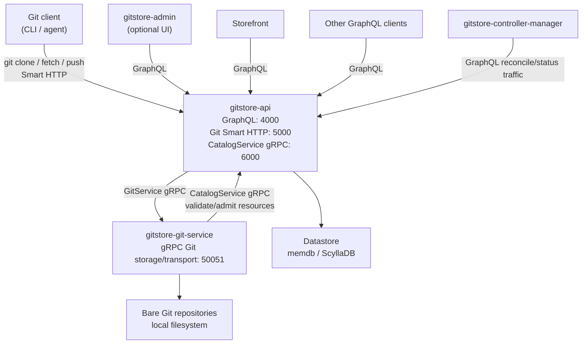

# GitStore - Agent-safe Catalogue Operations

> [!CAUTION]
> This project is in early development. The API and architecture are subject to change. Contributions and feedback are welcome, but expect breaking changes as we iterate.

GitStore is an open-source Git-backed commerce platform where product catalogues are managed as plain files instead of opaque database rows in a CMS admin interface.

Products, product variants, categories, and collections are Markdown files with structured YAML frontmatter. Developers, merchandisers, and AI agents can edit those files, review changes with normal Git workflows, and push them through policy and admission checks before they become queryable through GraphQL.

The broader thesis is that commerce operations are becoming increasingly agentic. AI agents will generate product descriptions, update prices, localise catalogues, prepare campaigns, and coordinate merchandising changes. GitStore gives those changes auditable history, reviewable diffs, and reversible operations.

## Why Now

AI agents are becoming capable enough to modify commercial content, but businesses do not yet have safe operational rails for letting them touch production commerce data. Git already solved review, history, rollback, branching, and collaboration for code.

GitStore applies those primitives to commerce catalogues, then exposes the admitted catalogue state through headless APIs and admin workflows. The timing is right because headless commerce, GitOps, and AI-assisted operations are converging.

## Architecture



## Components

- **`gitstore-api`**: Go service that exposes GraphQL, API-fronted Git Smart HTTP, and the CatalogService gRPC hook/admission endpoint.
- **`gitstore-git-service`**: Rust service that owns bare Git repository storage and the gRPC Git transport primitives used by the API.
- **`gitstore-controller-manager`**: Go controller runtime that reconciles through the API and exposes health, metrics, and poison-item endpoints.
- **`gitstore-admin`**: Optional Astro/React web UI that talks to `gitstore-api`.

See the module READMEs for boundaries and commands:

- [gitstore-api/README.md](gitstore-api/README.md)
- [gitstore-git-service/README.md](gitstore-git-service/README.md)
- [gitstore-controller-manager/README.md](gitstore-controller-manager/README.md)
- [gitstore-admin/README.md](gitstore-admin/README.md)

## Why This Works Well for Developers and AI Agents

- **Markdown-native catalogue authoring**: Catalogue resources are easy to create and edit as text files.
- **Git-native collaboration**: Branches, commits, diffs, code review, and history become catalogue lifecycle tools.
- **Automation-friendly**: AI agents can generate and update catalogue content through file operations and standard Git pushes.
- **Operational safety**: Push-time validation and admission checks return clear errors before invalid catalogue data becomes queryable.

## Quick Start

Run the core stack from the repository root:

```bash
make compose DETACH=1
make ps
```

Use `make compose` without `DETACH=1` to keep the compose stack in the foreground. After the API is healthy, create a starter namespace and repository:

```bash
make bootstrap ADMIN_PASSWORD=<admin-password>
```

The bootstrap command prints a clone URL similar to:

```text
http://localhost:5000/gitstore-test/catalog.git
```

See the [user guide](docs/user-guide.md) for the complete Docker workflow, catalogue push examples, GraphQL queries, and troubleshooting.

## Documentation

- **User Guide**: [docs/user-guide.md](docs/user-guide.md)
- **Developer Guide**: [docs/developer-guide.md](docs/developer-guide.md)
- **Architecture**: [docs/architecture.md](docs/architecture.md)
- **API Reference**: [docs/api-reference.md](docs/api-reference.md)
- **Admin**: [docs/admin/README.md](docs/admin/README.md)
- **Configuration**: [docs/configuration.md](docs/configuration.md)
- **Storefront**: [docs/storefront.md](docs/storefront.md)
- **GraphQL Contracts**: [shared/schemas/](shared/schemas/)

## Contributing

See the [developer guide](docs/developer-guide.md#development-setup) for local development, code generation, tests, and PR readiness checks.

Before creating a PR, run:

```bash
make pr-ready
```

## License

AGPL-3.0-or-later. See [LICENSE](LICENSE) for details.
