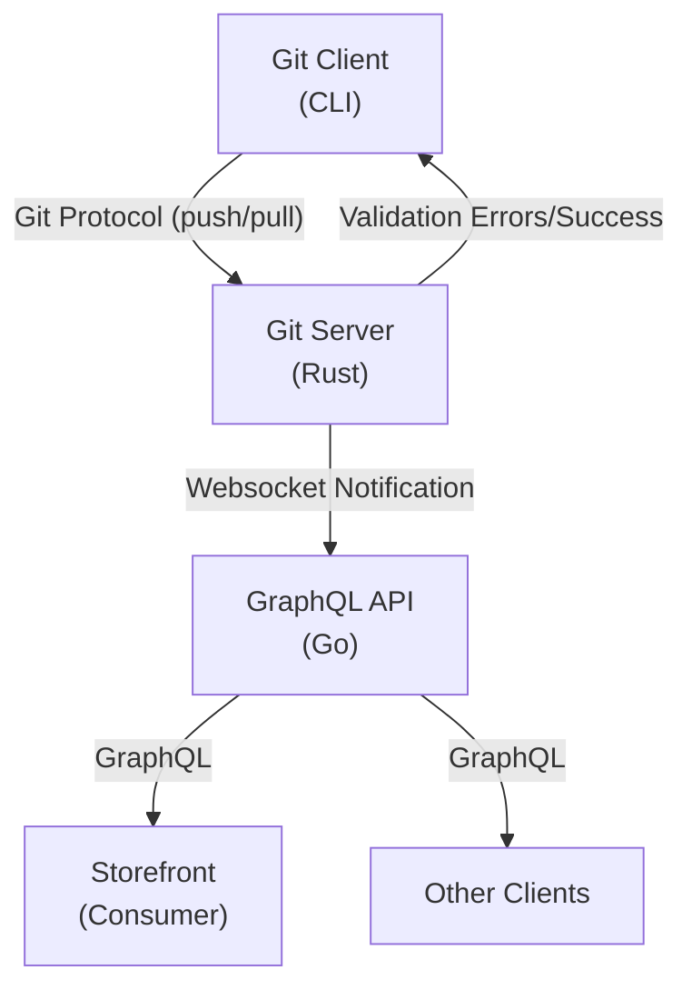

# GitStore - Agent-safe Catalog Operations

Open-source Git-backed commerce platform where product catalogs are managed as plain files in Git instead of trapped inside a CMS/database admin interface.
Products, categories, and collections are Markdown files with structured front matter. Changes can be created by developers, merchandisers, or AI agents, reviewed through normal Git workflows, validated on push, and published through release tags. 
The platform already includes a Rust Git server, Go GraphQL API, Astro/React Admin UI, schema validation, release-tag publishing, and documentation.

The broader thesis is that commerce operations are becoming increasingly agentic. AI agents will generate product descriptions, update prices, localize catalogs, prepare campaigns, and coordinate merchandising changes. 
Existing commerce platforms were designed around human admin panels and opaque database state. GitStore makes commerce data auditable, reviewable, reversible, and automation-safe.

## Why Now

AI agents are becoming capable enough to modify commercial content, but businesses do not yet have safe operational rails for letting them touch production commerce data. Git already solved review, history, rollback, branching, and collaboration for code. 
GitStore applies those primitives to commerce catalogs, then exposes the result through headless APIs and admin workflows. The timing is right because headless commerce, GitOps, and AI-assisted operations are converging.

## Architecture



## Components

- **Git Server** (Rust): Built-in git repository with validation and websocket notifications
- **GraphQL API** (Go): Headless API with Relay support

> **Admin add-on**: For the optional web UI, see [docs/admin/](docs/admin/).

## Why This Works Well for Developers and AI Agents

- **Markdown-native catalog authoring**: Products, categories, and collections are easy to create and edit as text files.
- **Git-native collaboration**: Branches, commits, diffs, code review, and tags become catalog lifecycle tools.
- **Automation-friendly**: AI agents can generate and update catalog content through file operations and standard git pushes.
- **Operational safety**: Validation happens at push time, with clear errors before bad data reaches the runtime API.

## Quick Start

### Prerequisites

- Docker 24+
- Git 2.40+

### Start Services

```bash
# Clone repository
git clone https://github.com/gitstore-dev/gitstore
cd gitstore

# Start all services
docker compose up -d

# Check service health
docker compose ps
```

**Expected Output**:
```
NAME                 STATUS              PORTS
gitstore-git-service running             0.0.0.0:9418->9418/tcp, 0.0.0.0:8080->8080/tcp
gitstore-api         running             0.0.0.0:4000->4000/tcp
```

### Access Services

- **GraphQL Playground**: http://localhost:4000/playground
- **Git Repository**: http://localhost:9418/catalog.git

## Contributing

### Prerequisites

- **Rust**: 1.75+ (`rustup install stable`)
- **Go**: 1.21+ (`go version`)
- **Node.js**: 18+ (`node --version`)
- **Docker**: 24+ (for local development)

### Build from Source

#### Git Server (Rust)

```bash
cd gitstore-git-service
cargo build --release
cargo test

# Run standalone
cargo run -- --port 9418 --ws-port 8080 --data-dir ./data
```

#### GraphQL API (Go)

```bash
cd gitstore-api
go mod download
go generate ./...  # Run gqlgen code generation
go build -o bin/api ./cmd/server

# Run standalone
./bin/api --port 4000 --git-ws ws://localhost:8080
```

## Usage

### Technical User - Git Workflow

```bash
# Clone catalog repository
git clone http://localhost:9418/catalog.git catalog-work
cd catalog-work

# Create a product
mkdir -p products/electronics
cat > products/electronics/LAPTOP-001.md << 'EOF'
---
id: prod_laptop001
sku: LAPTOP-001
title: Premium Laptop
price: 1299.99
currency: USD
inventory_status: in_stock
inventory_quantity: 50
category_id: cat_electronics
collection_ids:
  - coll_featured
images:
  - https://cdn.example.com/laptop-001.jpg
metadata:
  brand: TechCorp
  weight_kg: 1.8
created_at: 2026-03-09T10:00:00Z
updated_at: 2026-03-09T10:00:00Z
---

# Premium Laptop

Professional-grade laptop with cutting-edge specs.

## Features
- Intel i7 processor
- 16GB RAM
- 512GB SSD
- 15.6" 4K display
EOF

# Commit and push
git add products/electronics/LAPTOP-001.md
git commit -m "Add Premium Laptop (LAPTOP-001)"
git push origin main

# Create release tag
git tag -a v0.1.0 -m "Release v0.1.0: Initial catalog"
git push origin v0.1.0
```

### Query Products via GraphQL

```bash
curl http://localhost:4000/graphql \
  -H "Content-Type: application/json" \
  -d '{
    "query": "{ products(first: 5) { edges { node { sku title price } } } }"
  }'
```

## Testing

```bash
# Integration tests
cd gitstore-git-service && cargo test --test integration
cd ../api && go test ./tests/integration/...
```

## Documentation

- **Developer Guide**: [docs/developer-guide.md](docs/developer-guide.md)
- **Architecture**: [docs/architecture.md](docs/architecture.md)
- **API Reference**: [docs/api-reference.md](docs/api-reference.md)
- **User Guide**: [docs/user-guide.md](docs/user-guide.md)
- **Storefront**: [docs/storefront.md](docs/storefront.md)
- **GraphQL Contracts**: [shared/schemas/](shared/schemas/)

## License

MIT
