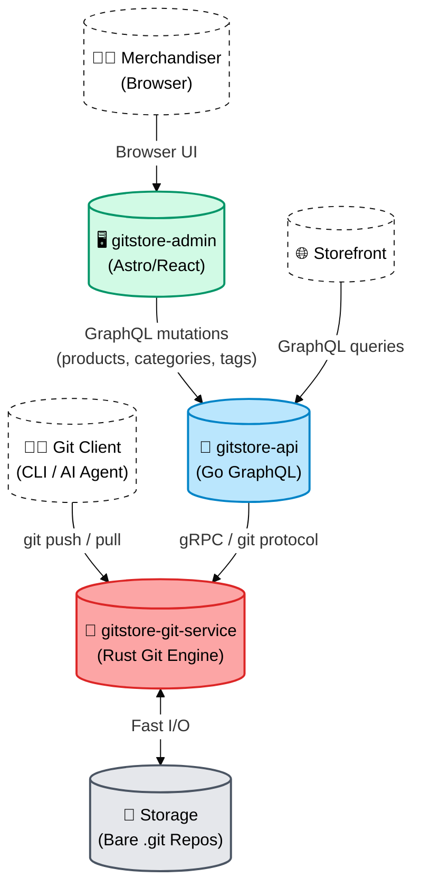

# GitStore Admin — Architecture

`gitstore-admin` is the backoffice layer of the core GitStore stack.

## Architecture Diagram



## How the Admin Fits In

The core stack (`gitstore-api` + `gitstore-git-service`) operates independently. `gitstore-admin`:

1. Connects only to `gitstore-api` via GraphQL — it never talks directly to `gitstore-git-service`.
2. Uses the same GraphQL mutations available to any other client (AI agents, storefronts, CI scripts).
3. Calls the `publishCatalog` mutation which triggers `gitstore-api` to push a tagged commit to `gitstore-git-service`.

## Relationship to Core Proposals

Both architecture proposals in [`docs/architecture.md`](../architecture.md) support the admin add-on at the same attachment point: the GraphQL API layer. The admin add-on is proposal-agnostic.

## Network Topology (Compose)

When started with the `compose.admin.yml` override, the three containers share `gitstore-network`:

```
gitstore-network
├── gitstore-git-service  (ports 9418, 8080)
├── gitstore-api          (port 4000)
└── gitstore-admin        (port 3000)  ← added by compose.admin.yml
```

The admin container communicates with the API container using the internal DNS name `api` (resolved by Docker within `gitstore-network`).
