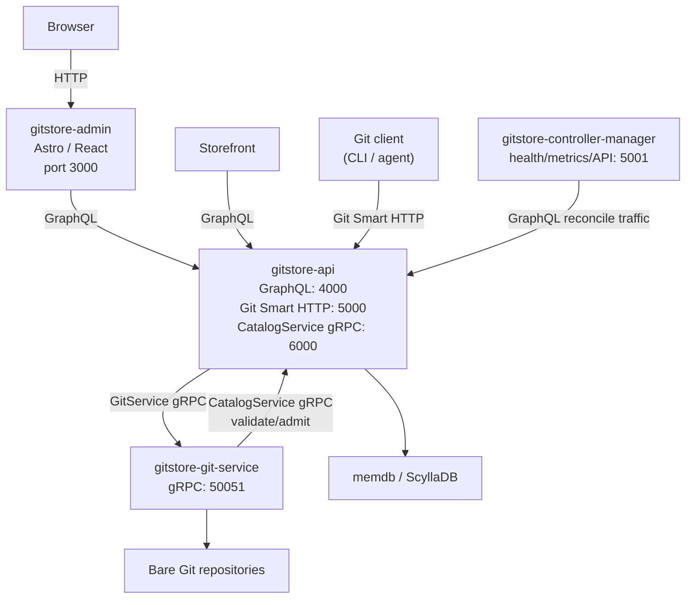

# GitStore Admin Architecture

`gitstore-admin` is an optional UI layer in front of `gitstore-api`.

## Topology



## Boundaries

- Admin is a client of `gitstore-api`.
- Admin uses `GITSTORE_GRAPHQL_URL` to reach the GraphQL endpoint.
- Admin never talks directly to `gitstore-git-service`.
- Git clone, fetch, and push traffic enters through `gitstore-api` on Git Smart HTTP port `5000`.
- `gitstore-git-service` remains gRPC-only from the perspective of the compose network.
- Catalogue admission is owned by the API and Git service hook callout flow, not by the admin process.

## Compose Network

When started with `compose.admin.yml`, the services share `gitstore-network`:

```text
gitstore-network
├── gitstore-api                 ports 4000, 5000, 6000
├── gitstore-git-service         port 50051
├── gitstore-controller-manager  port 5001
└── gitstore-admin               port 3000
```

Inside the Docker network, admin reaches the API at `http://api:4000/graphql`.

## Current Write Model

Catalogue writes are Git-driven today. Users author catalogue resource files, commit them, and push to the API-fronted Git Smart HTTP endpoint. Push validation and admission are performed by the core services.

The admin UI remains the browser-facing attachment point for future Git-backed editing workflows. Direct catalogue GraphQL CRUD and publish mutations are not the documented integration path while that design is still being finalized.
