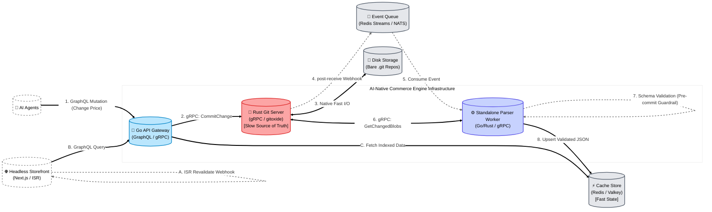
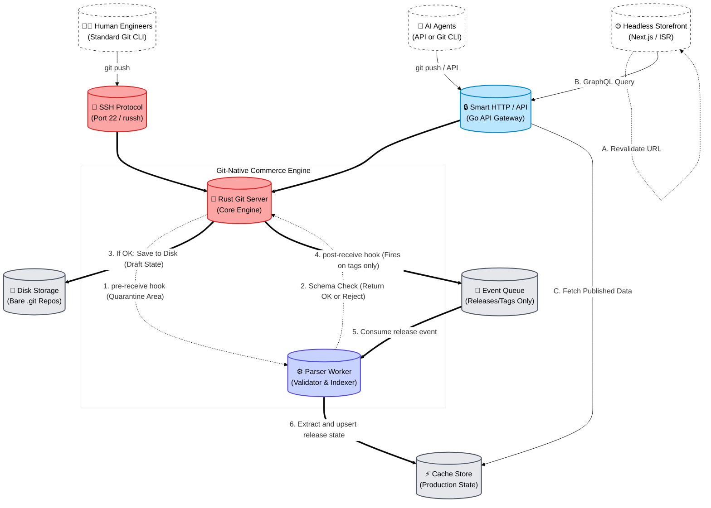
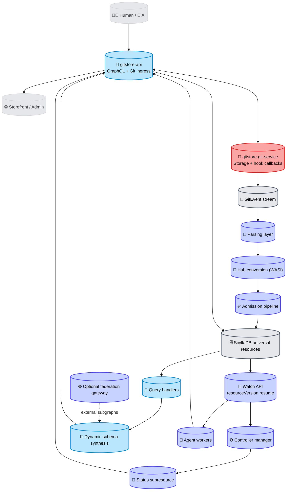

# Architecture

This document describes the architecture of the AI-native commerce engine: the service topology, GraphQL API design principles, write pipeline proposals, and the controller-manager model for reconciling catalogue state.

## System Goals

- Keep catalogue history auditable and reversible.
- Allow AI agents to perform safe, structured mutations.
- Serve storefront reads from low-latency indexed data.
- Decouple write acceptance from heavy validation and indexing work.

## Roadmap Alignment (Current Direction)

The current architecture target is **Proposal 3**. Use this table as the quick index from capability area to tracking initiatives.

| Capability Area           | Tracking Initiatives                                           |
|---------------------------|----------------------------------------------------------------|
| Git events and ingestion  | [#169][gh-169], [#139][gh-139]                                 |
| Parsing and admission     | [#134][gh-134], [#123][gh-123], [#106][gh-106]                 |
| Storage and versioning    | [#140][gh-140], [#141][gh-141], [#137][gh-137], [#164][gh-164] |
| Controller loop and watch | [#165][gh-165], [#166][gh-166], [#131][gh-131]                 |
| Query and schema runtime  | [#148][gh-148], [#149][gh-149], [#162][gh-162]                 |
| Agent orchestration       | [#150][gh-150]                                                 |

## Platform Building Blocks

All proposals share the same core building blocks, arranged with different control points:

- **Actors**: AI agents, human engineers, and the storefront.
- **Control plane**: Go API gateway and/or Rust Git server.
- **Storage plane**: Bare Git repositories on disk as source of truth.
- **Distribution plane**: Event queue plus KV store for published read state.

---

## Service Topology

- `gitstore-api/`: Go API gateway, GraphQL surface, and gRPC client/server boundaries.
- `gitstore-git-service/`: Rust Git engine, receive hooks, and repository access logic.
- `shared/schemas/`: GraphQL schema contracts consumed by the API layer.
- `shared/proto/gitstore/git/v1/`: Canonical `.proto` definition for the gRPC Git service contract.

> **Admin**: For the optional web interface, see [`docs/admin/architecture.md`](admin/architecture.md).

### Service Boundary

The API gateway (`gitstore-api`) and the Git server (`gitstore-git-service`) communicate exclusively through gRPC on port `50051`. **No shared volume mount is required.** The API holds no local git state; every read (catalogue load) and every write (commit, delete, tag) is an RPC call to the Git service.

Key environment variables:

| Service                | Variable                  | Purpose                                                       |
|------------------------|---------------------------|---------------------------------------------------------------|
| `gitstore-api`         | `GITSTORE_GIT__GRPC__URI` | gRPC address of git-service (e.g. `dns:///git-service:50051`) |
| `gitstore-git-service` | `GITSTORE_GRPC__PORT`     | Port the gRPC server binds on (default `50051`)               |
| `gitstore-git-service` | `GITSTORE_GIT__DATA_DIR`  | Path to the bare repository directory                         |

### Git Engine — gitoxide (gix)

`gitstore-git-service` uses [gitoxide (`gix 0.83.0`)](https://github.com/GitoxideLabs/gitoxide), a pure-Rust Git implementation, as its only Git library. The `git2` / libgit2 C binding was removed entirely in feature `007-migrate-gitoxide`.

Key consequences of this change:

- **No native library dependency**: the service binary links only Rust crates; no libgit2 or OpenSSL linkage.
- **Tree-editor writes**: `commit_file` and `delete_file` use gix's built-in tree-editor API to mutate bare repository trees directly, eliminating the previous clone-to-tmpdir pattern.
- **MSRV 1.82**: required by `gix 0.83.0`; the Rust toolchain must be ≥ 1.82.

### Multi-Repository Hosting

The git service supports **named repositories** created and deleted at runtime via gRPC — no service restart is required.

- Each repository is stored as `<GITSTORE_GIT__DATA_DIR>/<repository_id>.git` on disk.
- Every gRPC request carries a `repository_id` field that identifies the target repository.
- Requests with an unknown or invalid `repository_id` return `NOT_FOUND` or `INVALID_ARGUMENT` respectively.
- Concurrent requests to different repositories are isolated via a per-repository `RwLock`.

**There is no longer a default `catalog.git` repository.** Repositories must be created explicitly via the `CreateRepository` RPC before any other operation can be performed on them.

New RPCs (defined in `shared/proto/gitstore/git/v1/git_service.proto`):

| RPC                  | Description                                               |
|----------------------|-----------------------------------------------------------|
| `CreateRepository`   | Provisions a new named bare repository on disk.           |
| `DeleteRepository`   | Removes a named repository and all its data.              |

---

## GraphQL API Design

### Dynamic Schema for CRD-Style Kinds

The platform supports CRD-style kinds, so GraphQL schema shape cannot be treated as fully static.

- `gitstore-api` should watch kind/definition registry updates from Git and trigger schema refresh.
- Runtime synthesis should translate JSON Schema-backed kind definitions into GraphQL object types and fields.
- Generated query roots should stay namespaced by domain (for example `query { catalog { product(by: {id: "..."}) } }`).

Schema lifecycle should follow a safe publish pattern:

1. Build a candidate schema from current registry state.
2. Validate and wire resolvers.
3. Atomically publish if valid.
4. Keep the last known-good schema active on failure.

### Direct Synthesis vs Federation

For core kinds, prefer direct synthesis inside `gitstore-api` to reduce network hops and keep resolver behaviour predictable.

Federation is an optional path for externally owned integrations:

- External apps can expose independent subgraphs and extend shared entities.
- Composition uses federation ownership directives such as `@key`, `@extends`, and `@external`.
- Composition may run through an edge router/gateway when extension boundaries justify service isolation.

Use federation when an extension owns its own service boundary or datastore and must participate in cross-entity graph relationships. Keep core catalogue/resource kinds on direct synthesis by default.

### API Versioning and Evolution (Hub-and-Spoke Conversion)

CRD-style resources introduce a versioning tension: Kubernetes-style APIs expose explicit versions (for example `v1`, `v2`), while GraphQL favours one continuously evolving graph. The platform resolves this with a hub-and-spoke conversion model.

- Each kind designates one hub version as the internal storage state (for example `gitstore.dev/v2`).
- KV projections and synthesised core GraphQL types reflect the hub version.
- Older or alternate API versions are treated as spoke versions that convert to and from the hub.

Conversion is implemented as explicit WASI conversion hooks supplied by the kind owner:

- Hooks must support both upgrade and downgrade paths (for example `v1 -> v2` and `v2 -> v1`).
- Hooks execute in the write pipeline when inbound manifests are not in the hub version.
- The orchestrator stores only hub-version projections after successful conversion.

Write path behaviour:

1. Admin or agent pushes a manifest using an older `apiVersion`.
2. Orchestrator detects the version mismatch against the kind hub version.
3. Orchestrator runs the WASI hook to up-convert the parsed resource to hub form.
4. Validation, indexing, and KV projection proceed on hub-version data.

GraphQL evolution remains endpoint-stable and schema-driven:

- The endpoint is not versioned (no GraphQL `/v1` and `/v2` split).
- Breaking field renames are handled by transitional schema evolution.
- Deprecated fields remain available with GraphQL `@deprecated` metadata and are resolved from hub state for backward compatibility.

Example migration pattern:

- Hub model introduces `pricingMatrix`.
- Legacy `price` field remains in GraphQL as `@deprecated(reason: "Use pricingMatrix")`.
- Resolver maps `price` from the hub representation until clients migrate.

---

## Proposal 1 — API-Led Mutations with Asynchronous Indexing

Proposal 1 starts at the API boundary, commits to Git immediately, and then indexes validated state asynchronously.

### Top-Down Flow

1. **Entry**: AI agents call GraphQL mutations through the API gateway.
2. **Commit**: API gateway sends gRPC mutation requests to the Rust Git server.
3. **Persist**: Git server writes commits to disk repositories.
4. **Validate and index**: Post-receive events flow through queue and parser worker.
5. **Serve**: Storefront GraphQL queries read from the KV store.

### Implementation Focus

- **Request contract**: GraphQL mutations should include idempotency keys so retries do not create duplicate commits.
- **Commit metadata**: Persist actor identity, request ID, and schema version in commit message/footer for traceability.
- **Queue payload**: Emit repository path, commit SHA, changed blob paths, and correlation ID on each post-receive event.
- **Validation contract**: Parser worker validates changed blobs against the catalogue content schema (product/category/collection frontmatter) and returns structured errors.
- **KV write model**: Use deterministic keys (`catalog:{env}:{entity}:{id}`) and version stamps (`etag` or commit SHA).

### Architecture Diagram



### Responsibilities by Layer

- **Actors**
  - AI agents submit mutations and receive fast acknowledgements.
  - Storefront reads indexed catalogue state from KV for low-latency queries, and triggers ISR revalidation on webhook event from API.
- **Core services**
  - Go API gateway handles GraphQL writes and reads.
  - Rust Git server executes durable commit operations.
  - Parser worker validates changed blobs and writes read-optimised JSON.
- **Infrastructure**
  - Disk stores canonical Git history.
  - Queue carries asynchronous indexing work.
  - KV serves low-latency storefront reads.

### Operational Notes

- Write acknowledgements are fast because indexing is asynchronous.
- Validation failures are surfaced operationally without rewriting accepted Git commits.
- Multiple parser workers can scale out independently as event volume grows.
- At the current stage ScyllaDB serves storefront reads directly. The KV cache layer (Redis/Valkey) is deferred until ScyllaDB read throughput is a measured constraint.

### Implementation Sequence

1. Wire GraphQL mutation handlers in `gitstore-api/` to a single gRPC `CommitChange` boundary.
2. Implement post-receive event publication in `gitstore-git-service/` with correlation IDs.
3. Add parser worker consumers that validate and upsert KV documents.
4. Add observability: mutation latency, queue lag, validation failure rate, and KV upsert latency.
5. Gate rollout with shadow indexing before switching storefront reads fully to KV.

---

## Proposal 2 — Git-Native Ingress with Tag-Gated Publishing

Proposal 2 starts at Git transport boundaries, executes hooks during receive, and only publishes customer-visible state on explicit release tags.

### Top-Down Flow

1. **Entry**: Engineers and AI agents push via SSH or Smart HTTP/API.
2. **Control**: Rust Git server executes pre- / post-receive hook pipelines.
3. **Persist draft**: Accepted changes are written to disk as draft state.
4. **Publish release**: Tag events trigger queue-to-parser publish workflow.
5. **Serve**: Storefront reads published state from KV and revalidates pages.

### Implementation Focus

- **Ingress policy**: Enforce branch/tag naming rules and signer checks in pre-receive hooks.
- **Hook contract**: Git service emits pre- / post-receive hook events; policy workers/API decide allow/deny semantics.
  ```bash
  $ git push origin main
  Enumerating objects: 5, done.
  Counting objects: 100% (5/5), done.
  Writing objects: 100% (3/3), 342 bytes | 342.00 KiB/s, done.
  Total 3 (delta 2), reused 0 (delta 0)
  remote: -------------------------------------------------
  remote: ❌ POLICY CHECK FAILED
  remote: -------------------------------------------------
  remote: Rule: validation-failed
  remote: Error: see hook diagnostics above.
  remote:
  remote: Please fix policy violations and push again.
  remote: -------------------------------------------------
  To ssh://git.yourstore.com/brand/catalog.git
  ! [remote rejected] main -> main (pre-receive hook declined)
  error: failed to push some refs to 'ssh://git.yourstore.com/brand/catalog.git'
  ```
- **Release contract**: Only tags matching a release pattern (for example `release/*` or `v*`) emit publish events.
- **Publication payload**: Include tag name, target commit SHA, repository, and release timestamp.
- **KV projection**: Parser materialises only tagged state, keeping draft commits invisible to storefront queries.

### Architecture Diagram



### Responsibilities by Layer

- **Actors**
  - Engineers and AI agents can both submit changes through Git-native channels.
  - Storefront reads only published release state.
- **Core services**
  - Rust Git server provides Git protocol transport, hook execution points, and repository integrity.
  - Parser worker validates and projects tagged releases into KV.
  - Go API endpoint remains available for GraphQL reads and controlled write APIs.
- **Infrastructure**
  - Disk stores draft and released Git history.
  - Queue carries release publication events.
  - KV contains only customer-visible published catalogue data.

### Operational Notes

- Release tags become the explicit publishing contract.
- Draft branch activity is isolated from customer-facing reads.
- Rollbacks can be executed by moving release tags and replaying publish events.
- At the current stage ScyllaDB serves storefront reads directly. A KV cache layer is a future read-optimisation, not a correctness requirement.

### Implementation Sequence

1. Implement SSH/HTTP receive entrypoints and pre-receive checks in `gitstore-git-service/`.
2. Persist accepted draft refs to disk and log audit metadata for every ref update.
3. Trigger publish events only from tag updates and process them in parser workers.
4. Update `gitstore-api/` read resolvers to fetch only published keys from KV.
5. Add release runbooks for promote, rollback, and replay operations.

---

## Proposal 3 — Initiative-Aligned Control Plane (Current Direction)

Proposal 3 reflects the current roadmap initiatives and supersedes Proposals 1 and 2 as the active target architecture.

### Top-Down Flow

1. **Ingress**: Git and GraphQL writes enter through `gitstore-api` (protocol and API front door).
2. **Git event emission**: `gitstore-git-service` publishes normalised Git ref events (`branch-*`, `tag-*`, `push-rejected`) through the GitEvent contract.
3. **Validation pipeline**: parsing, hub-version conversion, schema/CEL checks, and admission policies run in `gitstore-api`.
4. **Persistence**: validated resources are projected into the universal ScyllaDB resource model with monotonic `resourceVersion`.
5. **Reconciliation**: controller manager consumes watch streams, executes side effects, and writes status conditions via status subresource mutations.
6. **Graph serving**: dynamic GraphQL schema synthesis serves core and CRD kinds from unified storage; federation is optional for external app subgraphs.

### Initiative Mapping

- **Git events and ingestion**: [#169][gh-169], [#139][gh-139]
- **Parsing and admission**: [#134][gh-134], [#123][gh-123], [#106][gh-106]
- **Storage and versioning**: [#140][gh-140], [#141][gh-141], [#137][gh-137], [#164][gh-164]
- **Controller loop and watch**: [#165][gh-165], [#166][gh-166], [#131][gh-131]
- **Query and schema runtime**: [#148][gh-148], [#149][gh-149], [#162][gh-162]
- **Agent orchestration**: [#150][gh-150]

[gh-106]: https://github.com/gitstore-dev/GitStore/issues/106
[gh-123]: https://github.com/gitstore-dev/GitStore/issues/123
[gh-131]: https://github.com/gitstore-dev/GitStore/issues/131
[gh-134]: https://github.com/gitstore-dev/GitStore/issues/134
[gh-137]: https://github.com/gitstore-dev/GitStore/issues/137
[gh-139]: https://github.com/gitstore-dev/GitStore/issues/139
[gh-140]: https://github.com/gitstore-dev/GitStore/issues/140
[gh-141]: https://github.com/gitstore-dev/GitStore/issues/141
[gh-148]: https://github.com/gitstore-dev/GitStore/issues/148
[gh-149]: https://github.com/gitstore-dev/GitStore/issues/149
[gh-150]: https://github.com/gitstore-dev/GitStore/issues/150
[gh-162]: https://github.com/gitstore-dev/GitStore/issues/162
[gh-164]: https://github.com/gitstore-dev/GitStore/issues/164
[gh-165]: https://github.com/gitstore-dev/GitStore/issues/165
[gh-166]: https://github.com/gitstore-dev/GitStore/issues/166
[gh-169]: https://github.com/gitstore-dev/GitStore/issues/169

### Architecture Diagram



### Initiative Legend

- **Git events and stream** (`Events`): [#169][gh-169], [#139][gh-139]
- **Parsing and admission** (`Parse`, `Convert`, `Admit`): [#134][gh-134], [#164][gh-164], [#123][gh-123], [#106][gh-106]
- **Storage and versioning** (`Store`): [#140][gh-140], [#141][gh-141], [#137][gh-137]
- **Watch and reconciliation** (`Watch`, `Ctl`, `Status`): [#131][gh-131], [#165][gh-165], [#166][gh-166]
- **Query and graph runtime** (`Query`, `Schema`, `Fed`): [#148][gh-148], [#149][gh-149], [#162][gh-162]
- **Agent orchestration** (`Agent`): [#150][gh-150]

### Operational Notes

- Controller-visible state is derived from ScyllaDB projections and status conditions, not directly from Git blobs.
- Release semantics should be event-driven (`tag-created` / `release-created`) and reflected via `Published` conditions.
- Redis/Valkey remains optional and should be introduced only if measured read pressure exceeds ScyllaDB tuning headroom.

---

## Choosing Between Proposals

- **Current target**: choose **Proposal 3**. It aligns with the active initiative set and current service boundary decisions.
- Treat **Proposal 1** and **Proposal 2** as historical alternatives retained for design context.
- In all variants, Git remains the source of intent and ScyllaDB is the serving read layer; a KV cache is optional and data-driven.

---

## Namespace Lifecycle Management (feature 009-api-namespaces)

Namespaces are the primary isolation boundary for repositories in GitStore. They are managed exclusively through the GraphQL API in `gitstore-api`; `gitstore-git-service` is unchanged (FR-011).

### Three Tiers

| Tier           | Who can create              | Owns repositories | Can have parent enterprise |
|----------------|-----------------------------|-------------------|----------------------------|
| `USER`         | Any authenticated caller    | Yes               | No                         |
| `ORGANISATION` | Any authenticated caller    | Yes               | Optional                   |
| `ENTERPRISE`   | Callers with `isAdmin` only | No                | No                         |

### Global Identifier Uniqueness

Namespace identifiers are globally unique across all tiers. The same identifier cannot exist as both a user-space and an organisation namespace. Identifiers follow DNS label rules: lowercase alphanumeric + hyphens, 1–63 characters, no leading or trailing hyphen.

### Authorization Model

- Callers obtain JWTs with the GraphQL `login` mutation and pass them as `Authorization: Bearer <token>` on protected mutations.
- **`isAdmin`** (JWT claim) is the elevated platform role. Callers with `isAdmin == true` may create enterprise namespaces and delete any namespace.
- **Ownership** for deletion is checked at query time via `CreatedBy == callerUsername || isAdmin`. No mutable ownership state is embedded in the JWT.

### API Surface

All namespace operations are GraphQL, consistent with the rest of the domain API. See `shared/schemas/namespace.graphqls` for the full contract.

```graphql
# Create a user namespace
mutation {
  createNamespace(input: { clientMutationId: "create-acme-corp", identifier: "acme-corp", tier: USER }) {
    clientMutationId
    namespace { id identifier tier createdAt createdBy }
  }
}

# List all namespaces
query {
  namespaces(first: 20) {
    edges {
      node { id identifier tier createdBy }
    }
    pageInfo { hasNextPage endCursor }
    totalCount
  }
}

# Get namespace by identifier
query {
  namespace(by: {identifier: "acme-corp"}) {
    id identifier displayName tier parentEnterpriseId
    createdAt createdBy updatedAt updatedBy
  }
}

# Get namespace by opaque global Node ID
query {
  namespace(by: {id: "Z2lkOi8vR2l0U3RvcmUvTmFtZXNwYWNlL25hbWVzcGFjZS11dWlk"}) {
    id identifier displayName tier parentEnterpriseId
    createdAt createdBy updatedAt updatedBy
  }
}

# Delete a namespace (owner or admin only)
mutation {
  deleteNamespace(input: { clientMutationId: "delete-acme-corp", identifier: "acme-corp" }) {
    clientMutationId
    deletedIdentifier
  }
}
```

### Deletion Guard

Deletion is blocked when the namespace contains repositories (enforced in the service layer). The guard is a no-op stub in this release (repositories table is out of scope); it will be enforced when the repository spec lands.

For quickstart examples and `curl`-based testing, see [`specs/009-api-namespaces/quickstart.md`](../specs/009-api-namespaces/quickstart.md).

---

## Controller Manager, Reconciliation Loop, and AI Integration (Proposal)

This model applies to both core resources and CRD-defined kinds. It avoids a split-brain read path by treating ScyllaDB as the unified serving state for reconciled resources while keeping Git as the audited intent log for `.spec`.

### End-to-End Flow

1. Desired state enters via Git.
2. API validates and projects `.spec` into hub-version storage.
3. Controller manager watches reconciled objects and drives side effects.
4. Controllers report `.status` through API mutations.
5. API increments `resourceVersion` and publishes the next watch event.

### Ownership and Write Boundaries

- Users and AI agents own desired state (`.spec`) and submit it exclusively through Git push/PR workflows.
- Standard controllers own observed state (`.status`) and write it through GraphQL status mutations on the API server, which then persists to ScyllaDB.
- No actor writes directly to ScyllaDB; every write is gated through the API to ensure resource versioning and watch-cache consistency.

### Validation Pipeline

Validation is layered, not monolithic. The layers map to the Kubernetes model:

| Layer        | Timing                   | Gate                                                            | Notes                                    |
|--------------|--------------------------|-----------------------------------------------------------------|------------------------------------------|
| Structural   | Pre-receive, synchronous | Decoding: is it valid YAML with recognised top-level fields?    | Fast-fail, no full parse                 |
| Schema       | Post-receive, async      | Field types, constraints, CRD rules, CEL expressions            | Equivalent to OpenAPI/CRD schema         |
| Built-in API | Post-receive, async      | Cross-object logic: sku uniqueness, parent reference resolution | Compiled API handler logic               |
| Admission    | Post-receive, async      | Policy: org rules, quota, external system checks                | Dynamic, may call external policy engine |

Pre-receive must return quickly (< ~200ms). Full schema and admission validation run asynchronously in the post-receive pipeline so that large pushes are not blocked by per-file parsing cost.

Git-originated and API-originated mutations converge at the schema and admission layers — they are evaluated identically.

### Resource Status — Conditions

Resources use typed `.status.conditions` rather than a `phase` field. A `phase` enum is an antipattern ([kubernetes/kubernetes#7856](https://github.com/kubernetes/kubernetes/issues/7856)) because it is opaque, hard to extend, and cannot represent concurrent states.

Standard conditions for catalogue resources:

| Condition type      | Meaning                                                                      |
|---------------------|------------------------------------------------------------------------------|
| `AdmissionAccepted` | Resource passed all schema and admission validation layers                   |
| `Published`         | Resource is live to storefront (set when a release tag targets the resource) |
| `Ready`             | Resource is projected and queryable                                          |

Example:

```yaml
status:
  conditions:
    - type: AdmissionAccepted
      status: "False"
      reason: SchemaMismatch
      message: "spec.pricing.priceSet.prices[0].money.amount must be > 0"
      lastTransitionTime: "2026-05-22T10:00:00Z"
    - type: Published
      status: "False"
      reason: NoReleaseTag
      lastTransitionTime: "2026-05-22T10:00:00Z"
```

### Git Ingest Contract

- **Pre-receive hook** (gRPC): auth, branch/tag protection, quota, and lightweight structural decoding. No durable state write.
- **Post-receive hook** (gRPC): full schema validation, admission policy evaluation, hub-version conversion, `.spec` and `.status.conditions` persistence.
- Each accepted write increments `resourceVersion` and publishes a watch event.
- If post-receive admission fails, the commit is persisted in Git (audit trail) but the resource carries `AdmissionAccepted=False` in `.status.conditions`. It is invisible to controllers and storefront until corrected.

### Watch Protocol over GraphQL

The API surface stays GraphQL-first while preserving Kubernetes-style watch semantics:

- Controllers subscribe through GraphQL-over-SSE (HTTP/2 friendly) backed by an in-process watch cache.
- Events are emitted as `ADDED`, `MODIFIED`, and `DELETED` envelopes containing full reconciled objects (`metadata`, `.spec`, `.status`).
- Watch streams support resume from `resourceVersion` so disconnected controllers can continue without full resync.
- On restart, the API rebuilds cache state from ScyllaDB before opening new watch streams.

### Reconciliation Model

1. Controller receives a watch event with latest `.spec` and `.status`.
2. Controller compares desired and observed state and executes external side effects.
3. Controller reports observed outcome via GraphQL status mutation (`update...Status`) with optimistic preconditions.
4. API writes new `.status`, increments `resourceVersion`, and fans out the next watch event.

AI controllers follow the same observation loop but act by proposing new `.spec` via Git (branch + PR). They do not bypass status ownership or admission boundaries.

```mermaid
sequenceDiagram
    participant U as Human / CI / AI Author
    participant G as Git Service (Rust)
    participant API as API Server (Go, GraphQL)
    participant DB as ScyllaDB
    participant WC as Watch Cache
    participant RC as Controller Manager

    rect rgb(30, 40, 60)
    note right of U: 1. Desired state update via Git
    U->>G: git push (manifest change)
    G->>API: gRPC pre-receive (validate only)
    API-->>G: allow/reject
    G->>G: persist accepted commit
    G->>API: gRPC post-receive (accepted refs + blobs)
    API->>API: parse + convert to hub version
    API->>DB: UPSERT .spec (resourceVersion++)
    API->>WC: apply reconciled object
    WC--)RC: ADDED/MODIFIED event
    end

    rect rgb(40, 50, 40)
    note right of RC: 2. Reconcile and report status
    RC->>RC: compare .spec with external state
    RC->>API: GraphQL mutation (update status)
    API->>DB: UPSERT .status (resourceVersion++)
    API->>WC: apply reconciled object
    WC--)RC: MODIFIED event (resume-safe)
    end

    rect rgb(50, 40, 50)
    note right of U: 3. AI controller proposes new intent
    U->>G: open PR with .spec update
    note right of U: loops back to step 1 after merge
    end
```


