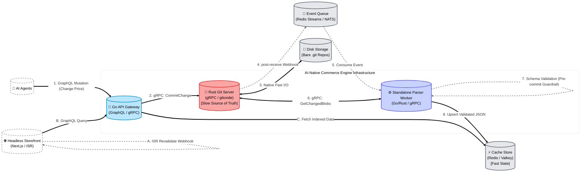
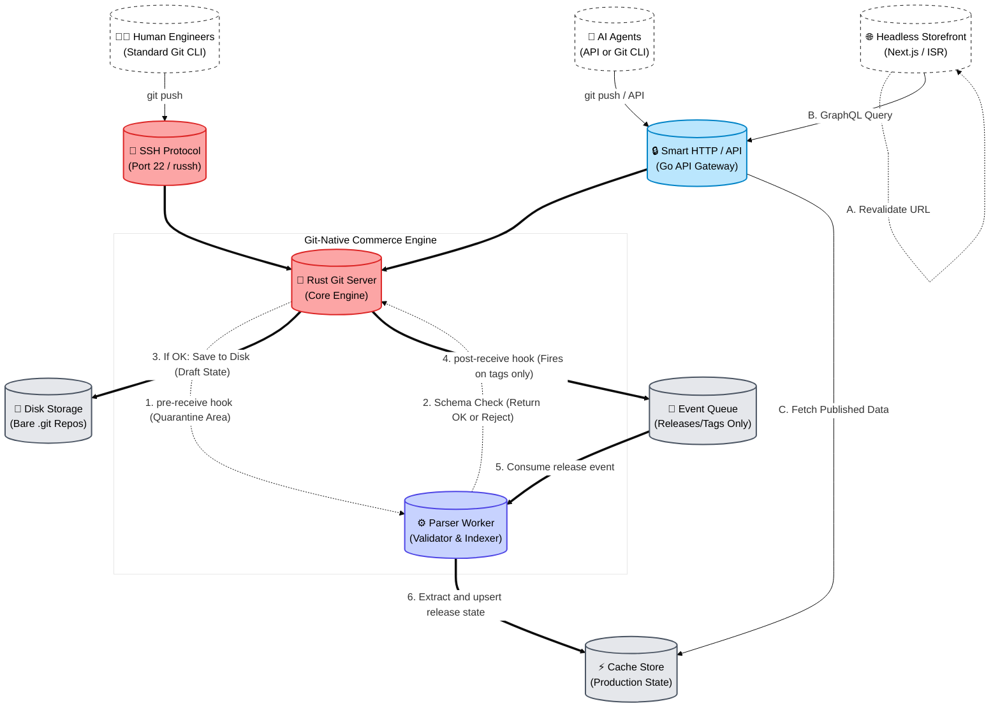

# Architecture

This document describes the architecture of the AI-native commerce engine: the service topology, GraphQL API design principles, write pipeline proposals, and the controller-manager model for reconciling catalogue state.

## System Goals

- Keep catalogue history auditable and reversible.
- Allow AI agents to perform safe, structured mutations.
- Serve storefront reads from low-latency indexed data.
- Decouple write acceptance from heavy validation and indexing work.
- Run the API, controller manager, and Git service as independently autoscaled replicas.
- Support concurrent users and agents through pluggable authentication and authorization.
- Sustain catalogues with millions of products and prolonged peak Git push workloads.

## Roadmap Alignment

The **accepted architecture** is the implemented baseline described below.
**Proposal 3** is the roadmap target, not a description of shipped topology or
contracts. Use this table as the quick index from capability area to tracking
initiatives.

| Capability Area           | Tracking Initiatives                                           |
|---------------------------|----------------------------------------------------------------|
| Git events and ingestion  | [#169][gh-169], [#139][gh-139]                                 |
| Parsing and admission     | [#134][gh-134], [#123][gh-123], [#106][gh-106]                 |
| Storage and versioning    | [#140][gh-140], [#141][gh-141], [#137][gh-137], [#164][gh-164] |
| Controller loop and watch | [#165][gh-165], [#166][gh-166], [#131][gh-131]                 |
| Query and schema runtime  | [#148][gh-148], [#149][gh-149], [#162][gh-162]                 |
| Agent orchestration       | [#150][gh-150]                                                 |

## Platform Building Blocks

All proposals share the same core building blocks, arranged with different control points:

- **Actors**: AI agents, human engineers, and the storefront.
- **Control plane**: Go API gateway and/or Rust Git server.
- **Storage plane**: Bare Git repositories on disk as source of truth.
- **Distribution plane**: Event queue plus KV store for published read state.

---

## Service Topology

- `gitstore-api/`: Go API gateway, GraphQL surface, and gRPC client/server boundaries.
- `gitstore-git-service/`: Rust Git engine, receive hooks, and repository access logic.
- `gitstore-controller-manager/`: Go watch, queue, reconciliation, status, retry, and operational runtime.
- `shared/schemas/`: GraphQL schema contracts consumed by the API layer.
- `shared/proto/gitstore/git/v1/`: Canonical `.proto` definition for the gRPC Git service contract.

> **Admin**: For the optional web interface, see [`docs/admin/architecture.md`](../admin/architecture.md).

### Production Deployment Model

The API, controller manager, and Git service are the core services. Each must
support multiple replicas and autoscaling without depending on process affinity.

- API correctness state, authentication, authorization, sessions, revocation,
  and idempotency must remain consistent across replicas.
- Controller reconciliation must be idempotent and use an explicit
  coordination, partitioning, or duplicate-safe work model.
- Git-service deployment must define repository placement, reference-update
  serialization, durable storage, sharding, routing, and failover without divergent refs.
- Routine catalogue paths must remain bounded at 5,000,000 or more products.
- Git push validation, admission, projection, and reconciliation must use
  bounded concurrency and backpressure and must pass sustained-load testing.

### Service Boundary

The API gateway (`gitstore-api`) and the Git server (`gitstore-git-service`) communicate exclusively through gRPC on port `50051`. The API holds no local git state; every read (catalogue load) and every write (commit, delete, tag) is an RPC call to the Git service.

`gitstore-api` serves 3 ports:
- Port `4000` — GraphQL API
- Port `9000` — Git smart HTTP (`git clone`, `git fetch`, `git push`)
- Port `6000` — Catalogue service gRPC (internal only)

`gitstore-git-service` serves 1 port:
- Port `50051` — gRPC only

`gitstore-controller-manager` serves 1 port:
- Port `5001` - Health checks and poison items (internal only)

### Go API Composition

`gitstore-api` uses explicit manual dependency injection. Runtime wiring is centralised in `gitstore-api/internal/app`, and `cmd/server/main.go` is limited to configuration loading, logger construction, server startup, and signal-driven shutdown.

Business packages receive dependencies through plain `Deps` structs rather than package globals or a DI framework. Shared infrastructure seams such as clocks, ID generators, catalog parsers, Git clients, auth services, and loggers are passed into constructors so tests can use deterministic time, IDs, and token expiry behavior.

Key environment variables:

| Service                | Variable                   | Purpose                                                          |
|------------------------|----------------------------|------------------------------------------------------------------|
| `gitstore-api`         | `GITSTORE_GIT__GRPC__URI`  | gRPC address of git-service (e.g. `dns:///git-service:50051`)    |
| `gitstore-api`         | `GITSTORE_API__GIT_PORT`   | Port the Git smart HTTP server binds on (default `9000`)         |
| `gitstore-git-service` | `GITSTORE_GRPC__PORT`      | Port the gRPC server binds on (default `50051`)                  |
| `gitstore-git-service` | `GITSTORE_GIT__DATA_DIR`   | Path to the bare repository directory                            |

### Git Engine — gitoxide (gix)

`gitstore-git-service` uses [gitoxide (`gix 0.83.0`)](https://github.com/GitoxideLabs/gitoxide), a pure-Rust Git implementation, as its only Git library. The `git2` / libgit2 C binding was removed entirely in feature `007-migrate-gitoxide`.

Key consequences of this change:

- **No native library dependency**: the service binary links only Rust crates; no libgit2 or OpenSSL linkage.
- **Tree-editor writes**: `commit_file` and `delete_file` use gix's built-in tree-editor API to mutate bare repository trees directly, eliminating the previous clone-to-tmpdir pattern.
- **MSRV 1.82**: required by `gix 0.83.0`; the Rust toolchain must be ≥ 1.82.

### Multi-Repository Hosting

The git service supports **named repositories** created and deleted at runtime via gRPC — no service restart is required.

- Each repository is stored as `<GITSTORE_GIT__DATA_DIR>/<repository_id>.git` on disk.
- Every gRPC request carries a `repository_id` field that identifies the target repository.
- Requests with an unknown or invalid `repository_id` return `NOT_FOUND` or `INVALID_ARGUMENT` respectively.
- Concurrent requests to different repositories are isolated via a per-repository `RwLock`.

**There is no longer a default `catalog.git` repository.** Repositories must be created explicitly via the `CreateRepository` RPC before any other operation can be performed on them.

New RPCs (defined in `shared/proto/gitstore/git/v1/git_service.proto`):

| RPC                  | Description                                               |
|----------------------|-----------------------------------------------------------|
| `CreateRepository`   | Provisions a new named bare repository on disk.           |
| `DeleteRepository`   | Removes a named repository and all its data.              |

---

## GraphQL API Design

### Dynamic Schema for CRD-Style Kinds

The platform supports CRD-style kinds, so GraphQL schema shape cannot be treated as fully static.

- `gitstore-api` should watch kind/definition registry updates from Git and trigger schema refresh.
- Runtime synthesis should translate JSON Schema-backed kind definitions into GraphQL object types and fields.
- Generated query roots should stay namespaced by domain (for example `query { catalog { product(by: {id: "..."}) } }`).

Schema lifecycle should follow a safe publish pattern:

1. Build a candidate schema from current registry state.
2. Validate and wire resolvers.
3. Atomically publish if valid.
4. Keep the last known-good schema active on failure.

### Direct Synthesis vs Federation

For core kinds, prefer direct synthesis inside `gitstore-api` to reduce network hops and keep resolver behaviour predictable.

Federation is an optional path for externally owned integrations:

- External apps can expose independent subgraphs and extend shared entities.
- Composition uses federation ownership directives such as `@key`, `@extends`, and `@external`.
- Composition may run through an edge router/gateway when extension boundaries justify service isolation.

Use federation when an extension owns its own service boundary or datastore and must participate in cross-entity graph relationships. Keep core catalogue/resource kinds on direct synthesis by default.

### API Versioning and Evolution (Hub-and-Spoke Conversion)

CRD-style resources introduce a versioning tension: Kubernetes-style APIs expose explicit versions (for example `v1`, `v2`), while GraphQL favours one continuously evolving graph. The platform resolves this with a hub-and-spoke conversion model.

- Each kind designates one hub version as the internal storage state (for example `gitstore.dev/v2`).
- KV projections and synthesised core GraphQL types reflect the hub version.
- Older or alternate API versions are treated as spoke versions that convert to and from the hub.

Conversion is implemented as explicit WASI conversion hooks supplied by the kind owner:

- Hooks must support both upgrade and downgrade paths (for example `v1 -> v2` and `v2 -> v1`).
- Hooks execute in the write pipeline when inbound manifests are not in the hub version.
- The orchestrator stores only hub-version projections after successful conversion.

Write path behaviour:

1. Admin or agent pushes a manifest using an older `apiVersion`.
2. Orchestrator detects the version mismatch against the kind hub version.
3. Orchestrator runs the WASI hook to up-convert the parsed resource to hub form.
4. Validation, indexing, and KV projection proceed on hub-version data.

GraphQL evolution remains endpoint-stable and schema-driven:

- The endpoint is not versioned (no GraphQL `/v1` and `/v2` split).
- Breaking field renames are handled by transitional schema evolution.
- Deprecated fields remain available with GraphQL `@deprecated` metadata and are resolved from hub state for backward compatibility.

Example migration pattern:

- Hub model introduces `pricingMatrix`.
- Legacy `price` field remains in GraphQL as `@deprecated(reason: "Use pricingMatrix")`.
- Resolver maps `price` from the hub representation until clients migrate.

---

## Proposal 1 — API-Led Mutations with Asynchronous Indexing

Proposal 1 starts at the API boundary, commits to Git immediately, and then indexes validated state asynchronously.

### Top-Down Flow

1. **Entry**: AI agents call GraphQL mutations through the API gateway.
2. **Commit**: API gateway sends gRPC mutation requests to the Rust Git server.
3. **Persist**: Git server writes commits to disk repositories.
4. **Validate and index**: Post-receive events flow through queue and parser worker.
5. **Serve**: Storefront GraphQL queries read from the KV store.

### Implementation Focus

- **Request contract**: GraphQL mutations should include idempotency keys so retries do not create duplicate commits.
- **Commit metadata**: Persist actor identity, request ID, and schema version in commit message/footer for traceability.
- **Admission payload**: Emit repository/ref, old commit SHA, new commit SHA, optional changed blob paths, and correlation ID on each post-receive event.
- **Validation contract**: The API/parser validates changed catalog blobs against the resource schemas (`Product`, `ProductVariant`, `CategoryTaxonomy`, `Collection`) and returns structured errors.
- **Write model**: Current catalog resources write resource-specific datastore rows with source path and commit provenance; future cache/KV projections can use deterministic keys (`catalog:{env}:{entity}:{id}`) and version stamps.

### Architecture Diagram



### Responsibilities by Layer

- **Actors**
  - AI agents submit mutations and receive fast acknowledgements.
  - Storefront reads indexed catalogue state from KV for low-latency queries, and triggers ISR revalidation on webhook event from API.
- **Core services**
  - Go API gateway handles GraphQL writes and reads.
  - Rust Git server executes durable commit operations.
  - Parser worker validates changed blobs and writes read-optimised JSON.
- **Infrastructure**
  - Disk stores canonical Git history.
  - Queue carries asynchronous indexing work.
  - KV serves low-latency storefront reads.

### Operational Notes

- Write acknowledgements are fast because indexing is asynchronous.
- Validation failures are surfaced operationally without rewriting accepted Git commits.
- Multiple parser workers can scale out independently as event volume grows.
- At the current stage ScyllaDB serves storefront reads directly. The KV cache layer (Redis/Valkey) is deferred until ScyllaDB read throughput is a measured constraint.

### Implementation Sequence

1. Wire GraphQL mutation handlers in `gitstore-api/` to a single gRPC `CommitChange` boundary.
2. Implement post-receive admission callouts in `gitstore-git-service/` with ref name, old/new commit SHAs, and correlation IDs.
3. Add API/parser consumers that derive create/update/delete/move operations and apply resource-specific datastore writes.
4. Add observability: mutation latency, admission lag, validation failure rate, and datastore write latency.
5. Gate cache rollout with shadow indexing before switching storefront reads fully to KV.

---

## Proposal 2 — Git-Native Ingress with Tag-Gated Publishing

Proposal 2 starts at Git transport boundaries, executes hooks during receive, and only publishes customer-visible state on explicit release tags.

### Top-Down Flow

1. **Entry**: Engineers and AI agents push via SSH or Smart HTTP/API.
2. **Control**: Rust Git server executes pre- / post-receive hook pipelines.
3. **Persist draft**: Accepted changes are written to disk as draft state.
4. **Publish release**: Tag events trigger queue-to-parser publish workflow.
5. **Serve**: Storefront reads published state from KV and revalidates pages.

### Implementation Focus

- **Ingress policy**: Enforce branch/tag naming rules and signer checks in pre-receive hooks.
- **Hook contract**: Git service emits pre- / post-receive hook events; policy workers/API decide allow/deny semantics.
  ```bash
  $ git push origin main
  Enumerating objects: 5, done.
  Counting objects: 100% (5/5), done.
  Writing objects: 100% (3/3), 342 bytes | 342.00 KiB/s, done.
  Total 3 (delta 2), reused 0 (delta 0)
  remote: -------------------------------------------------
  remote: ❌ POLICY CHECK FAILED
  remote: -------------------------------------------------
  remote: Rule: validation-failed
  remote: Error: see hook diagnostics above.
  remote:
  remote: Please fix policy violations and push again.
  remote: -------------------------------------------------
  To ssh://git.yourstore.com/brand/catalog.git
  ! [remote rejected] main -> main (pre-receive hook declined)
  error: failed to push some refs to 'ssh://git.yourstore.com/brand/catalog.git'
  ```
- **Release contract**: Only tags matching a release pattern (for example `release/*` or `v*`) emit publish events.
- **Publication payload**: Include tag name, target commit SHA, repository, and release timestamp.
- **KV projection**: Parser materialises only tagged state, keeping draft commits invisible to storefront queries.

### Architecture Diagram



### Responsibilities by Layer

- **Actors**
  - Engineers and AI agents can both submit changes through Git-native channels.
  - Storefront reads only published release state.
- **Core services**
  - Rust Git server provides Git protocol transport, hook execution points, and repository integrity.
  - Parser worker validates and projects tagged releases into KV.
  - Go API endpoint remains available for GraphQL reads and controlled write APIs.
- **Infrastructure**
  - Disk stores draft and released Git history.
  - Queue carries release publication events.
  - KV contains only customer-visible published catalogue data.

### Operational Notes

- Release tags become the explicit publishing contract.
- Draft branch activity is isolated from customer-facing reads.
- Rollbacks can be executed by moving release tags and replaying publish events.
- At the current stage ScyllaDB serves storefront reads directly. A KV cache layer is a future read-optimisation, not a correctness requirement.

### Implementation Sequence

1. Implement SSH/HTTP receive entrypoints and pre-receive checks in `gitstore-git-service/`.
2. Persist accepted draft refs to disk and log audit metadata for every ref update.
3. Trigger publish events only from tag updates and process them in parser workers.
4. Update `gitstore-api/` read resolvers to fetch only published keys from KV.
5. Add release runbooks for promote, rollback, and replay operations.

---

## Proposal 3 — Initiative-Aligned Control Plane (Roadmap Target)

Proposal 3 reflects the current roadmap initiatives. It is intentionally kept
separate from the accepted implementation below: GitEvent streaming, WASI hub
conversion, universal resource storage, dynamic schema synthesis, and
federation are not current runtime dependencies.

### Top-Down Flow

1. **Ingress**: Git and GraphQL writes enter through `gitstore-api` (protocol and API front door).
2. **Git event emission**: `gitstore-git-service` publishes normalised Git ref events (`branch-*`, `tag-*`, `push-rejected`) through the GitEvent contract.
3. **Validation pipeline**: parsing, hub-version conversion, schema/CEL checks, and admission policies run in `gitstore-api`.
4. **Persistence**: current Git-backed catalog resources are projected into resource-specific datastore tables with monotonic `resourceVersion`; the universal ScyllaDB resource model remains a target architecture item.
5. **Resource watch and reconciliation**: every Git-backed resource is exposed
   through the generic Resource Watch contract. Controller manager and agent
   workers consume those streams, execute side effects, and write status
   conditions through status-subresource mutations.
6. **Graph serving**: dynamic GraphQL schema synthesis serves core and CRD kinds from unified storage; federation is optional for external app subgraphs.

### Initiative Mapping

- **Git events and ingestion**: [#169][gh-169], [#139][gh-139]
- **Parsing and admission**: [#134][gh-134], [#123][gh-123], [#106][gh-106]
- **Storage and versioning**: [#140][gh-140], [#141][gh-141], [#137][gh-137], [#164][gh-164]
- **Controller loop and watch**: [#165][gh-165], [#166][gh-166], [#131][gh-131]
- **Query and schema runtime**: [#148][gh-148], [#149][gh-149], [#162][gh-162]
- **Agent orchestration**: [#150][gh-150]

[gh-106]: https://github.com/gitstore-dev/GitStore/issues/106
[gh-123]: https://github.com/gitstore-dev/GitStore/issues/123
[gh-131]: https://github.com/gitstore-dev/GitStore/issues/131
[gh-134]: https://github.com/gitstore-dev/GitStore/issues/134
[gh-137]: https://github.com/gitstore-dev/GitStore/issues/137
[gh-139]: https://github.com/gitstore-dev/GitStore/issues/139
[gh-140]: https://github.com/gitstore-dev/GitStore/issues/140
[gh-141]: https://github.com/gitstore-dev/GitStore/issues/141
[gh-148]: https://github.com/gitstore-dev/GitStore/issues/148
[gh-149]: https://github.com/gitstore-dev/GitStore/issues/149
[gh-150]: https://github.com/gitstore-dev/GitStore/issues/150
[gh-162]: https://github.com/gitstore-dev/GitStore/issues/162
[gh-164]: https://github.com/gitstore-dev/GitStore/issues/164
[gh-165]: https://github.com/gitstore-dev/GitStore/issues/165
[gh-166]: https://github.com/gitstore-dev/GitStore/issues/166
[gh-169]: https://github.com/gitstore-dev/GitStore/issues/169

### Target Architecture Diagram


`Resource Watch` is a kind-agnostic contract, not a Namespace-only subsystem.
It covers every Git-backed resource and carries resumable `resourceVersion`
streams to controllers and agents. Namespace and Repository already use the
durable resource journal; CategoryTaxonomy has a shipped watch surface but must
move from its event-bus backend to the journal before it satisfies this target
architecture.

### Initiative Legend

- **Git events and stream** (`Events`): [#169][gh-169], [#139][gh-139]
- **Parsing and admission** (`Parse`, `Convert`, `Admit`): [#134][gh-134], [#164][gh-164], [#123][gh-123], [#106][gh-106]
- **Storage and versioning** (`Store`): [#140][gh-140], [#141][gh-141], [#137][gh-137]
- **Watch and reconciliation** (`ResourceWatch`, `ListWatch`, `Reconcile`, `Status`): [#131][gh-131], [#165][gh-165], [#166][gh-166]
- **Query and graph runtime** (`Query`, `Schema`, `Federation`): [#148][gh-148], [#149][gh-149], [#162][gh-162]
- **Agent orchestration** (`Agent`): [#150][gh-150]

### Operational Notes

- Controller-visible state is derived from ScyllaDB projections and status conditions, not directly from Git blobs.
- Release semantics should be event-driven (`tag-created` / `release-created`) and reflected via `Published` conditions.
- Redis/Valkey remains optional and should be introduced only if measured read pressure exceeds ScyllaDB tuning headroom.

---

## Choosing Between Proposals

- **Accepted implementation**: use the implemented architecture below for
  current behaviour and operational decisions.
- **Roadmap target**: Proposal 3 aligns with the active initiative set and
  current service-boundary direction.
- Treat **Proposal 1** and **Proposal 2** as historical alternatives retained for design context.
- In all variants, Git remains the source of intent and ScyllaDB is the serving read layer; a KV cache is optional and data-driven.

---

## Namespace Lifecycle Management (feature 009-api-namespaces)

Namespaces are the primary isolation boundary for repositories in GitStore. Git is canonical for every non-bootstrap Namespace; GraphQL create/update mutations commit the equivalent manifest to `gitstore-system/gitstore-system` and wait for API admission. The Git service remains a policy-enforcement and repository-storage layer and requires no Namespace-specific behavior.

### Two Tiers

| Tier           | Who can create           | Owns repositories |
|----------------|--------------------------|-------------------|
| `USER`         | Any authenticated caller | Yes               |
| `ORGANIZATION` | Any authenticated caller | Yes               |

Enterprise-level grouping, if needed in future, will be modeled as a separate top-level resource outside the namespace type (consistent with the GitHub model at `/enterprises/{name}`).

### Global Name Uniqueness

Namespace names are globally unique across all tiers. The same name cannot exist as both a user-space and an organization namespace. Names follow DNS label rules: lowercase alphanumeric + hyphens, 1–63 characters, no leading or trailing hyphen.

### ScyllaDB Access Patterns

Namespace and Repository persistence avoid secondary-index primary reads and
single unbounded global partitions. `namespaces_by_uid` and
`repositories_by_uid` are authoritative: each stores the canonical resource
envelope, including audit/lifecycle metadata, JSON `spec` and `status`, and the
raw Markdown `body`. Namespace omits parent `namespace` and `repository_id`;
Repository uses the immutable Namespace name in `namespace`.

Name, path, reverse-path, and monthly ordering tables are narrow projections.
They never own complete resource state. Name/path lookups resolve a UID and
ordered pages read bounded `YYYY-MM` partitions, then hydrate each returned UID
from its authoritative row. Projection repair is therefore a roll-forward from
authoritative data, not a source for reconstructing or overwriting it.

Namespace and Repository ordering uses
`(creation_timestamp DESC, uid DESC)` keysets. Repository pages may report
`totalCount = -1` when an exact count would require scanning historical
partitions; `-1` means unknown. Global Repository listing is available only
through the datastore's bounded monthly listing capability—resolvers must not
fetch every row and sort in memory.

Canonical names are semantic boundaries: `uid` is resource identity,
`repository_id` references a Repository UID, `owner_references` is canonical
JSON, and `namespace` always contains the immutable Namespace name. Relay
GraphQL `id` values remain encoded only at the API boundary. Direct and
connection reads hydrate the same Namespace/Repository envelope and body.
Author metadata, spec, and body edits advance `generation`; status-only writes
preserve it.

### Authorization Model

- Callers obtain JWTs with the GraphQL `login` mutation and pass them as `Authorization: Bearer <token>` on protected mutations.
- **`isAdmin`** (JWT claim) is the elevated platform role. Callers with `isAdmin == true` may delete any namespace.
- **Ownership** for deletion is checked at query time via `CreatedBy == callerUsername || isAdmin`. No mutable ownership state is embedded in the JWT.

### API Surface

All namespace operations are GraphQL, consistent with the rest of the domain API. See `shared/schemas/namespace.graphqls` for the full contract.

```graphql
# Create a Namespace with the versioned resource envelope.
mutation CreateNamespace {
  createNamespace(input: {
    apiVersion: "gitstore.dev/v1beta1"
    kind: "Namespace"
    metadata: { name: "acme-corp" }
    spec: { title: "Acme Corporation", tier: ORGANIZATION }
  }) {
    namespace {
      apiVersion
      kind
      metadata { name uid resourceVersion generation }
      spec { title tier }
      status { observedGeneration lastAppliedRevision }
    }
  }
}

# List the current Namespace projection.
query ListNamespaces {
  namespaces(first: 20) {
    edges {
      node {
        apiVersion
        kind
        metadata { name uid resourceVersion generation }
        spec { title tier }
        status { observedGeneration conditions { type status reason message } }
      }
    }
    pageInfo { hasNextPage endCursor }
    totalCount
  }
}

# Look up by the current canonical name rather than the deprecated identifier.
query NamespaceByName {
  namespace(by: { name: "acme-corp" }) {
    metadata { name uid resourceVersion generation }
    spec { title tier }
    status { observedGeneration conditions { type status reason message } }
  }
}

# Start foreground deletion. The payload distinguishes a new request from one
# that found an already-terminating Namespace.
mutation DeleteNamespace($id: ID!) {
  deleteNamespace(input: { id: $id }) {
	namespace { id }
    outcome
  }
}
```

Every Git-backed resource uses the generic `watchResources` shape in the target
architecture. The kind and cursor are variables so the same operation works
for `Namespace`, `Repository`, `CategoryTaxonomy`, and future Git-backed kinds:

```graphql
subscription WatchResource(
  $kind: String!
  $namespace: String
  $resourceVersion: String
) {
  watchResources(
    kind: $kind
    namespace: $namespace
    resourceVersion: $resourceVersion
  ) {
    type
    kind
    namespace
    name
    resourceVersion
    object
  }
}
```

For Namespace, use the typed `watchNamespaces` subscription and its bootstrap
BOOKMARK when a strongly typed payload and race-free list/watch bootstrap are
needed. `watchResources(kind: "Namespace")` remains the compatible generic
route used by the controller manager.

### Deletion Guard

Deletion is blocked while the Namespace contains repositories. A successful
request begins foreground termination; permanent removal requires the
controller-only completion step after lifecycle preconditions are met.

For quickstart examples and `curl`-based testing, see [`specs/009-api-namespaces/quickstart.md`](../../specs/009-api-namespaces/quickstart.md).

---

## Accepted Architecture: Admission, Namespace Watch, and Reconciliation

This is the implemented baseline. It applies directly to the current Git-backed
admission path. Namespace and Repository use the shared durable resource-watch
journal; CategoryTaxonomy, Product, and File retain their current event-bus
backends. It does not imply that the Proposal 3 components have shipped.

### End-to-End Flow

1. Git Smart HTTP reaches `gitstore-api`, which resolves the repository and
   proxies Git transport to `gitstore-git-service` over gRPC.
2. During receive-pack, the Git service calls `CatalogService.ValidateResources`
   synchronously. On a successful ref update it calls
   `CatalogService.AdmitResources` with the repository, ref, and old/new tips.
3. The API verifies that the ref is still current, derives resource operations,
   and writes the resource-specific datastore projections. Post-receive
   admission is asynchronous from the client's perspective and cannot reject
   an accepted push retroactively.
4. For Namespace and Repository, Scylla CDC records the committed authoritative
   change. A leased, fenced API-replica materializer normalizes it into the
   shared, bounded durable resource-watch journal.
5. API replicas tail that journal once per process and expose it over
   GraphQL `graphql-transport-ws`. The controller manager lists, resumes via
   `watchResources(kind: "Namespace")`, reconciles, and writes its status via
   GraphQL with optimistic resource-version preconditions.

### Ownership and Write Boundaries

- Users and AI agents own desired state (`.spec`) and submit it through Git
  push/PR workflows or resource-specific GraphQL control-plane mutations where
  that resource supports them.
- Standard controllers own observed state (`.status`) and write it through GraphQL status mutations on the API server, which then persists to ScyllaDB.
- No controller writes directly to ScyllaDB. API-owned writes preserve resource
  versioning and, for Namespace, become observable through the durable journal.

### Validation Pipeline

Validation is layered, not monolithic. The layers map to the Kubernetes model:

| Layer        | Timing                   | Gate                                                            | Notes                                    |
|--------------|--------------------------|-----------------------------------------------------------------|------------------------------------------|
| Structural   | Pre-receive, synchronous | Decoding: is it valid YAML with recognised top-level fields?    | Fast-fail, no full parse                 |
| Schema       | Post-receive, async      | Field types, constraints, CRD rules, CEL expressions            | Equivalent to OpenAPI/CRD schema         |
| Built-in API | Post-receive, async      | Cross-object logic: sku uniqueness, parent reference resolution | Compiled API handler logic               |
| Admission    | Post-receive, async      | Policy: org rules, quota, external system checks                | Dynamic, may call external policy engine |

Pre-receive stays stateless and rejects structurally invalid resource blobs before refs are updated. DB-backed semantic checks and lifecycle projection run asynchronously in the post-receive admission pipeline so large pushes are not blocked by datastore lookups.

Git-originated and API-originated mutations converge at the schema and admission layers — they are evaluated identically.

### Resource Status — Conditions

Resources use typed `.status.conditions` rather than a `phase` field. A `phase` enum is an antipattern ([kubernetes/kubernetes#7856](https://github.com/kubernetes/kubernetes/issues/7856)) because it is opaque, hard to extend, and cannot represent concurrent states.

Standard conditions for catalogue resources:

| Condition type      | Meaning                                                                      |
|---------------------|------------------------------------------------------------------------------|
| `AdmissionAccepted` | Resource passed all schema and admission validation layers                   |
| `Published`         | Resource is live to storefront (set when a release tag targets the resource) |
| `Ready`             | Resource is projected and queryable                                          |

Example:

```yaml
status:
  conditions:
    - type: AdmissionAccepted
      status: "False"
      reason: SchemaMismatch
      message: "spec.pricing.priceSet.prices[0].money.amount must be > 0"
      lastTransitionTime: "2026-05-22T10:00:00Z"
    - type: Published
      status: "False"
      reason: NoReleaseTag
      lastTransitionTime: "2026-05-22T10:00:00Z"
```

### Git Ingest Contract

- **Pre-receive hook** (gRPC): auth, branch/tag protection, quota, and stateless structural/schema validation. No durable state write.
- **Post-receive hook** (gRPC): operation-aware admission receives the old and new ref tips, confirms the ref has not advanced, derives create/update/delete/move operations, and persists `.spec` plus admission-owned `.status.conditions` for current catalog resources.
- Resource identity is `apiVersion`, `kind`, namespace, and `metadata.name`; source file path is provenance. Path-only moves preserve `metadata.uid` and `generation` while incrementing `resourceVersion`.
- Spec/body edits increment both `generation` and `resourceVersion`; deletes remove the stored identity; delete/re-add allocates a new UID.
- If post-receive admission finds a DB-backed conflict, the commit remains in Git but the conflicting incoming resource is skipped or marked failed where a stored object exists. The already accepted push is not rejected retroactively.

### Watch Protocol over GraphQL

The API surface stays GraphQL-first while preserving Kubernetes-style watch semantics:

- Controllers subscribe using the `graphql-transport-ws` WebSocket protocol.
- Namespace uses `watchNamespaces` as its typed canonical contract and the
  compatible `watchResources(kind: "Namespace")` path used by the controller.
  Both read the same durable journal and expose `ADDED`, `MODIFIED`, `DELETED`,
  and `BOOKMARK` events.
- Namespace cursors are opaque, replica-portable journal cursors. A controller
  bootstraps with a durable BOOKMARK, lists, drains buffered events, and resumes
  strictly after its persisted cursor. Continuity failures return explicit
  `WATCH_EXPIRED`; materializer unavailability returns `WATCH_UNAVAILABLE`.
- CategoryTaxonomy, Product, and File retain their event-bus watch backends
  until their own durable-watch migrations land; they must not be represented
  as Namespace journal consumers.

### Reconciliation Model

1. Controller receives the latest `.spec` and `.status` from its list/watch
   cache.
2. Controller compares desired and observed state and executes idempotent
   external side effects.
3. Controller reports the observed outcome through `updateResourceStatus` (or
   a dedicated per-kind status mutation) with optimistic preconditions.
4. The API writes the status, advances `resourceVersion`, and Namespace status
   changes subsequently flow through CDC and the durable journal.

AI controllers follow the same observation loop but act by proposing new `.spec` via Git (branch + PR). They do not bypass status ownership or admission boundaries.

```mermaid
sequenceDiagram
    participant U as Human / CI / AI Author
    participant HTTP as gitstore-api Git Smart HTTP
    participant G as Git Service (Rust)
    participant API as API Server (Go, GraphQL)
    participant DB as ScyllaDB
    participant CDC as Scylla CDC + fenced materializer
    participant J as Durable Namespace journal
    participant RC as Controller Manager

    rect rgb(30, 40, 60)
    note right of U: 1. Desired state update via Git
    U->>HTTP: git push (manifest change)
    HTTP->>G: GitService gRPC receive-pack
    G->>API: gRPC pre-receive (validate only)
    API-->>G: allow/reject
    G->>G: persist accepted commit
    G->>API: gRPC post-receive (ref + old/new commits)
    API->>API: stale-ref check + derive resource operations
    API->>DB: apply create/update/delete (generation/resourceVersion lifecycle)
    DB-->>CDC: committed Namespace CDC record
    CDC->>J: append ordered durable event
    J--)RC: GraphQL-over-WebSocket watchResources(Namespace)
    end

    rect rgb(40, 50, 40)
    note right of RC: 2. Reconcile and report status
    RC->>RC: compare .spec with external state
    RC->>API: GraphQL mutation (updateResourceStatus)
    API->>DB: update .status (resourceVersion++#59; generation stable)
    DB-->>CDC: committed Namespace CDC record
    CDC->>J: append ordered MODIFIED event
    J--)RC: resume-safe MODIFIED event
    end

    rect rgb(50, 40, 50)
    note right of U: 3. AI controller proposes new intent
    U->>G: open PR with .spec update
    note right of U: loops back to step 1 after merge
    end
```


