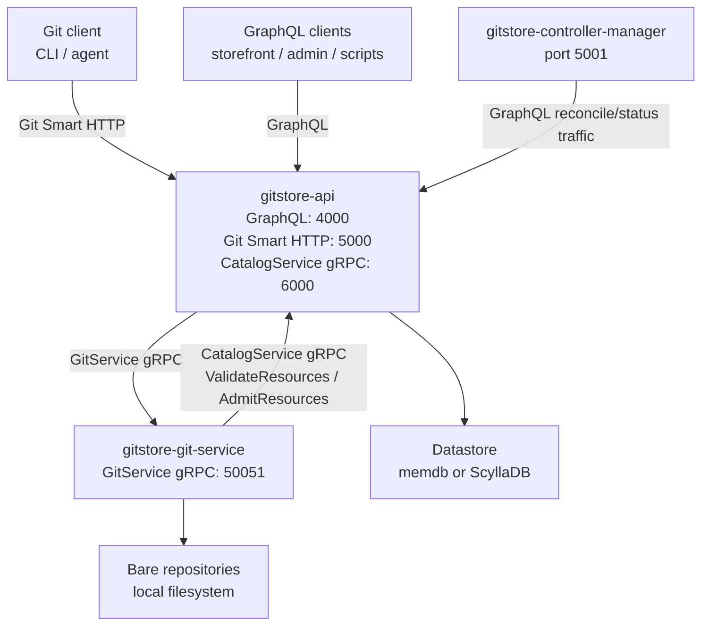

# GitStore Developer Guide

**Date**: 2026-06-17

**Audience**: Contributors, operators, and integration engineers
**Prerequisites**: Docker, Git, Go, Rust, Make, curl, jq

This guide keeps implementation detail out of the user guide. It covers service topology, local development, datastore backends, hook/admission flow, controller-manager runtime, generated schema/proto workflow, and module responsibilities.

## Current Topology



## Ports

| Service | Port | Purpose |
|---|---:|---|
| `gitstore-api` | `4000` | GraphQL, Playground, `/health`, `/ready`, login helper |
| `gitstore-api` | `5000` | Git Smart HTTP front door |
| `gitstore-api` | `6000` | CatalogService gRPC called by the Git service |
| `gitstore-git-service` | `50051` | GitService gRPC storage and transport |
| `gitstore-controller-manager` | `5001` | `/health`, `/metrics`, poison-item API |
| `gitstore-admin` | `3000` | Optional browser UI |

## Local Development

Start the Docker stack:

```bash
make compose DETACH=1
make ps
```

Run native services:

```bash
make git
make api
make controller
```

Run the Git service and API together in the foreground:

```bash
make dev
```

Bootstrap local control-plane resources through GraphQL:

```bash
make bootstrap ADMIN_PASSWORD=<admin-password>
```

Useful variables:

| Variable | Default | Purpose |
|---|---|---|
| `API_URL` | `http://localhost:4000/graphql` | Bootstrap GraphQL endpoint |
| `ADMIN_USERNAME` | `admin` | Login username |
| `ADMIN_PASSWORD` | unset | Login password for bootstrap token creation |
| `BOOTSTRAP_TOKEN` | unset | Reuse an existing bearer token |
| `NAMESPACE` | `gitstore-test` | Namespace to create |
| `REPOSITORY` | `catalog` | Repository to create |
| `DEFAULT_BRANCH` | `main` | Repository default branch |

## Datastore Backends

`gitstore-api` owns the application datastore abstraction.

| Backend | Use | Notes |
|---|---|---|
| `memdb` | Development and fast tests | In-memory only; no persistence |
| `scylla` | Production-oriented backend | Uses ScyllaDB 5.x+ and embedded migrations |

Start Scylla services only:

```bash
make scylla DETACH=1
```

Start the full stack with Scylla:

```bash
make compose-scylla DETACH=1
```

Run Scylla-backed API datastore tests after Scylla is reachable:

```bash
cd gitstore-api
GITSTORE_TEST_SCYLLA_ADDR=127.0.0.1:9042 \
  go test -tags scylla -v -timeout 10m ./tests/contract/datastore/... ./internal/datastore/scylla/...
```

## Git And Admission Flow

The API is the Git Smart HTTP front door. The Rust Git service is gRPC-only storage and transport.

1. A Git client clones, fetches, or pushes to `http://localhost:5000/{namespace}/{repo}.git`.
2. `gitstore-api` resolves `{namespace}/{repo}` to the stable repository ID stored in the datastore.
3. `gitstore-api` forwards Git transport work to `gitstore-git-service` through `GitService` gRPC.
4. During receive-pack, `gitstore-git-service` stages objects in quarantine and runs enabled hook phases.
5. In the blocking pre-receive phase, `gitstore-git-service` sends frontmatter resource blobs to `gitstore-api` via `CatalogService.ValidateResources`.
6. If validation passes, refs are updated and the push succeeds.
7. In the post-receive phase, `gitstore-git-service` calls `CatalogService.AdmitResources` with repository ID, commit SHA, and ref name.
8. `gitstore-api` fetches accepted files through `GitService`, parses catalogue resources, applies admission checks, and stores hydrated records and status in the datastore.
9. `gitstore-controller-manager` reconciles controller-owned status and operational follow-up through the API.

The pre-receive phase is intentionally stateless and blocking. Admission can use datastore state and is allowed to complete asynchronously relative to the Git client acknowledgement.

## Controller Manager Runtime

`gitstore-controller-manager` provides the shared runtime for level-triggered controllers.

Runtime pieces:

- Work queues keyed by kind, namespace, and name.
- Worker pools via `pond`.
- Retry and backoff via `cenkalti/backoff`.
- Quarantine for poison items after repeated failures.
- Panic capture with stack traces.
- Per-kind health statistics.
- Prometheus metrics.

HTTP surface on port `5001`:

| Route | Purpose |
|---|---|
| `GET /health` | Returns `ok` or `degraded` based on stalled workers and poison items |
| `GET /metrics` | Prometheus metrics |
| `GET /controller/v1/poison/{kind}` | List quarantined items for one kind |
| `GET /controller/v1/poison/_all` | List all quarantined items |
| `POST /controller/v1/poison/{kind}/{namespace}/{name}/requeue` | Requeue one poison item |

## Module Notes

### `gitstore-api`

Purpose:

- GraphQL API and Relay-style schema.
- Authentication and JWT sessions.
- Namespace and repository control plane.
- Git Smart HTTP handler.
- CatalogService gRPC server for push validation and admission.
- Datastore abstraction and backend implementations.

Important directories:

| Path | Purpose |
|---|---|
| `cmd/server` | API entrypoint |
| `internal/app` | Runtime composition |
| `internal/graph` | gqlgen resolvers and generated code |
| `internal/githttp` | Smart HTTP front door |
| `internal/gitclient` | GitService gRPC client |
| `internal/cataloggrpc` | CatalogService gRPC implementation |
| `internal/datastore` | Datastore abstraction and backends |
| `internal/validate` | Frontmatter resource validation |

Commands:

```bash
make api
cd gitstore-api
go test ./...
go generate ./...
go run ./cmd/hashpw <password>
```

### `gitstore-git-service`

Purpose:

- Own bare repository storage.
- Serve GitService gRPC operations for repository lifecycle, ref advertisement, receive-pack, upload-pack, file reads, commits, deletes, and tags.
- Run receive hook phases and call the API CatalogService.

Important directories:

| Path | Purpose |
|---|---|
| `src/grpc` | Tonic GitService server |
| `src/git` | Repository and pack protocol logic |
| `src/git/hooks` | Receive hook pipeline, validation, admission callouts |
| `gen` | Generated Rust proto bindings |
| `tests/integration` | Rust integration tests |

Commands:

```bash
make git
cd gitstore-git-service
cargo test
cargo test --test integration
cargo build --release
```

### `gitstore-controller-manager`

Purpose:

- Shared controller runtime.
- Level-triggered reconciliation primitives.
- Health, metrics, and poison-item management API.

Important directories:

| Path | Purpose |
|---|---|
| `cmd/controller` | Controller manager entrypoint |
| `internal/manager` | Runtime registration and dispatch |
| `internal/queue` | Work queue |
| `internal/worker` | Worker pool |
| `internal/retry` | Backoff and quarantine |
| `internal/health` | Health and metrics handlers |
| `internal/api` | Poison-item API |
| `tests/contract` | Runtime contract tests |

Commands:

```bash
make controller
cd gitstore-controller-manager
go test ./...
```

### `gitstore-admin`

Purpose:

- Optional Astro/React UI.
- GraphQL client of `gitstore-api`.
- Browser-facing attachment point for future Git-backed editing workflows.

Commands:

```bash
make admin-compose DETACH=1
cd gitstore-admin
npm install
npm run dev
npm run build
npm run test
npm run test:e2e
```

## Generated Schema And Proto Workflow

### GraphQL

Schema files live in [shared/schemas](../shared/schemas/). gqlgen configuration lives in [gitstore-api/gqlgen.yml](../gitstore-api/gqlgen.yml).

When schema changes:

```bash
cd gitstore-api
go generate ./...
go test ./...
```

Generated files are under `gitstore-api/internal/graph/generated` and `gitstore-api/internal/graph/model`.

### Protobuf

Canonical proto contracts live in [shared/proto](../shared/proto/):

- `gitstore/git/v1/git_service.proto`
- `gitstore/catalog/v1/catalog_service.proto`

Generated Go stubs live in `gitstore-api/gen`. Generated Rust stubs live in `gitstore-git-service/gen`. The Rust build does not generate proto code at compile time; `build.rs` documents that stubs are generated by the repository's buf workflow.

After proto changes, regenerate stubs with the repository's proto generation workflow and run:

```bash
make build
make test
```

## Tests And PR Readiness

Focused checks:

```bash
cd gitstore-api
go test ./...

cd ../gitstore-controller-manager
go test ./...

cd ../gitstore-git-service
cargo test
```

Aggregate checks:

```bash
make build
make test
make lint
make license-check
make pr-ready
```

Install local hooks once per clone:

```bash
./scripts/install-git-hooks.sh
```

Use Conventional Commits.

## Configuration Highlights

### API

| Env var | Default | Purpose |
|---|---|---|
| `GITSTORE_API__PORT` | `4000` | GraphQL HTTP port |
| `GITSTORE_API__GIT_PORT` | `5000` | Git Smart HTTP port |
| `GITSTORE_API__GRPC_PORT` | `6000` | CatalogService gRPC port |
| `GITSTORE_GIT__GRPC__URI` | `dns:///localhost:50051` | GitService gRPC target |
| `GITSTORE_DATASTORE__BACKEND` | `memdb` | `memdb` or `scylla` |
| `GITSTORE_AUTH__ADMIN__USERNAME` | unset | Admin login username |
| `GITSTORE_AUTH__ADMIN__PASSWORD_HASH` | unset | bcrypt password hash |
| `GITSTORE_AUTH__JWT__SECRET` | unset | JWT signing secret |

### Git Service

| Env var | Default | Purpose |
|---|---|---|
| `GITSTORE_GRPC__PORT` | `50051` | GitService gRPC port |
| `GITSTORE_GIT__DATA_DIR` | `/data/repos` | Bare repository root |
| `GITSTORE_GIT__REPO__MAX_FILE_SIZE` | `52428800` | Per-file limit |
| `GITSTORE_CATALOG_SERVICE__URI` | `http://localhost:6000` | API CatalogService target |

### Controller Manager

| Env var | Default | Purpose |
|---|---|---|
| `GITSTORE_CONTROLLER__PORT` | `5001` | HTTP management port |
| `GITSTORE_CONTROLLER__API__URI` | `http://localhost:4000/graphql` | API endpoint for reconciliation |
| `GITSTORE_CONTROLLER__DEFAULT_MAX_ATTEMPTS` | `5` | Retry limit before quarantine |
| `GITSTORE_CONTROLLER__DEFAULT_STALL_THRESHOLD` | `5m` | Worker stall threshold |

See [configuration.md](configuration.md) for the operator reference.

## Historical Implementation References

Spec quickstarts are useful implementation references, but they are not user-facing current workflow docs.

| Spec | Reference |
|---|---|
| `012-smart-http-api` | [quickstart](../specs/012-smart-http-api/quickstart.md), [plan](../specs/012-smart-http-api/plan.md) |
| `018-hook-pipeline-wiring` | [quickstart](../specs/018-hook-pipeline-wiring/quickstart.md), [plan](../specs/018-hook-pipeline-wiring/plan.md) |
| `021-category-taxonomy` | [quickstart](../specs/021-category-taxonomy/quickstart.md), [plan](../specs/021-category-taxonomy/plan.md) |
| `022-collection-resource-contract` | [quickstart](../specs/022-collection-resource-contract/quickstart.md), [plan](../specs/022-collection-resource-contract/plan.md) |
| `024-product-variant` | [quickstart](../specs/024-product-variant/quickstart.md), [plan](../specs/024-product-variant/plan.md) |
| `025-controller-manager-runtime` | [quickstart](../specs/025-controller-manager-runtime/quickstart.md), [plan](../specs/025-controller-manager-runtime/plan.md) |
| `026-reconcile-handler` | [quickstart](../specs/026-reconcile-handler/quickstart.md), [plan](../specs/026-reconcile-handler/plan.md) |

## Related Docs

- [User Guide](user-guide.md)
- [API Reference](api-reference.md)
- [Architecture](architecture.md)
- [Admin](admin/README.md)
- [Push Validation](products/push-validation.md)
