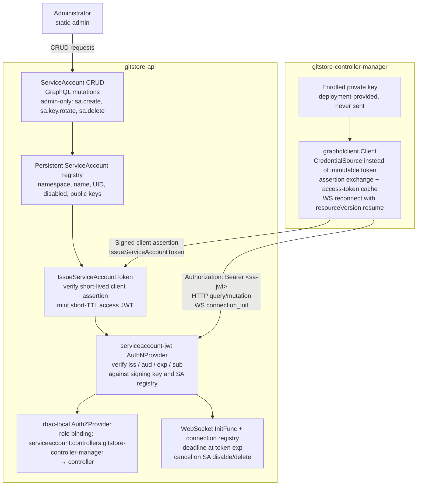
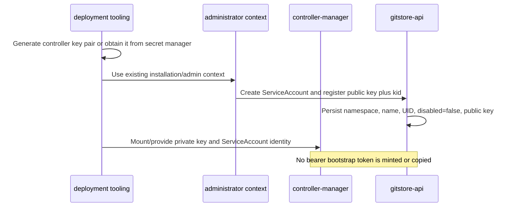
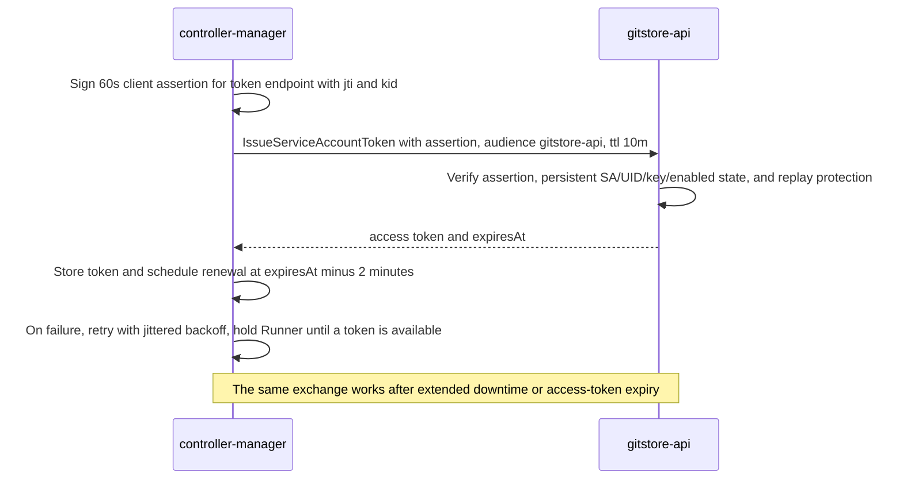
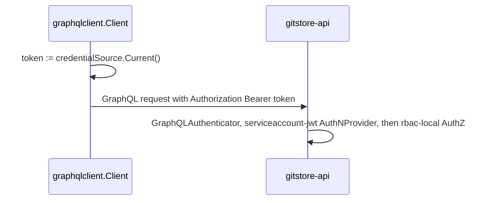
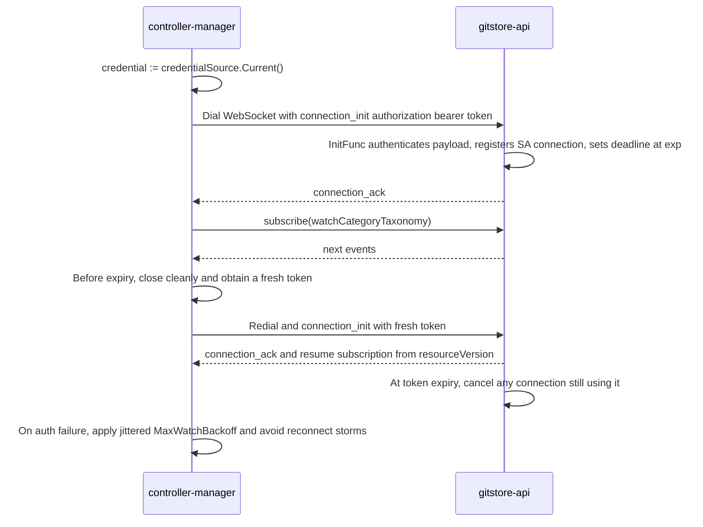
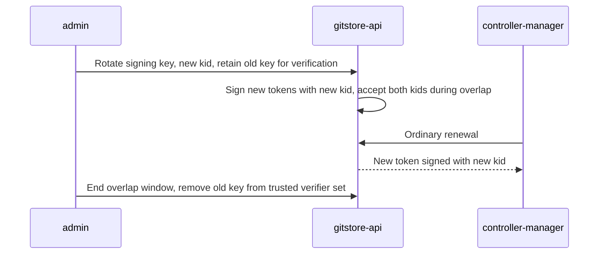
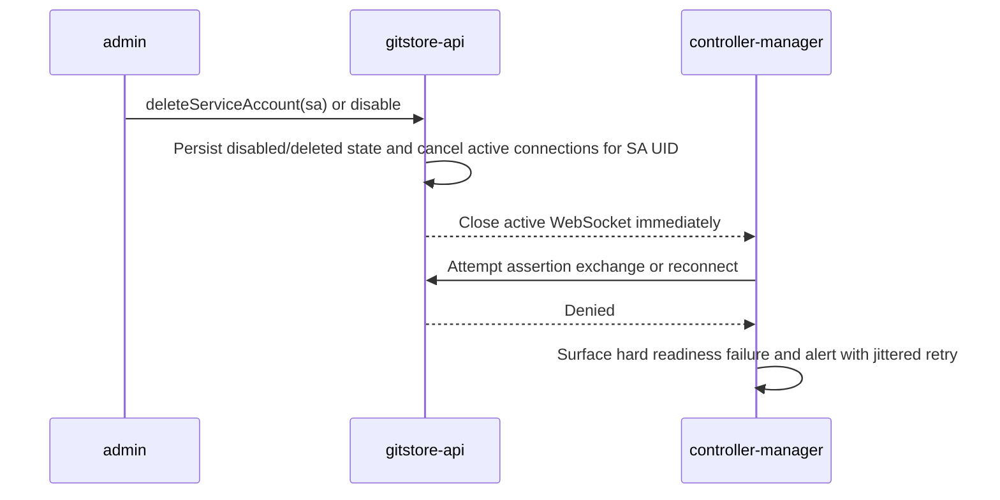

# Service-Account Authentication for GitStore Controllers
**Status**: 🟡️ Proposed (not yet implemented)

> Generated 2026-08-09 via deep-research workflow (102 agents, 20 sources, 21 verified claims) plus direct source inspection of `gitstore-api` and `gitstore-controller-manager`.
> Extends `020-pluggable_auth_architecture.md` (Phases 1–6 shipped; this document specifies the deferred Phase 7 "OIDC JWT provider" slot as a **GitStore-issued service-account provider** instead, and supersedes spec 040 research.md's "controller = ordinary bearer-JWT admin principal" interim decision).
> `022-opa-data-authorization.md` extends this document with authoritative read-path enforcement,
> semantic Product/ProductVariant scopes, and OPA-backed service-account role resolution.

---

## 1. Executive Recommendation

**Extend GitStore's pluggable AuthN/AuthZ architecture with a GitStore-issued service-account identity plane** — a new `AuthNProvider` (`serviceaccount-jwt`) that verifies short-lived, asymmetrically-signed, audience-bound JWTs against GitStore's own issuer, plus a minimal `TokenRequest`-style issuance endpoint inside `gitstore-api`. Kubernetes' **ServiceAccount token model is the right reference design to copy properties from** (namespaced identity, short TTL, audience binding, `TokenRequest`-style issuance instead of static secrets, object-binding, prompt invalidation) — but GitStore must **not** depend on a running Kubernetes cluster to get those properties, because GitStore also ships as a native process, a Docker Compose stack, and a CI job. Kubernetes' kubelet is the durable credential source for a Pod: it authenticates to the API server, obtains a Pod-bound token, projects it into the Pod, and rotates it before expiry. GitStore has no universal kubelet equivalent, so its portable path uses a deployment-enrolled controller key pair: the API persistently stores the public key and the controller proves possession of the private key with a short-lived client assertion whenever it needs an access token.

SPIFFE/SPIRE independently confirms which properties matter (audience-bound `JWT-SVID`s, stable hierarchical subject identity, attestation-derived — not self-asserted — identity) but its architecture (SPIRE Server + per-node SPIRE Agent + workload-attestation plugins) is materially heavier than a first controller-identity iteration justifies at GitStore's current single-controller-class scale.

**Verdict (of the four required choices): extend pluggable auth with GitStore-issued service accounts.** An optional, clearly-bounded Kubernetes-issued-token verifier (`oidc-jwt`-style, accepting a cluster's own `ServiceAccount` tokens via its OIDC discovery/JWKS) may be added later as an *additional* in-cluster-only AuthN provider in the chain — never as the only path, since GitStore must run identically outside Kubernetes.

This satisfies the decision standard: controllers get automatically renewable, short-lived, audience-bound credentials and least-privilege authorization without an administrator ever copying a personal or admin bearer token into `GITSTORE_CONTROLLER__API_TOKEN` in normal production operation. Installation still has an **identity-enrollment** step—equivalent to applying a Kubernetes `ServiceAccount`, RBAC binding, and workload manifest—but it registers public trust material rather than minting a bearer bootstrap token. Startup, restart, renewal after extended downtime, and recovery after access-token expiry require no administrator.

---

## 2. Verified Current-State Architecture and the Authentication Gap

Confirmed directly from source (not from the external research pass, which does not cover GitStore's own code):

- **`gitstore-controller-manager/internal/config/config.go`** — `ControllerConfig.ApiToken string` (`mapstructure:"api_token"`, env `GITSTORE_CONTROLLER__API_TOKEN`), default `""`. The doc comment states plainly: *"an ordinary bearer-JWT principal, no new auth mechanism."*
- **`gitstore-controller-manager/internal/graphqlclient/client.go`** — `Client.token` is an immutable string set once in `New(baseURL, token string)`. `do()` attaches `Authorization: Bearer <token>` on every HTTP query/mutation (`client.go:94-96`). `Subscribe()` sends the same token once, in the `connection_init` payload (`client.go:193-196`), never again for the life of the WebSocket. There is no token refresh, no re-authentication mid-stream, no rotation, and no revocation hook anywhere in this package.
- **`gitstore-controller-manager/cmd/controller/main.go:101`** — `graphqlclient.New(cfg.Controller.ApiURI, cfg.Controller.ApiToken)`, called once at startup. If the token is empty, wrong, or later revoked, the controller does not recover — see §12 (testing) and §13 (observability) for the corresponding gaps.
- **`gitstore-api/internal/app/server.go:322-368`** (`buildProviderRegistry`) — the **only** AuthN providers wired today are `static-admin` and `anonymous` (chain default `["static-admin","anonymous"]`); the only AuthZ providers are `rbac-local` and `allow-all`. Confirmed by directory listing: `gitstore-api/internal/auth/provider/` contains exactly `allowall/`, `anonymous/`, `rbaclocal/`, `staticadmin/`, `userdirnone/`. **No `oidcjwt/` package exists.** `020-pluggable_auth_architecture.md` §2b's `OIDCJWTProvider` and its "Phase 7 — OIDC JWT provider" rollout entry (§7) are an unimplemented design, not shipped code — the research task's caution not to treat `oidc-jwt` as implemented is correct.
- **`gitstore-api/internal/auth/types.go`** — the live `AuthNProvider` interface is `Name() string`, `Capabilities() Capability`, `Authenticate(ctx, AuthRequest) (*Principal, Decision, error)`, `RevokeSession(ctx, jti, expiresAt) error`, `RefreshSession(ctx, oldToken) (newToken, exp, error)`, and `IssueSession(ctx, subject) (token, exp, error)`. This is already provider-agnostic and already has an issuance method (`IssueSession`) — a new service-account provider slots in without changing this interface.
- **`gitstore-api/internal/middleware/security/graphql.go`** — `GraphQLFieldAuthorizer` (lines 181–218) is where `category.status.write` and the generic `<kind>.status.write` action strings are actually checked, only for the `updateCategoryStatus` and `updateResourceStatus` mutation fields. `GraphQLAuthenticator` (lines 46–85) runs once per GraphQL *operation* dispatch via `gqlServer.AroundOperations` (`server.go:262-264`) and reads `opCtx.Headers`. For WebSockets, gqlgen populates those headers from the HTTP upgrade request; it exposes the `connection_init` payload separately. The current server wires `transport.Websocket` with no `InitFunc` (`server.go:245-247`), while the controller sends its bearer token only in `connection_init`, so the server does **not** currently authenticate that payload or establish an authenticated connection context. The implementation must add an `InitFunc`; once authenticated there, a subscription principal is fixed for the connection lifetime unless the connection context is cancelled.
- **No `policy.yaml` exists anywhere in the repository.** `rbac-local`'s action-string vocabulary (`category.status.write`, `namespace.delete.own`, `namespace.delete.any`, `namespace.create.organization`, generic `<kind>.status.write`) is defined only in Go source and tests; there is no live example of a non-admin role binding running in any environment today.
- **`specs/040-controller-watch-status-api/research.md:45-50`** — spec 040 explicitly considered and **rejected** a dedicated machine-identity mechanism for controllers, deciding instead: *"The controller-manager authenticates as an ordinary bearer-JWT principal (issued via the existing `staticadmin.IssueSession`/`gitctl` tooling) whose roles are bound to a policy granting `category.status.write`..."* This is the documented status quo this research effort is asked to replace. Reusing the gRPC HMAC secret (`GITSTORE_AUTH__GRPC__HMAC_SECRET`, `gitstore-api/internal/gitclient/auth.go`) was also considered elsewhere and correctly ruled out — it protects a header-less gRPC channel with no `Principal` concept, not GraphQL callers.

**The gap, precisely:** GitStore has no notion of a *non-human, self-renewing, audience-scoped, least-privilege* principal. The only way to get the controller a working credential today is for an administrator to mint (or the controller to be handed) a `static-admin`-issued JWT — which, per `staticadmin`'s `IssueSession`, carries `Roles: ["admin"]` (see `020-pluggable_auth_architecture.md` §2a) — and paste it into `GITSTORE_CONTROLLER__API_TOKEN`. That is a manually-copied, long-lived, over-privileged bearer token, precisely what this research is asked to eliminate from normal production operation.

---

## 3. Required Security and Operational Properties

Derived from the objective, the decision standard, and confirmed external mechanics (§4):

1. **Distinct non-human identity type** — a controller must never be indistinguishable from a human admin in the audit trail (Principal.AuthMethod already provides the seam: `"static-admin"`, `"anonymous"`, and now `"serviceaccount-jwt"`).
2. **Namespaced, stable subject** — `serviceaccount:<namespace>:<name>` (or GitStore's own namespace concept — see §9) so future controllers get disjoint identities without new code.
3. **Short-lived, signed, audience-bound tokens** — no persistent non-expiring bearer secret in normal operation.
4. **Automatic issuance and renewal** — after installation-time public-key enrollment, no human step between "controller needs a token" and "controller has one," across every restart, every renewal cycle, and recovery after the previous access token has expired.
5. **Least privilege** — a controller role scoped to exactly the actions its reconciler needs, never `admin`.
6. **Prompt invalidation** — deleting/disabling a service account must stop new tokens issuing, invalidate subsequent HTTP authentication, and cancel active WebSocket connections for that identity; access-token expiry must independently bound every connection lifetime.
7. **Portability** — works identically on a bare process, Docker Compose, Kubernetes, and CI, because GitStore's product does not require Kubernetes.
8. **No silent reconnect storms** — WebSocket reconnect-with-new-token logic must back off, not hammer the API when issuance itself is failing.
9. **No credential leakage in logs.**
10. **Backward compatibility** — `static-admin` login, the existing AuthN chain semantics, and `GITSTORE_CONTROLLER__API_TOKEN` as a deprecated fallback must keep working.
11. **Durable identity state** — ServiceAccount identity, UID, enabled state, and enrolled public keys must survive API restart and work consistently across API replicas; only ephemeral replay and live-connection indexes may begin in process memory.

---

## 4. Kubernetes Model Analysis

### 4a. Concepts worth reusing (verified, high confidence, primary sources)

| Kubernetes concept                                                      | Verified mechanics                                                                                                                                                                                                                                                                                                                                                                             | Why GitStore wants this property                                                                                                  |
|-------------------------------------------------------------------------|------------------------------------------------------------------------------------------------------------------------------------------------------------------------------------------------------------------------------------------------------------------------------------------------------------------------------------------------------------------------------------------------|-----------------------------------------------------------------------------------------------------------------------------------|
| Namespaced `ServiceAccount`, one identity per namespace/name            | Every namespace auto-provisions a `default` ServiceAccount; ServiceAccounts are strictly namespace-scoped ([kubernetes.io/concepts/security/service-accounts](https://kubernetes.io/docs/concepts/security/service-accounts/))                                                                                                                                                                 | Direct precedent for `serviceaccount:<namespace>:<name>` subject identity and per-controller-class disjoint scoping               |
| `TokenRequest` API — imperative issuance, not a static Secret           | POST subresource on a ServiceAccount; caller supplies audiences + requested TTL + optional bound-object ref, server returns an issued token and its actual expiry ([KEP-1205](https://github.com/kubernetes/enhancements/blob/master/keps/sig-auth/1205-bound-service-account-tokens/README.md))                                                                                               | Exact structural analog of the "TokenRequest-like issuance operation" the objective asks for                                      |
| Bound, short-lived, audience-scoped tokens (v1.22+)                     | Since v1.22, tokens are obtained via `TokenRequest` and delivered as projected volumes rather than long-lived Secret-backed tokens; Kubernetes docs explicitly recommend this over manually creating non-expiring Secret tokens ([kubernetes.io/tasks/configure-pod-container/configure-service-account](https://kubernetes.io/docs/tasks/configure-pod-container/configure-service-account/)) | This *is* the "reject long-lived `GITSTORE_CONTROLLER__API_TOKEN`" requirement, already validated as an industry-standard default |
| Explicit `aud` audience array; relying party must self-check membership | Bound tokens carry `aud` as an array of intended recipients; presenting a token to an unintended party must fail ([KEP-1205](https://github.com/kubernetes/enhancements/blob/master/keps/sig-auth/1205-bound-service-account-tokens/README.md))                                                                                                                                                | Directly closes the confused-deputy/wrong-audience threat (§8)                                                                    |
| Object-binding → deletion invalidates the token                         | A token can be bound to a Pod/Secret (name+group+version+kind+uid); the token becomes invalid the instant the bound object is deleted — no revocation list needed ([KEP-1205](https://github.com/kubernetes/enhancements/blob/master/keps/sig-auth/1205-bound-service-account-tokens/README.md))                                                                                               | Gives "prompt invalidation... where practical" without GitStore needing a revocation-list datastore in phase 1                    |
| Standard JWT claims + a private namespaced claim for extra identity     | `aud, exp, iat, iss, jti, nbf, sub` at top level, plus a `kubernetes.io` private claim carrying `namespace`, `serviceaccount.{name,uid}`, and (if bound) `pod`/`node` fields ([kubernetes.io/reference/access-authn-authz/service-accounts-admin](https://kubernetes.io/docs/reference/access-authn-authz/service-accounts-admin/))                                                            | Direct template for GitStore's own claim contract (§9)                                                                            |
| Workload receives credentials without minting them                      | For a Pod assigned a ServiceAccount, the admission controller adds the projected volume and the kubelet obtains and refreshes a short-lived token before expiry; application code does not perform an administrator bootstrap ([kubernetes.io/reference/access-authn-authz/service-accounts-admin](https://kubernetes.io/docs/reference/access-authn-authz/service-accounts-admin/))           | GitStore should separate installation-time identity enrollment from automatic runtime token acquisition                           |

### 4b. Concepts that are unsuitable or unnecessary for GitStore

- **Kubelet-managed rotation and Token Volume Projection.** This is how Kubernetes *delivers* rotated tokens to a Pod filesystem — it requires a kubelet, a Pod, and a projected-volume mount. GitStore also runs as a plain binary and inside Docker Compose, neither of which has a kubelet. GitStore needs its own credential-source abstraction in the controller process (§9) regardless of deployment target; borrowing "kubelet writes a rotated file" as *the* mechanism would make Kubernetes a hard dependency, which the objective explicitly forbids.
- **Per-cluster OIDC discovery / JWKS as the trust anchor.** Managed Kubernetes (e.g. AWS EKS) publishes a public, per-cluster OIDC discovery endpoint so external relying parties like AWS IAM can validate cluster-issued tokens ([AWS EKS IRSA docs](https://docs.aws.amazon.com/eks/latest/userguide/iam-roles-for-service-accounts-technical-overview.html)) — this is the correct verified template *if and only if* GitStore later adds an optional Kubernetes-issued-token AuthN provider for in-cluster deployments. It is not portable to self-managed clusters without extra configuration, and it is meaningless outside Kubernetes entirely, so it cannot be the universal mechanism.
- **Node attestation / kubelet-managed credential projection.** Kubernetes can issue and rotate a Pod's token without asking the workload for an administrator credential because the control plane already trusts the kubelet and binds the token to the Pod. GitStore's controller-manager is not always Kubernetes-hosted, so there is no equivalent universal attestor or projector. The portable substitute is one-time enrollment of a controller public key by deployment tooling, followed by proof-of-possession token exchange (§7 and §11)—not a bearer bootstrap token.
- **`BoundServiceAccountTokenVolume`'s exact GA version and file-projection mechanics.** An earlier draft claim that this reached GA in v1.32 was checked and refuted by adversarial verification (0-3 vote) — the real timeline is Beta in v1.21, GA/stable in v1.22 (locked by v1.23); the "v1.32 [stable]" tag on the docs page describes only a narrower 2026-era enhancement (embedding `nodeName` in bound-Pod claims), not the core mechanism. This is immaterial to GitStore's design either way, since GitStore is not adopting Kubernetes' delivery plumbing, but it is flagged here so nobody cites v1.32 as *the* GA milestone in a future design doc.

### 4c. In-cluster vs. out-of-cluster implications

- **In-cluster (optional, future):** gitstore-api could add an `oidc-jwt`-style AuthN provider that trusts a specific cluster's ServiceAccount-token issuer (audience must include `gitstore-api`; issuer must be on an explicit allowlist; JWKS fetched from that cluster's discovery endpoint; subject taken from `system:serviceaccount:<ns>:<name>` and mapped into GitStore's own `Principal.Subject`). Kubernetes RBAC (who can `create pods` with that ServiceAccount) stays entirely inside the cluster and is irrelevant to GitStore's own `AuthZProvider` decision — GitStore RBAC (`rbac-local`/OPA policy) is a completely separate binding from the *GitStore* subject string to GitStore actions. Multiple clusters/issuers require an explicit per-issuer JWKS+audience+namespace-trust allowlist to prevent subject collisions (two different clusters both minting `system:serviceaccount:controllers:gitstore-controller-manager`).
- **Out-of-cluster (native process, Docker Compose, CI, non-K8s installs):** there is no Kubernetes issuer or kubelet credential projector to trust. GitStore's own issuer (§9) is the only option. Deployment tooling generates or supplies the controller private key, registers the public key and ServiceAccount record through an authenticated installation operation, and thereafter the controller can obtain tokens without a live administrator or a still-valid previous token.

**Conclusion:** the Kubernetes-issued-token path is a legitimate optional *addition* once GitStore has in-cluster deployments with a clear operational need for it — but it cannot be the primary design, because it does not cover native/Compose/CI. Kubernetes workloads do **not** require an administrator to copy a bootstrap token into each Pod: an operator declares the ServiceAccount/RBAC/workload, and the control plane plus kubelet deliver and rotate the credential automatically. GitStore should preserve that separation. Its installation process enrolls identity and public trust material; its controller performs automatic token acquisition and renewal. GitStore can therefore adapt the properties of the modern Kubernetes ServiceAccount model without pretending it has Kubernetes' universal kubelet machinery.

---

## 5. Options Comparison

| Option                                                                                                                               | Security                                                                                              | Portability                                                                                                                                                                                             | Impl. effort                                                                                                                                | Ops burden                                                                                         | Rotation                                                                                             | Revocation                                                                                                                                                                                                             | External deps                                                           | GraphQL WS compat                                                                                                                                                                                                                                                                                |
|--------------------------------------------------------------------------------------------------------------------------------------|-------------------------------------------------------------------------------------------------------|---------------------------------------------------------------------------------------------------------------------------------------------------------------------------------------------------------|---------------------------------------------------------------------------------------------------------------------------------------------|----------------------------------------------------------------------------------------------------|------------------------------------------------------------------------------------------------------|------------------------------------------------------------------------------------------------------------------------------------------------------------------------------------------------------------------------|-------------------------------------------------------------------------|--------------------------------------------------------------------------------------------------------------------------------------------------------------------------------------------------------------------------------------------------------------------------------------------------|
| **A. K8s-issued workload tokens** (oidc-jwt provider trusting cluster OIDC)                                                          | High in-cluster; risk of cross-cluster subject collision if issuer allowlist is sloppy                | **Poor** — useless outside K8s                                                                                                                                                                          | Medium (go-oidc/v3 already scoped in Phase 7 design)                                                                                        | Low once wired; JWKS rotation window needs forced-refresh-on-miss                                  | Kubelet-managed, automatic                                                                           | Account/Pod deletion invalidates promptly                                                                                                                                                                              | Requires reachable per-cluster JWKS                                     | Fine — same bearer-token model                                                                                                                                                                                                                                                                   |
| **B. GitStore-issued service accounts** (new `serviceaccount-jwt` AuthN provider + proof-of-possession `TokenRequest`-like endpoint) | High — short-lived access tokens plus an enrolled asymmetric controller key; no durable bearer secret | **Full** — native, Compose, K8s, CI use the same token contract; deployment adapters differ only in how the private key is supplied                                                                     | Medium — reuses `AuthNProvider` and existing datastore interfaces; adds client-assertion verification and persistent ServiceAccount records | Low — one issuer and persistent public-key registry; deployment tooling owns private-key placement | Controller-driven exchange using a short-lived signed assertion, before or after access-token expiry | Disable/delete/key removal blocks exchange and HTTP auth; active WebSockets are cancelled; optional access-token `jti` blacklist                                                                                       | None required                                                           | `InitFunc` authenticates `connection_init`; server bounds the connection by token expiry and identity revocation (§7)                                                                                                                                                                            |
| **C. External OIDC/OAuth2 client-credentials AS** (e.g. Keycloak/Dex issuing per RFC 6749 §4.4 + RFC 8693 token exchange)            | High, but only as strong as the external AS's own hardening                                           | Good, but adds a mandatory external service for every deployment profile, including `local-fast`                                                                                                        | High — new dependency, new deployment unit, new failure mode                                                                                | High — an additional service to run, monitor, and secure everywhere, including CI                  | Handled by the AS                                                                                    | Handled by the AS (revocation endpoint, RFC 7009)                                                                                                                                                                      | **Mandatory external IdP**                                              | Fine, same bearer model                                                                                                                                                                                                                                                                          |
| **D. SPIFFE/SPIRE** (JWT-SVID via SPIRE Agent Workload API)                                                                          | High — attestation-derived identity, not self-asserted                                                | Good in theory (works bare-metal/VM per SPIFFE's design goals), but requires a SPIRE Server plus a per-node SPIRE Agent everywhere GitStore or its controllers run, including a laptop `make dev` run   | High — net-new infrastructure class                                                                                                         | High — server + agent + attestation plugin config per environment                                  | Built-in via short-TTL SVIDs                                                                         | No general SVID revocation; relies on short TTL + attestation re-check (adversarial verification refuted the stronger claim that this is SPIFFE's *only* stated design tenet — treat as directionally true, not dogma) | SPIRE Server (+ Agent per host)                                         | Fine, same bearer model                                                                                                                                                                                                                                                                          |
| **E. mTLS client identities**                                                                                                        | High (network-layer identity, hard to steal via header leakage)                                       | Poor without existing PKI — `020-pluggable_auth_architecture.md` §4a already rejected mTLS for gRPC precisely because "PKI infrastructure (CA, cert generation, rotation tooling) does not exist today" | High — same blocker restated for a second call site                                                                                         | High — cert issuance/rotation tooling has to be built either way                                   | Requires cert rotation tooling                                                                       | Requires CRL/OCSP or short cert TTL                                                                                                                                                                                    | None required once PKI exists, but PKI itself is the missing dependency | **Awkward** — most browsers/clients and the existing `gorilla/websocket` dialer support TLS client certs, but this reintroduces a second identity mechanism alongside the existing bearer-JWT GraphQL model, violating the "avoid mixing... without justification" API-compatibility requirement |
| **F. Static API keys / long-lived JWTs (status quo)**                                                                                | Low — single stolen credential grants indefinite access until manually rotated                        | Full                                                                                                                                                                                                    | None (already exists)                                                                                                                       | Manual token minting and copy-paste per deployment                                                 | None (manual only)                                                                                   | None (manual revocation via blacklist, and only if the issuing provider is `static-admin`)                                                                                                                             | None                                                                    | Works, but this is exactly the anti-pattern the decision standard rejects                                                                                                                                                                                                                        |

**Reading the table:** Option B is the only one that is simultaneously secure, fully portable, low-effort (it reuses interfaces GitStore already has), and introduces no new mandatory external dependency. Option A is a valid *addition* once in-cluster deployments exist. Options C–E are all rejected for the same reason `020-pluggable_auth_architecture.md` already rejected mTLS for the gRPC plane: they require infrastructure GitStore does not have today, for a security property GitStore can already get more cheaply.

---

## 6. Recommended Architecture and Trust Boundaries



**Trust boundaries:**

1. **Deployment administrator/tooling → ServiceAccount registry.** Installation creates the ServiceAccount record and registers one or more controller public keys. Only an authenticated `admin`-role principal may create, rotate, disable, or delete these records. Role definitions and subject bindings remain authoritative in `rbac-local`'s `policy.yaml`; ServiceAccount CRUD does not mutate policy files.
2. **Controller key → token issuance.** The controller signs a client assertion with its enrolled private key. The assertion has a token-endpoint-specific audience, a maximum 60-second lifetime, a `kid`, the ServiceAccount subject/UID, and a unique `jti`. The API resolves the persistent ServiceAccount record, verifies the signature against the registered public key, rejects disabled/deleted/UID-mismatched accounts and replayed assertions, and only then mints an access token. A previous access token is neither necessary nor sufficient for renewal.
3. **Issuer signing key → access-token verification.** `gitstore-api` is both access-token issuer and verifier in phase 1 (no cross-process trust needed), which is a strict simplification of Kubernetes' issuer/relying-party split. The controller enrollment key is distinct from the API issuer key. If a second GitStore service later verifies access tokens independently, publish `/.well-known/jwks.json` rather than sharing the issuer private key.
4. **Controller → gitstore-api.** The controller never sends its private key. It sends a narrowly scoped, short-lived assertion only to token issuance and sends the resulting audience-bound access token to GraphQL HTTP and WebSocket operations. CategoryTaxonomy reconciliation has no delegated end-user identity to forward.
5. **Authenticated WebSocket → live connection registry.** `transport.Websocket.InitFunc` authenticates `connection_init`, returns a context carrying the principal, and gives that context a deadline at token expiry. The API registers the connection under the ServiceAccount UID; disable/delete/key-compromise handling cancels every matching context immediately. The registry is intentionally in-memory because it represents process-local sockets, unlike persistent ServiceAccount identity state.

---

## 7. Authentication and Token Lifecycle — Sequence Diagrams

**7a. Installation-time identity enrollment (not bearer-token bootstrap)**


**7b. Controller startup and renewal, including recovery after expiry**


**7c. HTTP request (Query/Mutate)**


**7d. WebSocket connection and reconnect**


**7e. Signing-key rotation**


**7f. Account revocation / deletion**


---

## 8. Proposed Interfaces and Configuration (not full implementation)

### 8a. Controller-side: replace the immutable token string

```go
// gitstore-controller-manager/internal/graphqlclient/credential.go

type Credential struct {
    AccessToken string
    ExpiresAt   time.Time
}

// CredentialSource supplies the current short-lived bearer token and expiry
// for every outbound request. Implementations own assertion exchange,
// renewal, caching, and single-flight behavior.
type CredentialSource interface {
    // Current returns a credential that remains valid for the caller's
    // immediate operation. It may block briefly while one exchange is in
    // flight, but must respect ctx and must never block indefinitely.
    Current(ctx context.Context) (Credential, error)
}

// StaticToken wraps GITSTORE_CONTROLLER__API_TOKEN for the deprecated
// dev/CI compatibility path (§11). Never renews.
type StaticToken struct{ token string }

func (s StaticToken) Current(context.Context) (Credential, error) {
    return Credential{AccessToken: s.token}, nil
}

// ServiceAccountSource signs a short-lived client assertion with an enrolled
// private key, exchanges it through IssueServiceAccountToken, and proactively
// renews access tokens at expiresAt-refreshThreshold. It can perform the same
// exchange when no cached access token exists or the previous token expired.
type ServiceAccountSource struct {
    // ... SA identity, key ID, signer/private-key source, issuer client,
    // current credential behind a mutex, singleflight, renewal goroutine
}
```

`Client.token string` becomes `Client.credentials CredentialSource`; `do()` and `Subscribe()` call `c.credentials.Current(ctx)` instead of reading a field. `Subscribe()` uses `Credential.ExpiresAt` to schedule a proactive reconnect before expiry. The server-side deadline remains authoritative if the client fails to reconnect.

### 8b. gitstore-api: new AuthN provider + issuance mutation

```go
// gitstore-api/internal/auth/provider/serviceaccountjwt/provider.go
package serviceaccountjwt

// Config keys (Viper):
//   auth.serviceaccount.issuer          GITSTORE_AUTH__SERVICEACCOUNT__ISSUER          default "gitstore"
//   auth.serviceaccount.audience        GITSTORE_AUTH__SERVICEACCOUNT__AUDIENCE        default "gitstore-api"
//   auth.serviceaccount.signing_key     GITSTORE_AUTH__SERVICEACCOUNT__SIGNING_KEY     required (PEM, Ed25519 or ECDSA)
//   auth.serviceaccount.default_ttl     GITSTORE_AUTH__SERVICEACCOUNT__DEFAULT_TTL     default "10m"
//   auth.serviceaccount.max_ttl         GITSTORE_AUTH__SERVICEACCOUNT__MAX_TTL         default "1h"
//   auth.serviceaccount.clock_skew      GITSTORE_AUTH__SERVICEACCOUNT__CLOCK_SKEW      default "2m"

type ServiceAccountJWTProvider struct { /* issuer signing key, persistent SA lookup, clock skew */ }

func (p *ServiceAccountJWTProvider) Name() string { return "serviceaccount-jwt" }
func (p *ServiceAccountJWTProvider) Authenticate(ctx, req) (*auth.Principal, auth.Decision, error) {
    // 1. Extract bearer token. Parse WITHOUT verifying signature; check iss ==
    //    p.issuer. If not, OutcomeChallenge (not my token — falls through
    //    to static-admin/anonymous, preserving existing chain semantics).
    // 2. Verify signature (Ed25519/ECDSA — asymmetric, so nothing else in
    //    the system needs this provider's private key).
    // 3. Verify aud contains p.audience; verify exp/nbf/iat with clock-skew leeway.
    // 4. Look up sub (serviceaccount:<namespace>:<name>) in the ServiceAccount
    //    registry; reject if disabled/deleted or uid mismatch (§9's uid claim
    //    guards against namespace/name reuse after deletion).
    // 5. Build Principal{Subject: sub, Roles: nil,
    //    AuthMethod: "serviceaccount-jwt", ExpiresAt: exp, TokenID: jti}.
}
// RevokeSession: optional per-access-token revocation. Account disable/delete
// and UID mismatch are authoritative and persist across API restarts.
// RefreshSession: ErrNotSupported — service accounts renew via
// proof-of-possession IssueServiceAccountToken, not the user-session refresh
// flow and not a still-valid previous access token.
```

The AuthN chain also adds a narrowly scoped `serviceaccount-assertion` provider. It recognizes `typ: "gitstore-sa-assertion+jwt"`, selects the persistent ServiceAccount and enrolled public key from the untrusted `sub`/`sa_uid`/`kid` only for signature lookup, then verifies:

- the signature against that enrolled key;
- `iss == sub == serviceaccount:<namespace>:<name>` and `sa_uid` matches the persistent record;
- `aud == "gitstore-api/serviceaccount-token"`;
- `exp - iat <= 60s`, `nbf`/clock skew, and enabled/non-deleted account state; and
- `jti` has not already been consumed within the assertion replay window.

On success it produces `Principal{Subject: sub, AuthMethod: "serviceaccount-assertion"}` for the single issuance operation. `GraphQLAuthorizer` must hard-deny this auth method for every operation except a single `issueServiceAccountToken` mutation; relying only on role checks is insufficient because the current read path is not generally gated. The issuance field authorizer additionally requires exact subject/UID match. An administrator may enroll or replace public keys and could therefore establish new trust through an auditable registry mutation, but an ordinary admin session cannot directly mint a controller token without first performing that explicit key-lifecycle action.

```graphql
# New mutation, gitstore-api/gitstore-api.graphqls
"""
Issues a short-lived token after the caller proves possession of an enrolled
ServiceAccount private key. Mirrors Kubernetes' TokenRequest result while
replacing kubelet attestation with a portable signed client assertion.
"""
type Mutation {
  issueServiceAccountToken(input: IssueServiceAccountTokenInput!): IssueServiceAccountTokenPayload!
  createServiceAccount(input: CreateServiceAccountInput!): CreateServiceAccountPayload!
  rotateServiceAccountKey(input: RotateServiceAccountKeyInput!): CreateServiceAccountPayload!
  deleteServiceAccount(input: DeleteServiceAccountInput!): DeleteServiceAccountPayload!
}

input IssueServiceAccountTokenInput {
  apiVersion: String! = "authentication.gitstore.dev/v1beta1"
  kind: String! = "TokenRequest"
  metadata: ObjectMetaInput! # contains namespace and name of the ServiceAccount to issue for
  spec: TokenRequestSpec!
}

input TokenRequestSpec {
    audience: String        # defaults to "gitstore-api"
    ttlSeconds: Int         # server clamps to auth.serviceaccount.max_ttl
}

type IssueServiceAccountTokenPayload {
    apiVersion: String!
    kind: String!
    metadata: ObjectMeta!
    status: TokenRequestStatus!
}

type TokenRequestStatus {
  token: String!
  expiresAt: DateTime!
}

input CreateServiceAccountInput {
  apiVersion: String! = "authentication.gitstore.dev/v1beta1"
  kind: String! = "ServiceAccount"
  metadata: ObjectMetaInput! # contains namespace and name of the ServiceAccount to create
  publicKeys: [ServiceAccountPublicKeyInput!]!
}

input ServiceAccountPublicKeyInput {
  kid: String!
  algorithm: String! # "Ed25519" preferred; "ECDSA-P256" acceptable
  publicKeyPEM: String!
}

input RotateServiceAccountKeyInput {
  metadata: ObjectMetaInput!
  add: [ServiceAccountPublicKeyInput!]!
  removeKids: [String!]!
}

type CreateServiceAccountPayload {
  apiVersion: String!
  kind: String!
  metadata: ObjectMeta!   # contains creationTimestamp, namespace, name and uid of the ServiceAccount created
  keyIDs: [String!]!
  disabled: Boolean!
}

input DeleteServiceAccountInput {
  apiVersion: String! = "authentication.gitstore.dev/v1beta1"
  kind: String! = "ServiceAccount"
  metadata: ObjectMetaInput! # contains namespace and name of the ServiceAccount to delete
}
```

`issueServiceAccountToken` authorization: the request must authenticate through `serviceaccount-assertion`, and the asserted subject/UID must exactly match the requested ServiceAccount. A previous access token cannot authorize issuance. Administrative authority is limited to ServiceAccount lifecycle and public-key enrollment/rotation; this prevents an administrator session or stolen API database from directly impersonating the controller without its private key.

### 8c. Config additions (Viper/env, additive — no breaking changes)

```
auth.authn.chain                       GITSTORE_AUTH__AUTHN__CHAIN            default unchanged: ["static-admin","anonymous"]
                                        # add both SA providers to enable, e.g.:
                                        # ["static-admin","serviceaccount-assertion","serviceaccount-jwt","anonymous"]
auth.serviceaccount.issuer             GITSTORE_AUTH__SERVICEACCOUNT__ISSUER          "gitstore"
auth.serviceaccount.audience           GITSTORE_AUTH__SERVICEACCOUNT__AUDIENCE        "gitstore-api"
auth.serviceaccount.assertion_audience GITSTORE_AUTH__SERVICEACCOUNT__ASSERTION_AUDIENCE "gitstore-api/serviceaccount-token"
auth.serviceaccount.signing_key        GITSTORE_AUTH__SERVICEACCOUNT__SIGNING_KEY     (required once enabled)
auth.serviceaccount.default_ttl        GITSTORE_AUTH__SERVICEACCOUNT__DEFAULT_TTL     "10m"
auth.serviceaccount.max_ttl            GITSTORE_AUTH__SERVICEACCOUNT__MAX_TTL         "1h"
auth.serviceaccount.clock_skew         GITSTORE_AUTH__SERVICEACCOUNT__CLOCK_SKEW      "2m"

controller.api_token                   GITSTORE_CONTROLLER__API_TOKEN          # DEPRECATED dev/CI compatibility only (§11)
controller.serviceaccount_namespace    GITSTORE_CONTROLLER__SERVICEACCOUNT__NAMESPACE  ""   # e.g. "controllers"
controller.serviceaccount_name         GITSTORE_CONTROLLER__SERVICEACCOUNT__NAME       "gitstore-controller-manager"
controller.serviceaccount_key_id       GITSTORE_CONTROLLER__SERVICEACCOUNT__KEY_ID      ""
# Signing key is an ADR 0001 SecretRef resolved through a bootstrap-tier
# SecretResolver (ADR 0009 §3) — NOT a raw filesystem path. The earlier
# controller.serviceaccount_private_key_file draft is superseded.
controller.serviceaccount_key_ref.name GITSTORE_CONTROLLER__SERVICEACCOUNT__KEY_REF__NAME ""
controller.serviceaccount_key_ref.key  GITSTORE_CONTROLLER__SERVICEACCOUNT__KEY_REF__KEY  "privateKey"
controller.secret_provider_bootstrap.type      GITSTORE_CONTROLLER__SECRET_PROVIDER_BOOTSTRAP__TYPE      "file"
controller.secret_provider_bootstrap.base_path GITSTORE_CONTROLLER__SECRET_PROVIDER_BOOTSTRAP__BASE_PATH "/etc/gitstore/secrets"
```

The ServiceAccount record is a datastore-only authentication-runtime resource. Its namespace/name, UID, disabled state, and enrolled public keys must be implemented through `datastore.Datastore` in both `go-memdb` and ScyllaDB from the first implementation phase. An in-memory record is not an acceptable starting point because API restart would erase the trust anchor and force re-enrollment. An assertion `jti` replay cache and the active-WebSocket index may remain in memory for the initial single-instance profile; multi-replica deployment requires a shared replay store and a revocation broadcast mechanism.

### 8d. WebSocket authentication and authoritative lifetime

The later implementation must add `transport.Websocket.InitFunc`; `AroundOperations` alone cannot authenticate the current client's `connection_init` payload. The `InitFunc`:

1. extracts `Authorization` from the init payload and authenticates it through the same registry used by HTTP;
2. rejects anonymous, expired, disabled, deleted, or UID-mismatched ServiceAccounts before `connection_ack`;
3. returns a context containing the authenticated principal and a deadline at `Principal.ExpiresAt`;
4. registers a cancellation function under a unique connection ID and ServiceAccount UID; and
5. unregisters the connection through `Websocket.CloseFunc`.

gqlgen closes the socket and cancels its active subscriptions when the returned context is cancelled. Account disable/delete and urgent key compromise cancel all matching live contexts immediately. In a multi-replica API, the durable account change is propagated to each replica through a datastore watch or pub/sub invalidation channel; each replica cancels only its local sockets. Client-side reconnect-before-expiry is a continuity optimization, never the security boundary.

---

## 9. Credential Contracts

### 9a. API-issued access-token claims

| Claim                                                          | Meaning                                             | Authoritative source                                      | Trust rule                                                                                                                                                                                                                                                                                                                  |
|----------------------------------------------------------------|-----------------------------------------------------|-----------------------------------------------------------|-----------------------------------------------------------------------------------------------------------------------------------------------------------------------------------------------------------------------------------------------------------------------------------------------------------------------------|
| `iss`                                                          | `auth.serviceaccount.issuer` (default `"gitstore"`) | gitstore-api signing config                               | Verifier MUST check exact match before trusting anything else — this is how the provider decides "is this even my token" (`OutcomeChallenge` vs. proceed)                                                                                                                                                                   |
| `sub`                                                          | `serviceaccount:<namespace>:<name>`                 | ServiceAccount registry at issuance time                  | Authoritative identity string; never accept a caller-asserted `sub` at issuance — issuance derives it from the ServiceAccount record being requested, gated by authz (§8b)                                                                                                                                                  |
| `aud`                                                          | `["gitstore-api"]` (array, matches K8s convention)  | issuance request, clamped to configured allowed audiences | Verifier MUST reject if its own identifier is absent — this is the confused-deputy defense                                                                                                                                                                                                                                  |
| `exp`                                                          | issuance time + clamp(requested TTL, `max_ttl`)     | issuer                                                    | MUST be checked; MUST NOT exceed `max_ttl` regardless of what the caller requested                                                                                                                                                                                                                                          |
| `iat`                                                          | issuance time                                       | issuer                                                    | Informational; service-account access tokens are never used as refresh credentials                                                                                                                                                                                                                                          |
| `nbf`                                                          | equal to `iat` (no future-dated tokens in phase 1)  | issuer                                                    | Checked with `clock_skew` leeway                                                                                                                                                                                                                                                                                            |
| `jti`                                                          | random UUID                                         | issuer                                                    | Supports optional per-token revocation and connection observability; account/UID state remains authoritative                                                                                                                                                                                                                |
| `sa_uid` (private claim, namespaced like K8s' `kubernetes.io`) | ServiceAccount's registry UID                       | ServiceAccount registry at issuance time                  | **Never accept this from an untrusted issuer** — it exists specifically so that if a ServiceAccount is deleted and a new one is created with the same namespace/name, an old cached token (if somehow still valid) fails verification on UID mismatch, exactly mirroring Kubernetes' own `serviceaccount.uid` claim purpose |
| `roles`                                                        | **absent** — roles are NOT embedded in the token    | —                                                         | See design decision below                                                                                                                                                                                                                                                                                                   |

**Design decision: roles are resolved by AuthZ from `rbac-local`'s `policy.yaml`, not embedded in the token or stored on the ServiceAccount identity record.** `serviceaccount-jwt.Authenticate` returns the stable subject with no roles. `rbac-local.Authorize` already merges `policy.RoleBindings[principal.Subject]` into the effective role set on every authorization call. This keeps identity/key lifecycle separate from authorization policy, makes the example in §10b authoritative, and means policy reload changes authorization without reissuing access tokens. ServiceAccount CRUD therefore does not accept or mutate roles.

Access-token signing: **asymmetric only** (Ed25519 preferred, ECDSA P-256 acceptable) — never HS256/shared-secret for this provider, specifically so that a future second verifier never needs the API issuer's private key, unlike the shared-secret `static-admin` HS256 path. No JWKS/OIDC-discovery endpoint is required in phase 1 (single issuer = single verifier, in-process); add `/.well-known/jwks.json` only when a second verifying process exists.

### 9b. Controller client-assertion claims

| Field                  | Requirement                                                                               |
|------------------------|-------------------------------------------------------------------------------------------|
| protected header `typ` | Exactly `gitstore-sa-assertion+jwt`; prevents confusing an assertion with an access token |
| protected header `kid` | Identifies one currently enrolled public key on the record                                |
| `iss`                  | Equal to the ServiceAccount subject                                                       |
| `sub`                  | Equal to `iss`; identifies the persistent record used to find `kid`                       |
| `sa_uid`               | Equal to the persistent ServiceAccount UID; prevents namespace/name reuse                 |
| `aud`                  | Exactly the configured assertion audience, default `gitstore-api/serviceaccount-token`    |
| `iat`/`nbf`/`exp`      | Assertion lifetime at most 60 seconds, checked with bounded clock skew                    |
| `jti`                  | Cryptographically random and accepted once within the replay window                       |

The assertion is proof of possession, not a general API credential. It is accepted only for `issueServiceAccountToken`, is never stored as the controller's renewable session, and remains useful after any prior access token has expired. Controller-key rotation uses overlapping `kid` values: enroll the new public key, roll controllers to the new private key, then remove the old `kid` and cancel connections authenticated through access tokens obtained with the compromised key if that provenance is tracked.

---

## 10. RBAC and Least-Privilege Policy — CategoryTaxonomy Controller

### 10a. Minimum actions required

Enumerated from `categorytaxonomy.NewReconciler` wiring in `cmd/controller/main.go:106-111` and the listwatch/status client shapes it depends on:

| Reconciler need                                        | Action string                                                | New or existing?                                                                                                                                                                                                                                                                                                                                                                                                                                                      |
|--------------------------------------------------------|--------------------------------------------------------------|-----------------------------------------------------------------------------------------------------------------------------------------------------------------------------------------------------------------------------------------------------------------------------------------------------------------------------------------------------------------------------------------------------------------------------------------------------------------------|
| Initial list of CategoryTaxonomy                       | `category.list`                                              | **New** — today there is no distinct list/watch action; `rbac-local` only gates mutations via `GraphQLFieldAuthorizer`, so reads currently pass through ungated by any explicit action check. Adding this action is optional hardening, not a blocker — GraphQL read-path authorization is a separate, pre-existing gap this document does not attempt to close in scope, but the action string is reserved here so it composes cleanly if/when read-gating is added. |
| Watch/subscribe to CategoryTaxonomy changes            | `category.watch`                                             | **New**, same rationale as above                                                                                                                                                                                                                                                                                                                                                                                                                                      |
| Supporting product reads (`NewProductCounter(client)`) | `product.list`                                              | **New** — 022 makes this the canonical Product connection action and enforces it through GraphQL read middleware.                                                                                                                                                                                                                                                                                                                                                     |
| Category status writes                                 | `category.status.write`                                      | **Existing** — already implemented and enforced today (`graphql.go:181-198`)                                                                                                                                                                                                                                                                                                                                                                                          |

**Recommendation:** define `category.list` and `category.watch` now. This document reserves those
actions; `022-opa-data-authorization.md` closes the Product/ProductVariant read-path gap and establishes
the same server-owned SDL/middleware pattern for future Category list/watch enforcement.

### 10b. Controller role (`rbac-local` `policy.yaml` fragment)

> **Corrected 2026-08-30 (spec 061, on rebase onto spec 047 / PR #370).** An earlier revision of this
> section scoped the role to the CategoryTaxonomy reconciler alone and asserted `no namespace.*, no
> repository.*`. That is wrong for the shipped binary: `gitstore-controller-manager`'s
> `cmd/controller/main.go` registers three workloads (`registerNamespace`, `registerCategoryTaxonomy`,
> `registerProductWatch`) that share **one** credential source and therefore **one** service account.
> The role below is the union of all three workloads' required actions.

```yaml
roles:
  gitstore-controller-manager:
    allow:
      # CategoryTaxonomy reconciler
      - category.list
      - category.watch
      - product.list
      - product.read.unpublished
      - category.status.write
      - category.delete
      # Namespace reconciler
      - repository.create.any     # see note below - .own is unreachable for a machine subject
      - namespace.status.write    # completeNamespaceDeletion
    deny: []   # least privilege: no admin role, no namespace.delete.*, no repository.delete.*

role_bindings:
  "serviceaccount:controllers:gitstore-controller-manager":
    - gitstore-controller-manager
```

**Why `repository.create.any` rather than `repository.create.own`.**
`Resolver.authorizeRepositoryTenant` (`gitstore-api/internal/graph/resolver/repository_authorization.go`)
picks the `.own`/`.any` suffix by comparing the target namespace's `CreationActor` to
`principal.Subject`, and falls back to `.any` whenever they differ. A controller's subject
(`serviceaccount:controllers:...`) never equals a human-created namespace's `CreationActor`, so
system-repository provisioning **always** requests `repository.create.any`. Granting only
`repository.create.own` would deny every provisioning call. Spec 047 (PR #370) makes this
load-bearing rather than theoretical, since system-repository provisioning is now on the enforced
namespace-admission path. Narrowing this grant — for example a resource-context predicate limiting
it to the reserved system-repository name, or an explicit machine-actor scope rule — requires an
`rbac-local` policy-semantics change and is deliberately out of scope for spec 061 (its FR-021
forbids changing `rbac-local` decision semantics). It is recorded there as a follow-on concern.

`product.read.unpublished` is required because the controller's product counter reconciles the
complete admitted catalog, not the storefront/public projection. Under 022, `product.list` supplies
the base read entitlement and `product.read.unpublished` upgrades that request to the `MANAGEMENT`
visibility scope. The role receives no ProductVariant management access unless a future reconciler
demonstrates a need for both `productVariant.list` and `productVariant.read.unpublished`.

### 10c. Namespacing and future controllers

Service-account identity is **namespaced by convention** (`serviceaccount:<namespace>:<name>`), reusing the exact same `Principal.Subject` string format the codebase already treats as opaque everywhere (`role_bindings` keys, log fields, `OwnerSub` comparisons). GitStore does not need a first-class "namespace" resource for ServiceAccounts distinct from its existing `Namespace` datastore concept — a simple string convention (e.g. `controllers` as the namespace segment for all controller-manager instances, or one namespace per controller class) is sufficient at this scale and matches Kubernetes' own namespace-as-string-segment design without requiring GitStore to build a second namespacing system. Each future controller (e.g. a hypothetical `product-variant-controller`) gets its own `serviceaccount:<ns>:<name>` plus a disjoint built-in controller role. In `rbac-local` that subject is connected through `role_bindings`; in the embedded OPA design it resolves through 022's built-in-role and namespace IAM projection. Neither path changes the AuthN provider or the `AuthZProvider` interface, and roles are not embedded in service-account tokens.

---

## 11. Migration Plan from `GITSTORE_CONTROLLER__API_TOKEN`

1. **Phase 0 (this document).** No code changes; establishes the target design.
2. **Phase 1 — persistent ServiceAccount identity and opt-in providers.** Add datastore-backed ServiceAccount/UID/public-key state plus `serviceaccount-assertion` and `serviceaccount-jwt` behind explicit AuthN-chain configuration. Ship assertion-gated issuance and administrative identity/key lifecycle mutations. `GITSTORE_CONTROLLER__API_TOKEN` continues to work exactly as today. Rollback: remove the two providers from the chain; persistent records remain inert.
3. **Phase 2 — installation-time enrollment, not token bootstrap.** Extend `gitctl` with an idempotent controller-identity enrollment command. It generates a private key locally (or accepts a secret-manager-backed signer), uses the administrator's existing installation context to create/update the ServiceAccount and register only the public key, and writes the private key with restrictive permissions or delegates storage to the deployment secret mechanism. Compose/Helm/native installation automation invokes this command as part of provisioning. It never writes a bearer access token to disk. This corresponds to an operator applying a Kubernetes ServiceAccount, RoleBinding, and workload manifest; runtime token delivery remains automatic.
4. **Phase 3 — controller exchange, renewal, and WebSocket enforcement.** Add `CredentialSource`, signed assertion exchange, access-token caching, proactive renewal, `Websocket.InitFunc`, expiry deadlines, live-connection cancellation, and `resourceVersion` resume. A restart after the access token expires succeeds from the enrolled private key without administrator involvement.
5. **Phase 4 — flip the default chain, deprecate the static fallback.** `GITSTORE_AUTH__AUTHN__CHAIN` default becomes `["static-admin","serviceaccount-assertion","serviceaccount-jwt","anonymous"]`. `GITSTORE_CONTROLLER__API_TOKEN` is marked deprecated in `docs/configuration.md` and is used only when no ServiceAccount signer is configured—an explicit dev/CI compatibility path, never the production default. Rollback trigger: any existing integration test relying on the static token path regresses.
6. **Phase 5 — enforce read-path action strings.** Adopt 022's SDL/middleware contract for
   `product.list` and its semantic visibility scope, then extend the same pattern to
   `category.list`/`.watch`. The controller role includes `product.read.unpublished` only because its
   reconciliation count needs the complete admitted Product set. ProductVariant management actions
   remain absent until a controller requirement justifies them.

At every phase, `static-admin` login and the existing `ChainedAuthN` short-circuit semantics (`registry.go:291-309`) remain intact. The two service-account providers use distinct token `typ` and audience contracts and return `OutcomeChallenge` for credentials they do not recognize. Installation may require an authorized administrative context to enroll identity, just as Kubernetes requires an operator or control plane to create/bind a ServiceAccount, but no administrator-issued bearer token participates in controller startup or renewal.

---

## 12. Testing Strategy

| Scenario                      | Test shape                                                                                                                                                                                                                                                                                                         |
|-------------------------------|--------------------------------------------------------------------------------------------------------------------------------------------------------------------------------------------------------------------------------------------------------------------------------------------------------------------|
| Clock skew                    | Unit test: token issued with `iat`/`nbf` 90s in the future (simulated clock drift) is still accepted within `clock_skew` leeway; 3 minutes in the future is rejected                                                                                                                                               |
| Assertion replay              | Unit/integration test: exchange one valid assertion successfully, replay the same `jti`, and confirm the second exchange is rejected; verify the assertion cannot authorize any GraphQL operation except `issueServiceAccountToken`                                                                                |
| Recovery after long downtime  | Integration test: stop the controller until its access token expires, restart it with only its enrolled private key and ServiceAccount identity, and confirm it obtains a new token without an administrator or previous access token                                                                              |
| API restart persistence       | Contract test against memdb and Scylla backends: enroll a ServiceAccount/key, restart/recreate the API backend, then exchange a new assertion successfully with the same UID and key                                                                                                                               |
| Signing-key rotation          | Integration test: issue a token with key A, rotate to key B while keeping A in the trusted set, verify tokens signed by both validate; after removing A, only B-signed tokens validate                                                                                                                             |
| Token expiry mid-watch        | Contract test: force a subscription token to expire while `Next()` is blocked; assert the server-side context deadline closes the socket even if the client does nothing, then confirm the Runner exchanges a new assertion and resumes from the last observed `resourceVersion` without gap or duplicate delivery |
| Invalid audience              | Unit test: token with `aud: ["some-other-service"]` is rejected by `serviceaccount-jwt.Authenticate` with `OutcomeDeny` (not `Challenge` — the issuer matches, so this is a real auth failure, not "not my token")                                                                                                 |
| Deleted service account       | Integration test: issue a token and open a subscription, then disable/delete the ServiceAccount; confirm assertion exchange and HTTP authentication fail and the server immediately cancels the already-open subscription                                                                                          |
| Unavailable issuer at startup | Unit test on `ServiceAccountSource`: issuance endpoint returns connection-refused; controller does not crash-loop tightly — verify jittered backoff timing and that `/health` reports not-ready (not merely silent) until a token is obtained                                                                      |
| Resume without missed events  | Already covered by spec 036/039's `resourceVersion`-based resume contract tests; add one more case specifically for "resume triggered by planned token-expiry reconnect" (7d) rather than only "resume triggered by network error"                                                                                 |
| No credential logging         | Static analysis / grep-based CI check (cheap to add) asserting no `zap` call in `graphqlclient` or `serviceaccountjwt` logs a raw token value; existing `020-pluggable_auth_architecture.md` conventions already avoid this elsewhere                                                                              |

---

## 13. Observability and Runbook Requirements

- **Metrics:** extend the existing `gitstore_git_http_auth_requests_total{outcome,service}` pattern (already shipped for git-http, `020-pluggable_auth_architecture.md` Phase 5) with a GraphQL-side equivalent, `gitstore_api_authn_requests_total{provider,outcome}`, so `serviceaccount-jwt` outcomes are distinguishable from `static-admin`/`anonymous` in the same dashboard.
- **Structured logs:** every `Authorize` call already emits `provider, subject, action, resource_kind, resource_name, outcome, reason, request_id, latency_ms` via the `DecisionLogger` (`020-pluggable_auth_architecture.md` §6 Decision 2) — `subject` for a service account naturally renders as `serviceaccount:<namespace>:<name>`, giving the audit trail the human/anonymous/service-account/inter-service distinction the objective asks for, for free, with zero new logging code.
- **Controller-side readiness:** the controller-manager's existing `/health` handler (`gitstore-controller-manager/internal/health`) should report not-ready while no valid `CredentialSource.Current()` can be obtained — this turns "credential acquisition failed at startup" into a scrapeable/alertable signal instead of a silent retry loop.
- **Runbook addition (new `docs/runbooks/controller-auth.md`, alongside the existing `controller-lag.md`):** steps for (a) rotating the API issuer key with zero downtime (§7e), (b) rotating/re-enrolling a controller public key without copying bearer tokens, (c) diagnosing "controller stuck in backoff" by distinguishing assertion exchange from watch-layer failure, and (d) recovering from accidental ServiceAccount deletion by explicitly re-enrolling the identity and invalidating the deleted UID.

---

## 14. Phased Implementation Plan with Rollback Points

| Phase                | Deliverable                                                                                                                                                                       | Rollback trigger                                                                                     |
|----------------------|-----------------------------------------------------------------------------------------------------------------------------------------------------------------------------------|------------------------------------------------------------------------------------------------------|
| 1                    | Persistent ServiceAccount datastore model; administrative identity/key lifecycle; `serviceaccount-assertion` and `serviceaccount-jwt`; assertion-gated `IssueServiceAccountToken` | Existing AuthN or datastore contracts regress; providers remain opt-in                               |
| 2                    | Idempotent `gitctl` identity enrollment and deployment integration; public key registered, private key stored through the deployment secret mechanism; no bearer bootstrap file   | Any supported deployment cannot enroll without copying an access token into controller configuration |
| 3                    | `graphqlclient.CredentialSource`, assertion exchange, proactive renewal, recovery after expiry, and WS reconnect with `resourceVersion` resume                                    | Controller cannot recover after access-token expiry or reconnect cleanly                             |
| 4                    | WebSocket `InitFunc`, expiry-bound contexts, live connection registry, and cancellation on ServiceAccount disable/delete                                                          | A connection survives expiry/revocation or existing subscription tests regress                       |
| 5                    | `policy.yaml` ships the `gitstore-controller-manager` role/binding; production defaults include both providers; static API token documented as deprecated dev/CI compatibility   | Any supported profile loses a working auth path or required controller action returns `OutcomeDeny`  |
| 6 (future, optional) | In-cluster `oidc-jwt`-style provider trusting Kubernetes-issued tokens, gated by explicit issuer allowlist config, as an additional chain entry                                   | N/A — purely additive; disabled by default                                                           |

---

## 15. Risks, Unresolved Decisions, and Explicit Non-Goals

**Risks**
- **Controller private-key protection becomes deployment-critical.** The key is a durable proof-of-possession credential, though it is not a bearer token and never leaves the controller. Native/Compose installs require restrictive filesystem permissions or a secret manager; Kubernetes should use a Secret/CSI-backed mount until the optional cluster-issued-token provider exists. Key rotation must support overlapping `kid` values.
- **Assertion replay protection is initially process-local.** A short assertion lifetime limits exposure in the single-instance profile. Multi-replica APIs require an atomic shared `jti` store before the feature is enabled across replicas.
- **Immediate WebSocket revocation is replica-local without broadcast.** Persistent disable/delete state blocks new authentication everywhere, but each replica needs a datastore watch or pub/sub invalidation signal to cancel its existing sockets promptly.
- **Read-path authorization migration** (§10a) spans more than controller authentication: today
  `GraphQLFieldAuthorizer` gates selected mutations, not general queries/subscriptions. 022 defines
  the Product/ProductVariant enforcement contract; Category list/watch enforcement still requires
  its own schema annotations and tests. Until those phases ship, assertion-only principals remain
  explicitly operation-restricted and cannot use the legacy read gap.
- **Public-key enrollment is an administrative installation operation.** This is not runtime token bootstrap: the administrator never mints or copies a bearer token, and the controller can recover autonomously after enrollment. Automation must make the operation idempotent and auditable.

**Unresolved decisions (deliberately deferred, not blocking)**
- Whether the first multi-replica implementation uses ScyllaDB lightweight transactions or a dedicated short-TTL cache for assertion `jti` replay protection.
- Whether to add workload/instance binding (a token bound to one controller-manager *process instance*, analogous to Pod-binding) — **not justified yet**: GitStore's controller-manager today is a single long-running process per deployment with no equivalent of Kubernetes' Pod-replacement churn; add this only if multi-replica controller-manager deployments become real.
- Exact shape of the future in-cluster `oidc-jwt` provider's issuer-allowlist config format — deferred to when an actual in-cluster deployment need materializes (§14 Phase 6).

**Explicit non-goals**
- This design does **not** adopt SPIFFE/SPIRE, mTLS, or an external OAuth2 authorization server as the primary mechanism (§5).
- This design does **not** require Kubernetes for any GitStore deployment profile.
- This design does **not** embed roles/scopes inside the JWT or ServiceAccount registry (§9) — authorization is resolved from `rbac-local`'s role definitions and subject bindings.
- This design does **not itself implement** the general GraphQL read path. It reserves controller
  actions and delegates the Product/ProductVariant authorization design to
  `022-opa-data-authorization.md`; other resource kinds require follow-up specifications.

---

## 16. Source-Backed Findings

External facts verified via a 102-agent adversarial-verification research pass (21 of 25 spot-checked claims confirmed, 4 explicitly refuted — see caveats below):

- Kubernetes ServiceAccount JWTs carry standard claims (`aud, exp, iat, iss, jti, nbf, sub`) plus a private `kubernetes.io` claim — [kubernetes.io/docs/reference/access-authn-authz/service-accounts-admin](https://kubernetes.io/docs/reference/access-authn-authz/service-accounts-admin/) (3-0 verified).
- Since v1.22, tokens are obtained via `TokenRequest` and delivered as projected volumes, replacing long-lived Secret-backed tokens; Kubernetes explicitly recommends this over manual non-expiring Secrets — [kubernetes.io/docs/tasks/configure-pod-container/configure-service-account](https://kubernetes.io/docs/tasks/configure-pod-container/configure-service-account/), [kubernetes.io/docs/concepts/security/service-accounts](https://kubernetes.io/docs/concepts/security/service-accounts/) (3-0 / 2-1 across sub-claims; merged confidence medium-high).
- For a Pod assigned a ServiceAccount, Kubernetes automatically provides credentials: the admission controller adds the projected volume and the kubelet requests and refreshes the time-bound token. Application code does not need an administrator-minted bootstrap token; the administrative act is declaring the ServiceAccount, RBAC binding, and workload — [kubernetes.io/docs/concepts/security/service-accounts](https://kubernetes.io/docs/concepts/security/service-accounts/), [kubernetes.io/docs/reference/access-authn-authz/service-accounts-admin](https://kubernetes.io/docs/reference/access-authn-authz/service-accounts-admin/).
- Bound tokens are explicitly audience-bound (`aud` as an array); relying parties must verify their own identifier is present — [KEP-1205](https://github.com/kubernetes/enhancements/blob/master/keps/sig-auth/1205-bound-service-account-tokens/README.md) (3-0).
- Tokens can be bound to a Pod/Secret object; deletion of the bound object invalidates the token without a maintained revocation list — [KEP-1205](https://github.com/kubernetes/enhancements/blob/master/keps/sig-auth/1205-bound-service-account-tokens/README.md) (3-0).
- `TokenRequest` is an imperative POST subresource taking audiences + validity duration + optional bound-object ref, returning a token + actual expiration — [KEP-1205](https://github.com/kubernetes/enhancements/blob/master/keps/sig-auth/1205-bound-service-account-tokens/README.md) (3-0).
- ServiceAccounts are strictly namespace-scoped; every namespace auto-provisions a `default` ServiceAccount — [kubernetes.io/docs/concepts/security/service-accounts](https://kubernetes.io/docs/concepts/security/service-accounts/) (3-0).
- AWS EKS publishes a per-cluster public OIDC discovery endpoint so external relying parties (IAM) can validate cluster-issued tokens — the concrete template for a future in-cluster `oidc-jwt` provider — [docs.aws.amazon.com/eks IRSA technical overview](https://docs.aws.amazon.com/eks/latest/userguide/iam-roles-for-service-accounts-technical-overview.html) (3-0).
- SPIFFE JWT-SVID mandates a stable, hierarchical `sub` (the workload's SPIFFE ID) and mandatory `aud` audience binding, with validators required to reject tokens missing their own identifier from `aud` — [spiffe/spiffe JWT-SVID.md](https://github.com/spiffe/spiffe/blob/main/standards/JWT-SVID.md) (3-0).
- SPIRE derives identity from local workload attestation (kernel/OS/kubelet-level inspection), not from a self-asserted token, and delivers SVIDs only via a per-node local Workload API — [spiffe.io SPIRE concepts](https://spiffe.io/docs/latest/spire-about/spire-concepts/), [spiffe.io SPIRE deployment](https://spiffe.io/docs/latest/deploying/spire_deployment/) (3-0 / 2-1; merged medium confidence — this is the architectural reason SPIRE was assessed as heavier than needed, §5).
- RFC 8414-style issuer-matching discipline (relying party must verify the issuer identifier it receives matches what it expects) — [RFC 8414](https://datatracker.ietf.org/doc/html/rfc8414) (general pattern confirmed 3-0; the narrower sub-claim that RFC 8414 mandates an `https`-only issuer scheme was checked and refuted, 1-2 — do not cite that specific restriction).
- OAuth 2.0 access tokens should be audience-restricted to a specific resource server — [RFC 9700 (OAuth 2.0 Security BCP)](https://datatracker.ietf.org/doc/html/rfc9700) (3-0), and the client-credentials grant (RFC 6749 §4.4) is the correct OAuth2 shape for non-delegated machine-to-machine auth if an external AS is ever used (§5 Option C).
- `graphql-transport-ws` delivers auth solely via the `connection_init` payload once per connection, with no built-in mid-connection re-authentication primitive — [enisdenjo/graphql-ws PROTOCOL.md](https://github.com/enisdenjo/graphql-ws/blob/master/PROTOCOL.md), corroborated by the library maintainer's own stated rationale that mid-connection credential swap has no real security benefit once a connection is established — [graphql-ws discussion #292](https://github.com/enisdenjo/graphql-ws/discussions/292) — directly informing this document's §7d design (renew-then-reconnect rather than swap-in-place).

**Explicitly refuted claims — do not rely on these:**
- "`BoundServiceAccountTokenVolume` reached stable/GA in Kubernetes v1.32" — refuted 0-3; the actual GA milestone for the core mechanism is v1.22 (locked by v1.23). The v1.32 tag on the docs page concerns a narrower, later `nodeName`-in-claims enhancement.
- "RFC 8414 requires the issuer field to use the `https` scheme" — refuted 1-2; treat as unconfirmed, not a hard requirement to design against.
- A generic high-level "SPIFFE overview" marketing-framing claim — refuted 0-3; rely only on the specific, verified SVID-format mechanics cited above.
- "JWT-SVID has no revocation mechanism and relies entirely on short TTL" — refuted 1-2; do not treat short-TTL-only as an established SPIFFE design tenet (this document instead treats short TTL as *sufficient in combination with* account-disable-blocks-new-issuance, per §7f — a GitStore-specific design choice, not a claimed SPIFFE mandate).

**Caveat carried forward from the research pass:** the 102-agent workflow verified only external ecosystem facts; it explicitly did not (and could not) verify GitStore's own source. All current-state claims in §2 of this document were separately confirmed by direct inspection of `gitstore-api` and `gitstore-controller-manager` source in this session, not by the external research pass.

---

## 17. Final Verdict

**Extend pluggable auth with GitStore-issued service accounts and proof-of-possession token exchange** (Option B, §5) is the chosen path.

- Kubernetes-issued workload tokens (Option A) are relegated to an optional, additive, in-cluster-only future extension (§14 Phase 6) because they cannot serve GitStore's native/Compose/CI deployment targets.
- An external workload-identity provider (OAuth2 client-credentials AS, or SPIFFE/SPIRE) is rejected as the primary mechanism because both require mandatory new infrastructure GitStore does not have and does not need at its current scale. GitStore instead enrolls an asymmetric controller public key, accepts only short-lived signed assertions at token exchange, and issues its own short-lived access JWTs through the existing pluggable-auth seams.
- A standalone GitStore subsystem separate from the pluggable auth framework is rejected: nothing about service-account identity requires stepping outside `AuthNProvider`/`AuthZProvider`/`ChainedAuthN` — it is a new provider plus a new issuance mutation, composing cleanly with everything already shipped in Phases 1–6 of `020-pluggable_auth_architecture.md`.
- Manual bearer-token bootstrap is rejected. Installation-time identity enrollment remains necessary for non-Kubernetes deployments because some trust anchor must authorize the controller key, but it is declarative/provisioning-time state analogous to creating a Kubernetes ServiceAccount and RoleBinding. Once enrolled, controller startup and renewal are autonomous even when every prior access token has expired.
