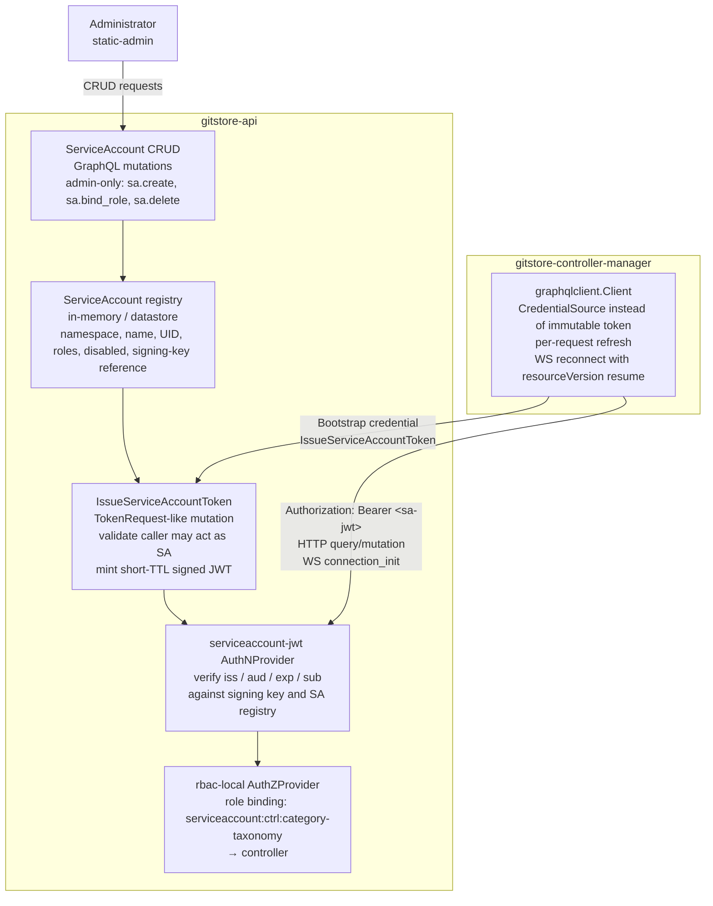
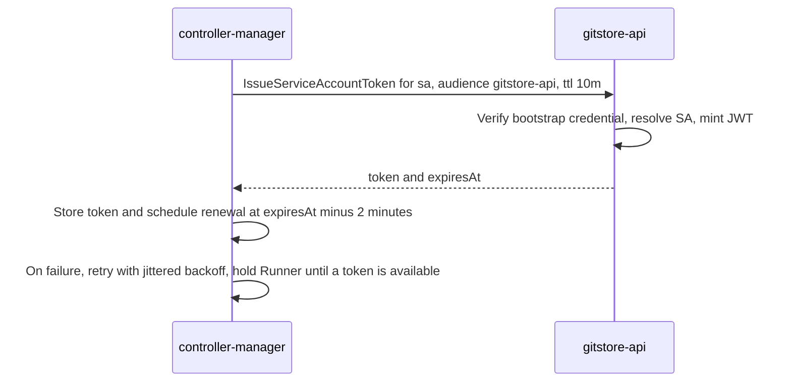
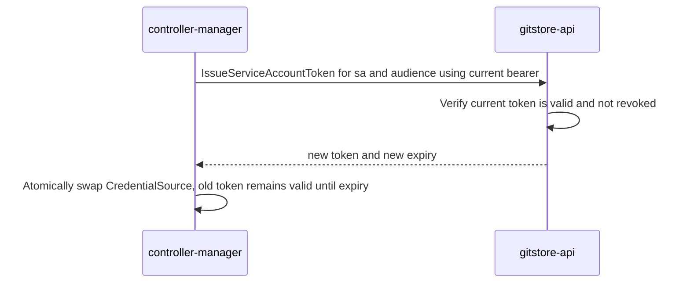
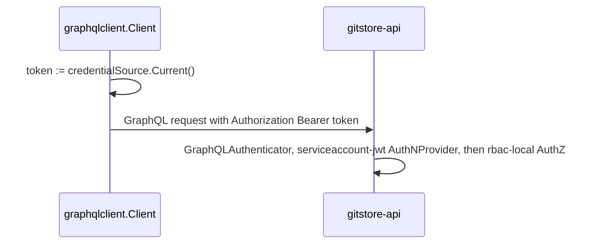
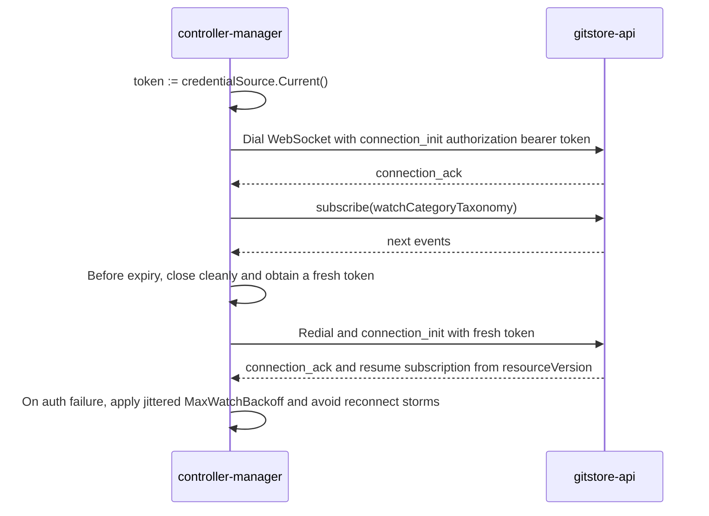
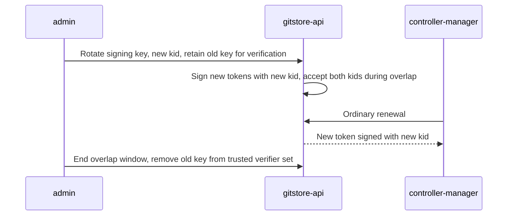
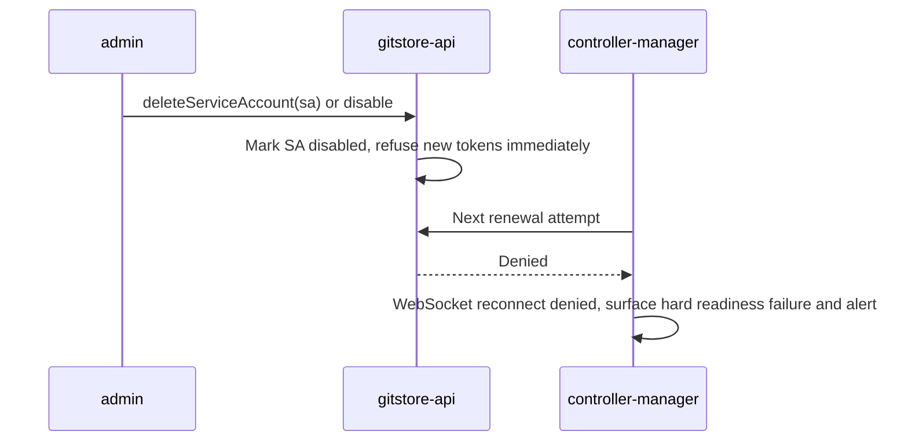

# Service-Account Authentication for GitStore Controllers

> Generated 2026-08-09 via deep-research workflow (102 agents, 20 sources, 21 verified claims) plus direct source inspection of `gitstore-api` and `gitstore-controller-manager`.
> Extends `020-pluggable_auth_architecture.md` (Phases 1–6 shipped; this document specifies the deferred Phase 7 "OIDC JWT provider" slot as a **GitStore-issued service-account provider** instead, and supersedes spec 040 research.md's "controller = ordinary bearer-JWT admin principal" interim decision).

---

## 1. Executive Recommendation

**Extend GitStore's pluggable AuthN/AuthZ architecture with a GitStore-issued service-account identity plane** — a new `AuthNProvider` (`serviceaccount-jwt`) that verifies short-lived, asymmetrically-signed, audience-bound JWTs against GitStore's own issuer, plus a minimal `TokenRequest`-style issuance endpoint inside `gitstore-api`. Kubernetes' **ServiceAccount token model is the right reference design to copy properties from** (namespaced identity, short TTL, audience binding, `TokenRequest`-style issuance instead of static secrets, object-binding, prompt invalidation) — but GitStore must **not** depend on a running Kubernetes cluster to get those properties, because GitStore also ships as a native process, a Docker Compose stack, and a CI job. Kubernetes' own machinery for achieving these properties (kubelet-managed rotation, node attestation via the kubelet, per-cluster OIDC discovery, `BoundServiceAccountTokenVolume`) is deployment-specific plumbing GitStore does not have and should not try to reimplement or require.

SPIFFE/SPIRE independently confirms which properties matter (audience-bound `JWT-SVID`s, stable hierarchical subject identity, attestation-derived — not self-asserted — identity) but its architecture (SPIRE Server + per-node SPIRE Agent + workload-attestation plugins) is materially heavier than a first controller-identity iteration justifies at GitStore's current single-controller-class scale.

**Verdict (of the four required choices): extend pluggable auth with GitStore-issued service accounts.** An optional, clearly-bounded Kubernetes-issued-token verifier (`oidc-jwt`-style, accepting a cluster's own `ServiceAccount` tokens via its OIDC discovery/JWKS) may be added later as an *additional* in-cluster-only AuthN provider in the chain — never as the only path, since GitStore must run identically outside Kubernetes.

This satisfies the decision standard: controllers get automatically renewable, short-lived, audience-bound credentials and least-privilege authorization without an administrator ever copying a personal or admin bearer token into `GITSTORE_CONTROLLER__API_TOKEN` in normal production operation.

---

## 2. Verified Current-State Architecture and the Authentication Gap

Confirmed directly from source (not from the external research pass, which does not cover GitStore's own code):

- **`gitstore-controller-manager/internal/config/config.go`** — `ControllerConfig.ApiToken string` (`mapstructure:"api_token"`, env `GITSTORE_CONTROLLER__API_TOKEN`), default `""`. The doc comment states plainly: *"an ordinary bearer-JWT principal, no new auth mechanism."*
- **`gitstore-controller-manager/internal/graphqlclient/client.go`** — `Client.token` is an immutable string set once in `New(baseURL, token string)`. `do()` attaches `Authorization: Bearer <token>` on every HTTP query/mutation (`client.go:94-96`). `Subscribe()` sends the same token once, in the `connection_init` payload (`client.go:193-196`), never again for the life of the WebSocket. There is no token refresh, no re-authentication mid-stream, no rotation, and no revocation hook anywhere in this package.
- **`gitstore-controller-manager/cmd/controller/main.go:101`** — `graphqlclient.New(cfg.Controller.ApiURI, cfg.Controller.ApiToken)`, called once at startup. If the token is empty, wrong, or later revoked, the controller does not recover — see §12 (testing) and §13 (observability) for the corresponding gaps.
- **`gitstore-api/internal/app/server.go:322-368`** (`buildProviderRegistry`) — the **only** AuthN providers wired today are `static-admin` and `anonymous` (chain default `["static-admin","anonymous"]`); the only AuthZ providers are `rbac-local` and `allow-all`. Confirmed by directory listing: `gitstore-api/internal/auth/provider/` contains exactly `allowall/`, `anonymous/`, `rbaclocal/`, `staticadmin/`, `userdirnone/`. **No `oidcjwt/` package exists.** `020-pluggable_auth_architecture.md` §2b's `OIDCJWTProvider` and its "Phase 7 — OIDC JWT provider" rollout entry (§7) are an unimplemented design, not shipped code — the research task's caution not to treat `oidc-jwt` as implemented is correct.
- **`gitstore-api/internal/auth/types.go`** — the live `AuthNProvider` interface is `Name() string`, `Capabilities() Capability`, `Authenticate(ctx, AuthRequest) (*Principal, Decision, error)`, `RevokeSession(ctx, jti, expiresAt) error`, `RefreshSession(ctx, oldToken) (newToken, exp, error)`, and `IssueSession(ctx, subject) (token, exp, error)`. This is already provider-agnostic and already has an issuance method (`IssueSession`) — a new service-account provider slots in without changing this interface.
- **`gitstore-api/internal/middleware/security/graphql.go`** — `GraphQLFieldAuthorizer` (lines 181–218) is where `category.status.write` and the generic `<kind>.status.write` action strings are actually checked, only for the `updateCategoryStatus` and `updateResourceStatus` mutation fields. `GraphQLAuthenticator` (lines 46–85) runs once per GraphQL *operation* dispatch via `gqlServer.AroundOperations` (`server.go:262-264`); for the WebSocket transport, gqlgen dispatches each `subscribe` message through the same `AroundOperations` chain, but `opCtx.Headers` for that dispatch come from the `connection_init` payload captured at connect time (`transport.Websocket`, wired at `server.go:245-247` with no `InitFunc` override) — so a subscription's principal is fixed for the life of that WebSocket connection; there is no per-event re-authentication once streaming begins.
- **No `policy.yaml` exists anywhere in the repository.** `rbac-local`'s action-string vocabulary (`category.status.write`, `namespace.delete.own`, `namespace.delete.any`, `namespace.create.organization`, generic `<kind>.status.write`) is defined only in Go source and tests; there is no live example of a non-admin role binding running in any environment today.
- **`specs/040-controller-watch-status-api/research.md:45-50`** — spec 040 explicitly considered and **rejected** a dedicated machine-identity mechanism for controllers, deciding instead: *"The controller-manager authenticates as an ordinary bearer-JWT principal (issued via the existing `staticadmin.IssueSession`/`gitctl` tooling) whose roles are bound to a policy granting `category.status.write`..."* This is the documented status quo this research effort is asked to replace. Reusing the gRPC HMAC secret (`GITSTORE_AUTH__GRPC__HMAC_SECRET`, `gitstore-api/internal/gitclient/auth.go`) was also considered elsewhere and correctly ruled out — it protects a header-less gRPC channel with no `Principal` concept, not GraphQL callers.

**The gap, precisely:** GitStore has no notion of a *non-human, self-renewing, audience-scoped, least-privilege* principal. The only way to get the controller a working credential today is for an administrator to mint (or the controller to be handed) a `static-admin`-issued JWT — which, per `staticadmin`'s `IssueSession`, carries `Roles: ["admin"]` (see `020-pluggable_auth_architecture.md` §2a) — and paste it into `GITSTORE_CONTROLLER__API_TOKEN`. That is a manually-copied, long-lived, over-privileged bearer token, precisely what this research is asked to eliminate from normal production operation.

---

## 3. Required Security and Operational Properties

Derived from the objective, the decision standard, and confirmed external mechanics (§4):

1. **Distinct non-human identity type** — a controller must never be indistinguishable from a human admin in the audit trail (Principal.AuthMethod already provides the seam: `"static-admin"`, `"anonymous"`, and now `"serviceaccount-jwt"`).
2. **Namespaced, stable subject** — `serviceaccount:<namespace>:<name>` (or GitStore's own namespace concept — see §9) so future controllers get disjoint identities without new code.
3. **Short-lived, signed, audience-bound tokens** — no persistent non-expiring bearer secret in normal operation.
4. **Automatic issuance and renewal** — no human step between "controller needs a token" and "controller has one," across every restart and every renewal cycle.
5. **Least privilege** — a controller role scoped to exactly the actions its reconciler needs, never `admin`.
6. **Prompt invalidation** — deleting/disabling a service account should stop new tokens issuing and should bound how long an already-issued token remains valid.
7. **Portability** — works identically on a bare process, Docker Compose, Kubernetes, and CI, because GitStore's product does not require Kubernetes.
8. **No silent reconnect storms** — WebSocket reconnect-with-new-token logic must back off, not hammer the API when issuance itself is failing.
9. **No credential leakage in logs.**
10. **Backward compatibility** — `static-admin` login, the existing AuthN chain semantics, and `GITSTORE_CONTROLLER__API_TOKEN` as a deprecated fallback must keep working.

---

## 4. Kubernetes Model Analysis

### 4a. Concepts worth reusing (verified, high confidence, primary sources)

| Kubernetes concept                                                      | Verified mechanics                                                                                                                                                                                                                                                                                                                                                                             | Why GitStore wants this property                                                                                                  |
|-------------------------------------------------------------------------|------------------------------------------------------------------------------------------------------------------------------------------------------------------------------------------------------------------------------------------------------------------------------------------------------------------------------------------------------------------------------------------------|-----------------------------------------------------------------------------------------------------------------------------------|
| Namespaced `ServiceAccount`, one identity per namespace/name            | Every namespace auto-provisions a `default` ServiceAccount; ServiceAccounts are strictly namespace-scoped ([kubernetes.io/concepts/security/service-accounts](https://kubernetes.io/docs/concepts/security/service-accounts/))                                                                                                                                                                 | Direct precedent for `serviceaccount:<namespace>:<name>` subject identity and per-controller-class disjoint scoping               |
| `TokenRequest` API — imperative issuance, not a static Secret           | POST subresource on a ServiceAccount; caller supplies audiences + requested TTL + optional bound-object ref, server returns an issued token and its actual expiry ([KEP-1205](https://github.com/kubernetes/enhancements/blob/master/keps/sig-auth/1205-bound-service-account-tokens/README.md))                                                                                               | Exact structural analog of the "TokenRequest-like issuance operation" the objective asks for                                      |
| Bound, short-lived, audience-scoped tokens (v1.22+)                     | Since v1.22, tokens are obtained via `TokenRequest` and delivered as projected volumes rather than long-lived Secret-backed tokens; Kubernetes docs explicitly recommend this over manually creating non-expiring Secret tokens ([kubernetes.io/tasks/configure-pod-container/configure-service-account](https://kubernetes.io/docs/tasks/configure-pod-container/configure-service-account/)) | This *is* the "reject long-lived `GITSTORE_CONTROLLER__API_TOKEN`" requirement, already validated as an industry-standard default |
| Explicit `aud` audience array; relying party must self-check membership | Bound tokens carry `aud` as an array of intended recipients; presenting a token to an unintended party must fail ([KEP-1205](https://github.com/kubernetes/enhancements/blob/master/keps/sig-auth/1205-bound-service-account-tokens/README.md))                                                                                                                                                | Directly closes the confused-deputy/wrong-audience threat (§8)                                                                    |
| Object-binding → deletion invalidates the token                         | A token can be bound to a Pod/Secret (name+group+version+kind+uid); the token becomes invalid the instant the bound object is deleted — no revocation list needed ([KEP-1205](https://github.com/kubernetes/enhancements/blob/master/keps/sig-auth/1205-bound-service-account-tokens/README.md))                                                                                               | Gives "prompt invalidation... where practical" without GitStore needing a revocation-list datastore in phase 1                    |
| Standard JWT claims + a private namespaced claim for extra identity     | `aud, exp, iat, iss, jti, nbf, sub` at top level, plus a `kubernetes.io` private claim carrying `namespace`, `serviceaccount.{name,uid}`, and (if bound) `pod`/`node` fields ([kubernetes.io/reference/access-authn-authz/service-accounts-admin](https://kubernetes.io/docs/reference/access-authn-authz/service-accounts-admin/))                                                            | Direct template for GitStore's own claim contract (§9)                                                                            |

### 4b. Concepts that are unsuitable or unnecessary for GitStore

- **Kubelet-managed rotation and Token Volume Projection.** This is how Kubernetes *delivers* rotated tokens to a Pod filesystem — it requires a kubelet, a Pod, and a projected-volume mount. GitStore also runs as a plain binary and inside Docker Compose, neither of which has a kubelet. GitStore needs its own credential-source abstraction in the controller process (§9) regardless of deployment target; borrowing "kubelet writes a rotated file" as *the* mechanism would make Kubernetes a hard dependency, which the objective explicitly forbids.
- **Per-cluster OIDC discovery / JWKS as the trust anchor.** Managed Kubernetes (e.g. AWS EKS) publishes a public, per-cluster OIDC discovery endpoint so external relying parties like AWS IAM can validate cluster-issued tokens ([AWS EKS IRSA docs](https://docs.aws.amazon.com/eks/latest/userguide/iam-roles-for-service-accounts-technical-overview.html)) — this is the correct verified template *if and only if* GitStore later adds an optional Kubernetes-issued-token AuthN provider for in-cluster deployments. It is not portable to self-managed clusters without extra configuration, and it is meaningless outside Kubernetes entirely, so it cannot be the universal mechanism.
- **Node attestation / kubelet-verified Pod identity.** This is how Kubernetes proves a token request came from a legitimate kubelet on a legitimate node. GitStore's controller-manager is not always Kubernetes-hosted, so there is no equivalent "attestor" to lean on universally; GitStore's own issuer must instead gate issuance by whoever is authorized to call the issuance endpoint (an administrator, or a bootstrap credential — see §11), not by node attestation.
- **`BoundServiceAccountTokenVolume`'s exact GA version and file-projection mechanics.** An earlier draft claim that this reached GA in v1.32 was checked and refuted by adversarial verification (0-3 vote) — the real timeline is Beta in v1.21, GA/stable in v1.22 (locked by v1.23); the "v1.32 [stable]" tag on the docs page describes only a narrower 2026-era enhancement (embedding `nodeName` in bound-Pod claims), not the core mechanism. This is immaterial to GitStore's design either way, since GitStore is not adopting Kubernetes' delivery plumbing, but it is flagged here so nobody cites v1.32 as *the* GA milestone in a future design doc.

### 4c. In-cluster vs. out-of-cluster implications

- **In-cluster (optional, future):** gitstore-api could add an `oidc-jwt`-style AuthN provider that trusts a specific cluster's ServiceAccount-token issuer (audience must include `gitstore-api`; issuer must be on an explicit allowlist; JWKS fetched from that cluster's discovery endpoint; subject taken from `system:serviceaccount:<ns>:<name>` and mapped into GitStore's own `Principal.Subject`). Kubernetes RBAC (who can `create pods` with that ServiceAccount) stays entirely inside the cluster and is irrelevant to GitStore's own `AuthZProvider` decision — GitStore RBAC (`rbac-local`/OPA policy) is a completely separate binding from the *GitStore* subject string to GitStore actions. Multiple clusters/issuers require an explicit per-issuer JWKS+audience+namespace-trust allowlist to prevent subject collisions (two different clusters both minting `system:serviceaccount:controllers:category-taxonomy`).
- **Out-of-cluster (native process, Docker Compose, CI, non-K8s installs):** there is no Kubernetes issuer to trust. GitStore's own issuer (§9) is the only option, and it must work with zero external dependencies to satisfy the `local-fast` profile constraint already established in `020-pluggable_auth_architecture.md` §6 Decision 1.

**Conclusion:** the Kubernetes-issued-token path is a legitimate optional *addition* once GitStore has in-cluster deployments with a clear operational need for it — but it cannot be the primary design, because it does not cover native/Compose/CI. This directly answers the primary question: GitStore can safely *adapt the properties* of the modern Kubernetes ServiceAccount model, but cannot adopt Kubernetes' *machinery* as its universal mechanism.

---

## 5. Options Comparison

| Option                                                                                                                    | Security                                                                               | Portability                                                                                                                                                                                             | Impl. effort                                                                                                                                            | Ops burden                                                                                       | Rotation                                                               | Revocation                                                                                                                                                                                                             | External deps                                                           | GraphQL WS compat                                                                                                                                                                                                                                                                                |
|---------------------------------------------------------------------------------------------------------------------------|----------------------------------------------------------------------------------------|---------------------------------------------------------------------------------------------------------------------------------------------------------------------------------------------------------|---------------------------------------------------------------------------------------------------------------------------------------------------------|--------------------------------------------------------------------------------------------------|------------------------------------------------------------------------|------------------------------------------------------------------------------------------------------------------------------------------------------------------------------------------------------------------------|-------------------------------------------------------------------------|--------------------------------------------------------------------------------------------------------------------------------------------------------------------------------------------------------------------------------------------------------------------------------------------------|
| **A. K8s-issued workload tokens** (oidc-jwt provider trusting cluster OIDC)                                               | High in-cluster; risk of cross-cluster subject collision if issuer allowlist is sloppy | **Poor** — useless outside K8s                                                                                                                                                                          | Medium (go-oidc/v3 already scoped in Phase 7 design)                                                                                                    | Low once wired; JWKS rotation window needs forced-refresh-on-miss                                | Kubelet-managed, automatic                                             | Account/Pod deletion invalidates promptly                                                                                                                                                                              | Requires reachable per-cluster JWKS                                     | Fine — same bearer-token model                                                                                                                                                                                                                                                                   |
| **B. GitStore-issued service accounts** (new `serviceaccount-jwt` AuthN provider + `TokenRequest`-like issuance endpoint) | High — same claim contract as A, self-controlled keys                                  | **Full** — native, Compose, K8s, CI all get the same code path                                                                                                                                          | Medium — reuses `AuthNProvider`/`IssueSession` interfaces already in `types.go`; no new external dependency required for HS256/EdDSA in-process signing | Low — one issuer, one key store, same operational surface as `static-admin`'s JWT issuance today | Controller-driven: request-before-expiry against the issuance endpoint | Short TTL + account/key revocation; optional `jti` blacklist reusing `staticadmin`'s existing pattern                                                                                                                  | None required                                                           | Same connect-time bearer model; needs a documented reconnect-on-expiry policy (§7)                                                                                                                                                                                                               |
| **C. External OIDC/OAuth2 client-credentials AS** (e.g. Keycloak/Dex issuing per RFC 6749 §4.4 + RFC 8693 token exchange) | High, but only as strong as the external AS's own hardening                            | Good, but adds a mandatory external service for every deployment profile, including `local-fast`                                                                                                        | High — new dependency, new deployment unit, new failure mode                                                                                            | High — an additional service to run, monitor, and secure everywhere, including CI                | Handled by the AS                                                      | Handled by the AS (revocation endpoint, RFC 7009)                                                                                                                                                                      | **Mandatory external IdP**                                              | Fine, same bearer model                                                                                                                                                                                                                                                                          |
| **D. SPIFFE/SPIRE** (JWT-SVID via SPIRE Agent Workload API)                                                               | High — attestation-derived identity, not self-asserted                                 | Good in theory (works bare-metal/VM per SPIFFE's design goals), but requires a SPIRE Server plus a per-node SPIRE Agent everywhere GitStore or its controllers run, including a laptop `make dev` run   | High — net-new infrastructure class                                                                                                                     | High — server + agent + attestation plugin config per environment                                | Built-in via short-TTL SVIDs                                           | No general SVID revocation; relies on short TTL + attestation re-check (adversarial verification refuted the stronger claim that this is SPIFFE's *only* stated design tenet — treat as directionally true, not dogma) | SPIRE Server (+ Agent per host)                                         | Fine, same bearer model                                                                                                                                                                                                                                                                          |
| **E. mTLS client identities**                                                                                             | High (network-layer identity, hard to steal via header leakage)                        | Poor without existing PKI — `020-pluggable_auth_architecture.md` §4a already rejected mTLS for gRPC precisely because "PKI infrastructure (CA, cert generation, rotation tooling) does not exist today" | High — same blocker restated for a second call site                                                                                                     | High — cert issuance/rotation tooling has to be built either way                                 | Requires cert rotation tooling                                         | Requires CRL/OCSP or short cert TTL                                                                                                                                                                                    | None required once PKI exists, but PKI itself is the missing dependency | **Awkward** — most browsers/clients and the existing `gorilla/websocket` dialer support TLS client certs, but this reintroduces a second identity mechanism alongside the existing bearer-JWT GraphQL model, violating the "avoid mixing... without justification" API-compatibility requirement |
| **F. Static API keys / long-lived JWTs (status quo)**                                                                     | Low — single stolen credential grants indefinite access until manually rotated         | Full                                                                                                                                                                                                    | None (already exists)                                                                                                                                   | Manual token minting and copy-paste per deployment                                               | None (manual only)                                                     | None (manual revocation via blacklist, and only if the issuing provider is `static-admin`)                                                                                                                             | None                                                                    | Works, but this is exactly the anti-pattern the decision standard rejects                                                                                                                                                                                                                        |

**Reading the table:** Option B is the only one that is simultaneously secure, fully portable, low-effort (it reuses interfaces GitStore already has), and introduces no new mandatory external dependency. Option A is a valid *addition* once in-cluster deployments exist. Options C–E are all rejected for the same reason `020-pluggable_auth_architecture.md` already rejected mTLS for the gRPC plane: they require infrastructure GitStore does not have today, for a security property GitStore can already get more cheaply.

---

## 6. Recommended Architecture and Trust Boundaries



**Trust boundaries:**

1. **Administrator → ServiceAccount registry.** Only an authenticated `admin`-role principal (today: `static-admin`) may create a ServiceAccount, bind it to roles, or delete it. This is a normal `rbac-local` action (`serviceaccount.create`, `serviceaccount.bind_role`, `serviceaccount.delete`), no new authz mechanism.
2. **ServiceAccount registry → token issuance.** The issuance endpoint trusts only its own ServiceAccount registry and its own signing key; it never trusts claims supplied by the caller beyond "which ServiceAccount am I requesting a token for" and "what audience." This mirrors `TokenRequest`'s `Audiences`/`ValidityDuration` request shape.
3. **Signing key → verification.** `gitstore-api` is both issuer and verifier in phase 1 (no cross-process trust needed), which is a strict simplification of Kubernetes' issuer/relying-party split — acceptable because there is exactly one verifier today. If a second GitStore service ever needs to verify these tokens independently, publish a `/.well-known/jwks.json` (RFC 8414-style discovery pattern, without the K8s-specific baggage) instead of sharing the private key.
4. **Controller → gitstore-api.** The controller trusts only the audience-bound token it currently holds; it never accepts or forwards credentials from elsewhere (it has none to forward — CategoryTaxonomy reconciliation has no delegated end-user identity).

---

## 7. Authentication and Token Lifecycle — Sequence Diagrams

**7a. Controller startup**


**7b. Normal token renewal (HTTP path)**


**7c. HTTP request (Query/Mutate)**


**7d. WebSocket connection and reconnect**


**7e. Signing-key rotation**


**7f. Account revocation / deletion**


---

## 8. Proposed Interfaces and Configuration (not full implementation)

### 8a. Controller-side: replace the immutable token string

```go
// gitstore-controller-manager/internal/graphqlclient/credential.go

// CredentialSource supplies the current bearer token for every outbound
// request. Implementations own their own renewal scheduling; Client only
// calls Current() and treats the whole thing as opaque.
type CredentialSource interface {
    // Current returns the token to present right now. May block briefly
    // if a renewal is in flight; must never block indefinitely.
    Current(ctx context.Context) (string, error)
}

// StaticToken wraps GITSTORE_CONTROLLER__API_TOKEN for the deprecated
// bootstrap/dev fallback path (§11). Never renews.
type StaticToken struct{ token string }

func (s StaticToken) Current(context.Context) (string, error) { return s.token, nil }

// ServiceAccountSource calls gitstore-api's IssueServiceAccountToken mutation,
// proactively renewing at expiresAt-refreshThreshold on a background timer.
type ServiceAccountSource struct {
    // ... issuer client, current token+expiry behind a mutex, renewal goroutine
}
```

`Client.token string` becomes `Client.credentials CredentialSource`; `do()` and `Subscribe()` call `c.credentials.Current(ctx)` instead of reading a field.

### 8b. gitstore-api: new AuthN provider + issuance mutation

```go
// gitstore-api/internal/auth/provider/serviceaccountjwt/provider.go
package serviceaccountjwt

// Config keys (Viper):
//   auth.serviceaccount.issuer          GITSTORE_AUTH__SERVICEACCOUNT__ISSUER          default "gitstore"
//   auth.serviceaccount.audience        GITSTORE_AUTH__SERVICEACCOUNT__AUDIENCE        default "gitstore-api"
//   auth.serviceaccount.signing_key     GITSTORE_AUTH__SERVICEACCOUNT__SIGNING_KEY     required (PEM, Ed25519 or ECDSA)
//   auth.serviceaccount.default_ttl     GITSTORE_AUTH__SERVICEACCOUNT__DEFAULT_TTL     default "10m"
//   auth.serviceaccount.max_ttl         GITSTORE_AUTH__SERVICEACCOUNT__MAX_TTL         default "1h"
//   auth.serviceaccount.clock_skew      GITSTORE_AUTH__SERVICEACCOUNT__CLOCK_SKEW      default "2m"

type ServiceAccountJWTProvider struct { /* signing key, registry lookup, clock skew */ }

func (p *ServiceAccountJWTProvider) Name() string { return "serviceaccount-jwt" }
func (p *ServiceAccountJWTProvider) Authenticate(ctx, req) (*auth.Principal, auth.Decision, error) {
    // 1. Extract bearer token. Parse WITHOUT verifying signature; check iss ==
    //    p.issuer. If not, OutcomeChallenge (not my token — falls through
    //    to static-admin/anonymous, preserving existing chain semantics).
    // 2. Verify signature (Ed25519/ECDSA — asymmetric, so nothing else in
    //    the system needs this provider's private key).
    // 3. Verify aud contains p.audience; verify exp/nbf/iat with clock-skew leeway.
    // 4. Look up sub (serviceaccount:<namespace>:<name>) in the ServiceAccount
    //    registry; reject if disabled/deleted or uid mismatch (§9's uid claim
    //    guards against namespace/name reuse after deletion).
    // 5. Build Principal{Subject: sub, Roles: registry.RolesFor(sub),
    //    AuthMethod: "serviceaccount-jwt", ExpiresAt: exp, TokenID: jti}.
}
// RevokeSession: adds jti to the same sync.Map blacklist pattern staticadmin
// already has (extract a small shared SessionBlacklist type — pure
// refactor, no interface change).
// RefreshSession: ErrNotSupported — service accounts renew via
// IssueServiceAccountToken (a distinct, authorization-gated operation),
// not the user-session refresh flow. Kept separate deliberately (§10a).
```

```graphql
# New mutation, gitstore-api/gitstore-api.graphqls
"""
Issues a short-lived token for the caller's own ServiceAccount identity, or
(admin only) for any ServiceAccount. Mirrors Kubernetes' TokenRequest.
"""
type Mutation {
  issueServiceAccountToken(input: IssueServiceAccountTokenInput!): IssueServiceAccountTokenPayload!
  createServiceAccount(input: CreateServiceAccountInput!): CreateServiceAccountPayload!
  deleteServiceAccount(input: DeleteServiceAccountInput!): DeleteServiceAccountPayload!
}

input IssueServiceAccountTokenInput {
  apiVersion: String! = "authn.gitstore.dev/v1beta1"
  kind: String! = "TokenRequest"
  metadata: ObjectMetaInput! # contains namespace and name of the ServiceAccount to issue for
  spec: TokenRequestSpec!
}

input TokenRequestSpec {
    audience: String        # defaults to "gitstore-api"
    ttlSeconds: Int         # server clamps to auth.serviceaccount.max_ttl
}

type IssueServiceAccountTokenPayload {
    apiVersion: String!
    kind: String!
    metadata: ObjectMeta!
    status: TokenRequestStatus!
}

type TokenRequestStatus {
  token: String!
  expiresAt: DateTime!
}

input CreateServiceAccountInput {
  apiVersion: String! = "authn.gitstore.dev/v1beta1"
  kind: String! = "ServiceAccount"
  metadata: ObjectMetaInput! # contains namespace and name of the ServiceAccount to create
  roles: [String!]!          # bound in rbac-local role_bindings, same as human subjects
}

type CreateServiceAccountPayload {
  apiVersion: String!
  kind: String!
  metadata: ObjectMeta!   # contains creationTimestamp, namespace, name and uid of the ServiceAccount created
  roles: [String!]!       # bound in rbac-local role_bindings, same as human subjects
  disabled: Boolean!
}

input DeleteServiceAccountInput {
  apiVersion: String! = "authn.gitstore.dev/v1beta1"
  kind: String! = "ServiceAccount"
  metadata: ObjectMetaInput! # contains namespace and name of the ServiceAccount to delete
}
```

`issueServiceAccountToken` authorization: the caller must either *be* the named ServiceAccount already holding a still-valid (non-expired, non-revoked) token for that same subject (self-renewal, §7b), or hold the `serviceaccount.token.issue` action for `any` (admin bootstrap, §11). This is a plain `rbac-local` action string — no new AuthZ mechanism.

### 8c. Config additions (Viper/env, additive — no breaking changes)

```
auth.authn.chain                       GITSTORE_AUTH__AUTHN__CHAIN            default unchanged: ["static-admin","anonymous"]
                                        # add "serviceaccount-jwt" to enable, e.g.:
                                        # ["static-admin","serviceaccount-jwt","anonymous"]
auth.serviceaccount.issuer             GITSTORE_AUTH__SERVICEACCOUNT__ISSUER          "gitstore"
auth.serviceaccount.audience           GITSTORE_AUTH__SERVICEACCOUNT__AUDIENCE        "gitstore-api"
auth.serviceaccount.signing_key        GITSTORE_AUTH__SERVICEACCOUNT__SIGNING_KEY     (required once enabled)
auth.serviceaccount.default_ttl        GITSTORE_AUTH__SERVICEACCOUNT__DEFAULT_TTL     "10m"
auth.serviceaccount.max_ttl            GITSTORE_AUTH__SERVICEACCOUNT__MAX_TTL         "1h"
auth.serviceaccount.clock_skew         GITSTORE_AUTH__SERVICEACCOUNT__CLOCK_SKEW      "2m"

controller.api_token                   GITSTORE_CONTROLLER__API_TOKEN          # DEPRECATED bootstrap/dev fallback only (§11)
controller.serviceaccount_namespace    GITSTORE_CONTROLLER__SERVICEACCOUNT__NAMESPACE  ""   # e.g. "controllers"
controller.serviceaccount_name         GITSTORE_CONTROLLER__SERVICEACCOUNT__NAME       "category-taxonomy"
controller.bootstrap_credential_file   GITSTORE_CONTROLLER__BOOTSTRAP_CREDENTIAL_FILE  ""   # path to a one-time-use bootstrap token (§11)
```

---

## 9. Credential Contract (JWT Claims)

| Claim                                                          | Meaning                                             | Authoritative source                                      | Trust rule                                                                                                                                                                                                                                                                                                                  |
|----------------------------------------------------------------|-----------------------------------------------------|-----------------------------------------------------------|-----------------------------------------------------------------------------------------------------------------------------------------------------------------------------------------------------------------------------------------------------------------------------------------------------------------------------|
| `iss`                                                          | `auth.serviceaccount.issuer` (default `"gitstore"`) | gitstore-api signing config                               | Verifier MUST check exact match before trusting anything else — this is how the provider decides "is this even my token" (`OutcomeChallenge` vs. proceed)                                                                                                                                                                   |
| `sub`                                                          | `serviceaccount:<namespace>:<name>`                 | ServiceAccount registry at issuance time                  | Authoritative identity string; never accept a caller-asserted `sub` at issuance — issuance derives it from the ServiceAccount record being requested, gated by authz (§8b)                                                                                                                                                  |
| `aud`                                                          | `["gitstore-api"]` (array, matches K8s convention)  | issuance request, clamped to configured allowed audiences | Verifier MUST reject if its own identifier is absent — this is the confused-deputy defense                                                                                                                                                                                                                                  |
| `exp`                                                          | issuance time + clamp(requested TTL, `max_ttl`)     | issuer                                                    | MUST be checked; MUST NOT exceed `max_ttl` regardless of what the caller requested                                                                                                                                                                                                                                          |
| `iat`                                                          | issuance time                                       | issuer                                                    | Informational; used for `RefreshSession`-analog logic if ever added                                                                                                                                                                                                                                                         |
| `nbf`                                                          | equal to `iat` (no future-dated tokens in phase 1)  | issuer                                                    | Checked with `clock_skew` leeway                                                                                                                                                                                                                                                                                            |
| `jti`                                                          | random UUID                                         | issuer                                                    | Used only for the optional revocation blacklist (§8b `RevokeSession`)                                                                                                                                                                                                                                                       |
| `sa_uid` (private claim, namespaced like K8s' `kubernetes.io`) | ServiceAccount's registry UID                       | ServiceAccount registry at issuance time                  | **Never accept this from an untrusted issuer** — it exists specifically so that if a ServiceAccount is deleted and a new one is created with the same namespace/name, an old cached token (if somehow still valid) fails verification on UID mismatch, exactly mirroring Kubernetes' own `serviceaccount.uid` claim purpose |
| `roles`                                                        | **absent** — roles are NOT embedded in the token    | —                                                         | See design decision below                                                                                                                                                                                                                                                                                                   |

**Design decision: roles are resolved by AuthZ from the service-account identity at request time, not embedded in the token.** Rationale: embedding roles would require re-issuing every outstanding token whenever an admin changes a ServiceAccount's role bindings, defeating the purpose of `rbac-local`'s existing hot-reloadable `role_bindings` map (`020-pluggable_auth_architecture.md` §8 Risk 4). Instead, `serviceaccount-jwt`'s `Authenticate` looks up `registry.RolesFor(sub)` fresh on every request — a revoked or re-scoped role takes effect on the *next* request, not just the next token issuance. This mirrors how `rbac-local` already resolves human-subject roles from `role_bindings` rather than from the JWT itself (`020-pluggable_auth_architecture.md` §2d).

Signing: **asymmetric only** (Ed25519 preferred, ECDSA P-256 acceptable) — never HS256/shared-secret for this provider, specifically so that a future second verifier (or an in-cluster `oidc-jwt` provider cross-checking) never needs the private key, unlike the shared-secret `static-admin` HS256 path. No JWKS/OIDC-discovery endpoint is required in phase 1 (single issuer = single verifier, in-process); add `/.well-known/jwks.json` only when a second verifying process exists.

---

## 10. RBAC and Least-Privilege Policy — CategoryTaxonomy Controller

### 10a. Minimum actions required

Enumerated from `categorytaxonomy.NewReconciler` wiring in `cmd/controller/main.go:106-111` and the listwatch/status client shapes it depends on:

| Reconciler need                                        | Action string                                                | New or existing?                                                                                                                                                                                                                                                                                                                                                                                                                                                      |
|--------------------------------------------------------|--------------------------------------------------------------|-----------------------------------------------------------------------------------------------------------------------------------------------------------------------------------------------------------------------------------------------------------------------------------------------------------------------------------------------------------------------------------------------------------------------------------------------------------------------|
| Initial list of CategoryTaxonomy                       | `category.list`                                              | **New** — today there is no distinct list/watch action; `rbac-local` only gates mutations via `GraphQLFieldAuthorizer`, so reads currently pass through ungated by any explicit action check. Adding this action is optional hardening, not a blocker — GraphQL read-path authorization is a separate, pre-existing gap this document does not attempt to close in scope, but the action string is reserved here so it composes cleanly if/when read-gating is added. |
| Watch/subscribe to CategoryTaxonomy changes            | `category.watch`                                             | **New**, same rationale as above                                                                                                                                                                                                                                                                                                                                                                                                                                      |
| Supporting product reads (`NewProductCounter(client)`) | `product.list` (or `product.read`, matching existing naming) | **New**, same rationale                                                                                                                                                                                                                                                                                                                                                                                                                                               |
| Category status writes                                 | `category.status.write`                                      | **Existing** — already implemented and enforced today (`graphql.go:181-198`)                                                                                                                                                                                                                                                                                                                                                                                          |

**Recommendation:** define `category.list` and `category.watch` now, even though nothing currently enforces them at the read path, so the controller role (below) is forward-compatible with the day read-gating ships, without another round of action-string churn.

### 10b. Controller role (`rbac-local` `policy.yaml` fragment)

```yaml
roles:
  category-taxonomy-controller:
    allow:
      - category.list
      - category.watch
      - product.list
      - category.status.write
    deny: []   # least privilege: no admin, no namespace.*, no repository.*

role_bindings:
  "serviceaccount:controllers:category-taxonomy":
    - category-taxonomy-controller
```

### 10c. Namespacing and future controllers

Service-account identity is **namespaced by convention** (`serviceaccount:<namespace>:<name>`), reusing the exact same `Principal.Subject` string format the codebase already treats as opaque everywhere (`role_bindings` keys, log fields, `OwnerSub` comparisons). GitStore does not need a first-class "namespace" resource for ServiceAccounts distinct from its existing `Namespace` datastore concept — a simple string convention (e.g. `controllers` as the namespace segment for all controller-manager instances, or one namespace per controller class) is sufficient at this scale and matches Kubernetes' own namespace-as-string-segment design without requiring GitStore to build a second namespacing system. Each future controller (e.g. a hypothetical `product-variant-controller`) gets its own `serviceaccount:<ns>:<name>` + its own `role_bindings` entry + its own disjoint role listing only the actions it needs — no code change to the AuthN provider or the `AuthZProvider` interface, only a `policy.yaml` and registry entry, identical in shape to onboarding a new human role today.

---

## 11. Migration Plan from `GITSTORE_CONTROLLER__API_TOKEN`

1. **Phase 0 (this document).** No code changes; establishes the target design.
2. **Phase 1 — ship `serviceaccount-jwt` provider + issuance mutation, opt-in.** Add to the AuthN chain behind explicit config (`GITSTORE_AUTH__AUTHN__CHAIN` must list `serviceaccount-jwt`); default chain unchanged. `GITSTORE_CONTROLLER__API_TOKEN` continues to work exactly as today. Rollback: unset the new chain entry.
3. **Phase 2 — bootstrap flow for the *first* controller credential.** This is the one place a human step is unavoidable, same as Kubernetes' own `default` ServiceAccount being auto-provisioned by the control plane rather than by magic: an administrator (already authenticated as `static-admin`) runs a one-time `gitctl` subcommand (extending the existing `gitctl` tool from Phase 4 of the shipped auth work) that calls `createServiceAccount` + `issueServiceAccountToken` and writes the result to `GITSTORE_CONTROLLER__BOOTSTRAP_CREDENTIAL_FILE`. From that point forward, the controller renews itself (§7b) and never again needs a human to touch a token. This is categorically different from today's status quo: today, *every* restart risks needing a fresh admin-minted token if the old one expired or was revoked; after this migration, only the *very first* bootstrap does, and it is a scoped, short-TTL, non-admin credential rather than an admin session token.
4. **Phase 3 — flip the default chain, deprecate the static fallback.** `GITSTORE_AUTH__AUTHN__CHAIN` default becomes `["static-admin","serviceaccount-jwt","anonymous"]`. `GITSTORE_CONTROLLER__API_TOKEN` is marked deprecated in `docs/configuration.md` and only consulted by `graphqlclient.New` when no bootstrap-credential-file path is configured — i.e., it becomes the explicit dev/CI-only fallback the objective allows, never the production default. Rollback trigger: any existing integration test relying on the static token path regresses.
5. **Phase 4 — enforce read-path action strings (`category.list`/`.watch`, `product.list`).** Independent of this migration's critical path; can ship separately once the broader read-authorization gap (noted in §10a) is addressed for all resource kinds, not just CategoryTaxonomy.

At every phase, `static-admin` login and the existing `ChainedAuthN` short-circuit semantics (`registry.go:291-309`) are untouched — `serviceaccount-jwt` is just another chain entry that returns `OutcomeChallenge` for tokens it doesn't recognize (wrong `iss`), exactly like `oidc-jwt`'s planned behavior in `020-pluggable_auth_architecture.md` §2b.

---

## 12. Testing Strategy

| Scenario                      | Test shape                                                                                                                                                                                                                                                                                                                                             |
|-------------------------------|--------------------------------------------------------------------------------------------------------------------------------------------------------------------------------------------------------------------------------------------------------------------------------------------------------------------------------------------------------|
| Clock skew                    | Unit test: token issued with `iat`/`nbf` 90s in the future (simulated clock drift) is still accepted within `clock_skew` leeway; 3 minutes in the future is rejected                                                                                                                                                                                   |
| Signing-key rotation          | Integration test: issue a token with key A, rotate to key B while keeping A in the trusted set, verify tokens signed by both validate; after removing A, only B-signed tokens validate                                                                                                                                                                 |
| Token expiry mid-watch        | Contract test on `listwatch.Runner`: force a subscription's token to expire while `Next()` is blocked on a channel read; assert the Runner detects the resulting auth error, backs off, renews (7b), and resumes from the last observed `resourceVersion` without gap or duplicate delivery — reusing the existing `listwatch_resume_test.go` fixtures |
| Invalid audience              | Unit test: token with `aud: ["some-other-service"]` is rejected by `serviceaccount-jwt.Authenticate` with `OutcomeDeny` (not `Challenge` — the issuer matches, so this is a real auth failure, not "not my token")                                                                                                                                     |
| Deleted service account       | Integration test: issue a token, delete the ServiceAccount, confirm (a) `issueServiceAccountToken` renewal now fails for that subject, and (b) if `RevokeSession`-based immediate blacklisting is enabled, the still-unexpired token itself is now rejected too                                                                                        |
| Unavailable issuer at startup | Unit test on `ServiceAccountSource`: issuance endpoint returns connection-refused; controller does not crash-loop tightly — verify jittered backoff timing and that `/health` reports not-ready (not merely silent) until a token is obtained                                                                                                          |
| Resume without missed events  | Already covered by spec 036/039's `resourceVersion`-based resume contract tests; add one more case specifically for "resume triggered by planned token-expiry reconnect" (7d) rather than only "resume triggered by network error"                                                                                                                     |
| No credential logging         | Static analysis / grep-based CI check (cheap to add) asserting no `zap` call in `graphqlclient` or `serviceaccountjwt` logs a raw token value; existing `020-pluggable_auth_architecture.md` conventions already avoid this elsewhere                                                                                                                  |

---

## 13. Observability and Runbook Requirements

- **Metrics:** extend the existing `gitstore_git_http_auth_requests_total{outcome,service}` pattern (already shipped for git-http, `020-pluggable_auth_architecture.md` Phase 5) with a GraphQL-side equivalent, `gitstore_api_authn_requests_total{provider,outcome}`, so `serviceaccount-jwt` outcomes are distinguishable from `static-admin`/`anonymous` in the same dashboard.
- **Structured logs:** every `Authorize` call already emits `provider, subject, action, resource_kind, resource_name, outcome, reason, request_id, latency_ms` via the `DecisionLogger` (`020-pluggable_auth_architecture.md` §6 Decision 2) — `subject` for a service account naturally renders as `serviceaccount:<namespace>:<name>`, giving the audit trail the human/anonymous/service-account/inter-service distinction the objective asks for, for free, with zero new logging code.
- **Controller-side readiness:** the controller-manager's existing `/health` handler (`gitstore-controller-manager/internal/health`) should report not-ready while no valid `CredentialSource.Current()` can be obtained — this turns "credential acquisition failed at startup" into a scrapeable/alertable signal instead of a silent retry loop.
- **Runbook addition (new `docs/runbooks/controller-auth.md`, alongside the existing `controller-lag.md`):** steps for (a) rotating the service-account signing key with zero downtime (§7e), (b) diagnosing "controller stuck in backoff" by checking whether it's a token-issuance failure vs. a watch-layer failure (distinguish via the new metric's `provider` label), (c) re-bootstrapping a controller after accidental ServiceAccount deletion.

---

## 14. Phased Implementation Plan with Rollback Points

| Phase                | Deliverable                                                                                                                                                                                                                                                         | Rollback trigger                                                                                                |
|----------------------|---------------------------------------------------------------------------------------------------------------------------------------------------------------------------------------------------------------------------------------------------------------------|-----------------------------------------------------------------------------------------------------------------|
| 1                    | `serviceaccount-jwt` AuthN provider, `IssueServiceAccountToken`/`CreateServiceAccount`/`DeleteServiceAccount` mutations, `ServiceAccount` registry (in-memory `sync.Map`, mirroring `staticadmin`'s blacklist pattern — no new datastore table required in phase 1) | Any existing AuthN chain test regresses; provider added but chain default unchanged                             |
| 2                    | `graphqlclient.CredentialSource` abstraction, `ServiceAccountSource` implementation, proactive renewal + WS reconnect-on-expiry (§7b/7d)                                                                                                                            | Existing `graphqlclient` unit/contract tests regress; controller fails to reconnect cleanly in integration test |
| 3                    | `gitctl` bootstrap subcommand; documented one-time bootstrap flow (§11 Phase 2)                                                                                                                                                                                     | Bootstrap flow cannot produce a usable credential end-to-end in `make bootstrap`-style smoke test               |
| 4                    | `policy.yaml` ships the `category-taxonomy-controller` role + binding (§10b); flip controller-manager's default deployment config to use the SA credential instead of a hand-copied admin token                                                                     | Any authorized action the controller needs starts returning `OutcomeDeny`                                       |
| 5                    | Flip `GITSTORE_AUTH__AUTHN__CHAIN` production default to include `serviceaccount-jwt`; mark `GITSTORE_CONTROLLER__API_TOKEN` deprecated in docs                                                                                                                     | Any documented supported deployment profile (native/Compose/K8s/CI) loses a working auth path                   |
| 6 (future, optional) | In-cluster `oidc-jwt`-style provider trusting Kubernetes-issued tokens, gated by explicit issuer allowlist config, as an *additional* chain entry                                                                                                                   | N/A — purely additive; disabled by default                                                                      |

---

## 15. Risks, Unresolved Decisions, and Explicit Non-Goals

**Risks**
- **In-memory ServiceAccount registry loses state on restart**, exactly like `staticadmin`'s current session blacklist (`020-pluggable_auth_architecture.md` §7 Phase 3 "Known limitation"). Acceptable for single-instance deployment today; multi-instance deployment needs the registry backed by the existing datastore abstraction (`go-memdb`/ScyllaDB) — additive, no interface change.
- **Read-path authorization gap** (§10a) is broader than this document's scope: today `GraphQLFieldAuthorizer` only gates specific mutation fields, not queries/subscriptions in general. Shipping `category.list`/`.watch` action strings without enforcing them anywhere is inert until that gap is closed — tracked as Phase 4 of §11, not blocking the primary migration.
- **Self-renewal creates a "renew forever" loop if a ServiceAccount is disabled but its current token hasn't expired yet** — bounded by short TTL (`default_ttl` 10m), same trade-off Kubernetes itself accepts for non-object-bound tokens.

**Unresolved decisions (deliberately deferred, not blocking)**
- Whether ServiceAccount records belong in the existing `datastore.Datastore` abstraction from day one, or start purely in-memory like `staticadmin`'s blacklist and migrate later — recommend starting in-memory (Decision 1 precedent in `020-pluggable_auth_architecture.md` §6).
- Whether to add workload/instance binding (a token bound to one controller-manager *process instance*, analogous to Pod-binding) — **not justified yet**: GitStore's controller-manager today is a single long-running process per deployment with no equivalent of Kubernetes' Pod-replacement churn; add this only if multi-replica controller-manager deployments become real.
- Exact shape of the future in-cluster `oidc-jwt` provider's issuer-allowlist config format — deferred to when an actual in-cluster deployment need materializes (§14 Phase 6).

**Explicit non-goals**
- This design does **not** adopt SPIFFE/SPIRE, mTLS, or an external OAuth2 authorization server as the primary mechanism (§5).
- This design does **not** require Kubernetes for any GitStore deployment profile.
- This design does **not** embed roles/scopes inside the JWT (§9) — authorization is always resolved fresh from the ServiceAccount registry + `rbac-local`.
- This design does **not** attempt to close the general GraphQL read-path authorization gap — only to reserve action-string names so that future work composes cleanly.

---

## 16. Source-Backed Findings

External facts verified via a 102-agent adversarial-verification research pass (21 of 25 spot-checked claims confirmed, 4 explicitly refuted — see caveats below):

- Kubernetes ServiceAccount JWTs carry standard claims (`aud, exp, iat, iss, jti, nbf, sub`) plus a private `kubernetes.io` claim — [kubernetes.io/docs/reference/access-authn-authz/service-accounts-admin](https://kubernetes.io/docs/reference/access-authn-authz/service-accounts-admin/) (3-0 verified).
- Since v1.22, tokens are obtained via `TokenRequest` and delivered as projected volumes, replacing long-lived Secret-backed tokens; Kubernetes explicitly recommends this over manual non-expiring Secrets — [kubernetes.io/docs/tasks/configure-pod-container/configure-service-account](https://kubernetes.io/docs/tasks/configure-pod-container/configure-service-account/), [kubernetes.io/docs/concepts/security/service-accounts](https://kubernetes.io/docs/concepts/security/service-accounts/) (3-0 / 2-1 across sub-claims; merged confidence medium-high).
- Bound tokens are explicitly audience-bound (`aud` as an array); relying parties must verify their own identifier is present — [KEP-1205](https://github.com/kubernetes/enhancements/blob/master/keps/sig-auth/1205-bound-service-account-tokens/README.md) (3-0).
- Tokens can be bound to a Pod/Secret object; deletion of the bound object invalidates the token without a maintained revocation list — [KEP-1205](https://github.com/kubernetes/enhancements/blob/master/keps/sig-auth/1205-bound-service-account-tokens/README.md) (3-0).
- `TokenRequest` is an imperative POST subresource taking audiences + validity duration + optional bound-object ref, returning a token + actual expiration — [KEP-1205](https://github.com/kubernetes/enhancements/blob/master/keps/sig-auth/1205-bound-service-account-tokens/README.md) (3-0).
- ServiceAccounts are strictly namespace-scoped; every namespace auto-provisions a `default` ServiceAccount — [kubernetes.io/docs/concepts/security/service-accounts](https://kubernetes.io/docs/concepts/security/service-accounts/) (3-0).
- AWS EKS publishes a per-cluster public OIDC discovery endpoint so external relying parties (IAM) can validate cluster-issued tokens — the concrete template for a future in-cluster `oidc-jwt` provider — [docs.aws.amazon.com/eks IRSA technical overview](https://docs.aws.amazon.com/eks/latest/userguide/iam-roles-for-service-accounts-technical-overview.html) (3-0).
- SPIFFE JWT-SVID mandates a stable, hierarchical `sub` (the workload's SPIFFE ID) and mandatory `aud` audience binding, with validators required to reject tokens missing their own identifier from `aud` — [spiffe/spiffe JWT-SVID.md](https://github.com/spiffe/spiffe/blob/main/standards/JWT-SVID.md) (3-0).
- SPIRE derives identity from local workload attestation (kernel/OS/kubelet-level inspection), not from a self-asserted token, and delivers SVIDs only via a per-node local Workload API — [spiffe.io SPIRE concepts](https://spiffe.io/docs/latest/spire-about/spire-concepts/), [spiffe.io SPIRE deployment](https://spiffe.io/docs/latest/deploying/spire_deployment/) (3-0 / 2-1; merged medium confidence — this is the architectural reason SPIRE was assessed as heavier than needed, §5).
- RFC 8414-style issuer-matching discipline (relying party must verify the issuer identifier it receives matches what it expects) — [RFC 8414](https://datatracker.ietf.org/doc/html/rfc8414) (general pattern confirmed 3-0; the narrower sub-claim that RFC 8414 mandates an `https`-only issuer scheme was checked and refuted, 1-2 — do not cite that specific restriction).
- OAuth 2.0 access tokens should be audience-restricted to a specific resource server — [RFC 9700 (OAuth 2.0 Security BCP)](https://datatracker.ietf.org/doc/html/rfc9700) (3-0), and the client-credentials grant (RFC 6749 §4.4) is the correct OAuth2 shape for non-delegated machine-to-machine auth if an external AS is ever used (§5 Option C).
- `graphql-transport-ws` delivers auth solely via the `connection_init` payload once per connection, with no built-in mid-connection re-authentication primitive — [enisdenjo/graphql-ws PROTOCOL.md](https://github.com/enisdenjo/graphql-ws/blob/master/PROTOCOL.md), corroborated by the library maintainer's own stated rationale that mid-connection credential swap has no real security benefit once a connection is established — [graphql-ws discussion #292](https://github.com/enisdenjo/graphql-ws/discussions/292) — directly informing this document's §7d design (renew-then-reconnect rather than swap-in-place).

**Explicitly refuted claims — do not rely on these:**
- "`BoundServiceAccountTokenVolume` reached stable/GA in Kubernetes v1.32" — refuted 0-3; the actual GA milestone for the core mechanism is v1.22 (locked by v1.23). The v1.32 tag on the docs page concerns a narrower, later `nodeName`-in-claims enhancement.
- "RFC 8414 requires the issuer field to use the `https` scheme" — refuted 1-2; treat as unconfirmed, not a hard requirement to design against.
- A generic high-level "SPIFFE overview" marketing-framing claim — refuted 0-3; rely only on the specific, verified SVID-format mechanics cited above.
- "JWT-SVID has no revocation mechanism and relies entirely on short TTL" — refuted 1-2; do not treat short-TTL-only as an established SPIFFE design tenet (this document instead treats short TTL as *sufficient in combination with* account-disable-blocks-new-issuance, per §7f — a GitStore-specific design choice, not a claimed SPIFFE mandate).

**Caveat carried forward from the research pass:** the 102-agent workflow verified only external ecosystem facts; it explicitly did not (and could not) verify GitStore's own source. All current-state claims in §2 of this document were separately confirmed by direct inspection of `gitstore-api` and `gitstore-controller-manager` source in this session, not by the external research pass.

---

## 17. Final Verdict

**Extend pluggable auth with GitStore-issued service accounts** (Option B, §5) is the chosen path.

- Kubernetes-issued workload tokens (Option A) are relegated to an optional, additive, in-cluster-only future extension (§14 Phase 6) because they cannot serve GitStore's native/Compose/CI deployment targets.
- An external workload-identity provider (OAuth2 client-credentials AS, or SPIFFE/SPIRE) is rejected as the primary mechanism because both require mandatory new infrastructure GitStore does not have and does not need at its current scale, for security properties a self-issued asymmetric-JWT provider already delivers using interfaces (`AuthNProvider`, `IssueSession`) that already exist in `gitstore-api/internal/auth/types.go`.
- A standalone GitStore subsystem separate from the pluggable auth framework is rejected: nothing about service-account identity requires stepping outside `AuthNProvider`/`AuthZProvider`/`ChainedAuthN` — it is a new provider plus a new issuance mutation, composing cleanly with everything already shipped in Phases 1–6 of `020-pluggable_auth_architecture.md`.
