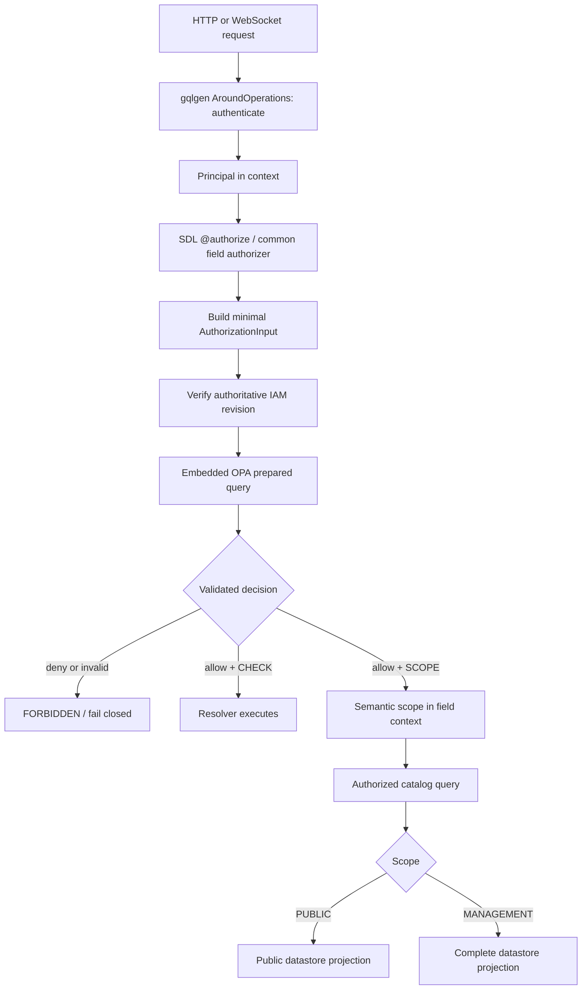

# OPA Data-Aware Authorization for GraphQL Catalog Reads
**Status**: 🟡 Proposed (architecture only; implementation requires a separate feature specification)

> Extends `020-pluggable_auth_architecture.md` and `021-controller_service_account_auth.md`.
> This document is authoritative for the embedded OPA provider, GraphQL read authorization,
> semantic catalog scopes, hybrid IAM data, and authorization-aware Product/ProductVariant reads.

## 1. Executive Decision

GitStore will add an **embedded Open Policy Agent (OPA) AuthZ provider** to the existing
pluggable authorization plane. The provider compiles and prepares Rego once, evaluates a
small request-specific input document, and reads shared IAM definitions from an in-memory OPA
data projection. It does not call an OPA sidecar and does not send the GraphQL schema or raw
operation to OPA on each request.

The public GraphQL contract will use server-owned SDL metadata to identify the authorization
action and whether the field requires a binary check or a data scope. gqlgen middleware makes
the policy decision before catalog access. Resolvers may consume a validated semantic scope
such as `PUBLIC` or `MANAGEMENT`, but they must not inspect roles, groups, direct grants, or
permissions. Service and datastore entry points require that validated scope, making an
unscoped catalog read unavailable by construction.

For Relay connections, authorization changes the physical query plan before pagination. Public
reads use public Product/ProductVariant projections; management reads use the complete catalog
projections. GitStore never fetches a page and removes unauthorized nodes afterward, and it
never relies on CQL `ALLOW FILTERING` for authorization.

OPA remains opt-in. This design does not change the default provider or implement any runtime
code, GraphQL schema, IAM mutation, or ScyllaDB migration.

## 2. Goals and Non-Goals

### Goals

- Preserve the live `AuthNProvider`, `AuthZProvider`, `Principal`, action-string, and
  `ResourceContext` contracts from 020.
- Centralize GraphQL AuthN/AuthZ in gqlgen middleware while carrying policy-produced data scopes
  to resolvers safely.
- Enforce consistent Product and ProductVariant visibility across direct lookups, Relay lists,
  global nodes, relationship fields, counts, and future subscriptions.
- Support permissions granted directly, through built-in or namespace-defined roles, or through
  external group membership mapped to namespace roles.
- Maintain accurate Relay cursors, `totalCount`, and `pageInfo` for every authorization scope.
- Fail closed when policy, IAM data, scope validation, publication state, or evaluation is unsafe.

### Non-goals

- Designing release tags, schedules, activation windows, or release controllers; that belongs to
  [GH#314](https://github.com/gitstore-dev/GitStore/issues/314).
- Treating a client-supplied directive as authority.
- Translating arbitrary residual Rego expressions into CQL.
- Loading all user profiles, credentials, sessions, or catalog rows into OPA.
- Adding nested groups, role inheritance, or a general relationship-authorization graph in v1.
- Replacing gqlgen's parsing, validation, complexity limiting, or persisted-query handling.
- Changing current production defaults before a later rollout explicitly approves that change.

## 3. Verified Current-State Constraints

The design extends these existing contracts rather than creating a parallel security path:

- `gitstore-api/internal/auth/types.go` defines `Principal`, `Decision`, `ResourceContext`, and
  `AuthZProvider.Authorize(ctx, principal, action, resource)`.
- `gitstore-api/internal/auth/registry.go` exposes exactly one active AuthZ provider through the
  existing provider registry.
- `gitstore-api/internal/auth/provider/rbaclocal` resolves principal roles plus subject role
  bindings, applies explicit deny before allow, and defaults to deny.
- `gitstore-api/internal/middleware/security/graphql.go` already authenticates GraphQL operations
  and authorizes selected mutations through gqlgen `AroundOperations` and `AroundFields` hooks.
- `gitstore-api/internal/app/server.go` installs those hooks on the GraphQL server.
- Product and ProductVariant reads are currently ungated. They are reachable through root fields,
  global `node(s)`, and relationship fields such as `Category.products`, `Collection.products`,
  and `Product.productVariants`.
- The current datastore exposes unscoped `ListProducts` and `ListProductVariants` methods. ScyllaDB
  lists by pre-modeled partition/keyset access patterns, while some relationship paths currently
  filter or paginate in application memory.
- Product status defines `Published`; ProductVariant status does not currently define an equivalent
  publication condition. Public ProductVariant rollout therefore depends on GH#314 materializing a
  variant publication-eligibility signal.

## 4. Trust Boundaries and Request Flow



The boundaries are intentional:

1. **AuthN owns identity.** Credentials are verified before policy evaluation. OPA never parses or
   verifies passwords, bearer tokens, controller assertions, or JWT signatures.
2. **GraphQL middleware owns policy invocation.** Resolvers do not call OPA and do not derive
   permissions from a principal.
3. **OPA owns entitlement resolution.** Direct grants, role grants, group-derived roles, deny
   precedence, and scope selection remain policy concerns.
4. **Resolvers adapt, but do not decide.** A resolver turns a validated decision into an authorized
   query object because collection scope must influence the datastore query.
5. **The datastore enforces query shape.** It selects an already-modeled public or management
   projection; it does not interpret Rego, roles, or GraphQL directives.

## 5. GraphQL Authorization Contract

### 5.1 Server-owned SDL directive

The first implementation adds one reusable directive:

```graphql
enum AuthzMode {
  CHECK
  SCOPE
}

directive @authorize(
  action: String!
  resource: String!
  mode: AuthzMode! = CHECK
) on FIELD_DEFINITION
```

- `CHECK` requires an allow decision and passes no catalog query scope.
- `SCOPE` requires an allow decision containing exactly one valid scope for the declared resource.
- `action` uses the existing dot-delimited GitStore vocabulary.
- `resource` is a stable policy kind, not a Go type or database table name.
- Directive arguments are schema-authored constants. Clients cannot change or omit them.

gqlgen generates a directive handler that behaves like field middleware and may short-circuit
before `next(ctx)`. This is the intended use described by gqlgen's
[schema directive documentation](https://gqlgen.com/reference/directives/). Authentication remains
in `AroundOperations`; common extraction, logging, decision validation, and dynamic global-node
handling remain in shared field middleware, following gqlgen's
[middleware model](https://gqlgen.com/reference/middlewares/).

Representative schema usage:

```graphql
extend type Query {
  product(by: ProductBy!): Product
    @authorize(action: "product.read", resource: "product", mode: SCOPE)

  products(namespace: String!, first: Int, after: String, last: Int, before: String): ProductConnection!
    @authorize(action: "product.list", resource: "product", mode: SCOPE)

  productVariant(by: ProductVariantBy!): ProductVariant
    @authorize(action: "productVariant.read", resource: "productVariant", mode: SCOPE)

  productVariants(namespace: String!, first: Int, after: String, last: Int, before: String): ProductVariantConnection!
    @authorize(action: "productVariant.list", resource: "productVariant", mode: SCOPE)
}

extend type Category {
  products(first: Int, after: String, last: Int, before: String): ProductConnection!
    @authorize(action: "product.list", resource: "product", mode: SCOPE)
}

extend type Collection {
  products(first: Int, after: String, last: Int, before: String): ProductConnection!
    @authorize(action: "product.list", resource: "product", mode: SCOPE)
}

extend type Product {
  productVariants(first: Int, after: String, last: Int, before: String): ProductVariantConnection!
    @authorize(action: "productVariant.list", resource: "productVariant", mode: SCOPE)
}
```

### 5.2 Global node fields

`Query.node` and `Query.nodes` are polymorphic and cannot declare a single Product-specific action.
Their common field authorizer decodes GitStore's opaque global ID before resolving the node:

- Product ID → evaluate `product.read` and attach a Product scope for that ID.
- ProductVariant ID → evaluate `productVariant.read` and attach a ProductVariant scope for that ID.
- Other kinds → use that kind's existing or future action without manufacturing a catalog scope.
- Invalid or unknown IDs retain the current invalid/not-found behavior without disclosing existence.

For `nodes`, decisions are associated with the normalized global ID, not only the resource kind, so
a mixed batch cannot accidentally reuse one node's decision for another. A later provider extension
may batch OPA evaluations, but batching must preserve the same per-ID result.

### 5.3 Field-local context

A scoped decision is stored in the context passed to `next(ctx)` and keyed by:

```text
GraphQL response path + resource kind + normalized resource identifier (when known)
```

This prevents a decision for one root field, alias, node, or namespace from authorizing another field
in the same operation. Scope lookup is mandatory and consumes only a decision matching the current
field path, resource kind, namespace, and identifier. A missing, duplicate, conflicting, or mismatched
scope fails closed.

### 5.4 Future executable directive

A future feature may add:

```graphql
enum CatalogView {
  PUBLIC
  MANAGEMENT
}

directive @catalogView(mode: CatalogView!) on FIELD
```

This directive is **not part of v1**. If implemented, it expresses client intent only. Middleware
passes the requested view to OPA, and OPA clamps it to the principal's entitlement. Requesting
`MANAGEMENT` without the unpublished-read entitlement returns the policy-selected `PUBLIC` scope or
`FORBIDDEN`, according to the field's documented contract; it never grants management access.

## 6. OPA Evaluation Model

### 6.1 Embedded provider

The provider uses the OPA v1 Go packages:

```go
import (
    "github.com/open-policy-agent/opa/v1/rego"
    "github.com/open-policy-agent/opa/v1/storage"
    "github.com/open-policy-agent/opa/v1/storage/inmem"
)
```

At startup it:

1. loads the configured bundle from a local, immutable deployment path;
2. validates package and decision-path contracts;
3. creates one `storage/inmem` store containing built-in policy data plus empty namespace IAM data;
4. compiles and prepares the configured decision query exactly once; and
5. publishes the engine only after preparation succeeds.

OPA documents that prepared queries can be cached and shared across goroutines, and that preparing
before evaluation avoids repeated parsing and compilation; see
[Integrating OPA](https://www.openpolicyagent.org/docs/integration). Namespace IAM changes update the
same OPA store through write transactions. They do not recompile the policy.

There is no OPA HTTP client, sidecar health dependency, sidecar circuit breaker, or network hop in
this phase. OPA stays behind the existing `AuthZProvider` interface.

### 6.2 Minimal input

The adapter constructs a typed input rather than serializing request objects wholesale:

```json
{
  "principal": {
    "subject": "user-123",
    "issuer": "gitstore",
    "tenant": "",
    "namespace": "shop-42",
    "groups": ["merchandising"],
    "roles": ["staff"],
    "scopes": [],
    "auth_method": "oidc-jwt"
  },
  "action": "product.list",
  "resource": {
    "kind": "product",
    "name": "",
    "namespace": "shop-42",
    "attributes": {}
  },
  "graphql": {
    "operation_type": "query",
    "operation_name": "Catalog",
    "parent_type": "Query",
    "field": "products",
    "response_path": "publicCatalog"
  },
  "request": {
    "requested_view": "PUBLIC"
  },
  "iam": {
    "namespace": "shop-42",
    "revision": "184"
  }
}
```

Only allowlisted `ResourceContext.Attrs` keys may enter `resource.attributes`. The adapter rejects an
unknown attribute instead of silently exposing it to policy. It excludes:

- raw GraphQL source, the complete parsed operation, and the GraphQL schema;
- request headers, cookies, bearer tokens, passwords, and controller assertions;
- `Principal.Claims` except values normalized into canonical Principal fields by a trusted provider;
- unrelated variables, selection sets, catalog rows, and user profiles.

Operation and field names provide audit/policy context but are not authority. The server-owned action
and resource values remain authoritative.

### 6.3 Decision output and fail-closed rules

The configured Rego decision path returns one object:

```json
{
  "allow": true,
  "reason": "product list allowed with public visibility",
  "scopes": [
    {
      "resource_kind": "product",
      "name": "catalog.visibility",
      "value": "PUBLIC"
    }
  ],
  "policy_revision": "sha256:...",
  "iam_revision": "184"
}
```

The Go adapter validates the result before converting it to `auth.Decision`. It denies when:

- evaluation errors, exceeds its deadline, returns undefined, or returns multiple results;
- the result is not an object or required fields have the wrong type;
- the returned IAM revision differs from the authoritative revision used for the evaluation;
- a `CHECK` request returns authority-bearing data the adapter does not understand;
- a `SCOPE` request is allowed without exactly one matching semantic scope;
- the scope resource, name, or value is unknown or does not match the field request; or
- OPA returns `allow=false` or an unknown action is evaluated.

The client receives a stable GraphQL error code, not internal policy or synchronization details.

### 6.4 GraphQL built-ins

OPA's GraphQL built-ins can parse or verify a query against a schema, and custom directive definitions
must be included in that schema; see OPA's
[GraphQL built-ins](https://www.openpolicyagent.org/docs/policy-reference/builtins/graphql). GitStore does
not use those built-ins for v1 field authorization because gqlgen has already parsed and validated the
operation and exposes the necessary typed field context.

If whole-operation policies are added later, the schema—including GitStore custom directives—is loaded
with policy configuration and parsed/prepared once. Only the request-specific operation AST or a
minimized operation summary may vary per evaluation. The full schema is never copied into every input.

## 7. Public Interfaces and Types

### 7.1 Additive authorization decision

`AuthZProvider.Authorize` remains unchanged. `auth.Decision` gains additive, provider-neutral fields:

```go
type DecisionScope struct {
    ResourceKind string `json:"resource_kind"`
    Name         string `json:"name"`
    Value        string `json:"value"`
}

type Decision struct {
    Outcome        Outcome         `json:"outcome"`
    Reason         string          `json:"reason"`
    RequestID      string          `json:"request_id"`
    At             time.Time       `json:"at"`
    Provider       string          `json:"provider"`
    Scopes         []DecisionScope `json:"scopes,omitempty"`
    PolicyRevision string          `json:"policy_revision,omitempty"`
    IAMRevision    string          `json:"iam_revision,omitempty"`
}
```

`DecisionScope` is deliberately different from `Principal.Scopes`: principal scopes are asserted
identity attributes; decision scopes are short-lived results for one authorization request. Scope
construction is restricted to provider adapters and validated middleware helpers.

The v1 scope registry is closed:

| Resource kind | Scope name | Allowed values |
|---|---|---|
| `product` | `catalog.visibility` | `PUBLIC`, `MANAGEMENT` |
| `productVariant` | `catalog.visibility` | `PUBLIC`, `MANAGEMENT` |

New scope names or values require an explicit contract change and tests. Arbitrary CQL fragments,
table names, predicates, field masks, or Rego expressions are forbidden scope values.

### 7.2 Authorized query types

Catalog service/datastore APIs accept typed queries rather than an unscoped namespace plus pagination:

```go
type CatalogVisibility string

const (
    CatalogVisibilityPublic     CatalogVisibility = "PUBLIC"
    CatalogVisibilityManagement CatalogVisibility = "MANAGEMENT"
)

type AuthorizedProductQuery struct {
    Namespace  string
    Visibility CatalogVisibility
    Page       PageParams
    By         *ProductSelector
    Relation   *ProductRelation
}

type AuthorizedProductVariantQuery struct {
    Namespace  string
    Visibility CatalogVisibility
    Page       PageParams
    By         *ProductVariantSelector
    ProductRef *ObjectReference
}
```

The exact package placement is an implementation-spec decision, but these invariants are mandatory:

- no exported Product/ProductVariant reader omits `CatalogVisibility`;
- constructors accept only a matching, validated field decision;
- `PUBLIC` and `MANAGEMENT` are the only values;
- selectors and relations are mutually exclusive and validated;
- relationship reads and counts use the same visibility as their returned connection; and
- internal controllers use the same authorized path rather than bypassing it through a raw datastore.

The resolver's justified authorization "leak" is therefore limited to:

```go
scope := authz.RequiredCatalogVisibility(ctx, "product")
query := catalogquery.NewAuthorizedProductQuery(scope, namespace, page)
return service.ListProducts(ctx, query)
```

It never contains `if principal.IsAdmin()`, role names, group names, or permission strings.

## 8. Hybrid IAM Ownership

### 8.1 Sources of authority

GitStore uses a hybrid model:

| Data | Authority | OPA location |
|---|---|---|
| Built-in human and controller role definitions | Versioned GitStore OPA bundle | `data.gitstore.builtin_roles` |
| Namespace custom role definitions | GitStore datastore | `data.gitstore.namespaces[ns].roles` |
| Direct subject permissions and role assignments | GitStore datastore | `data.gitstore.namespaces[ns].subjects` |
| Group-to-role bindings | GitStore datastore | `data.gitstore.namespaces[ns].group_role_bindings` |
| Current principal group membership | Trusted AuthN/UserDir normalization | `input.principal.groups` |
| Request/resource facts | GraphQL middleware and resource lookup | `input` |

Built-in roles are immutable through IAM APIs. A namespace custom role cannot shadow a built-in role;
role names are unique across the effective namespace role set. Upstream role/group claims are used only
after an AuthN/UserDir provider maps them to canonical, allowlisted names. Raw `Principal.Claims` are
never interpreted by Rego.

There are no persisted group membership lists in v1. GitStore persists only group-to-role mappings;
the identity provider or UserDir remains authoritative for membership.

### 8.2 Logical persisted entities

The later feature specification must map these logical entities to memdb and ScyllaDB:

```text
IAMRole
  namespace, name, allow[], deny[], built_in=false, resource_version

IAMSubjectGrant
  namespace, subject, roles[], allow[], deny[], resource_version

IAMGroupRoleBinding
  namespace, group, roles[], resource_version

IAMNamespaceRevision
  namespace, revision, updated_at
```

Every mutation of a role, subject grant, or group binding increments the namespace IAM revision in the
same logical operation. Administrative GraphQL CRUD uses the existing middleware path and requires
`iam.manage` for that namespace. An actor cannot mutate built-in roles, grant an unknown role, bind a
group to an unknown role, or create nested group/role references.

Deletion behavior is fail closed: deleting a custom role is rejected while a subject or group binding
references it, unless a future API defines an atomic cascading mutation.

### 8.3 Permission expansion and precedence

OPA computes effective permissions from:

1. direct subject grants;
2. roles assigned directly to the subject;
3. trusted built-in roles normalized onto the Principal;
4. current Principal groups mapped through namespace group-role bindings; and
5. built-in or namespace custom role definitions.

Explicit deny overrides every allow, including direct permissions, group-derived roles, wildcards, and
default allow. No role inherits another role and no group contains another group. An unknown role,
permission, action, namespace, or binding contributes no allow. The policy default is deny.

### 8.4 Namespace isolation and revision synchronization

Namespace is the customer-defined IAM boundary. Before every evaluation:

1. the provider reads the namespace's authoritative `IAMNamespaceRevision`;
2. it compares that revision with the namespace snapshot installed in OPA;
3. when behind, a singleflight refresh reads one complete, internally consistent namespace snapshot;
4. one OPA write transaction replaces the namespace subtree and its revision atomically; and
5. evaluation begins only after the installed revision equals the authoritative revision.

Concurrent requests may share the completed refresh. They may not evaluate against a known-stale
snapshot. If the authoritative revision cannot be read, the snapshot cannot be loaded, or the revision
changes during refresh, evaluation denies and retries according to the caller's normal retry policy.

Multi-replica API processes maintain independent in-memory OPA stores but converge through the same
authoritative revision check. No correctness requirement depends on process-local invalidation alone.

## 9. Catalog Actions and Semantic Scopes

The first catalog action vocabulary is:

| Action | Meaning | Base result |
|---|---|---|
| `product.read` | Read one Product | `PUBLIC` when allowed |
| `product.list` | List/count Products | `PUBLIC` when allowed |
| `product.read.unpublished` | Include non-public Products | upgrades Product scope to `MANAGEMENT` |
| `productVariant.read` | Read one ProductVariant | `PUBLIC` when allowed |
| `productVariant.list` | List/count ProductVariants | `PUBLIC` when allowed |
| `productVariant.read.unpublished` | Include non-public ProductVariants | upgrades ProductVariant scope to `MANAGEMENT` |

The base read/list permission is necessary for either scope. An unpublished-read grant does not grant
the base action by itself. OPA returns `MANAGEMENT` only when both the requested base action and the
corresponding unpublished entitlement are effective for the namespace.

The additional entitlement may originate from a direct subject grant, built-in role, custom role, or
group-derived role. Schema/resolver code does not distinguish those sources.

## 10. Controller Service Accounts

Service-account authentication follows 021. Tokens and ServiceAccount records carry stable identity,
not authorization roles. OPA resolves `serviceaccount:<namespace>:<name>` through the same built-in role
and namespace binding model used for humans.

Controller roles are immutable built-ins in the OPA bundle. A controller receives management visibility
only for resource kinds whose role explicitly grants the matching unpublished-read action. For example,
the CategoryTaxonomy controller needs `product.list` and `product.read.unpublished` if product counts
must include admitted-but-unpublished Products. It receives no ProductVariant management scope unless a
separate reconciler requirement explicitly grants `productVariant.list` and
`productVariant.read.unpublished`.

Long-lived subscriptions retain the decision made for their authenticated connection only until the
connection is re-authorized or closed under 021's expiry/revocation rules. A future catalog subscription
must also re-check IAM/publication authorization when reconnecting and must not replay events outside its
new scope.

## 11. Publication Eligibility Boundary

Authorization answers **which catalog view the principal may request**. Publication answers **which
resources belong in the public view**. These decisions must remain separate.

[GH#314](https://github.com/gitstore-dev/GitStore/issues/314) owns the release/publication lifecycle,
including tags, commit reachability, schedules, selectors, active windows, and materialization strategy.
OPA does not recreate those rules. It selects `PUBLIC` or `MANAGEMENT`; the datastore/query layer reads
the corresponding materialized view.

Until GH#314 replaces it, Product public eligibility is:

```text
status.conditions contains:
  type == Published
  status == True
  observedGeneration == metadata.generation
```

Missing status, missing `Published`, `False`, `Unknown`, or a condition observed for an older generation
is non-public. Updating a Product spec increments generation and synchronously removes the Product from
public projections before the updated full record becomes visible; a later publication reconciliation
may add it back.

ProductVariant public eligibility requires both:

1. independently materialized publication eligibility for the variant's current generation; and
2. a publicly eligible parent Product matching the resolved parent reference.

The current ProductVariant GraphQL status enum has no `PUBLISHED` condition. Public ProductVariant reads
therefore remain fail closed until GH#314 defines and materializes that signal (whether as a condition,
publication record, or public projection). `READY=True` is not a substitute for publication. GH#314 may
later require current-generation `Ready=True` and an active effective window in addition to publication
without changing the `catalog.visibility` authorization scope.

## 12. ScyllaDB and memdb Query Design

### 12.1 Projection rule

Every authorized access pattern has a physical or indexed query path for both scopes:

| GraphQL access | `PUBLIC` | `MANAGEMENT` |
|---|---|---|
| Product list by namespace | public Product namespace projection | existing complete Product namespace table |
| Product by name/UID | public Product name/UID lookup | existing complete name/UID lookup |
| Category/Collection Products | public relationship projection | complete relationship projection |
| ProductVariant list by namespace | public variant namespace projection | existing complete variant namespace table |
| ProductVariant by name/UID/SKU | public variant lookup projections | existing complete lookup projections |
| Product.productVariants | public variants-by-product projection | complete variants-by-product projection |

Concrete table names and migration ordering belong to the implementation specification. The naming
convention should make public tables unmistakable, for example `products_public_by_namespace` and
`product_variants_public_by_product`.

All projections for one catalog write are updated with the consistency mechanism selected by the
catalog-publication design. The safety invariant is one-way: a resource may temporarily disappear from
the public view during uncertainty, but an ineligible resource must never remain publicly readable.

### 12.2 Relay invariants

Authorization and publication filtering happen before keyset pagination:

1. select the scope-specific projection;
2. apply its partition and clustering-key cursor;
3. read `limit + 1` rows;
4. build edges and `pageInfo`; and
5. compute `totalCount` from the same scope-specific dataset or a matching maintained counter.

Public and management projections use identical stable ordering/cursor components wherever the API
exposes the same connection. A cursor obtained under one visibility is rejected if reused under another;
the opaque cursor format must bind the resource kind and visibility in its versioned payload.

Fetching a management page and deleting unpublished edges afterward is prohibited because it creates
short pages, misleading `hasNextPage`, inconsistent counts, and data-dependent over-fetching. CQL
`ALLOW FILTERING` is also prohibited: ScyllaDB documents that such queries can have performance tied to
the total stored data rather than returned rows; see the
[ScyllaDB SELECT guidance](https://docs.scylladb.com/manual/stable/cql/dml/select.html#allowing-filtering).

memdb implements the same externally observable contracts with visibility-specific indexes or
pre-pagination selection. It may not post-filter an already-paginated result.

## 13. GraphQL Error and Enumeration Semantics

| Condition | GraphQL behavior |
|---|---|
| Missing base action | `FORBIDDEN`; resolver is not called |
| OPA unavailable/invalid/timeout/stale IAM | stable authorization error with `FORBIDDEN`; details only in logs |
| Public direct lookup of unpublished Product/ProductVariant | `null` or existing `NOT_FOUND` shape, identical to absent resource |
| Public list | ineligible resources absent; no per-edge errors |
| Invalid/mismatched semantic scope | `FORBIDDEN`; no fallback to management query |
| Management lookup of existing unpublished resource | returned normally when base + unpublished entitlements allow it |

Direct lookup behavior prevents resource enumeration. The API must not reveal whether a Product or
ProductVariant exists but is outside the caller's view through messages, timing classes, counts, or
global-node behavior.

## 14. Configuration, Lifecycle, and Failure Handling

Proposed additive Viper keys:

```toml
[auth.authz]
provider = "opa"

[auth.opa]
bundle_path = "./policy/opa/gitstore-bundle.tar.gz"
decision_path = "data.gitstore.authz.decision"
evaluation_timeout = "25ms"
```

Environment variables follow existing Viper conventions:

```text
GITSTORE_AUTH__AUTHZ__PROVIDER=opa
GITSTORE_AUTH__OPA__BUNDLE_PATH=...
GITSTORE_AUTH__OPA__DECISION_PATH=data.gitstore.authz.decision
GITSTORE_AUTH__OPA__EVALUATION_TIMEOUT=25ms
```

Rules:

- `opa` is opt-in; existing defaults remain unchanged.
- Missing bundle, compile error, invalid decision path, or invalid built-in data prevents readiness
  and startup of the GraphQL serving path.
- Bundle reload uses read → verify/compile/prepare → atomic engine swap. Requests see either the old
  complete engine or the new complete engine.
- Runtime reload failure retains the last valid engine, marks reload health/metrics, and logs the
  failure. It never installs a partial bundle.
- Keeping the old policy does not permit known-stale namespace IAM data: the per-evaluation revision
  contract still denies until the current IAM snapshot is installed.
- Evaluation uses a child context with the configured deadline. Cancellation and timeout deny.
- A bundle rollback is the same atomic swap mechanism and must preserve decision-output compatibility.

## 15. Observability and Audit Contract

Extend `DecisionLogger` fields with:

```text
scope_resource_kind, scope_name, scope_value,
policy_revision, iam_revision, evaluation_latency_ms,
iam_sync_lag_revisions, graphql_parent_type, graphql_field
```

Continue logging `provider`, `subject`, `action`, resource identity, outcome, reason, request ID, and
total latency. Never log credentials, JWT/assertion contents, raw claims, raw GraphQL source, arbitrary
variables, OPA data snapshots, or full catalog resources.

Minimum metrics:

```text
gitstore_api_authz_decisions_total{provider,action,outcome,scope}
gitstore_api_authz_evaluation_seconds{provider}
gitstore_api_authz_policy_reload_total{outcome}
gitstore_api_authz_policy_revision_info{revision}
gitstore_api_authz_iam_refresh_total{outcome}
gitstore_api_authz_iam_sync_lag{namespace_hash}
```

Namespace labels must be bounded or hashed to avoid unbounded Prometheus cardinality. Policy and IAM
revisions are useful in structured logs; exposing raw revisions as metric labels requires an explicit
cardinality review.

## 16. Validation and Acceptance Matrix

### Policy and IAM

- Direct allow and direct deny for each catalog action.
- Built-in role and namespace custom-role permission expansion.
- Principal group → namespace group binding → built-in/custom role → permission.
- Subject-to-role assignment and combination with trusted Principal built-in roles.
- Explicit deny precedence across direct, role, group, wildcard, and default-allow sources.
- Unknown role/action/scope/namespace and cross-namespace binding isolation.
- Built-in role immutability, referenced-role deletion rejection, and `iam.manage` enforcement.
- Decision parity with `rbac-local` for every pre-existing non-catalog action.

### GraphQL coverage

- `product`, `products`, `productVariant`, and `productVariants`.
- Product/ProductVariant IDs through `node` and mixed `nodes` batches.
- `Category.products`, `Collection.products`, and `Product.productVariants`.
- Scope-correct `totalCount`, cursors, aliases, fragments, and multiple root fields.
- Future Product/ProductVariant subscription entry, reconnect, and replay boundaries.
- Missing base permission is `FORBIDDEN`; unpublished public lookup is indistinguishable from absent.

### Publication and storage

- Current-generation Product publication enters the public projection.
- Missing/false/unknown/stale publication stays out; a generation change removes public visibility
  synchronously.
- Variant eligibility is fail closed before GH#314 materializes it.
- Variant public visibility requires both variant and current parent eligibility.
- Scheduled activation/expiry integration tests are added with GH#314 without changing AuthZ scopes.
- memdb and ScyllaDB produce identical public/management results and Relay metadata.
- Cursor visibility binding rejects cross-scope reuse.
- No `ALLOW FILTERING` and no post-pagination authorization filtering in query implementations.

### OPA engine and operations

- Startup rejects missing, malformed, or contract-incompatible bundles.
- Atomic reload exposes no partial policy; failed reload retains the last valid engine.
- IAM revision refresh is atomic, singleflight, namespace-isolated, and denies on uncertainty.
- Concurrent evaluation is race-free and observes complete store transactions.
- Undefined, multiple, malformed, mismatched-revision, invalid-scope, error, cancellation, and timeout
  results all fail closed.
- Decision logs/metrics contain revisions and scope but no secrets or raw input.
- Benchmarks prove policy preparation occurs at startup/reload, never per authorization request, and
  establish p50/p95/p99 evaluation plus IAM-refresh overhead budgets before rollout.

## 17. Rollout and Compatibility

1. **Feature specification:** define concrete Go packages, GraphQL annotations, IAM schemas/mutations,
   datastore projections/migrations, and GH#314 dependencies.
2. **Provider foundation:** implement additive Decision scopes, OPA bundle preparation, strict result
   validation, and parity tests while keeping `opa` disabled by default.
3. **IAM projection:** add persistent namespace IAM entities, revision synchronization, and protected
   administration APIs.
4. **Scoped readers:** replace unscoped Product/ProductVariant read interfaces and cover all GraphQL
   paths. Public ProductVariant exposure stays gated on publication eligibility.
5. **Public projections:** build/backfill scope-specific memdb and ScyllaDB query paths, then enable
   public visibility behind a deployment feature flag.
6. **Production opt-in:** enable `GITSTORE_AUTH__AUTHZ__PROVIDER=opa` only after parity, load,
   publication, and rollback tests pass. Changing the default is a separate decision.

Compatibility guarantees:

- `AuthZProvider.Authorize` and existing action strings do not change.
- Existing providers may leave new Decision fields empty; `CHECK` calls continue to work.
- A `SCOPE` field fails closed when the active provider cannot produce the required semantic scope.
- `rbac-local` remains usable for existing checks; it must be extended or wrapped before it can serve
  scoped catalog reads.
- Existing admin and controller tokens do not gain permissions from token claims; IAM policy remains
  authoritative.

## 18. Assumptions and Resolved Decisions

- Namespace is the tenant/customer boundary for custom IAM.
- Built-in roles and controller roles ship in the OPA bundle and are immutable at runtime.
- External group membership is trusted only after AuthN/UserDir normalization.
- Custom roles, subject grants, and group-role bindings are GitStore datastore state.
- v1 has no nested groups or role inheritance.
- OPA is embedded with `rego` and `storage/inmem`; no sidecar is used.
- The GraphQL schema and raw query are not OPA input for field authorization.
- `@authorize` is server-owned v1 SDL; executable `@catalogView` is deferred.
- Public visibility derives from materialized publication eligibility owned by GH#314.
- ProductVariant public reads remain fail closed until variant eligibility is materialized.
- OPA remains opt-in until an explicit later rollout changes defaults.

## 19. References

- GitStore core architecture: `docs/implementation/020-pluggable_auth_architecture.md`
- GitStore controller identities: `docs/implementation/021-controller_service_account_auth.md`
- Live auth contracts: `gitstore-api/internal/auth/types.go`
- Live GraphQL middleware: `gitstore-api/internal/middleware/security/graphql.go`
- Live GraphQL server wiring: `gitstore-api/internal/app/server.go`
- Product schema: `shared/schemas/product.graphqls`
- ProductVariant schema: `shared/schemas/product_variant.graphqls`
- Publication design dependency: [GitStore GH#314](https://github.com/gitstore-dev/GitStore/issues/314)
- OPA Go embedding and prepared queries: [Integrating OPA](https://www.openpolicyagent.org/docs/integration)
- OPA GraphQL built-ins and custom directives:
  [GraphQL built-ins](https://www.openpolicyagent.org/docs/policy-reference/builtins/graphql)
- gqlgen permission directives: [Schema Directives](https://gqlgen.com/reference/directives/)
- gqlgen cross-cutting hooks: [Middlewares and Interceptors](https://gqlgen.com/reference/middlewares/)
- ScyllaDB filtering behavior:
  [CQL SELECT — Allowing filtering](https://docs.scylladb.com/manual/stable/cql/dml/select.html#allowing-filtering)
