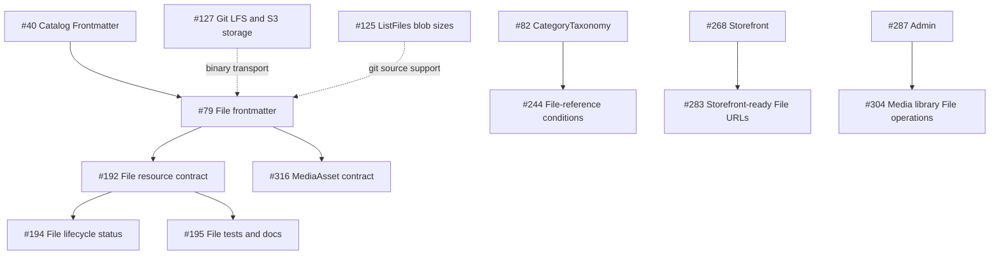
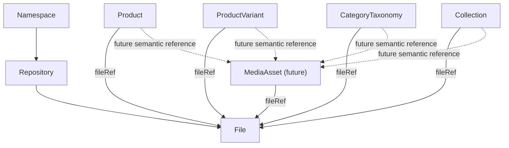
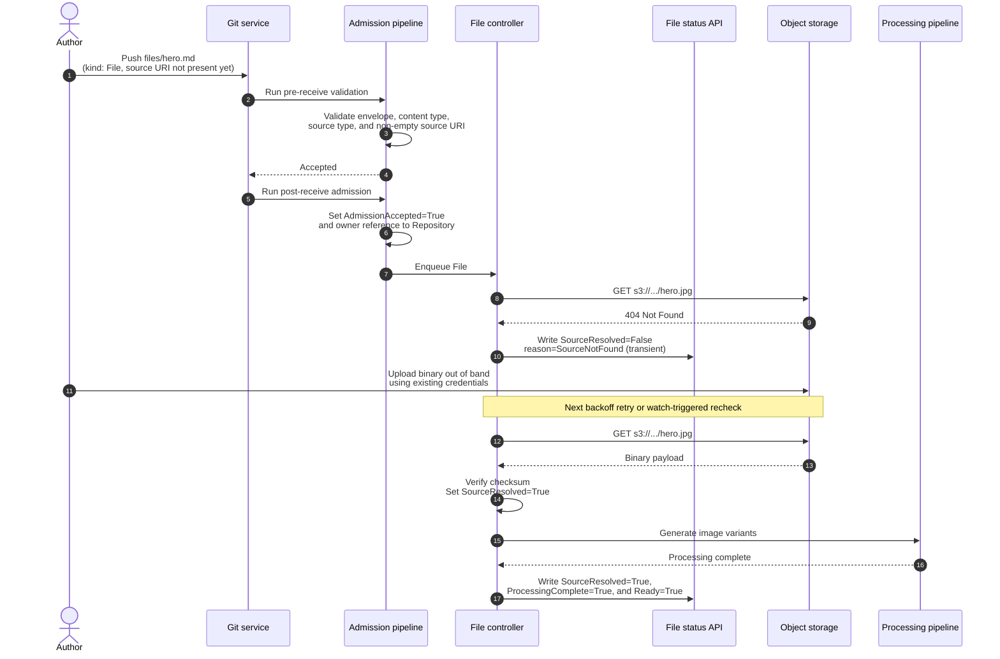
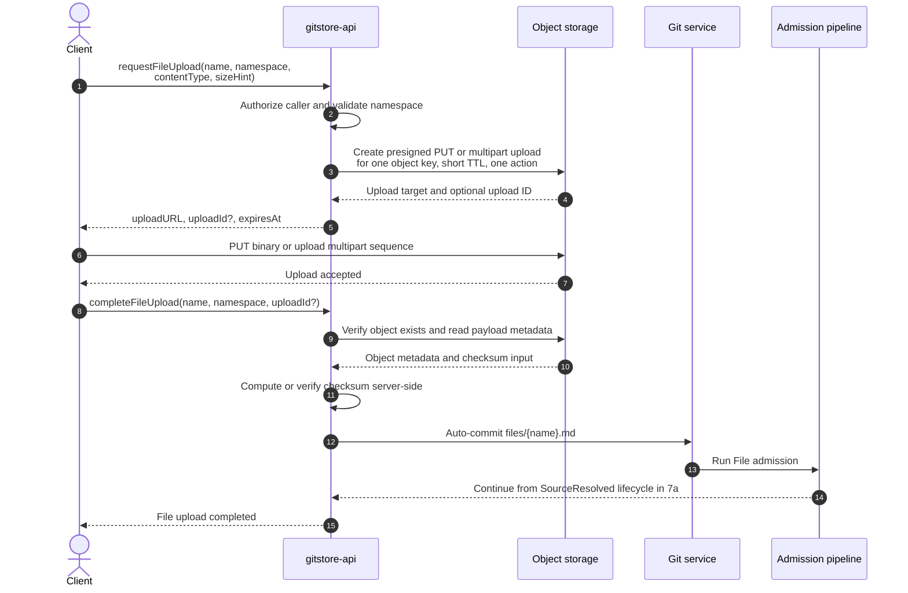
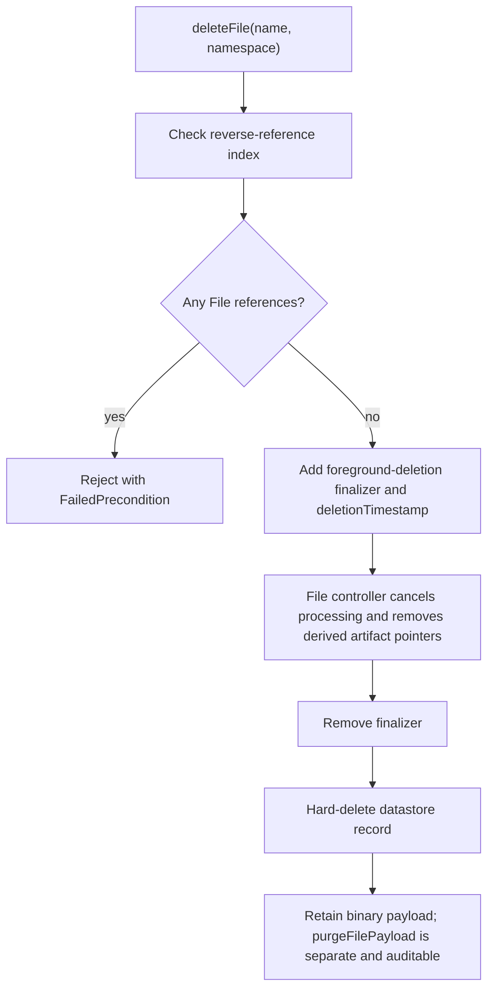
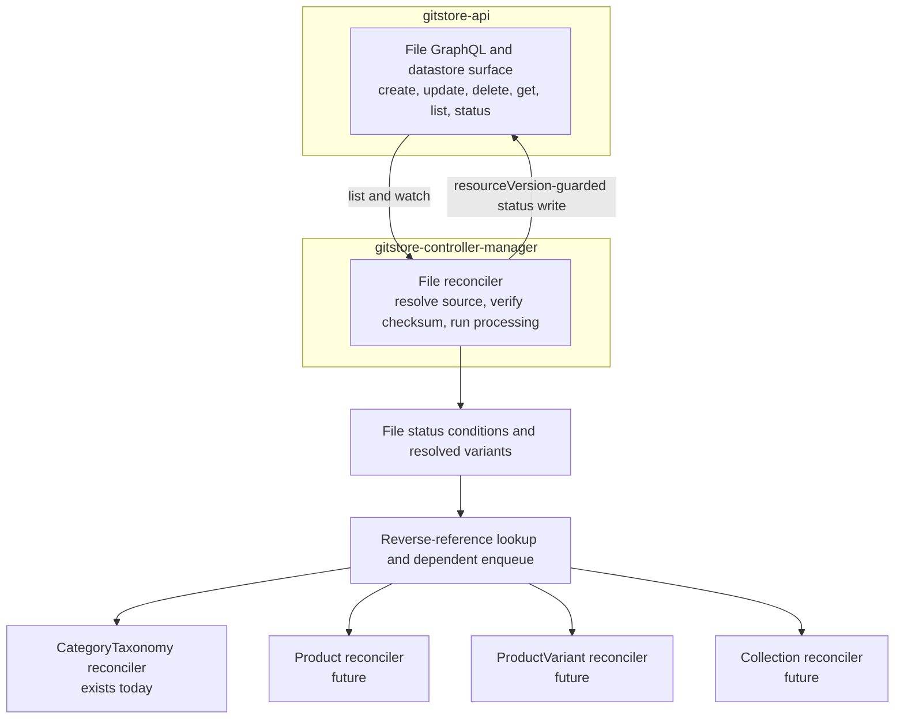

# File and Media Resource Lifecycle: Architecture Decision Document

**Status**: 🟡️ Proposed (not yet implemented)
**Date**: 2026-08-09
**Audience**: GitStore API, controller-manager, and catalog authors.
**Feeds**: ADR-0008 (finalize), GH#79, GH#127, GH#192, GH#194, GH#195, GH#244, GH#283, GH#304, GH#316.

This document reconciles GH#79 (File resource shape), GH#127 (LFS/S3 storage
initiative), GH#244 (CategoryTaxonomy controller's File-reference condition),
GH#283 (storefront media resolution), GH#304 (admin media library), and
GH#316 (MediaAsset contract) into one architecture, and states exactly what
must be built, in what order, to stop CategoryTaxonomy (and every other
catalog resource) from reporting file references as permanently `Unknown`.

---

## 1. Executive recommendation

Build a **dedicated File controller** (design **A** from the research
brief) that is the single writer of `File.status`, backed by:

- **File as a first-class Git-backed resource** (manifest in Git, hydrated
  record + status in the datastore, exactly like `CategoryTaxonomy` today) —
  not a CRD, not an API-side lazy hydration hack.
- **A provider-neutral storage abstraction** with two initial backends:
  Git LFS (small-to-medium, versioned, catalog-owned assets) and
  S3-compatible object storage (generated/high-churn/large assets),
  selected per-`File` via `spec.source.type`, matching the policy already
  documented in `../resource-storage/lfs-object-storage.md`. This is not an
  either/or between GH#79 and GH#127 — GH#79 defines the manifest that
  points at whichever backend GH#127 provisions.
- **A reverse-reference index** (`fileRef → [ObjectReference]`) maintained
  by `gitstore-api` at admission time (not scanned per-event), so the File
  controller can enqueue affected dependents in O(references) instead of
  O(all resources).
- **`MediaAsset` deferred**, but its seam (`spec.fileRef` on a sibling
  resource, not a File wrapper) preserved from day one so it can be added
  without a breaking change to `File`.

This directly satisfies the decision standard: once File exists as a
queryable, watchable resource with controller-owned status, the
CategoryTaxonomy reconciler (`gitstore-controller-manager/internal/categorytaxonomy/fileref.go`)
changes from "always emit `Unknown`, no lookup possible" to "look up File
status via cache, emit `True`/`False` deterministically" — a small, local
diff, because the generic `ListWatcher[T]`/`StatusClient`/`Cache[T]` plumbing
already exists and needs no changes (see §2).

## 2. Verified current-state architecture and exact blocking gaps

Verified by direct source inspection (`gitstore-api`, `gitstore-controller-manager`,
graphify graph traversal) — not by re-reading the ADRs alone.

| Component | State | Evidence |
|---|---|---|
| `File` GraphQL type / `createFile`/`updateFile`/`deleteFile`/`getFile`/`listFiles` | **Not implemented** | No `.graphqls` schema file defines `File` or any File mutation/query anywhere under `gitstore-api/internal/graph`. |
| `File` Go struct / datastore table | **Not implemented** | `gitstore-api/internal/datastore/entities.go` defines `Namespace`, `Product`, `CategoryTaxonomy`, `Collection`, `ProductVariant`, `Repository`, `NamespaceMapping` — no `File`. Only `FileReference` exists (`gitstore-api/internal/catalog/product.go:67-71`), a `{Name, Kind, Optional}` *pointer* struct embedded in `MediaDefinition`, not a File record. |
| `File` in `gitstore-api/internal/cataloggrpc/` | **Not implemented** | No File references in that package. |
| `ResolvedFileDefinition{Name, URL, ContentType}` (`gitstore-api/internal/catalog/status.go:87-91`) | **Shape exists, never populated** in a production path | The only place `ResolvedFileDefinition{...}` is constructed in the whole tree is a unit-test fixture (`product_test.go:182`). `DatastoreProductToGraphQL` round-trips `status.resolved` verbatim from the stored JSON blob; it performs no File lookup. |
| `CategoryTaxonomyStatus.Resolved` (`ResolvedCategoryTaxonomy`, `status.go:121-131`) | **Has no `Media` field at all** | Unlike `ResolvedProductDefinition.Media []ResolvedFileDefinition`, `ResolvedCategoryTaxonomy` only has `Depth`, `Path`, `Ancestors`, `ChildCount`, `ProductCount` — there is currently no place to put resolved category media even if a File existed. This is a schema gap, not just a resolution gap. |
| CategoryTaxonomy controller's fileRef handling | **Implemented, intentionally hardcoded** | `gitstore-controller-manager/internal/categorytaxonomy/fileref.go:12-35`, `computeFileRefCondition`: for every `optional: false` media entry, unconditionally emits `FileRefConfirmed=Unknown, Reason=FileNotQueryable` — no GraphQL/datastore query is attempted, by design, per `specs/039-category-taxonomy-reconciler/research.md` R5 ("No datastore or GraphQL query for `File` existence is attempted"). |
| File controller/reconciler | **Not implemented** | `gitstore-controller-manager/internal/` has exactly one resource-kind package: `categorytaxonomy`. No `file` package. |
| Generic watch/status/cache plumbing (`listwatch.ListWatcher[T]`, `status.StatusClient`, `cache.CacheAccessor[T]`, `types.Reconciler`) | **Implemented and reusable as-is** | `listwatch/listwatcher.go` interfaces are unparameterized-by-kind generics; `CategoryTaxonomyListWatcher` (spec 040) is the *first* concrete instance, not a hardwired dependency. A `FileListWatcher` needs zero interface changes — only a File GraphQL query/subscription on the `gitstore-api` side and a new reconciler package. |
| Product/ProductVariant/Collection reconcilers | **Do not exist at all** | Only CategoryTaxonomy has a controller package today. These ADRs (0004/0005/0007) all defer `MediaResolved` to "Phase 2, GH#244" but there is no reconciler loop to even attempt it — CategoryTaxonomy is *ahead* of the others by having an explicit (if degenerate) condition. |

**The blocking gap, precisely stated**: it is not that CategoryTaxonomy's
controller has a bug. It is that **File does not exist as a resource
anywhere in the system** — no schema, no table, no GraphQL surface, no
reconciler. `computeFileRefCondition` is a correct implementation of "we
have nothing to query," not a broken implementation of "we forgot to
query." Fixing this requires building File from the ground up, not patching
the CategoryTaxonomy controller.

### GH issue graph (verified via `gh issue view`)



**Key correction to the original research framing**: GH#244, not GH#79, is
the load-bearing issue for "why is CategoryTaxonomy reporting `Unknown`."
GH#79 only defines the File document shape (and explicitly excludes runtime
URL resolution from its own scope). GH#244's acceptance criteria literally
say "missing required File references are surfaced as a status condition
(not a push rejection)" — which is exactly what `fileref.go` does today,
using `Unknown` as a placeholder for "cannot check yet." GH#244 cannot be
closed correctly until File is queryable; it is currently only partially
satisfiable.

## 3. File/Media terminology and ownership model

Confirmed as the right split — do not merge these, per `docs/ADRs/0008-file-lifecycle.md`
and `../resource-storage/git-backed.md` ("Do not model `MediaAsset` as a wrapper
around `File`"):

| Resource | Owns | Lifecycle driver | Exists today? |
|---|---|---|---|
| **`File`** | Technical source manifest: `contentType`, `source.{type,uri,checksum,credentialsRef}`, `processing`, resolved variants, status. | Storage/binary lifecycle (upload, checksum, processing). One `File` = one binary identity. | No — build first. |
| **`MediaAsset`** | Catalog-facing semantic layer: `fileRef`, `role`, `altTextRef`, `focalPoint`, ordering. | Presentation lifecycle (a marketer changes alt text without touching the binary). | No — GH#316, correctly deferred. |
| **Inline `spec.media[*].fileRef`** on Product/ProductVariant/CategoryTaxonomy/Collection | A typed pointer (`{name, kind, optional}`) to a `File` (today) or a `MediaAsset` (later). | Catalog resource's own lifecycle. | Yes — `FileReference` struct exists; it's the reference, not the referent. |

**Is `MediaAsset` necessary for the first useful implementation?** No.
`fileRef` today points directly at `File`. This is sufficient to unblock
Ready/Unknown resolution for all four catalog resources. `MediaAsset` adds a
second reference hop (`spec.media[*].fileRef` → `MediaAsset` → `File`) that
is valuable once multiple catalog resources need to share presentation
metadata (e.g., the same hero image with different alt text per product),
but is not required to answer "does this file exist and is it ready."
**Recommendation: ship File + direct `fileRef`→File first (this document);
MediaAsset is a strictly additive Phase 2 (GH#316), changing `fileRef.kind`
from `File` to `MediaAsset` is a config change, not a breaking schema
change, because `fileRef.kind` is already a field today.**

## 4. Resource dependency graph



No circular dependency: File never references a catalog resource (confirmed
in ADR-0008 §"Dependency graph position"). This one-way edge is what makes a
reverse-reference index tractable — File is always the "many" side being
pointed at, never the pointer.

## 5. Storage and controller option comparison

### Storage backend comparison

| Option | Max practical size | Git impact | Dedup/CAS | Resumable | Signed URLs | Local/Compose dev | Recommendation |
|---|---|---|---|---|---|---|---|
| **Git LFS pointer** | Multi-GB (LFS-server-limited); pointer is <1KB, always | None on primary repo (pointer only); LFS store grows separately | Yes — `oid` is `sha256:<hash>`, content-addressed by construction (verified: git-lfs.com, git-lfs spec) | Server-dependent (most LFS servers support resumable PUT) | Not standard; LFS uses its own auth handshake | Needs an LFS server (can run `git-lfs-test-server` or a Git host with LFS in Compose) | Use for **catalog-owned, versioned, low-churn** assets (product hero shots checked in with the catalog repo) |
| **S3-compatible object storage** | Multi-TB via multipart (AWS: switch to multipart ≥100MB — verified, AWS mpuoverview) | Zero | Only if the app computes/stores a content hash itself; S3 has no built-in CAS | Yes — multipart upload never expires until completed/aborted; failed parts retransmit individually (verified, AWS) | Yes — presigned URLs are **bearer tokens** inheriting the signer's IAM permissions, no further identity check (verified, AWS docs ×2) | MinIO (AIStor-compatible, supports full multipart lifecycle: Create/UploadPart/UploadPartCopy/ListParts/Complete/Abort — verified, MinIO docs) runs cleanly in Compose | Use for **generated, high-churn, PII-bearing, or CDN-fronted** assets (renditions, customer uploads, invoices) |
| **External URL only** | N/A (no ingestion) | None | None | N/A | N/A | Trivial | Insufficient alone: no checksum, no lifecycle, no revocation. Acceptable as `spec.source.type: url` for read-only external references, but MUST go through SSRF-safe admission (§10). |
| **Direct Git blob (small file)** | A few hundred KB before repo bloat matters | Grows repo history permanently; clone time degrades | None | No | No | Trivial | Not recommended even for small files — `docs/ADRs/0008-file-lifecycle.md` explicitly rejects this ("Rejected. Git is not suited for large binary payloads... noisy repository history"). |
| **Hybrid (provider abstraction)** | Backend-dependent | Backend-dependent | Backend-dependent, unified via File's own `checksum` field as the canonical CAS key regardless of backend | Backend-dependent | Backend-dependent | Both LFS and MinIO available locally | **Recommended.** `File.spec.source.type ∈ {git, lfs, s3, gcs, b2, url}` (already drafted in `../resource-storage/lfs-object-storage.md`) with a Go `SourceResolver` interface per type. |

**Reconciling GH#79 and GH#127**: they are not competing proposals. GH#79's
`File` manifest is the control-plane record; GH#127's LFS/S3 work is one
possible implementation of `spec.source`'s resolution behind that record.
**Decision: support both via the provider abstraction, ship S3-compatible
(MinIO in dev) first** because it is simpler to make resumable/signed/CDN-
ready without depending on an LFS server, and matches GH#127's own scoping
("does not change the current catalog guidance that normal catalog media
remains external URLs" — i.e., LFS is additive, not blocking).

### Controller architecture comparison

| Option | Verdict |
|---|---|
| **A. Dedicated File controller** | **Recommended.** Matches Kubernetes' own controller-per-resource-kind precedent (verified, kubernetes.io/concepts/architecture/controller — "many narrow, single-purpose controllers" rather than one monolith). Owns File.status exclusively; catalog controllers only *read* File status via cache, never resolve sources themselves. |
| B. Shared "media controller" for all consumers | Rejected as primary — conflates File resolution with catalog-specific Ready semantics (e.g., CategoryTaxonomy's `Unknown`-vs-`False` distinction is CategoryTaxonomy's own business logic, not File's). |
| C. Each catalog controller resolves its own File references | Rejected — exactly the duplication the decision standard forbids. Also multiplies checksum/processing retry logic four ways once Product/ProductVariant/Collection controllers exist. |
| D. API-side synchronous lazy hydration at resolver time | Rejected as primary — makes GraphQL read latency depend on object-storage/checksum work, and gives no async retry/backoff model for slow or failing sources. May still be used as a **read-time cache-fill fallback** (§8) but must not be the system of record for status. |

## 6. Recommended File and Media resource contracts

### `File` (builds on ADR-0008, closes its Phase-2-deferred items)

```yaml
apiVersion: storage.gitstore.dev/v1beta1
kind: File
metadata:
  name: macbook-pro-hero        # immutable
  namespace: acme-store          # immutable
spec:
  contentType: image/jpeg        # author-writable; IMMUTABLE after first AdmissionAccepted
  type: gitstore.dev/media        # author-writable
  source:
    type: s3                     # author-writable; changing type or uri triggers re-verification
    uri: s3://acme-assets/products/macbook-pro-hero.jpg
    checksum:
      algorithm: sha256           # author-writable; changing triggers re-verification
      value: <hex>
    credentialsRef:
      kind: SecretRef             # same-namespace only (ADR-0001)
      name: s3-catalog-assets
  processing:                     # author-writable; changing triggers reprocessing
    image:
      variants:
        - width: 800
          format: webp
status:                           # controller-managed, never author-writable
  observedGeneration: 3
  conditions:
    - {type: AdmissionAccepted, status: "True"}
    - {type: SourceResolved,    status: "True",  reason: ChecksumVerified}
    - {type: ProcessingComplete,status: "True"}
    - {type: Ready,             status: "True"}
    - {type: Terminating,       status: "False"}
  resolvedVariants:
    - {name: original, url: "https://cdn.example.com/.../hero.jpg", contentType: image/jpeg, width: 3000, height: 2000, checksum: sha256:...}
    - {name: thumbnail-webp, url: "...", contentType: image/webp, width: 800}
  objectStorageLocation: {bucket: acme-assets, key: products/macbook-pro-hero.jpg, provider: s3}
```

**Immutability rules** (author-controlled fields marked immutable are
rejected at admission if changed post-creation, forcing a new `File` name
instead — this preserves "a File update never silently swaps the binary
identity out from under existing references"):
- `metadata.name`, `metadata.namespace` — immutable (existing ADR-0008 rule).
- `spec.contentType` — immutable after first successful admission (existing rule).
- `spec.source.type`, `spec.source.uri`, `spec.source.checksum.value` —
  **mutable**, but any change resets `SourceResolved=Unknown` and
  `ProcessingComplete=Unknown` and re-triggers the controller. This is a
  new decision beyond ADR-0008 (which was silent on whether URI changes are
  allowed at all): allow them, because "replace this hero image" is a
  legitimate authoring action, and rejecting it would force spurious
  File renames that break every `fileRef` pointing at the old name.
- `spec.processing` — mutable; triggers reprocessing only (not
  re-verification of source checksum).

**Validation/admission behavior** (extends ADR-0008's table):

| Input | Behavior |
|---|---|
| Malformed source URI | Pre-receive rejection (structural: must parse as a URI for the declared `source.type`'s scheme). |
| Unsupported `content Type` | Pre-receive rejection against an admission-configured allowlist (not a hardcoded list — namespaces may need different allowlists). |
| Checksum mismatch (post-fetch) | Controller sets `SourceResolved=False, reason=ChecksumMismatch`; does not retry the same checksum indefinitely — enters the poison/quarantine backoff class (§11). |
| Missing object at source URI | Controller sets `SourceResolved=False, reason=SourceNotFound`; retries with exponential backoff (transient — object may not have propagated yet). |
| Unsupported processing option | Admission-time rejection if the option is structurally unknown; controller-time `ProcessingComplete=False, reason=UnsupportedVariant` if the option is structurally valid but the processor can't satisfy it (e.g., requested format unsupported for content type). |
| Cross-namespace `credentialsRef` | Rejected at admission (ADR-0001 same-namespace rule — no exception for File). |
| Unsafe/private-network URL (`source.type: url`) | Rejected at admission via **allowlist**, not denylist (§10). |
| Duplicate `metadata.name` | Standard resource-identity conflict — rejected like any other Git-backed resource. |
| Source replacement (URI/checksum change) | Allowed; re-triggers verification (see immutability rules above). |
| Stale/conflicting update | Standard `resourceVersion` optimistic-concurrency rejection. |

### `MediaAsset` (deferred; contract sketch only, per GH#316)

```yaml
apiVersion: catalog.gitstore.dev/v1beta1
kind: MediaAsset
spec:
  fileRef: {name: macbook-pro-hero, kind: File}
  role: hero
  altTextRef: {locale: en-US, text: "MacBook Pro hero shot"}
  focalPoint: {x: 0.5, y: 0.3}
```

Not built in this phase. Preserve the seam: `fileRef.kind` on catalog
resources already accepts a `kind` field, so pointing at `MediaAsset`
instead of `File` later requires no schema change to Product/Variant/
Category/Collection.

## 7. Upload, processing, resolution, and deletion sequences

### 7a. Manifest-first creation + out-of-band upload (Phase 1, matches ADR-0008 today)



### 7b. Signed-URL upload (Phase 2, `requestFileUpload`/`completeFileUpload`)



Multipart switch-over at ~100MB (AWS threshold, verified) — below that,
single presigned PUT; above, presigned multipart (Create/UploadPart/Complete).
`tus` is a viable alternative for **self-hosted, S3-independent** local dev
if MinIO is judged too heavy for a given deployment target — not required
for v1, worth a follow-up ADR only if local dev friction with MinIO proves
real.

### 7c. Deletion



## 8. Controller topology


\* Product/ProductVariant/Collection reconcilers don't exist yet
(confirmed in §2) — this document's File controller is a prerequisite for
them, not a replacement.

**Why File-controller-reads-only for dependents**: this is what makes
"CategoryTaxonomy determines File usability without direct Git or
object-storage access" true by construction — CategoryTaxonomy's reconciler
never talks to object storage; it reads a `Cache[File]` populated by the
File controller's own watch, exactly mirroring how it already reads its own
resource type today via `CategoryTaxonomyListWatcher`.

**Idempotency/retries/backoff/poisoning**: reuse
`github.com/cenkalti/backoff/v5` (already a `gitstore-controller-manager`
dependency per CLAUDE.md) with distinct retry classes:
- *Transient* (network timeout, object not yet propagated): exponential
  backoff, unbounded retries, capped interval.
- *Terminal* (checksum mismatch, malformed content, unsupported content
  type): quarantine after N attempts — set `SourceResolved=False` with a
  terminal reason, stop requeueing until the manifest itself changes
  (generation bump), consistent with how Kubernetes controllers treat
  permanently-failing objects.
- Worker pool via `github.com/alitto/pond/v2` (already a dependency) bounds
  concurrent processing jobs to avoid one large-media backlog starving
  small-file reconciliation.

**Local development**: MinIO in `compose.yml`/`compose.scylla.yml`
(matching the existing `make scylla`/`make compose DATASTORE=scylla` pattern), File
controller reads `GITSTORE_FILE__S3_ENDPOINT` the same way the API reads its
other backend endpoints today.

## 9. Reverse-reference index and event fan-out

**Recommendation: maintain an explicit reverse-reference index in the
datastore**, keyed `(namespace, File.name) → []ObjectReference`, written by
`gitstore-api` **at admission time** for every catalog resource whose
`spec.media[*].fileRef` changed (add/remove/rename all update the index),
not derived by scanning all resources on every File event.

- **Consistency requirements**: index write happens in the same admission
  transaction as the referencing resource's own write (same pattern as
  `ownerReferences`, which is already written at admission per ADR-0002/0003).
- **Rename**: a `fileRef.name` change is an add-old-remove-new pair in the
  index, not an in-place rename (matches datastore semantics for other
  indexes in this codebase).
- **Delete/re-add**: deleting the referencing resource removes its index
  entries; deleting-then-re-adding a resource with the same name gets a new
  UID (existing convention per `../resource-storage/git-backed.md`) and a fresh
  index entry — no stale-UID leakage.
- **Namespace isolation**: index key is namespace-scoped; cross-namespace
  `fileRef` is already rejected at admission (ADR-0008), so the index never
  needs cross-namespace repair.
- **Stale-index repair**: a periodic reconciliation job (or the File
  controller itself, lazily, on cache miss) can rebuild an index entry by
  re-reading the referencing resource's `spec.media`, but this should be
  rare — the index is written transactionally, not eventually.

**Why not per-event full scans**: with "millions of Files" and "many
dependents per File" in scope (§11), a full scan per File status transition
is O(all catalog resources) per event — the index makes fan-out
O(references to this File), which is the only design that scales past a
few thousand resources.

**Event fan-out mechanics**: the File controller, after writing
`File.status`, looks up the reverse-reference index for `(namespace,
File.name)`, and for each `ObjectReference` returned, enqueues that
resource's *own* kind's reconciler work queue (CategoryTaxonomy's queue,
Product's queue, etc.) with the resource's identity — not with File's
identity. Each dependent controller's own reconcile loop then re-reads
current File status from its cache and recomputes its own condition. This
avoids the File controller needing to know each dependent kind's Ready
semantics.

## 10. Status-condition and resolved-media semantics

| File state | Dependent condition (required ref) | Dependent condition (optional ref) |
|---|---|---|
| Absent (no such File) | `FileRefConfirmed=False, reason=FileNotFound` → contributes to `Ready=False` | No condition emitted (existing rule) |
| Admitted, not yet source-resolved | `FileRefConfirmed=Unknown, reason=FileResolutionPending` | No condition |
| `SourceResolved=True`, still processing | `FileRefConfirmed=Unknown, reason=FileProcessing` | No condition |
| Processing failed (terminal) | `FileRefConfirmed=False, reason=FileProcessingFailed` | No condition; media entry omitted from `status.resolved.media` |
| `Ready=True` | `FileRefConfirmed=True` | `FileRefConfirmed=True`, entry included |
| Deleted/terminating | `FileRefConfirmed=False, reason=FileTerminating` (same as absent from dependent's perspective) | Entry removed |
| Present, unauthorized (credentialsRef broken) | `FileRefConfirmed=Unknown, reason=FileAccessDenied` — not `False`, because this may be a transient credential-rotation issue, not "the file doesn't exist" | No condition |
| Present, incompatible content type for requested use | `FileRefConfirmed=False, reason=FileContentTypeMismatch` | Entry omitted |
| Present, missing requested rendition | `FileRefConfirmed=True` (the File itself is fine) but that specific `resolvedVariants` entry is absent from `status.resolved.media` — do not fail the whole reference over one missing variant | Same |

**`Ready` composition rule**: `Ready=False` only when a **required**
`fileRef`'s `FileRefConfirmed=False`. A required ref in `Unknown` state
keeps the dependent's own `Ready` in `Unknown` (never optimistically `True`)
— this replaces today's blanket `Unknown` with a real state machine.
Optional refs never gate `Ready`; a missing optional file is represented by
simply omitting it from `status.resolved.media`, never by `Ready=False`.

This satisfies the decision standard's explicit rejection: "Reject any
design that leaves File references permanently `Unknown`" — under this
design, `Unknown` is always a transient state that a subsequent File
reconcile resolves to `True`/`False`; it is only permanent today because no
File controller exists to advance it.

**`status.resolved.media` contents**: ready files only (matches existing
`ResolvedFileDefinition{Name, URL, ContentType}` shape) plus, additively,
`checksum` and a `renditionName` so storefronts can pick the right variant —
**not** pending entries, **not** error metadata (errors live in
`conditions`, not in resolved data, so consumers reading `resolved.media`
never have to distinguish "ready" from "broken" themselves). Last-known-good
publishing is explicitly **not** allowed — when `SourceResolved` regresses
to `False`, the stale entry is removed from `resolved.media` in the same
status write, not left dangling; this avoids "silently serving
stale/broken media," which the decision standard forbids.

**Flapping avoidance**: status writes only occur on condition-value
*transitions* (existing `resourceVersion`-guarded `StatusPatch` pattern
already used by CategoryTaxonomy), not on every reconcile tick — a File
stuck retrying the same transient error does not repeatedly rewrite
`SourceResolved=False` with a new timestamp each attempt; `lastTransitionTime`
only updates when `status` (not `reason`/`message`) changes, matching the
Kubernetes condition convention this codebase already follows.

**`CategoryTaxonomyStatus` schema gap**: since `ResolvedCategoryTaxonomy`
currently has no `Media` field (§2), implementing this requires adding
`Media []ResolvedFileDefinition` to it — an additive, non-breaking field
add, mirroring `ResolvedProductDefinition.Media`.

## 11. GraphQL, datastore, and watch contracts

- **File as a built-in GraphQL type**, not a generic CRD. Rationale: File
  is core-scope per `../resource-storage/git-backed.md`'s own classification
  table, and needs first-class mutations (`requestFileUpload` in particular)
  that a generic CRD surface would have to special-case anyway.
- **Mutations**: `createFile`, `updateFile`, `deleteFile` (Phase 1, manifest
  only) + `requestFileUpload`, `completeFileUpload`, `retryFileProcessing`,
  `purgeFilePayload` (Phase 2). `requestFileDownload` is **not** needed as a
  mutation — resolved URLs are already exposed via `status.resolvedVariants`
  reads; a separate download-negotiation mutation would duplicate that.
- **Queries**: `getFile`, `listFiles` (namespace-scoped, cursor-paginated
  per Relay connection spec — cursors are opaque, forward-only pagination
  sufficient for v1, verified via relay.dev/graphql/connections.htm).
- **Watch/subscription**: reuses the existing `graphql-transport-ws`
  transport already wired in `gitstore-api/internal/app/server.go` (spec
  040) — add a `fileWatch`/`fileEvents` subscription following the same
  resourceVersion-resumable, at-least-once contract as the existing
  CategoryTaxonomy watch. On cursor expiration (aged-out resourceVersion),
  the server returns the equivalent of HTTP 410 semantics and the client
  must re-list and restart the watch from the fresh resourceVersion
  (verified pattern, kubernetes.io/api-concepts) — this is exactly how
  `CategoryTaxonomyListWatcher` must already behave per spec 040, so File's
  watcher inherits the same resume logic with zero new design work.
- **Status subresource**: File gets its own `updateFileStatus`-equivalent
  mutation (or reuses a generic status-patch mutation if one exists across
  kinds) guarded by `resourceVersion` precondition, matching
  `StatusClient`/`StatusPatch` already used for CategoryTaxonomy.
- **Reverse-reference queries**: expose `File.referencedBy` (paginated list
  of `ObjectReference`) backed directly by the index in §9 — useful for
  admin/debugging and for `deleteFile`'s own precondition check.

## 12. Security and threat model

| Threat | Mitigation |
|---|---|
| SSRF via `source.type: url` or misused S3 endpoint override | **Allowlist, not denylist**, of permitted hosts/schemes at admission (verified: OWASP SSRF cheat sheet explicitly frames denylisting as bypass-prone "last resort"; raw user-supplied URLs must not be parsed/validated ad hoc — use a structured allowlist check, not regex on the URL string). |
| Presigned URL misuse (bearer-token nature) | Scope to single object key, shortest workable TTL, single action (PUT-only for upload URLs, GET-only for download URLs) — verified: presigned URLs inherit exactly the signer's permissions and require no further identity check, so narrow scoping is the only real control. |
| Content-type spoofing | Never trust client-supplied `Content-Type` for security decisions (verified, OWASP File Upload Cheat Sheet) — verify server-side via magic-byte sniffing before setting `spec.contentType` as confirmed. |
| Decompression bombs / oversized renditions | Bound *decompressed* output size in the processing pipeline, not just upload size (verified, CWE-409) — image/video processors must enforce a max-pixel-count or max-decoded-bytes ceiling before allocating buffers. |
| Malware in uploaded binaries | Out of scope for File controller itself; recommend an optional AV-scan hook in the processing pipeline as a Phase 2+ extension point, not a v1 blocker. |
| Path traversal in `source.uri` (git-sourced files) | Reuse existing git-service path-normalization/validation (already required for any git-backed file read); reject `..`-containing relative paths. |
| Cross-tenant leakage via signed URLs | Presigned URL generation must include the namespace in the object key prefix (`s3://bucket/<namespace>/...`) and the File controller must refuse to generate a URL for an object outside the requesting namespace's prefix. |
| Secrets in Git/GraphQL/status/logs | `credentialsRef` only ever resolves through `SecretRef` (ADR-0001); the resolved secret value must never appear in `File.status`, in `resolvedVariants` output, or in controller logs — log the `credentialsRef.name`, never the resolved value. |
| Authorization for upload/download/processing/purge | Each mutation checks the caller's namespace-scoped RBAC action (`file.create`, `file.upload`, `file.purge`, etc.) via the existing `AuthZProvider` — `purgeFilePayload` specifically should require a distinct, higher-privilege action than `deleteFile`. |
| Audit events | Every `requestFileUpload`/`completeFileUpload`/`purgeFilePayload` call should emit an audit log entry (who, when, which object key) — object storage operations are the one place GitStore's Git-history audit trail doesn't naturally cover. |

## 13. Performance and scaling model

- **Reverse-reference index** (§9) is the load-bearing scalability
  decision — without it, "millions of Files, many dependents per File"
  makes fan-out cost unbounded per event.
- **Batching**: File controller processes status-write-triggered fan-out in
  batches (e.g., 100 dependent enqueues per index lookup page), not one
  GraphQL mutation per dependent.
- **Backpressure**: worker pool (`pond/v2`) bounds concurrent
  checksum-verification and processing jobs; a namespace-wide object-store
  outage should trip a per-namespace circuit breaker (stop retrying that
  namespace's Files at full rate) rather than burning the shared retry
  budget for unrelated namespaces.
- **Controller restart**: File controller resumes from its last-acked
  `resourceVersion` cursor exactly like CategoryTaxonomy's watcher already
  does (spec 040) — no new resume logic needed, same list-then-watch
  bootstrap.
- **Mass reprocessing** (e.g., new rendition format added to policy): rate-
  limited via `golang.org/x/time` (already a dependency), processed as a
  low-priority queue class distinct from new-upload processing, so a bulk
  reprocess job cannot starve interactive uploads.
- **Duplicate/out-of-order events**: the watch API is already at-least-once
  and resourceVersion-resumable; the File controller's reconcile must be
  idempotent by construction (recompute status from current File state, not
  from the event payload) — this is the standard level-based reconciliation
  pattern, not edge-triggered, matching Kubernetes' own controller design
  philosophy (verified).

## 14. Migration plan from "File not queryable"

1. **Phase 0** (this document + ADR-0008 revision): finalize File contract,
   ratify provider abstraction, close open questions in §18.
2. **Phase 1**: Ship File as a queryable resource — GraphQL type, datastore
   table, `createFile`/`updateFile`/`deleteFile`/`getFile`/`listFiles`,
   admission validation, reverse-reference index writes. **No controller
   yet.** `AdmissionAccepted=True` is the only condition set; `Ready` is not
   set (do not repeat ADR-0008's Phase 1 mistake of optimistically setting
   `Ready=True` before real resolution exists — leave it `Unknown` so
   dependents don't get false confidence).
3. **Phase 2**: Ship the File controller (checksum verification,
   `SourceResolved`) without processing pipeline yet. This alone lets
   CategoryTaxonomy flip `FileRefConfirmed` from permanent `Unknown` to real
   `True`/`False` for existence-only checks.
4. **Phase 3**: Ship processing pipeline (`ProcessingComplete`, resolved
   variants) and signed-URL upload mutations.
5. **Phase 4**: Update `CategoryTaxonomy`, then `Product`/`ProductVariant`/
   `Collection` reconcilers (building the latter three from scratch) to
   read File status via cache and emit real conditions.
6. **Phase 5**: `MediaAsset` (GH#316), `purgeFilePayload`, mark-and-sweep
   payload retention.

**Rollback points**: each phase is additive (new type, new controller
package, new fields) — rollback is "stop deploying the new controller
binary," not a schema rollback, because no existing behavior is removed
until Phase 4 changes `fileref.go`'s hardcoded `Unknown` emission (and that
change itself is a one-file diff, trivially revertible).

## 15. Required tests (mapped to phases above)

- File manifest validation (malformed URI, bad contentType, missing checksum) — Phase 1.
- Upload lifecycle (signed URL issue → PUT → complete → checksum verify) — Phase 3.
- Checksum mismatch → terminal quarantine, not infinite retry — Phase 2.
- Missing source → transient retry with backoff, eventual `SourceResolved=False` after cap — Phase 2.
- Processing success/failure paths, including partial-rendition-missing case — Phase 3.
- Required vs. optional `fileRef` — `Ready` gating differs (§10) — Phase 4.
- File status transition (`Processing→Ready`) wakes exactly the indexed dependents, no others — Phase 4/9.
- Reverse-reference index update on add/remove/rename/delete-readd — Phase 1.
- Delete protection: `deleteFile` rejected while references exist; succeeds after all removed — Phase 1.
- Stale `resourceVersion` conflict on concurrent File update — Phase 1 (reuses existing optimistic-concurrency test pattern).
- Watch resume after disconnect, and cursor-expiration (aged-out resourceVersion) recovery — Phase 2 (reuse spec 040's own watch-resume test harness/pattern).
- Duplicate and out-of-order File events processed idempotently — Phase 2.
- Object-store outage: circuit breaker trips per-namespace, other namespaces unaffected — Phase 2.
- Controller restart mid-backlog resumes from last-acked resourceVersion without reprocessing already-Ready Files — Phase 2.
- Namespace isolation: cross-namespace `fileRef` rejected at admission; reverse-reference index never crosses namespaces — Phase 1.

## 16. Documentation and runbook updates

- Revise `docs/ADRs/0008-file-lifecycle.md` from "Proposed" to reflect the
  phased plan in §14 once Phase 1 ships (it currently describes only the
  manifest-exists-but-nothing-resolves state as if that were the permanent
  Phase 1 endpoint).
- Add `File` to `docs/categories/category-taxonomy-spec.md`'s "File
  Existence Checks" section once GH#244's controller-side work lands —
  today it correctly says "deferred," which will become stale.
- Add a runbook entry for File-controller backlog/lag observability
  (mirrors the existing reconciliation-lag runbook pattern referenced in
  GH#244's acceptance criteria).
- Update `../resource-storage/lfs-object-storage.md` with the finalized
  `SourceResolver` provider list once implemented.

## 17. Open questions and explicit non-goals

**Open questions:**
- Does an existing object at a presigned PUT target get silently
  overwritten, or does GitStore need conditional-write/ETag preconditions
  in `completeFileUpload` to prevent clobbering? (Flagged by adversarial
  verification during research as needing fresh, targeted confirmation
  against the specific S3-compatible backend chosen — do not assume either
  way before implementation.)
- Should local/Compose dev default to MinIO, or should `tus` be offered as
  a lighter-weight self-hosted alternative for contributors without Docker
  resources to spare? (Not blocking — MinIO is the safe default; revisit
  only if dev friction is reported.)
- Exact malware-scanning integration point and vendor — deferred to a
  follow-up security-focused ADR, not blocking Phase 1-3.

**Explicit non-goals (this document):**
- CDN edge architecture / on-the-fly rendition generation at request time
  (imgix-style) — File's `processing.image.variants` is a pre-generation
  model for v1; on-demand transform-by-URL-parameter is a plausible future
  extension but out of scope here.
- `MediaAsset` implementation (contract sketched in §6 only; GH#316 tracks
  the real work).
- Admin media library UX (GH#304) — this document defines the backend
  contract GH#304 will consume, not the admin UI itself.
- Git LFS server operational setup/hosting choice — GH#127's infra scope,
  not repeated here.
