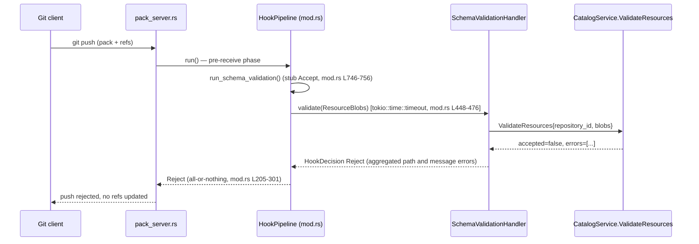
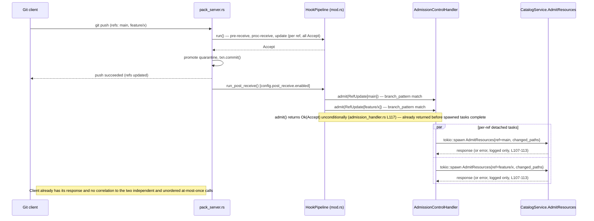
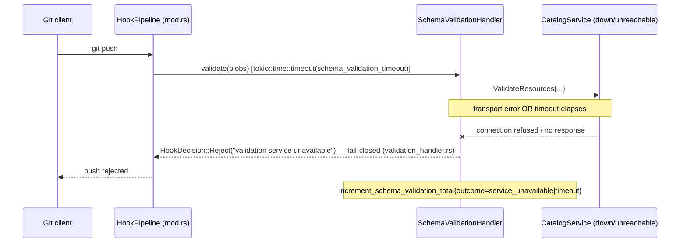
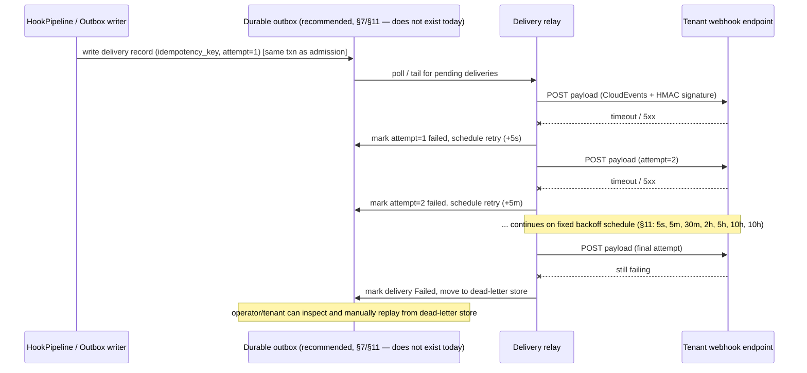
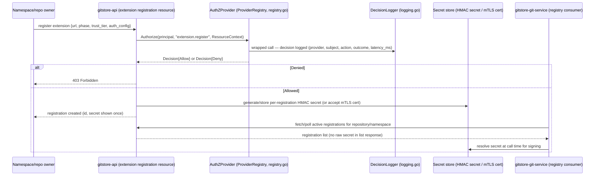

# 036 — Git Service Extension Architecture

**Status**: 🟡 Proposed (architecture/design only; no runtime code, config schema, or proto changes are made by this document)

> Extends `docs/implementation/022-opa-data-authorization.md` (pluggable AuthZ provider pattern),
> `docs/implementation/020-pluggable_auth_architecture.md` / `021-controller_service_account_auth.md`
> (provider registry conventions), and the existing `CatalogService.ValidateResources` /
> `AdmitResources` gRPC contract implemented by `gitstore-git-service`. Raw inspiration for a
> webhook-shaped config surface exists in `docs/ideas.md` (lines 133-181, "Git Service - Extend the
> hooks"); no corresponding Rust code exists anywhere in the repository today, and this document
> does not treat that sketch as a contract to preserve.

## 1. Problem statement

`gitstore-git-service` already has a working, in-process hook pipeline (`gitstore-git-service/src/git/hooks/mod.rs`) with two real, non-stub extension points wired to a single external service: `SchemaValidationHandler` (synchronous, fail-closed schema validation over gRPC) and `AdmissionControlHandler` (fire-and-forget, fail-open admission notification over gRPC), both talking to exactly one hard-coded catalog-service endpoint configured via `cfg.catalog_service.uri`.

This is sufficient for GitStore's own catalog admission use case, but it is architecturally a dead end for anything beyond it:

- There is no registry of extensions — one URL, one validation slot, one admission slot, chosen once at process startup from static TOML/env config.
- There is no way for a namespace or repository owner to install their own extension without redeploying `gitstore-git-service` with new config.
- There is no way for a third party — a marketplace extension, a tenant-supplied webhook, a controller-manager-side reconciler — to observe or veto a push without becoming the one privileged catalog-service peer.
- The only async delivery path today (`AdmissionControlHandler`) has no durability, no retry, no correlation ID, and is unconditionally fail-open, which is correct for a notification-only internal service but would be a silent security regression if reused as-is for untrusted third-party consumers who might expect their non-response to matter.
- The `reference-transaction/prepared` phase — the phase that runs while Git's own ref-lock files are held — is only reachable by a real, non-Noop handler today if an operator explicitly sets `schema_validation.phase` or `admission_control.phase` to `"reference-transaction/prepared"`; under the shipped defaults (`pre-receive`/`post-receive`) it exercises only the built-in stub Accept logic, so any extension design must not assume this phase is exercised by a real handler out of the box.
- `post_update` has a config toggle but no implementation (`mod.rs` has no `run_post_update` method), a latent gap that any extension design must not paper over.

The problem this document addresses: **how does GitStore let first-party (catalog admission), second-party (controller-manager), and eventually third-party (tenant-installed, marketplace) code observe and, where appropriate, veto Git pushes — without weakening the one enforcement guarantee GitStore has today (fail-closed schema validation), without blocking Git ref locks on untrusted network calls, without requiring any external infrastructure for local-first development, and without turning `gitstore-git-service` into a plugin runtime that duplicates half of Envoy or Kubernetes.**

This is a research and architecture document. It does not implement code, does not change `config.rs`'s schema, and does not change any proto. It sets direction for a future implementation spec.

## 2. Existing hook and protocol behavior (grounded in FACTS)

This section restates only verified current behavior, with citations, as the fixed ground truth the rest of this document designs against.

### 2.1 Pipeline shape and phase ordering

`HookPipeline` (`gitstore-git-service/src/git/hooks/mod.rs` L160) orchestrates in-process hook execution for a single push (one `ReceivePack` call). It holds `config: GitReceivePackHooks`, the configured `schema_validation_phase`/`schema_validation_timeout`/`validation_handler: Arc<dyn ValidationHandler>`, and the configured `admission_control_phase`/`admission_branch_pattern`/`admission_handler: Arc<dyn AdmissionHandler>`.

`run()` (mod.rs L205-301) executes strictly serially, in this order, for one push:

1. **pre-receive** — once per push, all-or-nothing: a reject aborts the whole push.
2. **proc-receive** — once per push, all-or-nothing.
3. **update** — once **per ref**, in a plain serial `for` loop; a per-ref reject skips only that ref and the loop continues processing the rest. Partial success across refs is the existing model at the update phase — it is not a design choice this document introduces.

Each stage calls the internal `run_schema_validation()` helper (below).

### 2.2 Reference-transaction: the phase that runs under Git's own ref locks

Separately from `run()`, `run_reference_transaction_prepared()` (mod.rs L305) is invoked from two call sites: `pack_server.rs`'s `handle_receive_pack` (L109, L237-241), and the live gRPC `receive_pack` streaming handler in `grpc/server.rs` (L1123-1131). `pack_server.rs`'s `handle_receive_pack` has **zero callers anywhere in the crate** — it is dead/unused code, not the live request path. The actual production path is the gRPC streaming handler, which builds `ref_edits` and calls `repo.refs.transaction().prepare(...)` inside a `spawn_blocking` closure (grpc/server.rs L1006-1130) — this is where gix's own ref-lock files are acquired — and the hook call happens **after** that `prepare()` and **before** quarantine promotion and `txn.commit()` (grpc/server.rs L1123-1150). This means a `reference-transaction`/`prepared` hook call genuinely executes while Git ref lock files are held: any slow external call at this phase blocks the ref lock for the call's entire duration.

- **Reject** → the txn is dropped, releasing the locks (grpc/server.rs, `TxnOutcome::RejectedByHook`), and `run_reference_transaction_aborted()` (mod.rs L365, observation-only, cannot fail) fires.
- **Accept** → quarantine is promoted, `txn.commit()` runs, then `run_reference_transaction_committed()` (mod.rs L354, observation-only, cannot fail) fires.

The gRPC handler bridges into this blocking context via `tokio::task::block_in_place` + `Handle::current().block_on(...)` to invoke `run_reference_transaction_prepared` (grpc/server.rs L1123-1131), passing a **real** `HookContext` derived from the proto `PushContext` (`let hook_ctx = HookContext::from(push_ctx)`, grpc/server.rs L851) and the same shared `Arc<HookPipeline>` that `main.rs` (L78-123) wires with real, non-Noop handlers by default. `run_reference_transaction_prepared` delegates to `run_schema_validation()` (§2.4), so this phase already invokes the real `SchemaValidationHandler`/`AdmissionControlHandler` in production **if** an operator configures `schema_validation.phase` or `admission_control.phase` as `"reference-transaction/prepared"`; under the shipped defaults it only runs the built-in stub Accept logic, since neither configured phase points there by default. (The unused `pack_server.rs::handle_receive_pack` path is the one that constructs `HookContext::default()` and its own code comment mentions `NoopAdmissionHandler` — but since that function has no callers, it does not describe production behavior.)

### 2.3 post-receive: the only async slot today, and its guarantees

`run_post_receive()` (mod.rs L377) fires only if `config.post_receive.enabled`. If `admission_control_phase == "post-receive"` (the config default), it does `tokio::spawn(...)` around `admission_handler.admit(...)` — true fire-and-forget: the spawned task's error is only logged (mod.rs L406-411), never surfaces back to the Git client, and is lost entirely if the process crashes before the task completes. There is no persistence, no retry, and no correlation between the completed push response and the async admission outcome.

### 2.4 The single choke point: `run_schema_validation()`

`run_schema_validation()` (mod.rs L431) is the only place that actually invokes the pluggable handlers. It:

1. Runs the phase's built-in stub logic first. All of `run_pre_receive`/`run_proc_receive`/`run_update` (mod.rs L746-756) are literally `HookDecision::Accept` no-ops today — there is no built-in Rust validation logic yet; everything real is delegated to the injected handlers.
2. Conditionally calls `validation_handler.validate()` when `phase == configured schema_validation_phase`, wrapped in `tokio::time::timeout(schema_validation_timeout, ...)` (mod.rs L448-476). Both a handler `Err` and a timeout map to `HookDecision::Reject` — **fail-closed by construction at this call site**.
3. Conditionally calls `admission_handler.admit()` when `phase == configured admission_control_phase AND phase != "post-receive"` (mod.rs L481-506, same timeout, same fail-closed mapping) — this is how `AdmissionHandler` can be configured to run as a blocking, veto-capable slot at pre-receive/proc-receive/update instead of post-receive, per the code comment at mod.rs L478-480 (used today by integration tests, not production wiring).

`config.rs`'s `validate()` (L133-140) enforces FR-019: `schema_validation.phase` and `admission_control.phase` **must** be different values, or startup fails. Combined with the post-receive exclusion above, this guarantees at most one blocking validation call and at most one blocking admission call per phase invocation, and that admission is a hard veto **only** when configured away from post-receive; at post-receive it is unconditionally fire-and-forget.

### 2.5 What content extensions actually see

`extract_resource_blobs` (mod.rs L524-601) opens the repo with `gix`. A file only becomes a `ResourceBlob` passed to `ValidationHandler` if its raw content starts with the literal bytes `"---"` (YAML/TOML frontmatter marker) — arbitrary files in a push are never sent to validation. For a brand-new branch (`old_oid` all-zero) it walks the full new tree; for a ref update it diffs old-tree vs new-tree and only collects changed blobs, so unchanged files already accepted by a prior push are never re-validated. When a `quarantine_dir` is present (push not yet promoted into the live object database), it hard-links (falling back to copy) the quarantine pack/idx files into `objects/pack` so `gix` can resolve not-yet-committed objects during validation, then removes those links afterward regardless of outcome (mod.rs L531-556, L596-600) — this is the only mechanism by which a validation call can see not-yet-durable pushed content.

### 2.5a Sequence: synchronous pre-receive validation that rejects a push



`HookContext` (mod.rs L33-44) is derived once per push from the `PushContext` proto (`actor_subject`, `actor_auth_method`, `max_pack_size_bytes`, `max_file_size_bytes`, `config_resource_version`) and passed by reference to every phase call — the existing "principal + policy" context object. Any new extension-context design in this document extends `HookContext`; it does not replace it.

### 2.6 Config surface and its gaps

`GitReceivePackHooks`/`HookToggle` (config.rs L58-71) independently enable/disable each of: `pre_receive`, `update`, `post_receive`, `proc_receive`, `post_update`, `reference_transaction`. Defaults (config.rs `default_toml`, L221-227): `pre_receive=true`, `update=false`, `post_receive=true`, `proc_receive=false`, `post_update=false`, `reference_transaction=false`.

**Known gap, called out explicitly rather than papered over:** config has a `post_update` toggle but `HookPipeline` has no `run_post_update` method at all — it is a dead/reserved config key today.

Config is static only: layered defaults → optional `gitstore.toml` → `GITSTORE_` env vars (double-underscore separated via `.separator("__")`, config.rs L187). Nested keys (`hooks.*`, `admission_control.*`, `schema_validation.*`) **are** overridable via env vars today — e.g. `GITSTORE_HOOKS__GIT_RECEIVE_PACK__PRE_RECEIVE__ENABLED`, `GITSTORE_SCHEMA_VALIDATION__PHASE`, `GITSTORE_ADMISSION_CONTROL__PHASE`, and even two-level-nested keys like `GITSTORE_AUTH__GRPC__HMAC_SECRET_PREVIOUS`, all exercised and asserted by config.rs's own test suite (`test_hook_toggle_env_vars_pre_receive_and_post_receive_round_trip` L578-604, `test_validate_phase_conflict_rejected` L503-524, `test_hmac_secret_previous_env_var` L662-675). A stale doc-comment above `load_config_from` (config.rs L90-95) still claims nested env overrides are unsupported "due to key-path ambiguity...using a single-underscore separator," but the actual `Environment` source uses a double-underscore separator (`.separator("__")`, L187), which is exactly why nested overrides work — that comment should be treated as out of date, not as current behavior. There is no hot reload, no per-namespace or per-repository override, and no API-managed configuration anywhere in this service today — one global policy per process, set at startup.

### 2.7 The two real handlers, and their fail-open/fail-closed asymmetry

`SchemaValidationHandler` (`gitstore-git-service/src/git/hooks/validation_handler.rs` L26) implements `ValidationHandler` by calling `CatalogService.ValidateResources` over gRPC (tonic client, generated via buf from `shared/proto/gitstore/catalog/v1/catalog_service.proto`). It sends `ValidateResourcesRequest{repository_id, blobs: [{path, blob_oid, content}]}`. `accepted=true` → Accept. `accepted=false` → Reject, aggregating every `ValidationError{file_path, field, constraint, message}` into one string. A `tokio::time::timeout` elapsing **or** any transport/RPC `Err` → Reject("validation service unavailable") — **this handler is fail-closed on both timeout and transport error**, and records a metric (`increment_schema_validation_total`) tagged accepted/rejected/timeout/service_unavailable per outcome.

`AdmissionControlHandler` (`gitstore-git-service/src/git/hooks/admission_handler.rs` L26) implements `AdmissionHandler` for the post-receive slot: for each `RefUpdate`, it regex-tests `update.ref_name` against the configured `branch_pattern` via `self.branch_pattern.is_match(...)` (L83) — an unanchored substring match, not a full/anchored match; a caller must supply an explicitly anchored pattern (e.g. `^refs/heads/main$`) to get full-match semantics, as the module's own test `test_prefix_extended_ref_no_grpc_call` (L409-439) demonstrates. The shipped default (`config.rs` L235, `branch_pattern = "refs/heads/main"`) is unanchored, so it also matches refs like `refs/heads/main-hotfix`, not just `refs/heads/main`. Non-matching refs are skipped with no gRPC call at all. For matching refs, it computes `changed_paths` via a tree diff (`compute_changed_paths_in_repo`, shared logic in `tree_diff.rs`) and `tokio::spawn`s an independent, per-ref, fully detached task that calls `CatalogService.AdmitResources{repository_id, commit_sha, ref_name, old_commit_sha, new_commit_sha, changed_paths}` — errors from that call are only logged (`error!(...)` at L107-113), never retried, never surfaced. Critically, the outer `admit()` returns `Ok(AdmissionDecision::Accept)` **unconditionally** (L117) before any spawned per-ref task has necessarily completed — **this handler is fail-open by construction**: it can never veto a push, and a multi-ref push produces N independent, uncorrelated, at-most-once delivery attempts to the catalog service with no ordering guarantee across refs and total loss on process crash before the spawned task runs.

Both handlers are constructed once at startup in `main.rs` (L78-123) against the **same** single configured URL, `cfg.catalog_service.uri` (config.rs `CatalogServiceConfig`, default `http://localhost:6000`) — exactly one hard-coded extension backend today, not a registry of pluggable/multiple extensions. Connections are lazy (`connect_lazy`) so a catalog-service outage at boot does not block git-service startup; if the initial `connect()` call itself fails (e.g. malformed URL), `main.rs` falls back to the Noop handler for that slot and logs a warning (L89-93, L107-111) — the **only** "fail-open at the whole-slot level" behavior in the codebase, and it applies only to startup-time connection construction, not to steady-state per-call behavior (fail-closed for validation, fail-open for admission, as above).

`NoopValidationHandler` / `NoopAdmissionHandler` (mod.rs L108-119, L139-153) always Accept; they are the defaults used in tests and the fallback when the real handler cannot be constructed at startup.

### 2.8 The existing contract as precedent, and its limits

The `CatalogService` gRPC contract (`shared/proto/gitstore/catalog/v1/catalog_service.proto`) has exactly two relevant RPCs: `ValidateResources` (request/response, synchronous) and `AdmitResources` (request/response, but called fire-and-forget by the client above). This is GitStore's own precedent for a synchronous-validation-plus-async-notification split. Today it is a fixed, single-tenant, internal client↔server pair (git-service is always the client, `gitstore-api`'s catalog service is always the server); it was never designed for third-party, possibly-untrusted callees. Everything in this document is about generalizing that precedent, not discarding it.

### 2.9 Adjacent, already-shipped patterns worth reusing (verified by direct read)

Two existing subsystems are directly relevant prior art for pieces of the design below, verified by reading their source (not part of the FACTS block, cited separately here):

- **`gitstore-api/internal/auth.AuthZProvider`** (`gitstore-api/internal/auth/types.go`) is the existing pluggable-provider contract: `Authorize(ctx, principal, action, resource) (Decision, error)`, exposed through exactly one active provider at a time via `gitstore-api/internal/auth/registry.go`'s `ProviderRegistry`. `docs/implementation/022-opa-data-authorization.md` (§1, §3, §4) proposes wrapping this single-provider slot with an embedded OPA engine that fails closed on invalid/unsafe decisions and keeps GraphQL middleware, not resolvers, as the sole policy-invocation point — the same "exactly one authoritative decision point, fail closed by default" shape this document recommends for git-service admission.
- **`gitstore-api/internal/auth.DecisionLogger`** (`gitstore-api/internal/auth/logging.go`) wraps any `AuthZProvider` and emits one structured log line per `Authorize` call (`provider`, `subject`, `action`, `resource_kind`, `resource_name`, `outcome`, `reason`, `latency_ms`), recently wired into `gitstore-api` (branch `043-fix-decision-logger`). This decorator-around-a-provider pattern is a direct model for uniform decision logging/audit around any git-service extension call, sync or async (§12).
- **`gitstore-api/internal/eventbus.Bus`** (`gitstore-api/internal/eventbus/eventbus.go`) is an in-process, per-kind, bounded ring-buffer publish/subscribe bus, explicitly documented in its own header comment as "in-memory only (no durability across a process restart)" (citing `specs/040-controller-watch-status-api/research.md` R2/R3). `Publish` assigns a monotonic per-kind cursor and fans out to every current subscriber over a buffered channel; if a subscriber's channel is full, `Bus` does not block or silently drop the event — it deletes and closes that subscriber's channel and increments `EventsDroppedTotal`, forcing the consumer to relist rather than advance on a gap (eventbus.go L94-121). `Subscribe`/`SubscribeWithCursor` replay retained ring-buffer events from a given cursor and return `ErrWatchExpired` when the requested cursor has already been evicted. This is the mechanism `gitstore-controller-manager`'s `CategoryTaxonomy` and `Product` list-watchers already consume. It is the closest existing GitStore building block to an "event bus + async consumers" extension mechanism (§5.9) — and it carries the same non-durability caveat as `AdmissionControlHandler`'s fire-and-forget calls: useful for at-least-once-ish, best-effort fan-out to consumers that are already running, not a substitute for a durable outbox (§7).

## 3. Extension use cases

Five distinct use-case shapes drive the rest of this design; conflating them is the single most common failure mode in comparable systems (see the k8s-admission/webhook-security research below).

1. **Synchronous admission/validation** — a call that can reject the push. Today: `SchemaValidationHandler` at pre-receive/proc-receive/update (fail-closed), and, per test-only wiring, `AdmissionControlHandler` when configured off post-receive. Future: tenant-defined schema/business-rule checks, OPA-style policy checks, license/quota checks.
2. **Asynchronous notification/automation** — a call that cannot reject the push and exists purely to trigger downstream work: catalog projection/materialization, search indexing, audit trail, CI/CD triggers, external ERP/CMS sync. Today: `AdmissionControlHandler` at post-receive (fail-open, fire-and-forget, no durability).
3. **Future controller-manager integrations** — `gitstore-controller-manager`'s reconcilers (e.g. `CategoryTaxonomy`, `Product`) already consume change events out of `gitstore-api`'s `eventbus.Bus` via GraphQL subscriptions (§2.9). A git-service extension mechanism that wants to feed the same reconciler loops should produce events shaped compatibly with that existing watch/reconcile pattern rather than inventing a third event shape.
4. **Marketplace / tenant-installed extensions** — third-party or tenant-authored code, installed per-namespace or per-repository, running with less trust than first-party catalog admission. This is the use case most current GitStore code has never had to consider — it changes the trust model completely (§4) and drives most of §5's mechanism comparison and §9's security section.
5. **Local-dev extensions with zero *new* external infrastructure** — GitStore's local-first bootstrap profile (`make dev`, `make compose`) must keep working with no *additional* extension backend configured beyond today's baseline. Note this is a narrower bar than "zero network calls": `main.rs` (L78-123) always attempts `connect_lazy()` against the configured `catalog_service.uri` (default `http://localhost:6000`, config.rs L238) for both handlers at startup, and `connect_lazy()` succeeds for any well-formed URL regardless of reachability — it does not fall back to `Noop*Handler` on an unreachable/not-yet-listening endpoint, only on a `connect()` construction error (e.g. malformed URL). Since schema validation is enabled by default at pre-receive and is fail-closed, today's baseline already makes a real (non-Noop) network call to the catalog service on every push in `make dev`/`make compose`, where `gitstore-api`'s catalog gRPC service is already part of the local stack (compose.yml `GITSTORE_CATALOG_SERVICE__URI=http://api:6000`). Every design choice below must degrade to "no *additional* extensions registered, behavior identical to today's baseline" without special-casing local dev — not to a stronger, inaccurate "zero network calls ever" claim.

## 4. Trust boundaries and threat model

**Baseline stance: a configured extension URL, socket path, or module path is never inherently trustworthy.** This is a change in posture from today's code, where the single `catalog_service.uri` is implicitly first-party (it is `gitstore-api`'s own catalog service, deployed by the same operator). The moment extensions can be installed by a namespace owner, a repository owner, or a marketplace listing, the git-service process is making outbound calls (or loading code) chosen by someone who is not the cluster operator.

Trust tiers, from most to least trusted:

- **T0 — Operator-configured, process-wide.** Today's `catalog_service.uri`. Set at deploy time, applies to every repository, effectively part of the trusted computing base. No change needed for this tier; it should remain the only tier that can run at `reference-transaction`/`prepared` under the ref lock (§7).
- **T1 — Operator-approved, namespace/repo-scoped.** An extension a cluster operator has vetted and enabled for specific namespaces (e.g. a partner integration). Should be capability-scoped (§8) and rate/timeout-bounded, but can still be given a blocking admission slot if it declares low `sideEffects` and a short `timeoutSeconds`, mirroring Kubernetes' `sideEffects`/`failurePolicy` gate (k8s-admission research).
- **T2 — Tenant-installed, self-service.** A namespace owner installs their own webhook/extension without operator review. Should default to **async, non-vetoing, notification-only**, matching how GitHub/Stripe/Svix-style webhooks are universally scoped (webhook-security research) — at-least-once, unordered, best-effort, never authoritative.
- **T3 — Marketplace, unvetted third-party.** Code or endpoints published by unrelated third parties and installed by tenants. Same functional tier as T2 for the network-call mechanisms (HTTP/gRPC), but for any in-process mechanism (WASM, dynamic libraries) T3 additionally requires the sandboxing guarantees in §5.6/§5.7 — no ambient syscalls, explicit capability grants, fuel/epoch-based CPU metering (wasm-extensions research) — before it can run in the same process as Git protocol handling at all.

Threats this model must account for, independent of mechanism:

- **SSRF**: an extension URL pointing at an internal service, cloud metadata endpoint, or loopback address, used to pivot from "configure a webhook" to "make the git-service process call arbitrary internal endpoints." Mitigation is mechanism-agnostic (§9): resolve and validate the destination, block private/link-local ranges unless explicitly allowlisted, disallow automatic redirect-following.
- **Denial of ref-lock availability**: any extension called while ref locks are held (§2.2, §7) that is slow, hung, or malicious becomes a lock-starvation vector against the whole repository. This is why T2/T3 extensions must never run at `reference-transaction`/`prepared`.
- **Fail-open masquerading as fail-closed**: an extension that is supposed to gate a push (validation) but is wired, misconfigured, or degrades into a notification-only fire-and-forget call (as `AdmissionControlHandler` already does at post-receive today). The contract in §8 must make this distinction a declared, enforced property of the extension registration, not an accident of which phase it happens to be wired to.
- **Data exfiltration via payload over-sharing**: sending full file content, full commit history, or credentials to an untrusted T2/T3 endpoint when only a diff summary or hash was needed. §8 separates validation-necessary data from notification-only data from data that must never leave the trust boundary.
- **Compromised extension as a pivot point**: a marketplace extension that behaves correctly at install time and turns malicious later (compromised dependency, compromised endpoint). Containment must come from capability scope, network egress restriction, and revocability (§9), not from trusting the extension's declared behavior.
- **Replay and duplicate delivery**: since async delivery is at-least-once by construction (webhook-security research; outbox-delivery research), a malicious or buggy consumer that treats a replayed event as new (e.g. re-provisioning a resource) is a threat the *contract* must defend against via idempotency keys, not something git-service can prevent by trying harder to deliver exactly once.

## 5. Candidate extension mechanisms

Ten mechanisms are evaluated. None is assumed to be the answer for every phase; §14 recommends a specific combination.

### 5.1 HTTP webhooks

Plain outbound HTTP(S) calls, signed per the GitHub/Stripe/Svix convention (HMAC-SHA256 over the raw body, timestamp embedded in the signed string, ~5-minute replay tolerance, versioned signature scheme, constant-time comparison — webhook-security research). Zero new server-side infrastructure to *receive* — any tenant's existing HTTP endpoint works. GitStore has zero webhook code today; `docs/ideas.md` L133-181 sketches a `[hooks.webhook]` TOML table (per-phase list of `{url, method, body, auth}`) but nothing beyond the sketch exists.

### 5.2 gRPC extension services

The mechanism GitStore already uses internally (`CatalogService.ValidateResources`/`AdmitResources`). Strongly-typed contract via protobuf, native `tonic`/`gix` async fit, first-class deadline propagation. Best for T0/T1 (operator-approved) synchronous slots; less natural for T2/T3 self-service tenants who would need to stand up and register a gRPC server rather than pointing at an existing HTTPS endpoint.

### 5.3 Versioned Unix-domain-socket protocol

A length-prefixed or framed protocol (protobuf-over-UDS, or an HTTP/1.1-over-UDS convention) for extensions that run as sidecar processes on the same host/pod as `gitstore-git-service`. Removes network-layer SSRF concerns entirely (no DNS, no IP, no TLS needed within the pod's loopback namespace) and gives lower, more predictable latency than a network call — but only for co-located T0/T1 extensions; it does not fit T2/T3 self-service or marketplace distribution.

### 5.4 In-process Rust dynamic libraries (`dlopen`/`cdylib`)

Compiled Rust (or C-ABI-compatible) shared objects loaded directly into the `gitstore-git-service` process. Zero IPC latency, full access to `gix`/HookContext types without serialization — but zero sandboxing: a loaded `.so` has the full privileges of the git-service process, including arbitrary syscalls, memory access, and crash-taking-down-the-host risk. This is a T0-only mechanism (operator-compiled-and-vetted, ideally built from source in the same repo/CI pipeline) and is fundamentally incompatible with T2/T3 (marketplace/tenant-installed) — there is no capability boundary to revoke or limit.

### 5.5 WASI/WASM modules

Sandboxed bytecode modules loaded in-process via a Wasm runtime (Wasmtime). The wasm-extensions research is directly applicable: linear-memory sandboxing gives no ambient syscalls by default — any network, filesystem, or clock access must be explicitly imported as a host function (the "deny by default, grant by import" pattern common to proxy-wasm, Extism, and wasmCloud). Wasmtime provides deterministic CPU-budget enforcement via fuel metering (`Config::consume_fuel`/`Store::set_fuel`, ~1 unit per instruction) and real wall-clock/cooperative-yield timeouts via epoch-based interruption (`set_epoch_deadline`/`epoch_deadline_trap`), plus memory/table/instance caps via `ResourceLimiter`. Module instantiation is reported at ~5µs post-copy-on-write optimization (Bytecode Alliance, wasm-extensions research) — orders of magnitude below any network RTT, so per-push instantiation is not a latency concern. This is the only mechanism in this list that can plausibly run T2/T3 marketplace code **in-process** with real safety guarantees, at the cost of needing a Wasm compilation target for extension authors (broad but not universal language support: Rust, Go, JS/TS/AssemblyScript, C, Zig, C#/.NET via various toolchains).

### 5.6 OCI/containerized extensions

Extensions packaged and distributed as OCI artifacts (à la OPA/Envoy Wasm-over-OCI, or Wasm-OCI per the CNCF spec) and run as separate container processes, invoked over gRPC/HTTP/UDS. Gets full OS-level process isolation (stronger than WASM's language-level sandbox) and reuses the entire existing container registry/signing ecosystem (`cosign`/Sigstore attestation — plugin-distribution research) for provenance, at the cost of an orchestration dependency (a container runtime, a scheduler) that directly conflicts with the local-first, zero-mandatory-infrastructure constraint unless it is made fully optional.

### 5.7 Sidecars

Not a distinct wire protocol but a deployment pattern: any of §5.1-5.6 run as a co-located process reachable over localhost/UDS instead of a remote network hop. Improves latency and removes DNS/public-network SSRF surface, but does not change the mechanism's fundamental trust/sandboxing properties — a sidecar-hosted webhook receiver is still a T1/T2 HTTP mechanism underneath.

### 5.8 Git-executable-compatible hooks

Plain executables on disk invoked the way native `git` invokes `pre-receive`/`update`/`post-receive` scripts (stdin/argv/env, exit code as decision). Maximizes compatibility with the existing Git hooks ecosystem and requires no new wire protocol, but runs with the full privileges of the git-service host filesystem/process (similar isolation profile to §5.4) and has no structured request/response schema — everything is argv/stdin/exit-code, which is a poor fit for the rich context (§8) this design needs and for any T2/T3 trust tier.

### 5.9 Event-bus + async consumers

An in-process (or externally backed) publish/subscribe fan-out, on the model of `gitstore-api`'s `eventbus.Bus` (§2.9): the git-service publishes a change event after a push completes, and any number of already-connected consumers (controller-manager reconcilers, indexers, audit sinks) receive it. This is naturally notification-only (§6) — nothing subscribing to a bus can veto a push that has already been published — and, per `eventbus.Bus`'s own documented design, is in-memory-only unless explicitly backed by a durable log (§7). Best fit for use case 3 (controller-manager integrations) and use case 2 (notification/automation) where consumers are already running GitStore-operated processes rather than arbitrary tenant endpoints.

### 5.10 Hybrid sync-admission + async-event model

Not a new wire mechanism but a composition rule: use a small number of narrowly-scoped, fail-closed, timeout-bounded synchronous calls (gRPC or UDS, T0/T1 only, never inside the ref-lock window) for anything that can legitimately reject a push, and route everything else — including all T2/T3 extensions by default — through an at-least-once, durable-if-required, fail-open-by-default async event path (HTTP webhooks with the GitHub/Stripe/Svix signing convention, or `eventbus`-style fan-out for already-connected internal consumers). This is the generalization of GitStore's own existing `ValidateResources`/`AdmitResources` split (§2.8), and it is the composition this document recommends (§14) — evaluated here as its own row because none of §5.1-5.9 alone is sufficient; the hybrid is the actual proposal.

## 6. Synchronous vs asynchronous execution model, phase by phase

| Phase / integration                                                                     | Can reject push?                                                                                                                                                                                                                             | Retries / duplicates / ordering                                                                                                                                                                                    | Delivery semantics                                                                                                                                              |
|-----------------------------------------------------------------------------------------|----------------------------------------------------------------------------------------------------------------------------------------------------------------------------------------------------------------------------------------------|--------------------------------------------------------------------------------------------------------------------------------------------------------------------------------------------------------------------|-----------------------------------------------------------------------------------------------------------------------------------------------------------------|
| **pre-receive** (once/push)                                                             | Yes — all-or-nothing (mod.rs L205-301)                                                                                                                                                                                                       | No retry within the call; a timeout/error is a Reject, not a retried attempt (mod.rs L448-476)                                                                                                                     | At-most-once *evaluation* per push attempt; the client simply re-pushes on rejection, which is a *new* call, not a retry of the old one                         |
| **proc-receive** (once/push)                                                            | Yes — all-or-nothing                                                                                                                                                                                                                         | Same as pre-receive                                                                                                                                                                                                | Same as pre-receive                                                                                                                                             |
| **update** (per ref, serial loop)                                                       | Yes, but only for that ref — a reject skips the ref, other refs continue (mod.rs L205-301)                                                                                                                                                   | No retry; ordering across refs is the serial for-loop order, not caller-controlled                                                                                                                                 | At-most-once per ref, per push attempt                                                                                                                          |
| **reference-transaction/prepared** (runs under gix ref lock, grpc/server.rs L1006-1150) | Yes, in principle (`run_reference_transaction_prepared`, mod.rs L305) — but see §7: the real handlers are only reached here if `schema_validation.phase`/`admission_control.phase` is explicitly set to this phase, which is not the default | No retry — a slow call here blocks the lock, so retrying inline would extend lock-hold time; not something to add                                                                                                  | At-most-once, and it **must stay** synchronous/blocking-with-hard-timeout by construction, or the ref-lock guarantee is meaningless                             |
| **reference-transaction/committed, /aborted**                                           | No — mod.rs L354/L365 are explicitly observation-only, cannot fail                                                                                                                                                                           | N/A (no decision to retry)                                                                                                                                                                                         | At-most-once notification of an outcome that already happened                                                                                                   |
| **post-receive** (mod.rs L377)                                                          | **No** — `tokio::spawn` fire-and-forget; the outer call has already returned Accept to the Git client by the time this may still be running                                                                                                  | No retry today (error is logged and dropped, L406-411); no ordering guarantee across the `tokio::spawn`-per-ref tasks in `AdmissionControlHandler`                                                                 | At-most-once, with silent loss on process crash — this is *not* at-least-once until a durable outbox is added (§7)                                              |
| **post-update**                                                                         | N/A — config toggle exists, no implementation exists (known gap, §2.6)                                                                                                                                                                       | N/A                                                                                                                                                                                                                | N/A — do not describe this as providing any guarantee; it does nothing today                                                                                    |
| **schema validation** (as a cross-cutting call within any blocking phase)               | Yes — fail-closed on both handler error and timeout (`SchemaValidationHandler`, validation_handler.rs L26)                                                                                                                                   | No retry inside the call; caller re-pushes to retry                                                                                                                                                                | At-most-once per call, synchronous                                                                                                                              |
| **admission control** (as configured phase, non-post-receive)                           | Yes, when explicitly configured off post-receive (mod.rs L481-506) — used by integration tests today, not production wiring                                                                                                                  | No retry inside the call                                                                                                                                                                                           | At-most-once, synchronous, blocking                                                                                                                             |
| **admission control** (post-receive, current production default)                        | **No** — fail-open by construction (`admission_handler.rs` L117 returns `Ok(Accept)` unconditionally)                                                                                                                                        | No retry, no ordering across per-ref spawned tasks, at-most-once delivery to the catalog service, total loss on crash before the task runs                                                                         | At-most-once, asynchronous, non-authoritative                                                                                                                   |
| **catalog extraction/projection** (future, downstream of admission)                     | No — by definition happens after the push is already accepted                                                                                                                                                                                | Depends entirely on whether the trigger path is durable (§7); if built on today's `AdmissionControlHandler` shape, at-most-once; if built on a durable outbox, can be at-least-once with consumer-side idempotency | Must be documented as async and best-effort unless a durable outbox is added                                                                                    |
| **audit logging**                                                                       | No                                                                                                                                                                                                                                           | Should be at-least-once and durable regardless of mechanism — audit gaps are a compliance problem, not a performance tradeoff                                                                                      | Recommend: write synchronously to a local durable log/store as part of the admission decision itself (not a spawned task), even if downstream shipping is async |
| **search indexing**                                                                     | No                                                                                                                                                                                                                                           | Tolerant of at-least-once + eventual consistency; duplicate re-index is idempotent by nature                                                                                                                       | Async, at-least-once acceptable, ordering not required (last-write-wins per document)                                                                           |
| **external ERP/CMS sync**                                                               | No                                                                                                                                                                                                                                           | Must assume at-least-once with duplicates on the wire (webhook-security, outbox-delivery research) — the *consumer* must dedupe via a delivery ID                                                                  | Async only; never wire an external ERP/CMS call into a blocking phase                                                                                           |
| **CI/CD triggers**                                                                      | No — a CI trigger is a notification, not a gate; if a CI check must gate merges, that gating happens in the CI system or via a separate synchronous status check integration, not via this trigger                                           | At-least-once triggering is fine and expected (CI systems already dedupe on commit SHA)                                                                                                                            | Async                                                                                                                                                           |

**Never describe an asynchronous integration as capable of providing synchronous admission guarantees.** Every row above that is async is explicitly "No" in the reject column; this is a hard invariant carried through §7, §11, and §14, not a stylistic choice.

### 6.1 Sequence: successful multi-ref push with asynchronous post-receive delivery



### 6.2 Sequence: external extension timeout/outage (synchronous slot)



### 6.3 Sequence: asynchronous event retry and dead-letter flow (recommended v2 design, not current behavior)



### 6.4 Sequence: extension configuration authorization and secret resolution



## 7. Transaction and consistency model

Two already-verified facts anchor this section and must not be contradicted by any future design:

1. `reference-transaction`/`prepared` runs while `gix` ref-lock files are held, between `repo.refs.transaction().prepare(...)` and quarantine promotion (`pack_server::promote_quarantine`, reused from `pack_server.rs`)/`txn.commit()` — in the live gRPC path, inside the `spawn_blocking` closure in `grpc/server.rs` (L1006-1150; the equivalent logic also exists, unused, in `pack_server.rs`'s dead `handle_receive_pack`, §2.2). Any hook call at this phase is **on the critical path of ref-lock hold time** for every other operation contending for that lock. This is the *only* phase where "reject" is coupled to atomic, uncommitted-object visibility (extension code can see quarantined objects, per §2.5, and a reject cleanly aborts the transaction by dropping the txn) — and it is exactly the phase that must never be handed to an untrusted (T2/T3) extension, and should only ever be handed to a T0 extension with a hard, short timeout.
2. `AdmissionControlHandler`'s post-receive path (admission_handler.rs, mod.rs L377-411) has **zero durability**: the decision to call the catalog service is made in-memory, the call itself is a detached `tokio::spawn`, and a process crash between "Git client received Accept" and "spawned task completes" **silently drops the notification with no record it was ever supposed to happen.**

From these two facts, the following guarantees are **impossible without additional infrastructure**, and no future extension design should imply otherwise:

- **"Every accepted push is guaranteed to notify extension X"** — impossible without a durable outbox (a local, transactionally-written record of "this push happened, deliver it") written *before* returning Accept to the Git client, on the transactional-outbox pattern (outbox-delivery research: "messages are guaranteed to be sent if and only if the database transaction commits"). Today, `gitstore-git-service` has no local durable store at all — it is a stateless protocol server over bare Git repos — so this guarantee does not exist for any post-receive integration today, and adding it means either (a) writing an outbox record into the target repository itself (e.g. a ref or a side file) as part of the same ref-transaction that accepts the push, or (b) introducing a durable queue/log external to git-service (e.g. writing into `gitstore-api`'s eventual datastore, or a message broker) synchronously, before the push's response is returned to the client.
- **"Extension calls at post-receive happen in commit order across refs"** — impossible today; the per-ref spawned tasks in `AdmissionControlHandler` have no ordering guarantee across refs (admission_handler.rs), matching the general industry finding that async delivery is unordered by default (AWS EventBridge explicitly documents no cross-target ordering guarantee — outbox-delivery research).
- **"A post-receive extension's failure will be visible to the operator/pusher"** — impossible without either (a) a dead-letter/failed-delivery record (§11) or (b) piping the spawned task's result into a structured, queryable status rather than a bare `error!(...)` log line (mod.rs/admission_handler.rs L107-113 today).
- **"An extension can veto a push from post-receive"** — impossible by construction and must stay impossible: the Git client has already received a successful response by the time a post-receive hook's async work may still be running. A design that appears to add veto power to post-receive (e.g. by making the client poll for an async result) would not actually gate the push — the ref already moved — and must not be built.

Conversely, what **is** achievable without any new durable infrastructure, purely from today's synchronous, in-process phases:

- **Pre-commit validation with a real veto** — already true today for `SchemaValidationHandler` at pre-receive/proc-receive/update, fail-closed by construction (validation_handler.rs).
- **Ref-lock-scoped, all-or-nothing gating with visibility into not-yet-durable objects** — already structurally available at `reference-transaction`/`prepared` in the live gRPC path (mod.rs L305, grpc/server.rs L1006-1150), with a real `HookContext` and the same real handlers wired everywhere else; it simply isn't reached by a real handler under the *default* phase configuration yet, since neither `schema_validation.phase` nor `admission_control.phase` defaults to `"reference-transaction/prepared"` (§2.2).

**Design rule carried into §11 and §14:** post-receive/async hooks must never be described, configured, or documented as providing pre-commit validation guarantees. If a future feature needs "every push must satisfy X before the ref moves," it belongs at pre-receive/proc-receive/update/reference-transaction with a fail-closed, timeout-bounded, T0/T1-only synchronous call — never at post-receive, and never by promoting today's fire-and-forget admission path into something that merely *looks* authoritative.

## 8. Extension API and payload contract

### 8.1 Versioning and envelope shape

Recommend a versioned envelope, explicitly modeled on Kubernetes' `AdmissionReview{apiVersion, kind, request, response}` rather than Envoy's flatter `CheckRequest`/`CheckResponse` attribute bag (k8s-admission research) — Git push operations carry richer, more structured context (refs, objects, commits, changed paths) than an HTTP-attribute bag models well. Concretely:

```
GitPushExtensionRequest {
  schema_version: "v1"                      // extension protocol version, independent of GitStore's own release version
  request_id: <uuid>                        // per-call correlation id
  idempotency_key: <uuid>                   // stable per (push attempt, ref, phase) — same on any retry/redelivery
  phase: "pre-receive" | "update" | "reference-transaction-prepared" | "post-receive" | ...
  operation: "push" | "branch-delete" | "tag-create" | ...
  dry_run: bool                             // mirrors K8s dryRun; extensions MUST skip side effects when true
  deadline_unix_ms: <int>                   // absolute deadline, not a relative timeout, to survive clock/queue skew
  attempt: <int>                            // 1 for first delivery, incremented on redelivery (async paths only)
  security_context: {
    tenant_id / namespace / repository_id,
    actor_subject, actor_auth_method,        // from existing HookContext (mod.rs L33-44)
  }
  git_context: {
    ref_name, old_object_id, new_object_id,
    is_new_branch: bool,
    commit_metadata: { sha, author, committer, message_summary },
    changed_paths: [ ... ],                  // from AdmissionControlHandler's existing compute_changed_paths_in_repo
  }
  payload: ValidationPayload | NotificationPayload   // see 8.2
}

GitPushExtensionResponse {
  schema_version: "v1"
  request_id: <echoed>
  decision: "allow" | "deny" | "error"        // "error" is distinct from "deny" so fail-open/fail-closed mapping is explicit at the caller, not inferred
  reason: <string>                            // human-readable, safe to log and to surface to the pusher
  warnings: [ <string> ]                      // non-blocking, surfaced to the pusher (mirrors K8s admission `warnings`)
}
```

### 8.2 Separating validation data, notification data, and data that must never leave the trust boundary

- **Validation-necessary data** (sent only to synchronous, T0/T1, fail-closed slots): the actual resource blob content needed to check a constraint — mirrors what `SchemaValidationHandler` already sends today (`path, blob_oid, content`, validation_handler.rs L26). This is the most sensitive payload category and must never be sent to a T2/T3 (self-service/marketplace) endpoint by default.
- **Notification-necessary data** (sent to async, any-trust-tier consumers): `ref_name`, old/new object IDs, `changed_paths`, commit metadata, actor identity — enough for a consumer to know *that* something changed and *what shape* it was, without needing raw file content. This matches what `AdmissionControlHandler` already sends today (`repository_id, commit_sha, ref_name, old_commit_sha, new_commit_sha, changed_paths`, admission_handler.rs) — no content, by design, and this document recommends keeping that boundary rather than widening it for third-party consumers.
- **Data that must never leave the trust boundary**: raw credentials, session tokens, internal service URLs/topology, unredacted PII fields inside a resource blob unless a specific extension has been explicitly granted that field, and — critically — **quarantined pre-commit object content must never be sent to any T2/T3 async consumer**, since a rejected push's not-yet-durable content should not be exfiltrated to a third party regardless of the eventual decision (this is a stricter rule than today's code needs, since today's only consumer is first-party).

### 8.3 Wire format: JSON vs protobuf vs CloudEvents

- **Protobuf** — recommended for T0/T1 synchronous, in-trust-boundary calls (gRPC, UDS): strong typing, matches the existing `catalog_service.proto` precedent, and gives free backward-compatible field evolution.
- **JSON** — recommended for T2/T3 async HTTP webhooks: the near-universal receiving format for tenant/marketplace endpoints (GitHub, Stripe, Svix all use JSON bodies — webhook-security research); protobuf-over-HTTP would raise the bar for third-party consumers with no offsetting benefit at webhook scale/latency.
- **CloudEvents** — recommended as the *envelope* standard for the async/notification path specifically (not for synchronous admission calls): CloudEvents 1.0's required attributes (`id`, `source`, `specversion`, `type`, optional `time`/`datacontenttype`) standardize exactly the metadata a consumer needs to dedupe (`id` is the dedup key) and route (`type`) without prescribing signing or transport, so it composes cleanly with HMAC signing rather than replacing it (webhook-security research). Recommend wrapping the `GitPushExtensionRequest` notification payload as a CloudEvents `data` field for any externally-facing async delivery, while keeping the internal `eventbus.Bus`-consumed shape (Kind/Namespace/Name/ResourceVersion/Object, per eventbus.go L27-38) as-is for internal, already-GitStore-operated consumers like controller-manager reconcilers — no reason to force CloudEvents onto a channel that already has a working, simpler internal contract.

## 9. Security and secret-management model

### 9.1 Who can install/configure, at what scope

Recommend a scope hierarchy mirroring the trust tiers in §4:

- **Process-wide (T0)**: today's model — static config, operator-only, via `gitstore.toml`/`GITSTORE_` env vars (config.rs). No change required for this tier.
- **Namespace/repository-scoped (T1/T2)**: requires an API-managed registration surface — this does **not** exist in `gitstore-git-service` or `gitstore-api` today and is new scope for a future implementation spec, not this document. Recommend it be modeled as a GitStore resource (subject to the same admission/AuthZ path as any other resource) rather than a bespoke config table, so that installing/updating/revoking an extension registration goes through the existing `AuthZProvider.Authorize` gate (gitstore-api/internal/auth/types.go) and existing audit logging (`DecisionLogger`, logging.go) rather than a parallel, unaudited path.
- **Marketplace (T3)**: registration is the same T2 mechanism plus a provenance/signature check at install time (§9.6) — a marketplace listing is just a T2 registration whose source happens to be a signed, versioned artifact rather than a hand-typed URL.

### 9.2 Outbound authentication options

In order of preference for git-service-initiated calls to an extension:

- **mTLS** — strongest, appropriate for T0/T1 gRPC/UDS calls where both ends are operator-controlled; certificate/CA pinning per-extension mirrors Kubernetes' `clientConfig.caBundle` model (k8s-admission research: pin the CA that signed the extension's cert, validate cert CN/SAN against the configured host) rather than relying on a shared cluster-wide trust store.
- **Workload identity** (e.g. SPIFFE/SVID, cloud IAM roles) — best for T0/T1 calls to extensions running in the same orchestrated environment; avoids long-lived static secrets entirely.
- **OAuth2 client-credentials** — appropriate for T1/T2 HTTP calls to an extension that already runs a standard OAuth2-protected API.
- **HMAC request signing** — the correct default for T2/T3 webhooks: sign the raw outbound request body with a per-registration secret, following the Stripe/Svix convention — HMAC-SHA256 over `"{timestamp}.{raw_body}"`, versioned scheme prefix (`v1,...`), timestamp embedded in the signed string so it cannot be forged without invalidating the signature, ~5-minute replay tolerance, constant-time comparison (webhook-security research). This also gives the receiving tenant a way to *verify* the call genuinely came from GitStore, which matters as much as GitStore authenticating outbound.
- **Bearer token** — acceptable fallback for T1/T2 where the extension endpoint is a simple internal service; weakest of the above (no replay defense, no origin proof) and should not be the only option offered.
- **Unix-socket peer credentials** (`SO_PEERCRED`/`getsockopt`) — appropriate only for the co-located sidecar case (§5.3/§5.7): identity is enforced by the OS at the socket level, removing the need for an application-layer credential at all for that specific transport.

### 9.3 SSRF protection and network allowlisting

Mandatory for any T1/T2/T3 outbound call regardless of auth mechanism: resolve the destination host to an IP before connecting and reject private/link-local/loopback ranges unless the destination is explicitly allowlisted (matches the webhook-security research's baseline: "SSRF protection on the outbound delivery path — validate/re-resolve destination URLs, block private/link-local IP ranges, disallow redirects"); disable automatic redirect-following (a redirect can retarget a validated URL to an internal one after the fact); enforce TLS for any T2/T3 destination (no plaintext HTTP to a tenant-registered endpoint).

### 9.4 TLS requirements and secret rotation

TLS is mandatory (not optional) for any call crossing outside the process/pod boundary to a T1/T2/T3 extension. HMAC secrets and mTLS client certs should support dual-secret/dual-cert rotation with an overlap window (Stripe's pattern: up to 24h dual-secret validity — webhook-security research) so rotation never requires a synchronized cutover between GitStore and every registered extension simultaneously.

### 9.5 Replay protection and payload signing

Every async delivery must carry the CloudEvents `id` (§8.3) as the dedup key and an HMAC signature over the raw body with an embedded timestamp, rejecting deliveries outside a small (~5 minute) tolerance window — the converged industry baseline across GitHub/Stripe/Svix (webhook-security research), chosen deliberately over GitHub's weaker no-timestamp model.

### 9.6 Integration with the existing GitStore auth model and OPA design

This design should reuse, not duplicate, two already-designed GitStore mechanisms:

- Extension **registration** (install/update/revoke) is itself an authorization decision and should flow through the existing `AuthZProvider.Authorize(ctx, principal, action, resource)` contract (gitstore-api/internal/auth/types.go) exactly as any other resource mutation does, and through the existing `ProviderRegistry`'s single active provider (gitstore-api/internal/auth/registry.go) — including, once `022-opa-data-authorization.md` ships, the embedded-OPA provider's fail-closed evaluation model (022 §1, §4) for scoping *who* may install *what* at *what* trust tier. This document does not require OPA to ship first; it requires that extension registration be gated by whatever `AuthZProvider` is active, the same way every other privileged mutation is.
- Extension **invocation** (every sync or async call to an extension, accept or reject) should be logged uniformly the way `DecisionLogger` (gitstore-api/internal/auth/logging.go) already logs every `Authorize` call — one structured line per invocation with provider/extension identity, subject, action/phase, outcome, reason, and latency — giving operators the same audit shape for "why was this push rejected by extension X" as they already get for "why was this AuthZ decision made" (§12).

### 9.7 Containing a compromised extension

Containment must not depend on the extension behaving well:

- **Mechanism-level**: WASM sandboxing (fuel/epoch limits, no ambient syscalls — §5.5) for any T2/T3 code that must run in-process; OS-level process/container isolation for anything else; never a dynamic library (§5.4) or Git-executable hook (§5.8) for T2/T3.
- **Network-level**: egress allowlisting scoped per extension registration, so a compromised T1 extension cannot pivot to arbitrary internal endpoints even if its code is fully trusted at install time but its runtime environment is later compromised.
- **Blast-radius**: a T2/T3 extension's failure, timeout, or malicious response can only ever produce a non-authoritative notification (§6, §7) — it structurally cannot reject a push or block a ref lock, so "compromised extension" degrades to "lost/delayed notification," never to "denial of git service" or "unauthorized ref rejection."
- **Revocability**: registration must be instantly revocable (disable the registration record; do not require a redeploy), and revocation should be checked at call time, not cached indefinitely.

## 10. Configuration and lifecycle model

| Model | Fits which tier(s) | Local-first zero-infra? | Notes |
|---|---|---|---|
| **Static TOML/env** (today's model, config.rs) | T0 only | Yes — this *is* the current zero-infra default | No hot reload, no per-namespace scoping (§2.6); keep as the mechanism for T0 process-wide extensions, since it already matches how `catalog_service.uri` is configured |
| **Git-declared resources** (a file committed into a repo, e.g. a `.gitstore/extensions.yaml`) | T1/T2 | Yes — no external service needed, and it version-controls the registration alongside the code it governs | Attractive for repo-scoped extensions because it reuses Git's own history/review process as the approval trail; requires the git-service (or gitstore-api reading the repo) to parse and validate the file, and requires deciding whether a change to this file itself goes through admission (recommend: yes, at pre-receive, since a malicious extensions file is itself a security-relevant change) |
| **API-managed** (a GitStore resource type, mutated via GraphQL like `Namespace`/`Repository`) | T1/T2/T3 | Yes, as long as `gitstore-api` remains part of the local-first `make dev`/`make compose` stack (it already is) | Best fit for marketplace (T3) since it can carry install/uninstall lifecycle, versioning, and audit through the same admission/AuthZ path as any other resource (§9.6); best long-term answer for namespace/repo-scoped registration generally |
| **Namespace/repo-scoped override of an otherwise process-wide config** | T1 | Yes, in principle, if implemented as a database-backed override layered on top of static config rather than a separate infra dependency | Useful middle ground: keep T0 static config as the hard default/floor, allow API-managed per-namespace *narrowing* (e.g. disabling a process-wide extension for one namespace) without requiring every extension to be fully dynamic |

**Preserve the local-first bootstrap profile with zero *new* mandatory external infrastructure**: whichever model(s) are chosen for T1/T2/T3, the T0 static-config path and the `Noop*Handler` fallback must remain sufficient to run `make dev`/`make compose` with zero *additional* extensions configured — exactly as today, where `main.rs` already attempts a real (non-Noop) connection to `catalog_service.uri` for schema validation on every push (§3 use case 5), not "zero network calls." Any API-managed registration model must be additive on top of `gitstore-api`, which is already part of the core local stack, not a new mandatory service.

## 11. Failure, retry, timeout, and backpressure behavior

| Hook class | Fail-open or fail-closed? | Why (grounded) |
|---|---|---|
| Schema validation (any phase) | **Fail-closed** | Matches `SchemaValidationHandler`'s existing behavior exactly: both a handler `Err` and a `tokio::time::timeout` elapsing map to `Reject("validation service unavailable")` (validation_handler.rs, mod.rs L448-476) — this is correct and must not be weakened for any future extension in this slot, including T1 extensions, since this slot's entire purpose is to be authoritative. |
| Admission control, configured off post-receive (blocking slot) | **Fail-closed** | Same timeout-wrapped, same-mapping call path as schema validation (mod.rs L481-506) when explicitly configured as a blocking gate — if an extension occupies this slot, it is claiming veto power and must fail safe, not silently pass pushes through on an outage. |
| Admission control, post-receive (today's production default) | **Fail-open — but only because it is explicitly non-authoritative** | `admission_handler.rs` L117 returns `Ok(Accept)` unconditionally by construction; this is acceptable *only* because post-receive has already been established (§6, §7) as incapable of gating a push regardless of outcome. Do not "fix" this to fail-closed — a fail-closed post-receive would still not actually block the ref (the response is already sent), it would just add a misleading error path with no real enforcement effect. |
| New T1 synchronous extension slots (future) | **Fail-closed by default; fail-open only as an explicit, audited, per-extension opt-in** | Mirrors Kubernetes' `failurePolicy: Fail` default vs. explicit `Ignore` opt-in, and Envoy's `failure_mode_allow` defaulting to `false` — both flagged in the k8s-admission research as an availability-over-security tradeoff that must be a deliberate choice, not a default. |
| New T2/T3 async extensions (default posture) | **Fail-open by definition** — they are notification-only | Consistent with §6/§7: an async consumer's failure cannot and must not affect the push outcome; "failure" here means "delivery did not (yet) succeed," handled by retry/DLQ below, not by anything resembling a veto. |

**Durable-queue requirements for async paths**: any async integration that needs at-least-once delivery (rather than today's silent-loss-on-crash behavior) requires a durable outbox/queue written synchronously as part of admission, per §7's impossibility analysis. Recommend an explicit, bounded retry schedule rather than unbounded retry — the Svix fixed exponential schedule (5s, 5m, 30m, 2h, 5h, 10h, 10h, then `Failed` — webhook-security research) is a reasonable concrete default; Stripe's "retry up to 3 days" is an acceptable alternative for lower-volume integrations. Endpoints failing continuously for an extended period (Svix: 5 consecutive days) should be auto-disabled rather than retried forever, to bound the blast radius of a permanently-broken tenant endpoint.

**Dead-letter handling**: exhausted-retry deliveries must be preserved (not dropped) in a dead-letter store/queue for inspection and manual/automated replay, matching both the transactional-outbox pattern and AWS EventBridge's DLQ behavior (outbox-delivery research). Without this, "at-least-once" degrades back to "at-most-once with extra latency," which defeats the purpose of adding durability at all.

**Circuit breaking**: any synchronous T1 slot should circuit-break on sustained failure — after N consecutive timeouts/errors within a window, stop calling the extension and apply its configured failure policy (fail-closed reject, or explicit fail-open) without paying the full per-call timeout on every subsequent push, matching the existing `tokio::time::timeout` cost model but avoiding repeated full-timeout latency during a known outage.

## 12. Observability and operational tooling

- **Uniform decision logging**: one structured log line per extension invocation (sync or async), covering extension identity/version, trust tier, phase, action/decision, reason, latency, and (for async) delivery attempt number — directly modeled on `DecisionLogger`'s existing shape (`provider`, `subject`, `action`, `resource_kind`, `resource_name`, `outcome`, `reason`, `latency_ms` — gitstore-api/internal/auth/logging.go L58-68), since this repository already has exactly this pattern proven out for `AuthZProvider` decisions.
- **Metrics**: extend the existing metric conventions already present in `validation_handler.rs` (`increment_schema_validation_total` tagged accepted/rejected/timeout/service_unavailable) and `eventbus.go` (`EventsDroppedTotal`, `SubscriptionsOpenedTotal`, `WatchExpiredTotal`) to every new extension slot: per-extension call count by outcome, per-extension latency histogram, per-extension circuit-breaker state, and (for async paths) queue depth, retry count, and dead-letter count.
- **Correlation**: the `request_id`/`idempotency_key` fields in the payload contract (§8.1) must appear in every log line and metric label touching that call, end to end from git-service through any downstream consumer, so a single push's full extension fan-out is traceable.
- **Delivery visibility for async paths**: operators (and, for T2/T3 self-service registrations, the registering tenant) need a queryable delivery-status view — modeled on Stripe's dashboard `Delivered`/`Pending`/`Failed` states with per-attempt HTTP status/error — rather than only a log line, since log lines are not a practical way to answer "did my webhook fire for push X" after the fact.
- **Config/registration audit**: every extension install/update/revoke event should be logged with the same actor/reason/outcome shape as any other privileged mutation (§9.6), so "who enabled this extension and when" is answerable without grepping raw config files.

## 13. Compatibility and versioning strategy

- **`schema_version` on every payload** (§8.1), independent of GitStore's own release cadence, so an extension can declare which protocol versions it accepts — mirroring Kubernetes' `admissionReviewVersions` negotiation, which let webhooks support multiple schema versions during the `v1beta1` → `v1` migration (k8s-admission research).
- **Additive-only evolution**: new fields may be added to request/response payloads; existing fields are never repurposed or removed within a `schema_version`. A breaking change requires a new `schema_version`, with both versions served in parallel during a deprecation window, matching the K8s precedent above.
- **Capability declaration at registration time**: an extension declares which phases it wants to be called at and, critically, its `sideEffects`/`dryRun` behavior (K8s: `None`/`NoneOnDryRun`/`Some`/`Unknown`, where `Some`/`Unknown` are only permitted alongside an explicit fail-open opt-in — k8s-admission research). This lets the registration path itself refuse to register an extension whose declared side effects are incompatible with the fail-closed default for its requested trust tier, catching a whole class of misconfiguration at install time rather than at push time.
- **Per-extension semantic versioning for marketplace listings**, with GitStore honoring a compatibility-range declaration (à la Terraform's `required_providers { version = "~> 5.0" }` — plugin-distribution research) rather than pinning exact versions, so a marketplace extension can be upgraded without every consumer needing to re-approve a new pin.
- **Rollback**: keep the previous accepted registration/version available for instant rollback (Krew's N-previous-versions-cached-locally-with-atomic-symlink-cutover pattern, or, for an API-managed registration, simply un-deleting the prior registration row) rather than requiring a fresh install to revert.

## 14. Recommended architecture

**The smallest safe contract, stated plainly:**

1. Keep the existing `SchemaValidationHandler`/`AdmissionControlHandler` split exactly as-is for GitStore's own first-party catalog use case — it already correctly implements the fail-closed-sync / fail-open-async hybrid this document recommends generalizing (§5.10), and nothing in this design requires touching it.
2. Generalize the *slot*, not the *call site*: introduce a small `Arc<dyn ValidationHandler>`/`Arc<dyn AdmissionHandler>`-shaped **registry** (plural, keyed by extension identity) behind the existing single-handler call sites in `run_schema_validation()` (mod.rs L431), so multiple T0/T1 synchronous extensions can occupy the validation/admission slots that today hold exactly one hard-coded handler each (main.rs L78-123). This is additive to the existing trait boundary, not a rewrite of it.
3. **v1 mechanism for synchronous (T0/T1) slots: gRPC**, matching the existing `CatalogService` precedent exactly — same tonic client pattern, same timeout-wrapped fail-closed call shape, just parameterized over a registry instead of one hard-coded URL. Do not introduce WASM, dynamic libraries, or UDS as the v1 synchronous mechanism; they solve problems (in-process sandboxing, co-location) that v1's T0/T1-only synchronous scope does not yet have.
4. **v1 mechanism for asynchronous (any-tier) notification: HTTP webhooks with CloudEvents envelope + HMAC signing** (§8.3, §9.2, §9.5), as the self-service-friendly, zero-new-infrastructure-for-the-tenant path, plus continued use of `eventbus.Bus`-style in-process fan-out (§5.9) for already-GitStore-operated internal consumers like controller-manager reconcilers, which need no new mechanism at all — they already consume this shape from `gitstore-api`.
5. **A durable outbox is not required in v1.** Per §7's impossibility analysis, v1 should explicitly document the async path as at-most-once/best-effort (exactly what `AdmissionControlHandler` already is today) and defer durable-outbox work to a v2 that is scoped once real usage shows which integrations actually need at-least-once guarantees — building the outbox speculatively before any consumer needs it violates "keep the core git-service small and operationally understandable."
6. **WASM is the recommended mechanism for T2/T3, deferred past v1.** It is the only candidate that can run marketplace/tenant code in-process with real isolation (§5.5), but it is also the most implementation work and the least urgent — v1 has no T3 use case yet, only T0 (catalog admission) and T1 (controller-manager). Recommend treating WASM support as its own follow-on spec once a concrete T2/T3 use case exists, rather than speculatively building it now.
7. **Local-first mode requires zero of the above.** With no *additional* extensions registered, the registry holds only today's single catalog-service entry, and behavior is byte-for-byte identical to today (mod.rs L108-119, L139-153 remain the fallback only on a startup `connect()` construction error, exactly as now) — `make dev`/`make compose` behavior is unchanged. This is not "zero network calls": today's baseline already makes a real call to `catalog_service.uri` for schema validation on every push by default (§3 use case 5), and that does not change merely because no *extra* extensions were registered.
8. **This generalizes, rather than weakens, the existing single-tenant `ValidateResources`/`AdmitResources` pattern**: the catalog service becomes registration entry #1 in the new registry (still T0, still fail-closed for validation, still fail-open for post-receive admission — identical runtime behavior), and the registry mechanism is what makes it possible to add entry #2 (a T1 controller-manager integration) and, later, entry #3+ (T2/T3 tenant/marketplace) without each new entry requiring a new hard-coded call site, a new `main.rs` wiring block, or a relaxation of the fail-closed validation guarantee that entry #1 already enforces.

### Decision matrix

| Mechanism | Local-first usability | Deployment complexity | Latency | Failure isolation | Security isolation | Cross-language portability | Versioning/compat | Streaming | Backpressure | Observability | Multi-tenant isolation | Upgrade/rollback | Marketplace suitability | Single-binary compat | Hard-timeout enforceability | Safety in ref-transaction |
|---|---|---|---|---|---|---|---|---|---|---|---|---|---|---|---|---|
| HTTP webhooks | High (no server infra needed) | Low | Medium (network RTT) | High (separate process/network) | Medium (network-layer only; SSRF risk) | Very high (any HTTP client) | Easy (header/body versioning) | Poor (request/response only) | Weak (client-side only) | Good (status codes, delivery logs) | Good (per-URL/secret scoping) | Easy (just a URL/secret change) | High | High (no extra runtime in-process) | Medium (client timeout only) | Unsafe (never use here) |
| gRPC extension services | High (matches existing pattern) | Low-Medium | Low-Medium | High (separate process) | Medium (network-layer + mTLS) | High (many gRPC SDKs) | Good (proto field evolution) | Good (native streaming) | Good (flow control built in) | Good (deadlines, status codes) | Good (per-channel scoping) | Easy (redeploy client config) | Medium (needs a gRPC server) | High | Good (native deadline propagation) | Conditional — only for T0, short timeout |
| Unix-domain-socket protocol | High (co-located, no network) | Medium (sidecar lifecycle) | Very low | High (separate process) | High (no network exposure, peer creds) | Medium (needs UDS support) | Custom (must define) | Depends on framing chosen | Custom | Custom (must build) | Weak (host-scoped, not multi-tenant-native) | Medium | Low (not remote-installable) | Medium (extra process) | Good | Conditional — only for T0, short timeout |
| In-process dynamic libraries | Medium (build/load complexity) | Medium (ABI management) | Very low | **None** (shares process) | **None** (full process privilege) | Low (ABI-compatible languages only) | Hard (ABI breakage risk) | N/A | N/A | Weak (no call boundary to instrument generically) | **None** | Hard (requires reload/restart) | **None** | High | Poor (can hang the whole process) | Unsafe |
| WASI/WASM modules | Medium (needs a Wasm runtime) | Medium | Very low (µs instantiation) | High (linear-memory sandbox) | High (capability-based, deny-by-default) | High (many source languages compile to Wasm) | Good (can version the ABI/interface) | Emerging (component model streaming still maturing) | Good (fuel/epoch metering doubles as backpressure) | Good (host can instrument every import call) | Good (fresh instance per call/tenant) | Good (swap module by digest) | High | Medium (embeds a runtime) | Excellent (fuel + epoch deadlines) | Unsafe for T2/T3; plausible for T0 with strict fuel/epoch caps |
| OCI/containerized extensions | Low (needs container runtime) | High | Medium-High | High (OS process isolation) | High (namespace/cgroup isolation) | Very high (any language) | Good (image digest pinning) | Good (via gRPC/HTTP inside) | Good (orchestrator-level) | Good (standard container observability) | Good (per-container scoping) | Good (digest pin, easy rollback) | High (OCI+Sigstore ecosystem) | Low (extra runtime dependency) | Depends on inner protocol | Unsafe (too slow/heavy) |
| Sidecars (deployment pattern) | Medium (extra process per host) | Medium-High | Low (localhost) | High | High (no public network exposure) | High (wraps any mechanism) | Inherits inner mechanism | Inherits inner mechanism | Inherits inner mechanism | Inherits inner mechanism | Medium (host-scoped by default) | Inherits inner mechanism | Medium | Low | Inherits inner mechanism | Depends on inner mechanism; still not recommended |
| Git-executable-compatible hooks | High (matches Git tradition) | Low | Low (local exec) | Low (shares host, no structured boundary) | **None** (full host privilege, no schema) | Medium (any executable) | Poor (argv/exit-code only) | N/A | N/A | Poor (no structured payload to log) | **None** | Medium (swap the binary) | Low | High | Poor (no built-in timeout concept) | Unsafe |
| Event-bus + async consumers | High (in-process today, per `eventbus.Bus`) | Low (reuses existing pattern) | Low (in-memory fan-out) | High (publisher never blocks on slow subscriber — closes it instead, eventbus.go L109-118) | Medium (in-process consumers only, or external bus with its own auth) | High if consumers are polyglot via an external bus; Low if in-process Go-only | Good (event schema versioning, as CategoryTaxonomy/Product already do) | Good (this *is* a stream) | Good (bounded ring buffer + drop-and-relist, eventbus.go) | Good (existing metrics: EventsDroppedTotal, SubscriptionsOpenedTotal, WatchExpiredTotal) | Weak today (per-kind, not per-tenant, without extra work) | Easy (consumers can restart/relist independently) | Low (not third-party-installable as-is) | High (already in-process) | N/A (never a gating mechanism) | Never applicable — inherently post-decision, notification-only |
| Hybrid sync-admission + async-event (recommended composition) | High (each half is independently local-first-safe) | Low-Medium (reuses gRPC for sync, webhooks/eventbus for async) | Matches whichever half is invoked | High (async half never blocks on sync half's outcome) | High (trust tier gates which half an extension may use) | High (sync=gRPC for T0/T1; async=HTTP/JSON for any tier) | Good (versioned envelope shared across both halves) | Good (async half streams; sync half is request/response) | Good (async half has natural backpressure via queue/DLQ) | Good (uniform decision logging across both halves) | Good (async half can be fully tenant-scoped) | Good (each half rolls back independently) | High (async half is the marketplace-facing surface) | High for sync half; medium for async half if webhooks are used | Good for sync half (explicit deadline field); N/A for async | Sync half only, T0-only, short timeout |

## 15. Phased implementation plan

- **Phase 0 — no code, spec only.** This document. Circulate for review; capture open questions from §18 as follow-up spec inputs.
- **Phase 1 — registry, no new mechanism.** Replace the single hard-coded `Arc<dyn ValidationHandler>`/`Arc<dyn AdmissionHandler>` construction in `main.rs` (L78-123) with a small ordered registry of the *same* trait objects, still all T0, still gRPC, still configured via static TOML. Behavior for the existing single-catalog-service case is unchanged. This alone unlocks use case 3 (a second T0/T1 gRPC consumer, e.g. a controller-manager-facing admission check) without touching the fail-closed/fail-open semantics anywhere.
- **Phase 2 — versioned payload contract + decision logging.** Introduce the `schema_version`/`request_id`/`idempotency_key` envelope (§8.1) on top of the existing proto messages (additive fields only, per §13), and wrap every registry entry's call with a `DecisionLogger`-equivalent (§9.6, §12) so every extension invocation — not just AuthZ decisions — gets uniform structured logging from day one.
- **Phase 3 — API-managed registration for T1.** Add a GitStore resource type for extension registration, gated by the existing `AuthZProvider` (§9.6, §10), still synchronous/gRPC/T0-T1 only. This is the point at which `gitstore-controller-manager` integrations become dynamically registerable rather than statically wired.
- **Phase 4 — async webhook path for T2.** Add the HTTP-webhook + CloudEvents + HMAC delivery path (§5.1, §8.3, §9.2, §9.5) for post-receive notification only, explicitly fail-open, explicitly best-effort/at-most-once in this phase (no outbox yet), with the retry/DLQ machinery from §11 scoped as its own sub-phase once real delivery-failure data exists.
- **Phase 5 — durable outbox, only if usage demands it.** Add a transactional-outbox-backed delivery guarantee (§7) for the async path, gated on an actual product requirement surfacing (e.g. an ERP/CMS integration that cannot tolerate silent loss) rather than being built speculatively.
- **Phase 6 — WASM sandbox for T2/T3, only once a concrete tenant/marketplace use case exists.** Scoped as its own follow-on spec (§14 point 6), not part of this plan's committed phases.

## 16. Migration and rollout strategy

- **No behavior change for existing deployments at Phase 1-2**: the registry refactor is required to be behavior-preserving for the single existing catalog-service registration; this should be enforced by the existing integration test suite that already exercises `SchemaValidationHandler`/`AdmissionControlHandler` end to end, extended (not rewritten) to also assert on the new registry shape.
- **Feature-flag new slots, not new behavior for old slots**: Phase 3's API-managed registration and Phase 4's webhook path should be additive capabilities that default to "no extra registrations" — an operator/tenant must explicitly register something for any new call to occur, so upgrading `gitstore-git-service` never silently starts making new outbound calls.
- **Config migration**: since nested TOML config remains the mechanism for T0 (§10), no migration is needed for existing `gitstore.toml` files at Phase 1-2; Phase 3+'s API-managed registrations are purely additive rows, not a replacement for the static config path.
- **Staged trust-tier rollout**: ship T0 (Phase 1-3) and T1 registration fully before any T2 (Phase 4) capability is exposed to tenants, and ship T2 fully (including the security controls in §9) before any T3/marketplace surface (Phase 6) is exposed to third parties — each tier's security controls should be proven in production at the previous tier's blast radius before being extended to a less-trusted one.
- **Backward-compatible payload evolution**: every phase after Phase 2 must only add fields to the versioned envelope (§8.1, §13), never repurpose them, so an extension written against an earlier phase's contract keeps working unmodified.

## 17. Test strategy

- **Preserve existing integration test coverage** for `SchemaValidationHandler`/`AdmissionControlHandler` fail-closed/fail-open behavior exactly as-is through every phase — these are the only two proven contracts in the system today and must not regress.
- **Registry-level unit tests** (Phase 1): multiple registered handlers at the same phase, ordering guarantees (or explicit lack thereof) across them, and that a registry with zero entries behaves identically to today's `Noop*Handler` defaults.
- **Timeout/circuit-breaker tests**: simulate a slow/hung extension at each synchronous phase and assert the configured fail-open/fail-closed mapping (§11) triggers within the configured deadline, including the reference-transaction/prepared phase's requirement to never exceed a short, hard-capped timeout given it runs under the ref lock (§7).
- **Delivery-semantics tests for the async path** (Phase 4+): assert at-most-once behavior explicitly in Phase 4 (no false claims of at-least-once before Phase 5 ships), then assert at-least-once + dedup-via-idempotency-key once the outbox lands in Phase 5, including a process-crash-mid-delivery test that proves the outbox record survives.
- **Security tests**: SSRF allowlist enforcement (private/link-local IP rejection, redirect rejection) for every T1/T2/T3 outbound call; HMAC signature verification and replay-window rejection for webhook delivery; mTLS/CA-pinning rejection of an untrusted cert for T0/T1 gRPC calls.
- **Sandbox escape tests** (if/when Phase 6 WASM support is built): fuel-exhaustion trap, epoch-deadline trap, memory-limit trap, and a test asserting a WASM module with no granted host functions cannot make any network/filesystem call.
- **Local-first regression test**: an explicit test/CI check that `make dev`/`make compose` with zero *additional* extension registrations makes no outbound network calls from `gitstore-git-service` beyond today's baseline catalog-service call (schema validation at pre-receive, and admission at post-receive), run at every phase, so the zero-*new*-mandatory-infrastructure constraint is enforced mechanically rather than by convention.

## 18. Risks and unresolved questions

- **Where exactly does an API-managed extension registration live?** As a new `gitstore-api` resource type (consistent with §9.6/§10) is the recommendation, but the concrete GraphQL schema, datastore shape (memdb/Scylla), and relationship to existing `Namespace`/`Repository` resources is unresolved and belongs to the Phase 3 implementation spec, not this document.
- **How does `gitstore-git-service` — a stateless, bare-Git-repo process with no datastore of its own — read a dynamic, API-managed registry without introducing a hard runtime dependency on `gitstore-api` being reachable?** Today's `catalog_service.uri` is fetched-once-at-startup config; a dynamic registry implies either polling `gitstore-api` (adds a new mandatory-at-runtime dependency, in tension with §10's zero-infra local-first requirement unless carefully scoped) or push-based config distribution (adds its own consistency/staleness questions). This is the single largest open architectural question this document does not resolve.
- **`post_update`'s dead config key (§2.6)**: should it be implemented (giving it real, presumably observation-only, semantics matching `post-receive`'s pattern) or removed from config as dead weight? Out of scope for this document; flagged for a follow-up decision.
- **Reference-transaction/prepared production wiring (§2.2)**: the live gRPC path already threads a real `HookContext` and the same real handlers through this phase; today it only exercises a real handler if an operator explicitly points `schema_validation.phase`/`admission_control.phase` at `"reference-transaction/prepared"`, which is not the shipped default. Making that phase the *documented, recommended* T0 slot for real veto logic (rather than an incidental side effect of a non-default config value) is explicitly in-scope for this design's recommended architecture (§14 point 3 implicitly includes it as a synchronous T0 slot), but the specific timeout budget that is safe to hold a ref lock for is a product/ops decision requiring real latency data from the target catalog-service deployment, not something this document can responsibly set a number for.
- **Multi-tenant isolation for the in-process `eventbus.Bus` pattern (§5.9)**: today it is per-kind, not per-tenant; if controller-manager-style consumption patterns extend to tenant-facing use cases (not currently planned), per-tenant isolation would need to be added, and it is unclear whether that belongs in `eventbus.Bus` itself or a tenant-scoped wrapper around it.
- **CloudEvents adoption cost vs. benefit for internal-only consumers**: §8.3 recommends CloudEvents only for externally-facing async delivery and explicitly not for `eventbus.Bus`-consumed internal events; whether that boundary holds up once a T1 controller-manager integration and a T2 webhook need to observe *the same underlying event* is an open design question — a shared internal representation that both are derived from, versioned once, may be cleaner than maintaining the two payload shapes in parallel long-term.
- **Marketplace governance model (T3, Phase 6+)**: signing/provenance (Sigstore/cosign per plugin-distribution research) answers "is this artifact what it claims to be," not "should this tenant be allowed to install it" or "who is liable if it misbehaves" — those policy questions are unaddressed here and need product/legal input before Phase 6 is scoped in detail.
- **Whether WASM is truly necessary, or whether OCI-containerized extensions (§5.6) are sufficient for the eventual T2/T3 need**, given that v1 defers both: the two mechanisms trade in-process low-latency-but-language-constrained sandboxing against process-level-isolation-but-heavier-deployment, and which one wins depends on latency requirements for the first real T2/T3 use case that has not yet materialized.

---

*This document makes no code changes. It does not modify `gitstore-git-service/src/git/hooks/mod.rs`, `config.rs`, `pack_server.rs`, `validation_handler.rs`, `admission_handler.rs`, `main.rs`, `shared/proto/gitstore/catalog/v1/catalog_service.proto`, `gitstore-api/internal/eventbus/eventbus.go`, `gitstore-api/internal/auth/*`, or `docs/ideas.md`. Every current-behavior claim above is either cited to the FACTS block's file:line references, or — for the two additional-context reads performed for this document (`docs/implementation/022-opa-data-authorization.md` and `gitstore-api/internal/eventbus/eventbus.go`/`gitstore-api/internal/auth/logging.go`) — cited to the specific file and line ranges read while producing this document. All other content is explicitly framed as design recommendation, research synthesis, or open question, not as a statement of current GitStore behavior.*
