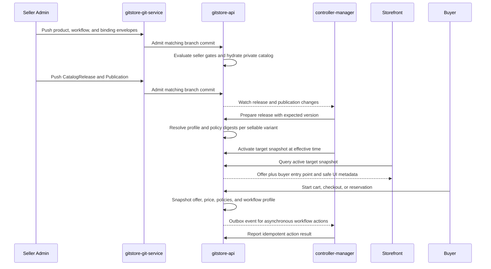

# Custom Seller and Buyer Workflows

**Status:** 🟡 Proposed<br>
**Scope:** configurable seller catalog/release workflows and buyer transaction workflows<br>
**Audience:** catalog and storefront designers; API, Git service, and
controller-manager maintainers

## Decision

Seller and buyer workflows are **separate definitions and separate executions,
joined by immutable contracts**. They are neither one mutable end-to-end state
machine nor two unrelated features.

- The **seller plane** governs authoring, review, compliance, and eligibility
  for a `CatalogRelease`. It operates on Git-backed desired state and records
  its review/runtime facts outside Git.
- The **buyer plane** governs a customer's interaction with an offer: browse,
  cart, checkout, order, fulfillment, delivery, return, and refund. It operates
  on private, datastore-only transactional data.
- At publication, GitStore resolves the applicable workflow profile and places
  its immutable identity in the target's catalog snapshot. At checkout, the API
  snapshots that identity and all commercial policies onto the cart line/order.
  A later category or workflow edit can therefore affect a new release, but
  cannot rewrite an in-flight order or return.

This is a shared commercial lifecycle, with an explicit hand-off rather than a
shared mutable state. It lets a restaurant use order-ahead and pickup while a
car maker uses configuration and reservation, without teaching the core order
ledger that every product is a restaurant meal or a car.

## Why not one end-to-end workflow?

An end-to-end definition appears simple, but combines data with incompatible
ownership, consistency, and retention rules. Product copy and workflow policy
need Git review and release snapshots; a payment authorization, delivery scan,
or customer address must never be placed in a Git manifest. It would also let a
seller edit change the rules for an order a buyer already placed.

Fully independent workflows are also insufficient: the buyer must know which
checkout entry point, return policy, eligibility checks, and fulfillment shape
the published offer promises. The release-to-order contract provides that
connection.

| Concern          | Seller workflow                              | Buyer workflow                                                 | Join contract                                  |
|------------------|----------------------------------------------|----------------------------------------------------------------|------------------------------------------------|
| Primary actor    | seller/admin, reviewer, automation           | shopper, service agent, fulfillment and payment integrations   | published offer and order line                 |
| Primary object   | Product, ProductVariant, release candidate   | Cart, Checkout, Order, Fulfillment, Return                     | resolved `WorkflowProfile` and policy digests  |
| Source of intent | Git-backed envelope                          | API command/event                                              | immutable public snapshot, then order snapshot |
| Mutability       | a new manifest generation and release        | append-only runtime transitions                                | never changes for an existing order            |
| Terminal outcome | eligible for a release, rejected, or retired | delivered, cancelled, returned, refunded, or otherwise settled | audit trail links both sides                   |

`Published`, `Retiring`, and `Retired` retain the target-specific meanings in
[Product and Variant Publication Lifecycle](../products/publication-lifecycle.md).
They are not seller-workflow states stored on every product, and a buyer's
`DELIVERED` state does not cause a product to become retired.

## The two workflow planes

### Seller: author to publication

A seller creates or changes `Product` and `ProductVariant` envelopes through a
Git push or the Admin UI's Git write path. Admission makes the new generation
part of the private current catalog, but does not make it public. A seller
workflow may add category-specific gates before that generation can be selected
for `CatalogRelease`.

The common contract is:

```text
AUTHORING -> REVIEW -> APPROVED -> RELEASE_ELIGIBLE
                                      |
                                      v
                      CatalogRelease -> Publication -> PUBLIC TARGET SNAPSHOT
```

`REVIEW` can have any named sub-states a definition needs, such as
`NUTRITION_CHECK`, `HOMOLOGATION`, `MARKET_REGISTRATION`, or `MEDIA_QA`. The
core relies on an approved certificate for the resource UID, the approval
gate's material-input digest, the workflow-definition digest, and the release
target. The definition declares the material field paths for each approval gate;
the API canonicalizes those values from the release candidate and hashes them.
An authored generation that changes a material input changes the digest and
invalidates the approval. A non-material generation may carry it forward only
when the digest is unchanged. The certificate retains the reviewed generation
as audit provenance, but generation alone is not its eligibility key.

The publication controller remains responsible for its existing release work:
pinning the source revision, ensuring the immutable release tag, preparing the
snapshot, and activating the `Publication` at its effective time. A custom
seller workflow may gate that work; it cannot bypass it or write a public
projection itself.

### Buyer: browse to settlement

The buyer plane begins only from an active target snapshot. A profile selects a
small, typed entry-point contract rather than replacing the commerce kernel:

| Entry point             | Appropriate examples                  | Required core hand-off                                                        |
|-------------------------|---------------------------------------|-------------------------------------------------------------------------------|
| `STANDARD_CHECKOUT`     | clothing, supplements, ordinary goods | cart, price/tax snapshot, inventory reservation, payment, order               |
| `ORDER_AHEAD`           | meals and pickup/delivery             | configured line, fulfillment slot, payment/order, kitchen hand-off            |
| `CONFIGURE_AND_RESERVE` | vehicle or high-value equipment       | configuration, identity/finance or dealer review, reservation/contract record |
| `REQUEST_QUOTE`         | B2B or regulated equipment            | qualified request, quote, acceptance, then an order                           |

Within that contract, a buyer workflow can express states such as
`AWAITING_AGE_VERIFICATION`, `AWAITING_PICKUP_SLOT`, `IN_PREPARATION`,
`AWAITING_CARRIER_SCAN`, or `RETURN_INSPECTION`. It cannot redefine the meaning
of a payment capture, inventory allocation, or immutable order event.

The base buyer lifecycle is therefore a useful visual model, not a forced
linear UI:

```text
BROWSE -> CART -> CHECKOUT -> ORDER -> FULFILLMENT -> DELIVERED
                                      |                  |
                                      +-> CANCELLED      +-> RETURN -> REFUND or EXCHANGE
```

For example, a `CONFIGURE_AND_RESERVE` profile does not expose a misleading
"add to basket" action; it starts a reservation request. A standard clothing
profile does expose a normal basket and may add an exchange path after return.

## Workflow resource model

The following are proposed extension/CRD resources. They use the normal
GitStore Markdown-envelope format and are admitted from the configured catalog
branch. `WorkflowPolicy`, already described in
[Git-backed resources](../resource-storage/git-backed.md), remains the generic
policy for approvals and checks on Git changes; it is not renamed or replaced.

| Resource                                                      | Storage                     | Purpose                                                                                                                                 |
|---------------------------------------------------------------|-----------------------------|-----------------------------------------------------------------------------------------------------------------------------------------|
| `WorkflowDefinition`                                          | Git-backed                  | A versioned, constrained state-machine definition for one scope: `SELLER_RELEASE`, `BUYER_ORDER`, or `BUYER_RETURN`.                    |
| `WorkflowProfile`                                             | Git-backed                  | Composes seller, buyer-order, and buyer-return definitions with policy references and allowed checkout entry point(s).                  |
| `CategoryCluster`                                             | Git-backed                  | A reusable workflow-selection group: category roots/subtrees plus optional product or variant labels.                                   |
| `WorkflowBinding`                                             | Git-backed                  | Binds a cluster or a product/variant selector to a profile for a namespace, market, and channel.                                        |
| `WorkflowBundle`                                              | Git-backed                  | A locked desired installation of an imported set of definitions, profiles, clusters, schemas, UI metadata, and optional action modules. |
| `WorkflowExecution`                                           | Datastore only              | Current state, input/output references, and immutable definition/profile snapshot for a seller review, order, or return.                |
| `WorkflowTransition`, `WorkflowTask`, `WorkflowActionAttempt` | Datastore only, append-only | Auditable facts for a transition, human task, and asynchronous action attempt.                                                          |

`CategoryTaxonomy` remains classification. It must not grow execution behavior
or a per-category blob of workflow code. `CategoryCluster` is deliberately
orthogonal: a cluster may cover a taxonomy subtree, a cross-category label, or
a cluster that varies by market/channel. It gives a brand a reusable way to say
"these are made-to-order food items" or "these are regulated devices" without
misclassifying the catalog.

### Seller and buyer definition examples

A definition declares states, typed events, gates, and permitted action *names*.
It does not contain credentials, executable shell commands, or arbitrary
database access. Gates have one unambiguous combination rule: `allOf` requires
every contained gate; `anyOf` and `noneOf` are explicit when needed. A gate is
one of the following:

- `requiredFields`, `expression`, and `coreCondition` are pure, synchronous API
  checks over the command input or an immutable snapshot.
- `approval` creates or verifies a durable approval for a named gate. It names
  a policy, material input paths, expiry, and separation-of-duties rule; it is
  not a raw permission string embedded in a transition.
- `externalAttestation` checks a persisted, authenticated result from an
  asynchronous integration action. It never executes a plugin during an API
  transition.

The seller definition owns catalog completeness and release-review gates. Thus a
missing product title or description is found before an offer is published, not
when a shopper attempts checkout.

```markdown
---
apiVersion: workflow.gitstore.dev/v1beta1
kind: WorkflowDefinition
metadata:
  name: food-menu-release
  namespace: acme-store
spec:
  version: 1.0.0
  scope: SELLER_RELEASE
  contract: RELEASE_ELIGIBILITY
  states: [DRAFT, CONTENT_REVIEW, COMPLIANCE_REVIEW, APPROVED, REJECTED]
  initialState: DRAFT
  transitions:
  - from: DRAFT
    event: SUBMIT_FOR_REVIEW
    to: CONTENT_REVIEW
    gates:
      allOf:
      - kind: requiredFields
        subject: releaseCandidate
        paths:
        - product.title
        - product.description
        - variant.sku
        - variant.pricing
        - variant.allergenDisclosure
  - from: CONTENT_REVIEW
    event: CONTENT_APPROVED
    to: COMPLIANCE_REVIEW
    gates:
      allOf:
      - kind: approval
        gateID: menu-content-review
        policyRef:
          name: food-content-review
        materialPaths:
        - product.title
        - product.description
        - variant.sku
        - variant.pricing
        minimumApprovals: 1
        prohibitSubmitter: true
        expiresAfter: P7D
  - from: COMPLIANCE_REVIEW
    event: COMPLIANCE_APPROVED
    to: APPROVED
    gates:
      allOf:
      - kind: approval
        gateID: food-safety-review
        policyRef:
          name: food-safety-review
        materialPaths:
        - variant.allergenDisclosure
        - variant.ingredients
        - variant.nutrition
        minimumApprovals: 1
        prohibitSubmitter: true
      - kind: coreCondition
        condition: targetEligibility
        equals: ELIGIBLE
---

Seller release gates for prepared-food offers.
```

The buyer definition then deals only in facts a buyer, kitchen, payment gateway,
or fulfillment integration can actually establish. The action is asynchronous:
the controller delivers it through an outbox and an authenticated kitchen result
is stored as an attestation before it can advance the order.

```markdown
---
apiVersion: workflow.gitstore.dev/v1beta1
kind: WorkflowDefinition
metadata:
  name: quick-service-order
  namespace: acme-store
spec:
  version: 1.0.0
  scope: BUYER_ORDER
  contract: ORDER_AHEAD
  states: [AWAITING_SLOT, AWAITING_KITCHEN_ACCEPTANCE, IN_PREPARATION, READY_FOR_PICKUP, HANDED_OVER, CANCELLED]
  initialState: AWAITING_SLOT
  transitions:
  - from: AWAITING_SLOT
    event: ORDER_SUBMITTED
    to: AWAITING_KITCHEN_ACCEPTANCE
    gates:
      allOf:
      - kind: requiredFields
        subject: checkout
        paths: [fulfillmentSlot, contactDetails]
      - kind: coreCondition
        condition: paymentAuthorization
        equals: ACTIVE
    actions:
    - capability: kitchen.order.submit
  - from: AWAITING_KITCHEN_ACCEPTANCE
    event: KITCHEN_ACCEPTED
    to: IN_PREPARATION
    gates:
      allOf:
      - kind: externalAttestation
        attestationType: kitchen.orderAccepted
        integrationRef:
          name: restaurant-kitchen
  - from: IN_PREPARATION
    event: KITCHEN_READY
    to: READY_FOR_PICKUP
    gates:
      allOf:
      - kind: externalAttestation
        attestationType: kitchen.orderReady
        integrationRef:
          name: restaurant-kitchen
  - from: READY_FOR_PICKUP
    event: HANDOVER_CONFIRMED
    to: HANDED_OVER
---

Order-ahead workflow for items made by a restaurant location.
```

```markdown
---
apiVersion: workflow.gitstore.dev/v1beta1
kind: WorkflowProfile
metadata:
  name: quick-service
  namespace: acme-store
spec:
  sellerWorkflowRef:
    name: food-menu-release
    version: 1.0.0
  buyerOrderWorkflowRef:
    name: quick-service-order
    version: 1.0.0
  buyerReturnWorkflowRef:
    name: quick-service-refund
    version: 1.0.0
  checkoutEntrypoints: [ORDER_AHEAD]
  policyRefs:
    fulfillmentPolicyRef: restaurant-pickup-and-delivery
    restrictedGoodsPolicyRef: food-allergen-disclosure
  compatibilityKey: quick-service-order
---

Shared contract for prepared-food offers.
```

At profile admission, each `{name, version}` reference resolves to a resource
UID, generation, and content digest. Definitions are immutable by that digest
once referenced by a release or execution. A new semantic version or generation
creates a new digest; it never changes how an existing order is interpreted.

### Binding and deterministic resolution

A binding identifies where a profile applies. It may select a `CategoryCluster`
or an explicit product/variant selector, then narrow to a channel or market.
The candidate release resolves each selected variant to one profile and records
the profile digest, entry point, compatibility key, and policy digests in its
immutable snapshot.

Resolution order is deliberately deterministic:

1. Match namespace and target, then product/variant selector or cluster.
2. Prefer an exact variant binding over a product binding, and a product binding
   over a cluster binding.
3. Use an explicit numeric priority only among equally specific matches.
4. Reject the admission/release when a tie remains. There is no accidental
   "last YAML file wins" behavior.

A `WorkflowBinding` must resolve at release preparation, not lazily during
checkout. This prevents a buyer's available flow from changing because someone
edited a category after browsing. The public catalog projection exposes only
the buyer-facing entry point and safe UI metadata, never management-only review
states or policy diagnostics.

## The release-to-order hand-off



At the transition from cart/checkout to an order (or to a reservation/quote
record for a non-standard entry point), the API persists:

- the public snapshot ID and the selected variant's profile and definition
  digests;
- price, tax, return, fulfillment, eligibility, and legal-policy snapshots;
- the buyer workflow state and a new `WorkflowExecution` ID; and
- the actor, input reference, idempotency key, and resulting append-only event.

The checkout kernel rejects a cart whose profiles cannot safely be combined.
Profiles that deliberately share a `compatibilityKey` may use the same order;
otherwise the UI must split the cart into compatible checkout groups or reject
the mixture. A restaurant pickup profile must not silently combine with a
vehicle reservation just because both were put in a browser basket.

## Extension boundary and non-negotiable invariants

Most customization should be declarative: states, typed events, CEL-like pure
gates, required human tasks, notification templates, and a registry of
capability-named actions. This is inspectable in Git, testable at admission,
and usable from an Admin UI without requiring authors to write code.

An imported bundle may later add a sandboxed WASI action module for specialized
integration logic. It runs under the controller-manager's asynchronous action
runner, not in the Git receive path or a storefront request. The module receives
a narrow, versioned input and capability token; by default it has no filesystem,
network, datastore, secret, or arbitrary GraphQL access. Each granted capability
is named, policy-checked, resource/time/memory bounded, and invoked through an
idempotent API command. The API verifies every resulting transition against the
definition before it becomes durable.

The following remain core API invariants and cannot be overridden by a bundle:

- only the API creates order, payment, inventory, fulfillment, return, refund,
  and audit records;
- price/tax/policy and workflow snapshots are taken before a buyer commitment;
- payment authorization, capture, and refund use approved gateway contracts;
- inventory reservation/allocation has its own concurrency and expiry rules;
- PII, payment data, secrets, and high-churn events are never Git-backed;
- every state transition is authorized, validated, idempotent, and auditable;
- an emergency legal, safety, or fraud suppression is an independent,
  narrowly-authorized runtime override, not a custom transition that can be
  removed by a Git edit.

This preserves the three-service boundary:

| Service                         | Workflow responsibility                                                                                                                                                                                                       | Must not do                                                                                                      |
|---------------------------------|-------------------------------------------------------------------------------------------------------------------------------------------------------------------------------------------------------------------------------|------------------------------------------------------------------------------------------------------------------|
| **gitstore-git-service**        | Store manifests, validate normal Git operations, emit Git events, and create protected release tags only for an authorized API command.                                                                                       | Run buyer workflows, retain transaction data, interpret category bindings, or execute extension code.            |
| **gitstore-api**                | Admit/version workflow configuration; resolve bindings for releases; expose safe storefront contracts; authorize and transactionally persist workflow commands, snapshots, events, tasks, outbox records, and fenced results. | Poll timers, directly mutate Git refs, or let an extension bypass payment/inventory/order invariants.            |
| **gitstore-controller-manager** | Watch/reconcile configurations and executions; wake scheduled work; acquire per-key leases; deliver asynchronous actions and report idempotent results.                                                                       | Directly write the datastore, serve storefront requests, trust unverified event payloads, or grant capabilities. |

As with publication, replicas are active/passive per side-effect key, not a
single global workflow leader. The API supplies a durable lease epoch and rejects
stale results. Outbox event IDs, transition idempotency keys, and the current
execution version make replay safe after a controller or integration failure.

## Importing custom categories and workflows

An import is a reviewable desired-state change, not a hidden Admin UI setting or
an arbitrary plugin upload. `WorkflowBundle` locks an external artifact by
immutable digest, publisher identity/signature, and bundle version. The artifact
can contain category taxonomy envelopes, clusters, profiles, definitions,
schemas, UI metadata, test fixtures, and optional WASI modules. Categories
themselves are normal `CategoryTaxonomy` resources, so imported and hand-authored
categories follow the same envelope/admission model.

The Admin UI is a convenience client for this process; a Git-native team can
commit the exact same manifests directly.

1. An administrator invokes `previewWorkflowBundle` with an OCI or Git source.
   The API resolves it to an immutable digest and returns the proposed resource
   diff, requested action capabilities, validation result, and conflicts. No
   installation is active at this point.
2. The administrator selects names/namespace and accepts the preview. The API
   writes a review branch or requested Git commit containing a `WorkflowBundle`
   lock envelope and the materialized category/profile/binding manifests. It
   never stores a mutable `latest` reference.
3. Normal Git admission validates schemas, signature/trusted-publisher policy,
   capability grants, selector ambiguity, cross-resource references, and a
   bundle's declared compatibility with the installed workflow contract.
4. The controller fetches the digest, verifies it again, performs only declared
   safe initialization, and reports `Ready` in system status. A binding cannot
   resolve into a release until its bundle is ready.
5. A normal `CatalogRelease` and `Publication` activate the imported profile for
   new offers. The UI can then render the profile's constrained, declarative
   forms and call the corresponding typed API commands.

An upgrade imports a new immutable bundle digest and produces a reviewable
diff. It never rewrites an installed digest. An uninstall prevents new release
resolution and new executions, but retains the old definition/profile snapshots
until every order, return, audit, and legal-retention obligation referring to
them has expired. A failed import is not partially active; its diagnostics belong
in datastore-only status/audit records.

Dynamic GraphQL schema generation is not required for the first version. The
core can expose generic extension resources plus a schema-driven Admin UI and
typed workflow-command API. That avoids making one tenant's imported fields part
of every client's public GraphQL schema.

## Category-cluster examples

| Cluster                     | Seller gates before release                                                                              | Buyer contract                                                                                                           | Important restriction                                                                                              |
|-----------------------------|----------------------------------------------------------------------------------------------------------|--------------------------------------------------------------------------------------------------------------------------|--------------------------------------------------------------------------------------------------------------------|
| Quick-service restaurant    | allergen/nutrition content, menu availability, outlet/hours, food safety review                          | `ORDER_AHEAD`: configure meal, choose pickup/delivery slot, pay, kitchen preparation, hand-over/refund                   | no generic parcel return flow; traceable food-safety withdrawal remains a core override                            |
| Vehicle maker               | configuration validity, homologation, market content, allocation/dealer approval                         | `CONFIGURE_AND_RESERVE`: configure, reserve, identity/finance or trade-in review, contract, production, delivery/service | a reservation or finance decision is not an ordinary SKU checkout                                                  |
| Fashion retailer            | media/size-chart/content review, stock/season rules, brand approval                                      | `STANDARD_CHECKOUT`: normal cart, split fulfillment, delivery, carrier-scanned return, refund or exchange                | original size/color and price snapshots remain attached to every line                                              |
| Medical device / supplement | market registration, labels and instructions, claims review, lot/traceability policy, qualified approval | standard checkout only where eligibility succeeds, or `REQUEST_QUOTE` for professional-only goods                        | age/professional/destination rules, recall, audit retention, and safety takedown cannot be relaxed by the workflow |
| Generic retail              | lightweight content/price review                                                                         | `STANDARD_CHECKOUT` and standard return policy                                                                           | use the platform default rather than importing a bundle merely to restate it                                       |

The same store may publish several clusters to the same target. Resolution is
per sellable variant, and compatibility handling is then applied at cart time.
This supports a fashion brand that also sells made-to-order refreshments without
forcing either catalog domain into the other's workflow.

## Authorization, observability, and rollout

OPA/RBAC actions should distinguish configuration management from execution:
`workflow.definition.manage`, `workflow.profile.manage`,
`workflow.binding.manage`, `workflow.bundle.install`,
`workflow.release.approve`, `workflow.execution.transition`, and narrowly scoped
`workflow.action.<capability>`. Storefront principals receive only the
buyer-command permissions and only for executions they own or may lawfully act
on. A profile's UI metadata is not authority to invoke its transition.

Admission should provide a dry-run trace that explains the winning binding for
each candidate variant. Runtime operations should record the profile/digest,
transition name, actor type, lease epoch where relevant, idempotency key, and
causal event ID. Metrics should include execution backlog/age, transition
failures, action retries, lease conflicts, bundle validation failures, and
profile-resolution ambiguity.

Delivery should be phased:

1. Implement profile/binding resolution, snapshotting, standard seller gates,
   and the standard buyer checkout/return contract without custom code.
2. Add declarative definitions, task queues, gates, event/outbox processing,
   Admin UI forms, and bundle preview/import.
3. Add constrained WASI actions only after its capability model, multi-replica
   replay tests, limits, and operational audit trail are proven.

This starts with the workflows that GitStore itself can safely explain and
operate, while retaining a controlled path to the category-specific models
envisioned in [ideas.md](../ideas.md).
