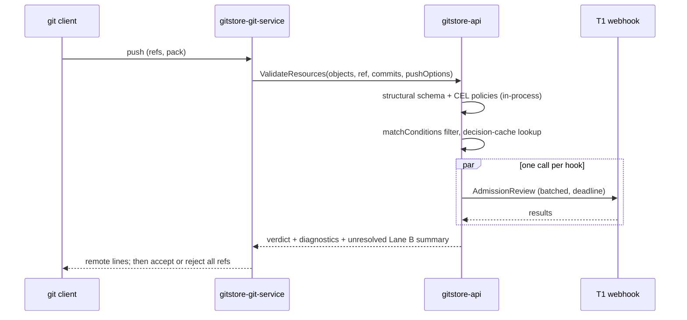

# Resource Lifecycle Hooks: Contracts
**Status**: 🟡 Proposed (contracts only; implementation requires separate feature specifications)

> Implements [ADR 0015](../ADRs/0015-resource-lifecycle-hooks.md). Referenced by
> [ADR 0014](../ADRs/0014-catalog-release-and-publication.md) (`ReleaseEligible` gates) and
> [ADR 0016](../ADRs/0016-custom-resource-definitions.md) (CRD validations and conversion
> Functions). It narrows [036](036-git-service-extension-architecture.md) and replaces the gate and
> action model of [037](037-custom-commerce-workflows.md). All API versions below are
> `v1alpha1` until the first feature spec graduates them.

## 1. Registration resources

| Kind                               | Group                    | Storage group                       | Author                      | Tier                                      |
|------------------------------------|--------------------------|-------------------------------------|-----------------------------|-------------------------------------------|
| `ValidatingAdmissionPolicy`        | `admission.gitstore.dev` | Git + datastore                     | namespace admin             | any                                       |
| `ValidatingAdmissionPolicyBinding` | `admission.gitstore.dev` | Git + datastore                     | namespace admin             | any                                       |
| `MutatingAdmissionPolicy`          | `admission.gitstore.dev` | Git + datastore                     | namespace admin             | any; applies to datastore-only kinds only |
| `AdmissionHookConfiguration`       | `admission.gitstore.dev` | Git + datastore, cluster-scoped     | operator                    | T0/T1                                     |
| `LifecycleGate`                    | `lifecycle.gitstore.dev` | Git + datastore                     | namespace admin             | any                                       |
| `EventSubscription`                | `events.gitstore.dev`    | Git + datastore                     | namespace admin             | any                                       |
| `FunctionBinding`                  | `functions.gitstore.dev` | Git + datastore                     | namespace admin             | any                                       |
| `HookSuspension`                   | `admission.gitstore.dev` | Datastore only                      | operator or namespace admin | n/a                                       |
| `AdmissionReport`                  | `admission.gitstore.dev` | Datastore only                      | API                         | n/a                                       |

Registrations are admitted only from the admission branch of a `gitstore-system` repository
([ADR 0002](../ADRs/0002-namespace-lifecycle.md)). Admission rejects a registration manifest
anywhere else.

- **Cluster scope.** Manifests in `gitstore-system/gitstore-system` omit `metadata.namespace` and
  apply to every namespace. `AdmissionHookConfiguration` is accepted only here.
- **Namespace scope.** Manifests in `<namespace>/gitstore-system` apply only in that namespace. A
  namespace-scoped binding may reference a cluster-scoped policy but cannot weaken it.
- **Ordering.** Cluster-scoped policies are evaluated before namespace-scoped ones. A deny from
  either rejects the push.

### 1.1 `ValidatingAdmissionPolicy` and binding

```yaml
apiVersion: admission.gitstore.dev/v1alpha1
kind: ValidatingAdmissionPolicy
metadata:
  name: price-floor
  namespace: acme-store
spec:
  failurePolicy: Fail                  # Fail | Ignore (Ignore only for Async mode)
  paramKind:                           # optional
    apiVersion: catalog.gitstore.dev/v1beta1
    kind: PriceFloorPolicy             # a CRD
  matchConstraints:
    resourceRules:
    - apiGroups: [catalog.gitstore.dev]
      kinds: [ProductVariant]
      operations: [CREATE, UPDATE]
  matchConditions:
  - name: priced
    expression: "has(object.spec.price)"
  variables:
  - name: amount
    expression: "object.spec.price.amount"
  validations:
  - expression: "variables.amount >= params.spec.minimum"
    messageExpression: "'price ' + string(variables.amount) + ' below floor ' + string(params.spec.minimum)"
    reason: Invalid
    fieldPath: spec.price.amount
---
apiVersion: admission.gitstore.dev/v1alpha1
kind: ValidatingAdmissionPolicyBinding
metadata:
  name: price-floor-eu
  namespace: acme-store
spec:
  policyName: price-floor
  paramRef:
    name: eu-floor
  validationActions: [Deny]            # Deny | Warn | Audit
  matchResources:
    refs: [refs/heads/main]            # optional; defaults to the admission branch
  mode: Sync                           # Sync (Lane A) | Async (Lane B)
```

CEL environment variables:

- `object`, `oldObject` (null on CREATE), `request` (operation, user, ref, commit), `params`,
  `variables`;
- `namespaceObject`, the admitted Namespace;
- `references`, a map of declared references, resolved **only** from the push's own objects plus
  the current read model.

No network, clock or random functions are available. Every expression has an estimated-cost
ceiling that is checked at policy admission, and a runtime cost ceiling per evaluation. Both
values are set in the feature spec from benchmarks. `Warn` produces a `remote: warning` line
(Lane A) or a `warning` annotation (Lane B). `Audit` only records a result.

### 1.2 `AdmissionHookConfiguration` (cluster-scoped, T0/T1)

The manifest is committed to `gitstore-system/gitstore-system`:

```yaml
apiVersion: admission.gitstore.dev/v1alpha1
kind: AdmissionHookConfiguration
metadata:
  name: tax-classifier               # cluster-scoped: no namespace
spec:
  type: Validating                   # Validating | Mutating (Mutating: datastore-only kinds only)
  endpoint:
    url: https://tax.internal.example/admit
    caBundleRef: { name: tax-ca }    # SecretRef (ADR 0001)
    hmacSecretRef: { name: tax-hmac }
  rules:
  - apiGroups: [catalog.gitstore.dev]
    kinds: [ProductVariant]
    operations: [CREATE, UPDATE]
  namespaceSelector:                 # optional; default all namespaces
    matchLabels: { gitstore.dev/tier: USER }
  matchConditions:
  - name: taxable
    expression: "object.spec.taxable == true"
  mode: Sync                         # Sync (Lane A) | Async (Lane B)
  timeoutMs: 1500                    # ≤ admission.limits.max_hook_timeout_ms
  failurePolicy: Fail                # Fail | Ignore
  onLargePush: Defer                 # Defer | Reject
  largePushObjects: 500
  circuit: { failureRatio: 0.5, window: 30s, openFor: 60s }
  version: "2026-09-01"              # part of the decision-cache key
```

Admission rejects the manifest in any of these cases:

- it appears outside `gitstore-system/gitstore-system`;
- the pusher lacks `admissionHook.create`;
- `type: Mutating` matches any Git-backed kind;
- the endpoint host isn't in the egress allowlist;
- any value exceeds a static limit.

`HookSuspension` overrides the manifest immediately, without a push. Per ADR 0015 §4, webhooks
are never invoked for pushes to `gitstore-system` repositories, so a broken hook can't block its
own fix.

Static operator limits (`config.toml`) bound every Git-declared hook:

```toml
[admission.limits]
remote_hooks_enabled = true
push_deadline_ms = 5000
max_hooks_per_push = 8
max_hooks_per_kind = 4
max_hook_timeout_ms = 2000
egress_allowlist = ["*.internal.example"]   # SSRF policy per 036 §9.3
```

### 1.3 `LifecycleGate`

```yaml
apiVersion: lifecycle.gitstore.dev/v1alpha1
kind: LifecycleGate
metadata:
  name: merch-approval
  namespace: acme-store
spec:
  subject:
    apiGroup: catalog.gitstore.dev
    kinds: [Product, ProductVariant]
    selector: { matchLabels: { gitstore.dev/brand: premium } }
  transition: ReleaseEligible          # ReleaseEligible | Ready | Delete | <Kind-declared transition>
  materialInputs:                      # fields hashed into the gate digest
  - spec
  - body
  gate:
    allOf:
    - requiredFields: [spec.title, spec.media]
    - approval:
        role: merchandiser
        count: 1
    - externalAttestation:
        issuer: compliance-scanner
        predicateType: https://gitstore.dev/attestations/compliance/v1
```

- The gate digest is the SHA-256 of the canonical JSON of `materialInputs`, together with the
  subject UID and generation.
- An approval is a datastore-only `ApprovalCertificate` holding `(gate, subject UID, digest,
  principal, time, signature)`, created through `lifecycleGate.approve`. An attestation is a
  signed statement verified against the issuer's registered key.
- The controller patches the condition `Gate/<name>`. For `Delete` transitions it adds the
  finalizer `lifecycle.gitstore.dev/<name>`.

### 1.4 `EventSubscription`

```yaml
apiVersion: events.gitstore.dev/v1alpha1
kind: EventSubscription
metadata:
  name: erp-sync
  namespace: acme-store
spec:
  sources:
  - apiGroup: catalog.gitstore.dev
    kinds: [Product, ProductVariant]
    types: [created, updated, deleted, conditionChanged]
  filter: "event.data.conditions.exists(c, c.type == 'Ready' && c.status == 'True')"
  sink:
    http:
      url: https://erp.example.com/hooks/gitstore
      signingSecretRef: { name: erp-webhook-key }
  delivery:
    maxAttempts: 12
    backoff: { initial: 5s, max: 1h }
    deadLetter: true
```

### 1.5 `FunctionBinding`

```yaml
apiVersion: functions.gitstore.dev/v1alpha1
kind: FunctionBinding
metadata:
  name: tiered-pricing
  namespace: acme-store
spec:
  target: gitstore:pricing/line-price@1
  module:
    ref: oci://registry.example.com/acme/tiered-pricing
    digest: sha256:4f1c…                # required; tags are rejected
  inputQuery: |
    query Input($line: ID!) {
      line(id: $line) { quantity variant { sku price { amount currencyCode } labels } }
    }
  config: { tiers: [ { min: 10, discountPct: 5 } ] }
  failurePolicy: UseDefault            # UseDefault | Fail
```

## 2. Admission request and response envelope

Lane A and Lane B webhooks receive the same batched envelope:

```json
{
  "apiVersion": "admission.gitstore.dev/v1alpha1",
  "kind": "AdmissionReview",
  "request": {
    "uid": "0c5c…",
    "hook": { "name": "tax-classifier", "version": "2026-09-01" },
    "lane": "A",
    "repository": { "namespace": "acme-store", "name": "catalog" },
    "ref": "refs/heads/main",
    "oldCommit": "9f2e…",
    "newCommit": "abc1…",
    "pusher": { "subject": "user:ada", "tier": "human" },
    "pushOptions": ["ci.skip-notify"],
    "objects": [
      {
        "operation": "UPDATE",
        "path": "products/coat.md",
        "blobOID": "e69d…",
        "object": { "apiVersion": "catalog.gitstore.dev/v1beta1", "kind": "ProductVariant", "...": "..." },
        "oldObject": { "...": "..." }
      }
    ]
  }
}
```

```json
{
  "response": {
    "uid": "0c5c…",
    "results": [
      {
        "blobOID": "e69d…",
        "allowed": false,
        "reason": "Invalid",
        "annotations": [
          { "path": "products/coat.md", "fieldPath": "spec.taxCode",
            "level": "failure", "title": "tax-code-missing", "message": "taxable variants need spec.taxCode" }
        ]
      }
    ]
  }
}
```

Envelope rules:

- The response must contain one result per object, keyed by `blobOID`. A missing result is
  treated as a hook failure under `failurePolicy`.
- Mutating responses (`patch`, as JSON Patch) are accepted only for datastore-only subjects.
- `fieldPath` is mapped to a line and column through YAML node positions. `path` alone produces a
  line-1 annotation.
- Secrets, raw push credentials and non-matched objects are never sent (036 §8.2).
- Request bodies are capped (default 4 MiB). Above the cap, `onLargePush` applies.

## 3. Lane A execution



- `admission.limits.push_deadline_ms` is the push-wide budget (default 5000). Hook timeouts are
  individually ≤ the remaining budget. After the deadline every pending hook is treated as timed
  out.
- **Decision cache.** The key is `(blobOID, hook name, hook version, policy digest, params
  digest)`. The value is the per-object result. Entries are stored in the datastore with a TTL
  (default 7 days) so that every API replica shares them. Only `allowed` and deterministic `deny`
  results are cached, never failures.
- **Circuit breaker.** The breaker is per hook per replica. An open circuit applies
  `failurePolicy` without a call.
- Diagnostics are capped at 50 `remote:` lines per push, followed by an `… and N more
  (gitctl admission show <commit>)` line.

## 4. `AdmissionReport`

```yaml
apiVersion: admission.gitstore.dev/v1alpha1
kind: AdmissionReport
metadata:
  name: catalog.abc1f00.main.tax-classifier   # deterministic from the key
  namespace: acme-store
spec:
  repositoryRef: { name: catalog }
  commit: abc1f00…
  ref: refs/heads/main
  hook: { kind: AdmissionHookConfiguration, name: tax-classifier, version: 2026-09-01 }
  lane: B
status:
  status: completed                   # queued | in_progress | completed
  conclusion: failure                 # success | failure | neutral | skipped | timed_out
  startedAt: "2026-09-30T10:00:00Z"
  completedAt: "2026-09-30T10:00:04Z"
  summary: 1 failure, 0 warnings
  annotations:
  - path: products/coat.md
    startLine: 7
    endLine: 7
    startColumn: 3
    level: failure                    # notice | warning | failure
    title: tax-code-missing
    message: taxable variants need spec.taxCode
    fieldPath: spec.taxCode
```

- **Identity.** The report is unique on `(repository, commit, ref, hook)`. Re-running a report
  replaces its annotations and increments `status.attempt`.
- **Bounds.** At most 1,000 annotations per report and 64 KiB per message; the rest are counted
  in `status.truncated`. Retention is 90 days, or until the ref no longer contains the commit and
  30 days have passed.
- **SARIF export.** `GET /admission/reports/{uid}.sarif` produces one `run` per report:
  - `tool.driver.name` is the hook name, and `tool.driver.version` is the hook version;
  - each `result.ruleId` is the annotation title;
  - `level` maps `failure → error`, `warning → warning` and `notice → note`;
  - `physicalLocation.artifactLocation.uri` is the path, and `region` holds the lines and
    columns;
  - `versionControlProvenance[0]` has `revisionId` = commit and `branch` = ref.
- **GraphQL.** `repository.admissionReports(commit:, ref:)` and `watchResources(kind:
  "AdmissionReport")`. `gitctl admission show <commit> [--ref]` renders the reports.
- **Notes projection.** A controller writes `refs/notes/gitstore/admission` through a Git service
  command, one note per commit:

  ```text
  gitstore-admission/v1
  refs/heads/main tax-classifier failure 1 https://…/reports/<uid>
  ```

  The projection is rebuilt from reports and never read back. Pushes to `refs/notes/*` are
  rejected by the Git service. Admission also ignores those refs.

## 5. Datastore-only admission

For datastore-only subjects, the four-phase `Chain` runs inside the write:

1. mutating policies;
2. mutating webhooks (T0/T1);
3. validating policies;
4. validating webhooks (T0/T1).

After that, the row and its journal entry are written in one transaction. Mutating webhooks are
re-invoked at most once if a later mutation changed a field they matched. The GraphQL mutation
deadline bounds the whole chain (default 2 s, matching commercetools' default).

## 6. Event delivery

- Each subscription has a cursor per subscription key (`subscription/<uid>`), advanced only after
  a 2xx response. Cursor advances carry the `subscription/<uid>` lease's fencing token, and the API
  rejects a stale one ([ADR 0018](../ADRs/0018-controller-ownership-concurrency-and-fencing.md)
  §3–§4).
- Headers:
  - `webhook-id` is the CloudEvent `id`, the journal sequence;
  - `webhook-timestamp`;
  - `webhook-signature: v1,<base64>` over `id.timestamp.body`;
  - `content-type: application/cloudevents+json`.
- Retries use `delivery.backoff` with full jitter. After `maxAttempts` the event goes to an
  `EventDeadLetter` record (datastore-only). The cursor moves past it. Replay is done with
  `gitctl events replay --subscription <name> --from <seq>`.
- A journal gap (retention exceeded) sets `EventSubscription` `Degraded=True` with reason
  `JournalGap`, and emits a `dev.gitstore.events.gap.v1` event so consumers know to resync.

## 7. Function host

| Bound (per invocation) | Initial default  | Notes                                  |
|------------------------|------------------|----------------------------------------|
| Module size            | 1 MiB            | Checked at `FunctionBinding` admission |
| Fuel                   | target-specific  | Wasmtime fuel, benchmarked per target  |
| Linear memory          | 16 MiB           |                                        |
| Input / output         | 128 KiB / 32 KiB | Input comes from `inputQuery`          |
| Wall clock             | 50 ms            | A backstop to fuel                     |

- Modules are compiled once per digest per replica and instantiated per call. No state carries
  over between calls.
- WASI is not provided, apart from a deterministic `log` import that is bounded to 4 KiB.
- `failurePolicy: UseDefault` returns the target's declared default. `Fail` fails the enclosing
  operation with a typed `FUNCTION_FAILED` error.

## 8. Authorization actions

Actions are added to [ADR 0010](../ADRs/0010-authorization-model.md):

- `admissionHook.{get,list,create}`, cluster scope only
- `admissionPolicy.{get,list,watch}`
- `admissionReport.{get,list,watch}`
- `lifecycleGate.{get,list,approve}`
- `eventSubscription.{get,list,replay}`
- `functionBinding.{get,list}`
- `hook.suspend`

Creating a registration requires push permission on the `gitstore-system` repository it is
admitted from. Remote webhooks additionally require `admissionHook.create`.

## 9. Rollout

1. **R1: CEL validating policies (Lane A only).** Wire policies into the existing Git-backed
   `Chain` phase 3, and remove mutating registration for Git-backed kinds. Add YAML node-position
   diagnostics.
2. **R2: `AdmissionReport` and Lane B.** Add `mode: Async`, the report store, GraphQL and
   `gitctl`, and the next-push echo.
3. **R3: T0/T1 webhooks**, with batching, the decision cache, deadlines, circuit breakers and
   `onLargePush`.
4. **R4: Event subscriptions** from the watch journal, with a CloudEvents sink.
5. **R5: Lifecycle gates**, starting with `ReleaseEligible` (ADR 0014) and `File Ready`.
6. **R6: Function host**, starting with `gitstore:apiextensions/convert@1` (ADR 0016) and
   `gitstore:pricing/line-price@1`.
7. **R7: Notes projection** (optional).

Each phase is gated per namespace by a feature flag. Every phase deploys readers before writers,
so a rolling upgrade that mixes replicas with and without a phase never rejects a push that the
older replicas would accept. New policies default to `validationActions: [Warn]` for one release.

## 10. Test strategy

- **Multi-replica.** Two API replicas share the decision cache and reports, and a report keyed on
  `(repository, commit, ref, hook)` is written once under concurrent Lane B runs. Two controllers
  deliver a subscription with no gaps and only detectable duplicates across a lease handover.
- **Rolling upgrade.** A mixed-version API fleet gives stable verdicts for the same push. Old
  replicas ignore unknown registration kinds without failing admission.
- **AuthN/AuthZ.** A namespace admin can't bind a policy outside their namespace. T2/T3 can't
  obtain a synchronous slot. `hook.suspend` is enforced. Webhook secrets never appear in logs,
  reports or envelopes.
- **Registration location.**
  - An `AdmissionHookConfiguration` pushed to any repository other than
    `gitstore-system/gitstore-system` is rejected, and so is a registration pushed outside a
    `gitstore-system` repository.
  - A manifest that exceeds `[admission.limits]` is rejected.
  - With a `failurePolicy: Fail` webhook down, a push to `gitstore-system` that removes the
    webhook still succeeds, and so does a `HookSuspension`.
- **Bounded work.** Push-deadline enforcement with slow hooks; the large-push `Defer`/`Reject`
  paths; the annotation, diagnostic and payload caps; CEL cost rejection at policy admission; and
  WASM fuel, memory and wall-clock exhaustion.
- **Sustained load.** Repository lifecycle capacity profiles (`make capacity TARGET=repository
  PROFILE=lifecycle`) with 10 policies and 2 webhooks bound. The p95 push-admission overhead is
  recorded, and the decision-cache hit ratio is measured on re-pushes.
- **Determinism.** The same Function input gives the same output across replicas and
  architectures. CEL policies give identical verdicts in Lane A and Lane B.
