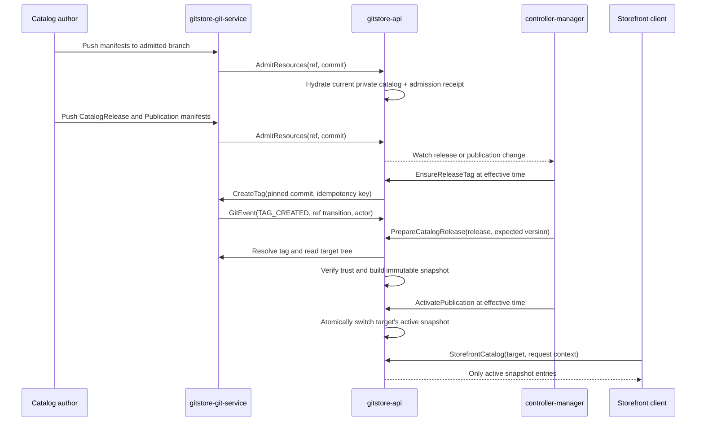

# Product and Variant Publication Lifecycle

**Status:** 🟡 Proposed  
**Scope:** Product and ProductVariant publication; follow-up design for [#314](https://github.com/gitstore-dev/GitStore/issues/314)  
**Audience:** catalog authors; Git service, API, and controller-manager maintainers

## Decision

Git admission and public publication are separate state machines.

- A push to an admitted branch makes a Git-authored `Product` or
  `ProductVariant` part of the private, current catalog read model. It is not
  public merely because admission succeeded.
- A protected, immutable Git tag identifies the exact commit to release. A
  `CatalogRelease` manifest names that tag and a friendly source ref. The API
  pins the source ref to an admitted commit in system status; at publication
  time the controller ensures the tag exists at that pinned commit.
- A `Publication` manifest attaches that immutable release snapshot to one
  public target and an activation window. The controller activates and expires
  it; the API alone commits the public-serving projection.
- A storefront query reads only an active immutable snapshot plus explicitly
  live runtime values (such as inventory and request-time price eligibility).
  It never falls back to the mutable current catalog rows.

This design keeps the normal admission pattern narrow (for example,
`^refs/heads/main$`). Tags are release evidence, not competing catalog branches,
and are never sent through normal catalog admission.

## Why a source-resource `Published` flag is not sufficient

`Product` and `ProductVariant` are Git-backed desired state. Their authoritative
current rows are deliberately replaced as the admitted branch advances. A boolean
on those rows cannot answer all of these questions at once:

- Which channel or market is published?
- Which revision is published after `main` has moved on?
- Is the resource active at this request time?
- Which other resources and dependencies were released with it?

The generic `Published` condition type already exists in the broad catalog status
vocabulary, but it has no owner that can make those target-, revision-, and
time-specific guarantees. It must not become the source of truth for storefront
visibility. Existing uses remain compatible, but new publication work does not
write or gate on that condition. `AdmissionAccepted`, `Ready`, and the reference
conditions remain source-health signals only.

Publication is instead a relation between an immutable release snapshot and a
target. A source product can therefore be public in `web/eu`, scheduled for
`web/us`, and absent from `wholesale` without conflicting status writes.

## Terms and derived states

These are derived states for a resource *at a publication target*, not an enum
stored on every Product or ProductVariant.

| Derived state | Meaning                                                                                                                                                                  |
|---------------|--------------------------------------------------------------------------------------------------------------------------------------------------------------------------|
| `Draft`       | Successfully admitted into the private current catalog, but included in no prepared release for the target.                                                              |
| `Candidate`   | Included in a validated, immutable `CatalogRelease` snapshot, but that snapshot has no active publication for the target.                                                |
| `Scheduled`   | Candidate in a publication whose `effectiveFromTime` is still in the future.                                                                                             |
| `Published`   | Included in the target's active publication and valid for the request time.                                                                                              |
| `Retiring`    | The source manifest declares `spec.lifecycle.state: RETIRED`, but an older active snapshot still contains the resource. It is ineligible for every new snapshot.         |
| `Retired`     | The source is retired and this target's active snapshot no longer contains it. The durable source record remains available to authorized management users.               |
| `Withdrawn`   | Not included in the target's active publication for any reason. Removing a source manifest does not withdraw an already-active snapshot; a replacement publication does. |
| `Expired`     | The publication window ended. It is a state of the publication, not a mutation to every resource it contained.                                                           |

For a ProductVariant, `Published` also requires its parent Product to be in the
same snapshot and the variant to be eligible for the request-time pricing and
inventory checks. A Product may be published as presentation content with zero
published variants, but it cannot yield a purchasable cart line until at least one
variant qualifies.

### Retirement is not deletion or an emergency kill switch

`Product` and `ProductVariant` gain an authored desired-state field:

```yaml
spec:
  lifecycle:
    state: ACTIVE # or RETIRED
```

`RETIRED` is durable Git intent: it preserves source history, SKU and order
references, and management visibility while making the resource ineligible for
all newly prepared releases. Retiring a Product makes every child variant
ineligible for a new snapshot. Retiring a variant removes only that sellable SKU;
its Product may remain published with its other variants.

Retirement intentionally does not rewrite an immutable active snapshot. The
normal withdrawal path is a replacement Publication, normally effective
immediately, that omits the retired resource. A safety, legal, or fraud takedown
that must override an existing snapshot is a separate, audited, datastore-only
emergency-suppression capability; it must be narrowly authorized, fail closed,
and expire or be replaced by a normal Publication. Do not overload `RETIRED`
with that emergency operation.

## Storage and envelope model

The design follows the repository's resource-storage envelope: human-reviewable
intent is a Markdown manifest with YAML frontmatter; controller state, audit
facts, and query projections stay out of Git.

| Record                                 | Storage class               | Authoritative content                                           | Writer                                   |
|----------------------------------------|-----------------------------|-----------------------------------------------------------------|------------------------------------------|
| `Product`, `ProductVariant`            | Git + datastore             | Git manifest; datastore hydration and health status             | catalog author / existing admission path |
| `CatalogRelease`                       | Git + datastore             | Git manifest; datastore status                                  | release author / API admission           |
| `Publication`                          | Git + datastore             | Git manifest; datastore status                                  | release author / API admission           |
| Admission receipt                      | Datastore only, durable     | A successful admitted ref/commit fact                           | API admission path                       |
| Observed Git event/tag                 | Datastore only, append-only | Git event ID, ref transition, tag object, peeled commit, pusher | API, from Git event stream               |
| Release snapshot and public indexes    | Datastore only, immutable   | selected manifest revision, dependency closure, snapshot digest | API, on controller request               |
| Reconcile lease and side-effect record | Datastore only              | holder, epoch, expiry, idempotency key, operation result        | API, on controller request               |

`CatalogRelease` and `Publication` are themselves normal Git-backed manifests,
admitted only from the configured admission branch. Their `status` fields, the
tag observation, and snapshots are system-managed and must not be authored in
frontmatter.

### `CatalogRelease` manifest

A release pre-registers the tag that must identify its snapshot. The author
selects a source ref, not a commit SHA. During admission the API resolves that
ref once, verifies it has an admission receipt, and records the exact peeled
commit in system-managed resolved status. The ref is therefore convenient user
input; the recorded commit is the immutable release target.

```markdown
---
apiVersion: catalog.gitstore.dev/v1beta1
kind: CatalogRelease
metadata:
  name: black-friday-2026
  namespace: acme-store
spec:
  repositoryRef:
    name: storefront-catalog
  tagRef: refs/tags/v2026.11.27
  sourceRef: refs/heads/main
  selection:
    productRefs:
    - name: winter-coat
    variantRefs:
    - name: winter-coat-blue-m
---
Black Friday catalog snapshot
```

The API writes `status.resolved.pinnedCommitSHA` and its admission receipt ID for
the accepted `CatalogRelease` generation. A source-ref edit creates a new release
generation and requires a distinct tag ref; an existing release tag is never
retargeted. The controller never resolves `main` or another moving ref at
wake-up.

The GraphQL/Admin UI creation flow accepts a repository, tag name, source-branch
picker (defaulting to the repository default branch), and resource selection. It
commits the same envelope through the normal Git write path, then displays the
system-resolved commit, author, timestamp, and change summary once admission has
pinned it. A non-technical catalog author never has to find or enter a SHA.

The first version requires an explicit non-empty resource selection. A future,
separately reviewed selector feature may add `matchLabels`, but it must be
evaluated against the tag's tree and must require an explicit opt-in label such
as `catalog.gitstore.dev/releaseable: "true"`. An omitted selector meaning
"everything" is intentionally not supported: a release should not expose a new
resource because another team merely added a manifest to `main`.

Selection is closed over required catalog dependencies:

- Selecting a variant includes its parent Product presentation snapshot but does
  not implicitly sell sibling variants.
- Selecting a Product does not implicitly select its variants. Authors choose
  the sellable variants explicitly.
- The snapshot records required category, collection, translation, and File
  manifest dependencies used by selected content. A missing or unready required
  dependency makes release preparation fail closed.

Resolved release status includes the pinned commit SHA, admission receipt ID,
observed tag object ID when present, selected resource identities, snapshot
digest, and conditions such as `SourcePinned`, `TagObserved`, `TargetTrusted`,
`SnapshotReady`, and `Ready`.

### `Publication` manifest

One publication binds a prepared release to one public target and time window.

```markdown
---
apiVersion: catalog.gitstore.dev/v1beta1
kind: Publication
metadata:
  name: web-eu-black-friday-2026
  namespace: acme-store
spec:
  releaseRef:
    name: black-friday-2026
  target:
    channel: web
    market: eu
  effectiveFromTime: "2026-11-27T00:00:00Z"
  effectiveUntilTime: "2026-11-30T23:59:59Z"
---
```

The target key is `(namespace, channel, market)`. The first implementation
allows at most one active publication per target. A candidate is rejected when
its activation window overlaps another publication for the same target, unless
it explicitly supersedes that publication. This prevents unspecified merge
ordering and means a campaign release is a complete replacement snapshot for
its target.

### Atomic replacement and rollback

An authorized replacement uses an explicit predecessor reference rather than
shortening the predecessor in a separate edit:

```markdown
spec:
  releaseRef:
    name: corrected-black-friday-2026
  target:
    channel: web
    market: eu
  effectiveFromTime: "2026-11-27T12:00:00Z"
  supersedesRef:
    name: web-eu-black-friday-2026
```

`supersedesRef` is allowed only when the named predecessor has the identical
target key and is the target's current active or scheduled publication at
admission. Its overlap is a replacement interval, never an overlay: the API
records the predecessor's immutable identity and rejects a stale, already
superseded, or differently targeted predecessor. The controller may prepare the
replacement beforehand, but at `effectiveFromTime` it asks the API to perform a
fenced compare-and-swap on the target's public-snapshot pointer. The API changes
that one pointer, marks the predecessor `Superseded`, and records both snapshot
IDs in one durable operation. It does not deactivate the old snapshot before a
replacement is ready; on a failed replacement the old snapshot remains served.

This permits an immediate retirement, correction, or rollback without a
storefront gap. It does not permit a general pair of simultaneously active
publications. A rollback is simply a new, validated publication whose prepared
release contains the earlier desired catalog state and whose `supersedesRef`
names the active publication. Future overlay semantics, if needed, must declare
a deterministic precedence and atomic composition contract rather than reusing
this field implicitly.

`Publication.status` records `ReleaseReady`, `Scheduled`, `Active`, `Expired`,
`Superseded`, or `Failed`, the immutable snapshot ID, the activation
version/fencing token, predecessor/replacement identity where applicable, and
diagnostics. These are controller/API-owned status fields.

## Service responsibilities

| Service                         | Owns                                                                                                                                                                                                                                                                                                                                                      | Must not own                                                                                                                                   |
|---------------------------------|-----------------------------------------------------------------------------------------------------------------------------------------------------------------------------------------------------------------------------------------------------------------------------------------------------------------------------------------------------------|------------------------------------------------------------------------------------------------------------------------------------------------|
| **gitstore-git-service**        | Git receive protocol; pre-receive validation; normal post-receive admission notification for matching branches; emitting minimal ref/tag `GitEvent`s; resolving a tag to its peeled commit; read-only Git object/tree/reachability and signature checks; creating a new immutable tag only for an authorized API command.                                 | Catalog persistence, selector evaluation, scheduling, status updates, public-query decisions, or moving/deleting a release tag.                |
| **gitstore-api**                | AuthN/AuthZ; parsing/admitting all manifests; pinning a friendly source ref to an admitted commit; current catalog rows; durable admission receipts and Git-event facts; release validation; immutable snapshot/public-index persistence; leased and fenced ensure-tag/activation/deactivation commands; GraphQL management, status, and watch contracts. | Receiving Git protocol traffic; polling/sleeping for schedules; choosing an implicit tag target; treating a tag as an admitted catalog branch. |
| **gitstore-controller-manager** | Level-triggered reconciliation of `CatalogRelease` and `Publication`; retry/backoff; schedule wake-up; acquiring per-key active leases; asking the API to ensure the pinned release tag exists at publication time, prepare snapshots, and activate/deactivate a target.                                                                                  | Direct Scylla writes, GraphQL storefront serving, trusting tag data without API validation, or direct Git ref mutation.                        |

### Per-key active/passive controller ownership

Controller replicas are active/passive **per side-effect key**, not one global
active controller. All replicas may list/watch and enqueue work; before tag
creation or publication activation, one acquires the durable lease for
`release/<release-uid>` or `publication/<target-key>`. Its state is `ACTIVE`; all
other replicas are `PASSIVE` and continue observing the key. Different keys can
be active on different replicas, so this retains horizontal scale.

The API grants a monotonically increasing lease epoch with a bounded expiry.
The active replica renews well before expiry and includes the epoch in every
side-effecting command. API storage rejects a stale epoch even when a paused old
replica resumes after a new replica has become active. A graceful holder releases
the lease; an unhealthy holder is replaced only after expiry. Every command also
has a durable idempotency key, so an uncertain network result is resolved by
reading the recorded operation or Git ref, never by issuing a second mutation.

This follows the same fenced-lease pattern already used for the Namespace watch
materializer, but isolates release delays and failures to one release or target.
All correctness-relevant state (tag observation, snapshot content, operation
result, next activation, and fencing) is durable in the API datastore.

## End-to-end flow



The normal branch push is allowed to complete before asynchronous admission,
just as it does today. A tag may be created manually before the effective time,
or automatically by the controller when that time arrives. In either case it has
no public effect until API-mediated validation reaches `Ready`.

### Git-event ingress (#139)

Issue [#139](https://github.com/gitstore-dev/GitStore/issues/139) is the right
control-plane transport for ref changes. Its `GitEvent` stream must remain a
minimal fact channel, not a release-business-logic transport. For publication it
must provide a repository-scoped monotonic event ID or sequence, ref name,
old/new object IDs, event type, actor, and an at-least-once reconnect/replay
contract. The API persists/deduplicates the event, then rereads the tag/ref from
the Git service before trusting it; an event alone never authorizes a release.

A lost stream must not lose a release. The Git service must retain events until
the API acknowledges the sequence, or the API must reconcile all registered
release tags after a reconnect. Out-of-order, duplicate, moved, and deleted tag
events are expected inputs and are resolved against the current ref plus the
first immutable successful observation.

## Trust and validation rules

Before the API creates a release snapshot, all of the following must hold:

1. The API has pinned `spec.sourceRef` for the current `CatalogRelease`
   generation to one exact commit and a successful durable admission receipt.
   An unpinned release cannot be prepared or published.
2. If `spec.tagRef` already exists, the API has durably received its `GitEvent`
   and verified that its peeled commit equals the pinned commit. A missing tag
   before the effective time leaves the release prepared but not active.
3. The tag is immutable after first successful observation. A delete or move is
   recorded as a failed/rejected observation and never changes an existing
   snapshot or public target.
4. At or after `Publication.effectiveFromTime`, the lease holder asks the API to
   ensure a missing tag exists at the pinned commit. The API verifies the lease
   epoch and receipt, records an idempotency key scoped to the release UID, and
   treats an existing same-target tag as success. A different target is terminal
   and is never overwritten.
5. If signature policy is enabled, an automatic tag is created with the
   repository's configured release-signing identity. An external tag must be an
   annotated signed tag verified by the Git service against the repository's
   trusted signer policy. Lightweight or unsigned tags are rejected when that
   policy requires a signature.
6. The API reads the manifest tree at the pinned commit, evaluates the release
   selection and dependency closure there, and validates it with the same
   envelope/schema rules used for admission. It must not hydrate the snapshot
   from today's mutable Product or ProductVariant rows.
7. The selected resources are release-ready in the snapshot. The API returns
   bounded diagnostics by resource identity; it never publishes a partial
   snapshot.
8. The `Publication` references a `Ready` snapshot and does not overlap a live
   publication for the same target.

The Git service authenticates its internal notification to the API with the
existing service-to-service mechanism. The API additionally authorizes author
actions such as `catalogrelease.create`, `publication.create`, and
`publication.read`. A controller service account receives only the
prepare/ensure-tag/activate/deactivate operations for its assigned namespaces;
the API checks its lease epoch as well as its action. Storefront authorization is
defined by the OPA semantic-scope contract below.

## Snapshot boundary and request-time data

The snapshot is immutable catalog content: envelope identity, source revision,
frontmatter, Markdown body, release dependency closure, and a digest of the
fully resolved publication document. It is the only source for public title,
copy, labels, variant membership, catalog media references, and price templates.

The following remain request-time evaluations and are not frozen into a release:

- `PriceTemplate.validFromTime`, `validUntilTime`, priority, quantity, and CEL
  eligibility evaluation;
- runtime inventory availability, reservations, and allocation state;
- caller authorization, market eligibility, locale, and currency selection.

This is what makes a Black Friday price safe: the price rule is present in the
immutable release snapshot, while its date window and customer eligibility are
evaluated for the individual request. Price selection remains deterministic:
consider eligible entries whose time window contains the request time, then use
the lowest priority; a remaining tie is a release-validation error rather than
an arbitrary result.

## Public and management read contracts

This design follows the `catalog.visibility` semantic scope in
[OPA data-aware authorization](../implementation/022-opa-data-authorization.md).
OPA decides whether a caller receives `PUBLIC` or `MANAGEMENT`; publication
decides which records are in the `PUBLIC` projection. OPA does not recreate tag,
schedule, lifecycle, or snapshot rules.

Management reads use the admitted, current Git-backed rows. `PUBLIC` reads use
the target's active snapshot projection. This scope-specific plan is required on
every existing Product/ProductVariant access path: direct lookup, Relay list,
global node, Product variants, Category/Collection relationships, counts, and
watches. It is not sufficient to protect a new root alone. A storefront facade
may still be offered, for example:

```graphql
storefrontCatalog(target: StorefrontTargetInput!): StorefrontCatalog!
```

The API resolves a validated target's active snapshot, applies the request-time
checks above, and returns `NOT_FOUND` or `null` for public direct lookups of
absent, not-ready, not-yet-active, expired, withdrawn, or unauthorized entries.
That result is indistinguishable from an absent resource. Public product
connections, collection membership, cursors, and counts all derive from the
same target-specific snapshot and `PUBLIC` scope. They must not query a
management table and filter after pagination, which would leak drafts or
produce short pages/count mismatches.

Storefront changes publish their own watch events after the atomic target switch.
They are not inferred from a mutable Product watch, so a source edit after a
tag cannot cause a client to observe content that was never released.

## Reconciliation and failure behavior

The release reconciler watches release and publication resources through the
API, persists checkpoints, and requeues on an earliest activation/expiration
deadline. On startup or replacement it lists incomplete releases and all
scheduled publications, so no in-memory timer is a correctness dependency.

| Event                                                     | Required result                                                                                                                                                            |
|-----------------------------------------------------------|----------------------------------------------------------------------------------------------------------------------------------------------------------------------------|
| Tag arrives before its release manifest is admitted       | Record the observation; reconcile once the release appears.                                                                                                                |
| Release/tag/commit validation fails                       | `CatalogRelease` becomes `Ready=False`; no snapshot or public index is exposed. Correct the release with a new tag/ref, never move the rejected tag.                       |
| Snapshot build crashes or times out                       | Leave the release non-ready; retry idempotently. A completed snapshot digest is reused, never partially replaced.                                                          |
| Two controllers act together                              | Only the live lease epoch may create a tag or activate. A stale holder is rejected; same-epoch retries resolve through the durable idempotency record.                     |
| Clock reaches the start or end window                     | Controller asks API to activate/deactivate; API validates the time and fencing again. Early or late controller work cannot expose an invalid window.                       |
| Publication reaches `effectiveFromTime` and tag is absent | Lease holder asks API to ensure the tag at the system-pinned target. API verifies the receipt, records the operation, and treats a same-target existing tag as success.    |
| Product or Variant is marked `RETIRED`                    | It is excluded from every new snapshot. An active snapshot remains until a replacement Publication withdraws it; an emergency suppression is a separately authorized path. |
| Source Product changes or is deleted after tagging        | Current management rows change normally. The prepared/active snapshot remains unchanged until a new publication replaces it.                                               |
| Rollback                                                  | Admit a new `Publication` that points to an earlier prepared immutable release. Never force-move a tag or rewrite the old snapshot.                                        |

## Delivery plan and acceptance tests

The feature should be delivered in this order:

1. Define schemas, GraphQL contracts, authorization actions, and resource-storage
   docs for `CatalogRelease`, `Publication`, and storefront reads.
2. Add API datastore contracts and memDB/Scylla implementations for admission
   receipts, tag observations, immutable snapshots, public indexes, and fenced
   target activation. Add migrations before code that serves the public path.
3. Implement #139's replayable Git-event stream and extend the Git service with
   tag-observation, read-only tag/tree RPCs, and idempotent ensure-tag RPCs.
   Keep the existing branch-pattern admission handler unchanged for tags.
4. Implement API release validation/snapshot construction, target-specific
   public projections, fenced operations, and the OPA `PUBLIC`/`MANAGEMENT`
   query plans. Only then implement the controller's list/watch reconciler and
   active/passive scheduler.
5. Deploy schema/API readers everywhere with storefront publication disabled;
   deploy Git tag notifications and controllers; verify reconciliation; then
   enable `PUBLIC` snapshot readers per namespace/target. Rollback first disables
   those readers, never deletes a snapshot that may still be referenced.

Required tests include:

- a draft Product and Variant are admitted but cannot appear in a storefront
  query;
- a signed, registered tag at an admitted commit produces the exact pinned
  snapshot even after `main` changes;
- an unregistered, moved, unsigned (when required), or non-admitted tag cannot
  produce a snapshot;
- product-only, variant-only, and dependency-closure selection rules;
- Admin UI/API source-ref selection and system pinning, including a moving source
  branch after pinning;
- manual or automatically ensured tags, including replay after a disconnected
  Git-event stream, duplicate events, a moved tag, and uncertain ensure-tag RPC
  outcomes;
- a missing tag at effective time, activation, expiration, and retirement,
  including controller restart between scheduling and activation;
- Black Friday pricing boundary, priority, eligibility, and tie cases;
- two controller replicas and two API replicas racing lease acquisition, tag
  ensuring, activation, restart, and retry without a partial or mixed public
  catalog;
- a rolling upgrade where older controllers do not activate the feature and API
  gating keeps storefront publication disabled until the fleet is compatible;
- public GraphQL pagination, collection counts, watch events, and authorization
  denial prove that drafts cannot leak through alternate query paths; and
- sustained release preparation/public reads at the expected catalog size with
  bounded snapshot work, queue depth, retry, and latency evidence.

Operational metrics should include tag observations and trust failures, snapshot
preparation duration/size/failure, scheduled/active/expired publications,
activation fencing conflicts, overdue schedules, storefront snapshot age, and
public-query deny/not-found counts. Audit records must correlate tag object,
peeled commit, admission receipt, snapshot digest, release, publication, actor,
and target.

## Explicit non-goals

This design does not introduce a second branch as a public catalog source, make
Git tags a general admission input, let a controller mutate refs directly or
choose an implicit tag target, add overlay publication semantics, or freeze
high-churn inventory/customer data into Git snapshots. Those changes would need
their own contracts.
